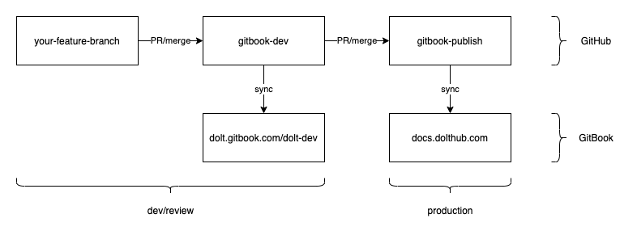

## Introduction
This repository contains Dolt and DoltHub documentation.

## GitBook Hosting
We use [GitBook](https://www.gitbook.com/) to publish our documentation, and delegate the subdomain `docs.dolthub.com` to `dolt.gitbook.io`. GitBook operates by syncing the contents of this repository. The GitBook/GitHub integration is documented [here](https://docs.gitbook.com/integrations/github).

Using GitBook requires us to adopt their model of content structuring in order to properly render our markdown. The restrictions are as follows:
- the root directory is set in `.gitbook.yaml`
- assets, i.e. images, need to live in `content/.gitbook/assets`
- the content structure is configured in `content/SUMMARY.md`

## Contribution Workflow
We have two GitBook "spaces", one for development and review, and one for production:
- "Dolt", which `docs.dolthub.com` links to, and syncs off of `gitbook-publish`
- "Dolt Dev", which is `dolt.gitbook.io/dolt-dev`, and syncs off of `gitbook-dev`

To make a contribution create a feature branch, either in a fork or in this repository, and then make a PR against `gitbook-dev`. This can be reviewed and merged, which will result in it being deployed to "Dolt Dev" space. Once it has been reviewed in GitBook we can merge `gitbook-dev` to `gitbook-publish`, and it will land in production.

To update Dolt CLI reference docs, make updates to the Dolt command code in the `dolt` repo, then run `dolt dump-docs` to regenerate the CLI markdown file and copy it to `content/reference/cli.md`.  

To recap:
- make changes on `your-feature-branch`
- review and merge to `gitbook-dev`, `gitbook-dev` syncs to [Dolt Dev](https://dolt.gitbook.io/dolt-dev/)
- once you are satisfied with your changes, merge `gitbook-dev` to `gitbook-publish`, at which point your changes will sync'd to production

The following diagram illustrates the workflow:

## Outstanding Items
There are few things that need doing to sync our documentation with our release automation process:
- fix some dead links from the migration
- Dolt to generate CLI docs
- Doltpy to generate API docs

## Check Dead Links
This [tool](https://www.deadlinkchecker.com/) is free and works quite well if you just pass the dev URL, `https://dolt.gitbook.io/dolt-dev/`, into it.
