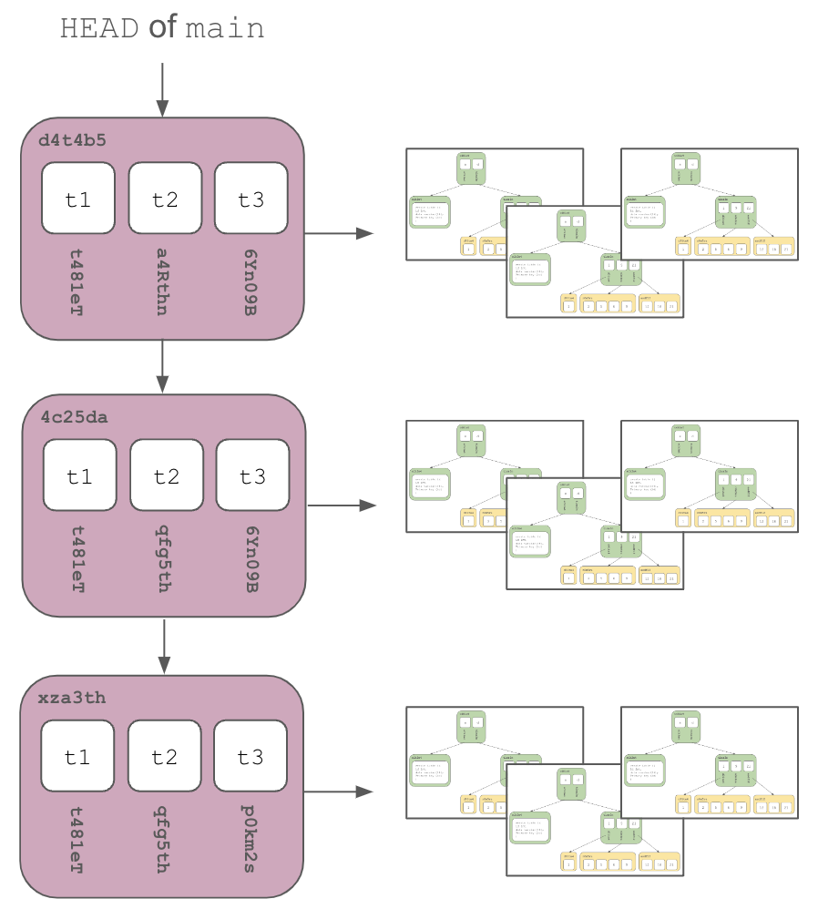
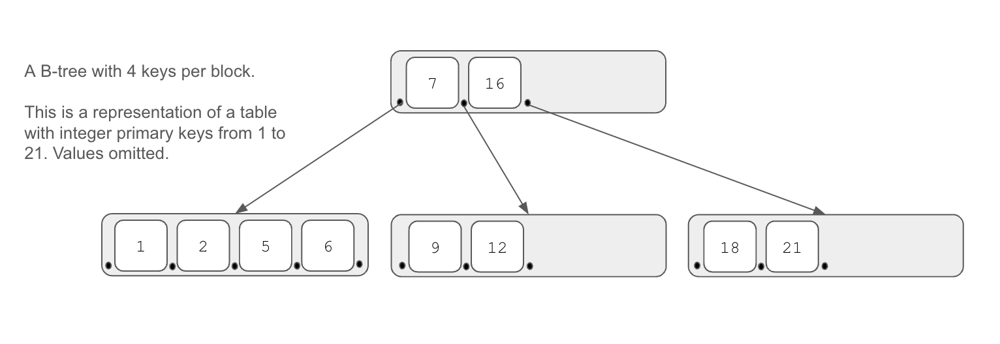
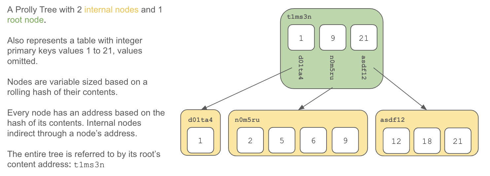
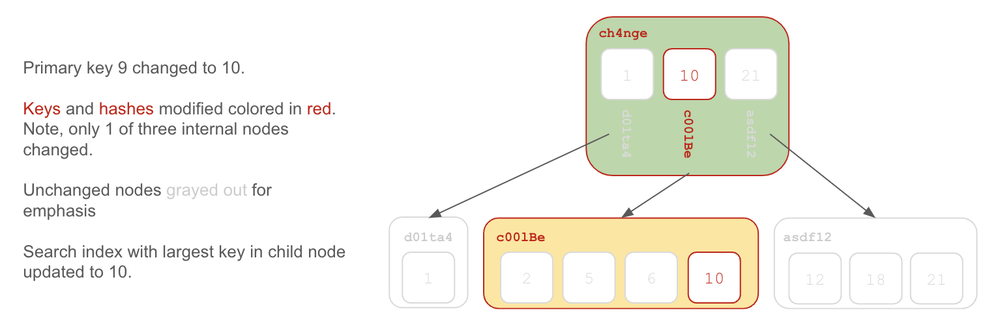
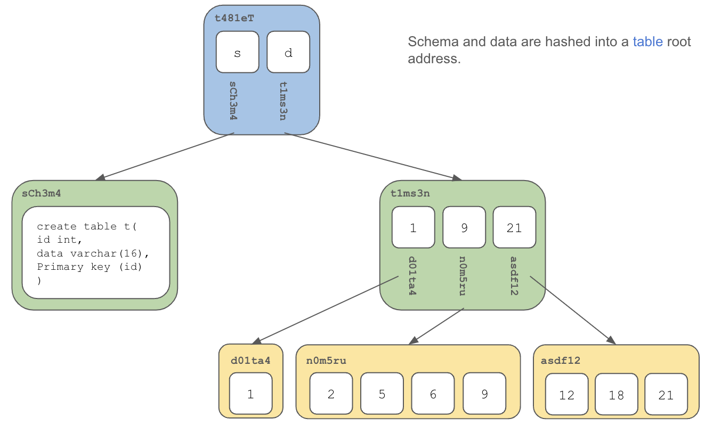
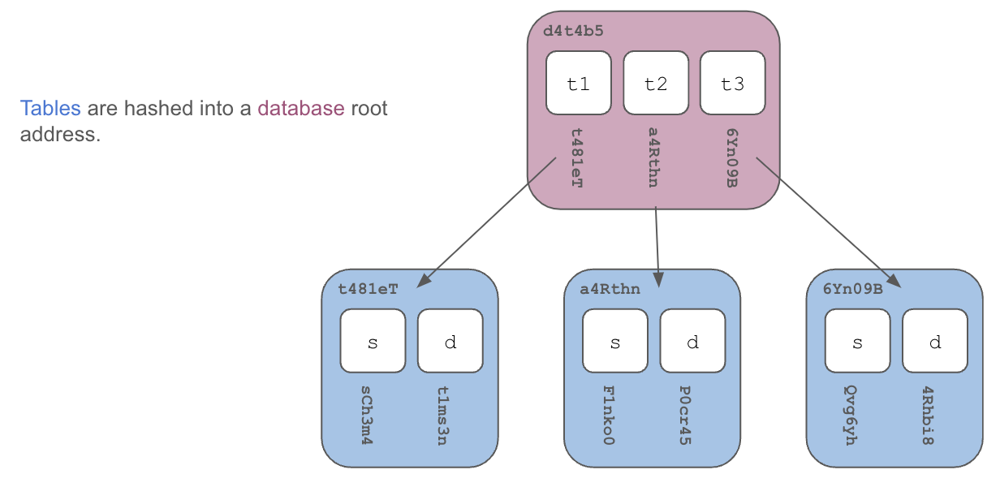
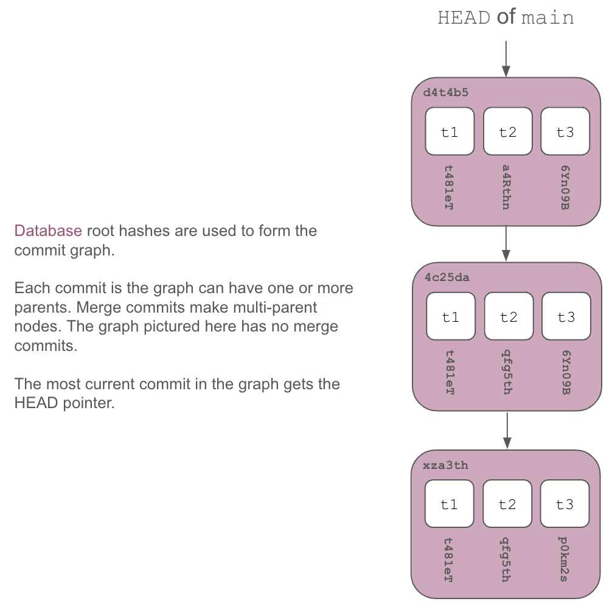

[Dolt](https://www.doltdb.com) is the world's first [version controlled SQL database](https://www.dolthub.com/blog/2022-08-04-database-versioning/). How would you build a storage engine for such a thing?

Dolt's storage engine is heavily influenced and shares code with [Noms](https://github.com/attic-labs/noms). We here at [DoltHub](https://www.dolthub.com) have immense respect for the Noms team's pioneering work, without which [Dolt](https://www.doltdb.com) would not exist.

# Motivation: Database Version Control

Dolt's storage engine is motivated by the desire to add Git-style version control to databases. Both Noms and Dolt share this vision. Noms attempts to achieve the vision on a generic, document-like database while Dolt restricts the vision to an Online Transaction Processing (OLTP) SQL database. Currently, [Noms](https://github.com/attic-labs/noms) is not under active development while [Dolt](https://www.doltdb.com) is.

Git-style version control on a database provides a number of useful features including:

1. Instantaneous rollback to any previous state
2. A full, queryable audit log of all data back to inception
3. Multiple evolving branches of data
4. The ability to merge data branches
5. Fast synchronization with remote versions for backup or decentralized collaboration
6. Queryable differences (ie. diffs) between versions

# Requirements

As noted in [an earlier, requirements exercise for Dolt itself](./architecture.md), a storage engine for a SQL database with Git-style versioning would provide:

1. **Tables**

A SQL database is a collection of tables. Tables have rows and columns. The columns have schema: names, types, and constraints. Columns can have indexes to improve query performance. Advanced database features like views, stored procedures, and triggers would also be useful. Tables must be able to be accessed via standard SQL select, insert, update, and delete queries.

2. **Performance at Scale**

A modern relational database must be performant at large scale. In particular, sub-linear worst case scaling on seek (ie. select) is a must.

3. **Fast diff**

Comparing and producing the differences between two versions must be fast. Displaying diffs to a user is a common operation. Querying diffs must also be supported and should be as fast as a regular select query. Moreover, merge relies on diffs so fast diff is essential for merge operations at scale.

4. **Structural Sharing**

To offer version control in a database, all versions of the data must be stored. Storing a full copy of the database at every change is untenable. Data that does not change between versions must share storage.

# Prolly Trees + Commit Graph = Dolt Storage Engine

Dolt's storage engine is built on a Git-style commit graph of Prolly Trees. Table schema and data is stored in Prolly Trees. The roots of those Prolly Trees along with other metadata are stored in a commit graph to provide Git-style version control. We'll start by explaining Prolly Trees and then show how these fit into a commit graph.

# The Database Backbone: Search Trees

Databases are built on top of [Search Trees](https://en.wikipedia.org/wiki/Search_tree), a class of data structure. Most databases are built on [B-trees](https://www.dolthub.com/blog/2020-04-01-how-dolt-stores-table-data/#b-tree-review). 

Dolt is built on a novel Search Tree, closely related to a B-tree, called a Probabilistic B-Tree, or Prolly Tree for short. As far as we can tell, Prolly Trees were [invented by the Noms team specifically for database version control](https://github.com/attic-labs/noms/blob/master/doc/intro.md) and they also coined the term.

## B-Trees

Most SQL databases you are familiar with, like [Postgres](https://www.postgresql.org/) or [MySQL](https://www.mysql.com/), are built on [B-tree](https://www.dolthub.com/blog/2020-04-01-how-dolt-stores-table-data/#b-tree-review) storage. Tables are represented as a map of primary keys to values and the keys of that map are stored in a B-tree. Values are stored in the leaf nodes. 

B-tree storage allows for fast seek (ie. select) with reasonable write performance (ie. insert, update, delete). B-trees have proven to be the ideal data structure to back databases. 

However, finding the differences between two B-trees requires scanning both trees and comparing all values, an operation that scales with the size of the tree. This operation is slow for large trees.

Also, writes to B-trees are not history independent, the order of the writes internally changes the structure of the tree. Thus, storage cannot be easily shared between two versions of the same tree.

## Prolly Trees

A Prolly Tree, or Probabilistic B-tree, is a content-addressed B-tree. 

Similarly to B-trees, a map of primary keys to values are used to represent tables. Keys form the intermediary nodes and values are stored in the leaf nodes. Because of their similarity to B-trees, Prolly trees [approximate B-tree performance](https://docs.dolthub.com/sql-reference/benchmarks/latency) of basic SQL database read and write operations like select, insert, update, and delete. Content-addressing allows for fast comparison (ie. diff) and [structural sharing](https://www.dolthub.com/blog/2020-05-13-dolt-commit-graph-and-structural-sharing/) of versions.

In Prolly Trees, each internal node in the B-tree is labelled with an immutable, history independent hash or content address built from the node's contents. This allows fast comparison of two Prolly Trees. One simply needs to look at the root hash of the tree to tell if two trees are different. Walking the tree following paths with nodes of different values quickly identifies differences in the tree. Thus, calculating the difference between two Prolly tree scales with the size of the differences, not the size of the tree. 

Moreover, sections of the tree that share the same root hash can share storage between versions because the contents of the trees are necessarily the same. When laid out in a commit graph, Prolly Tree roots share storage if the root hash of the tree or any sub-tree are the same in each version.

Prolly trees are described in more detail [here](./storage-engine/prolly-tree.md).

## Comparison

[The Noms documentation](https://github.com/attic-labs/noms/blob/master/doc/intro.md#some-properties-of-prolly-trees) provides the following useful algorithmic, big O() comparison of B-trees and Prolly Trees:

Operation | B-Trees | Prolly Trees
--------- | ------- | ------------
1 Random Read | logk(n) | logk(n)
1 Random Write | logk(n) | (1+k/w)*logk(n)
Ordered scan of one item with size z | z/k | z/k
Calculate diff of size d | n | d
Structural sharing | ❌ | ✅

**n**: total leaf data in tree, **k**: average block size, **w**: window width

As you can see a Prolly Tree approximates B-tree performance on reads and writes while also offering the ability to compute differences in time proportional to the size of differences rather than the total size of the data. 

# Commit Graph

Effectively, Prolly Tree storage laid out in a Commit Graph, or [Merkle DAG](https://en.wikipedia.org/wiki/Merkle_tree) of versions, allows for Git-style version control on a SQL database. [Dolt](https://github.com/dolthub/dolt), the world's first version controlled SQL database, is working proof of the combination of a Commit Graph with Prolly Trees effectiveness. 

How do we turn the table data storage described above into a SQL database? We must make all the contents of the database Prolly Trees and hash the roots together. The data in tables is by far the most complex tree. But in Dolt, it's Prolly Trees all the way down.

Table data is stored in a Prolly Tree as described above: a map of primary keys to the values in additional columns. Thus, each table version has an immutable hash of the data in the table. In SQL, tables also have schema. Table schema is stored in a much simpler Prolly Tree and given a content address. The combination of the roots of the schema and data Prolly Trees form the content address of the table.

The content addresses of the tables in the database are then hashed to form the content address of the database.

Finally, we lay these database roots out in a commit graph of database versions. Any subtree where the roots have the same content-address are only stored once, accomplishing structural sharing.

And, thus, you end up with Dolt's storage engine.

