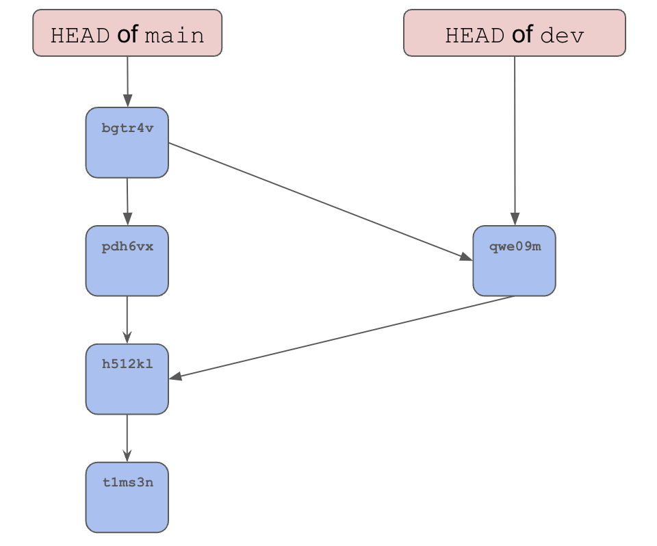
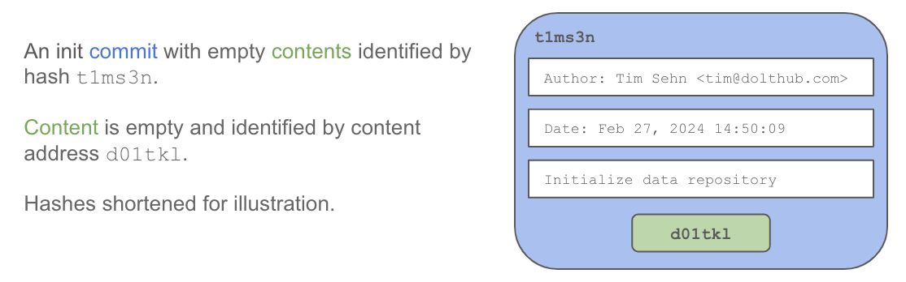
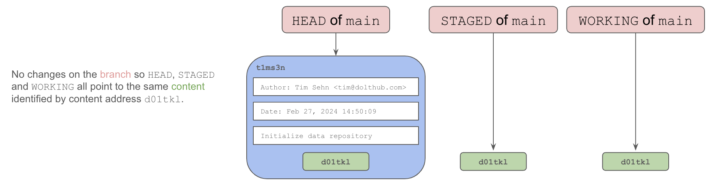
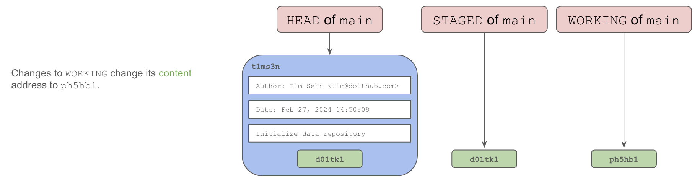
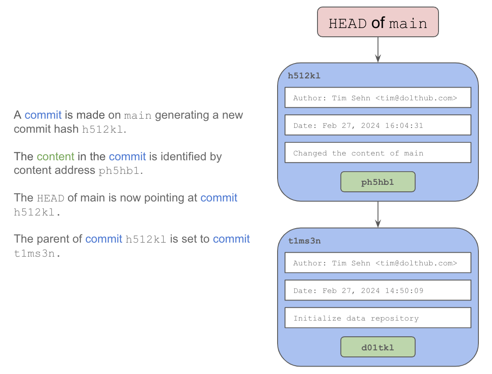
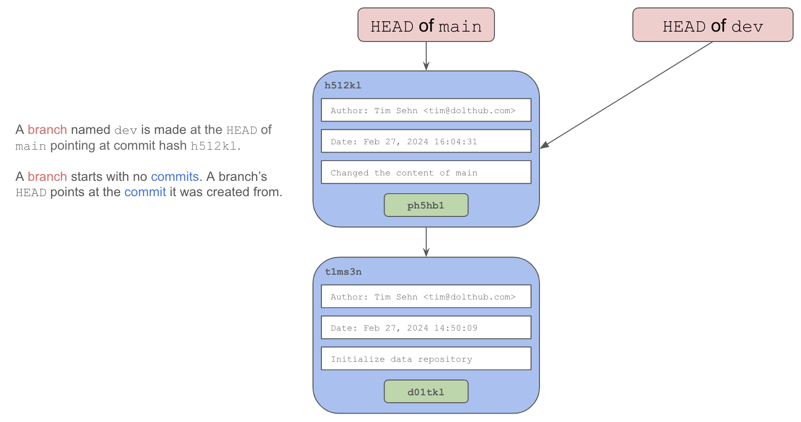

Dolt's unique [storage engine](https://docs.dolthub.com/architecture/storage-engine) implements a Git-style commit graph of [Prolly Trees](https://docs.dolthub.com/architecture/storage-engine/prolly-tree). Dolt's commit graph facilitates common version control operations like log, diff, branch and merge on database tables instead of files.

# Git vs Dolt

Git and Dolt share the same [version control conceptual underpinnings](https://docs.dolthub.com/concepts/dolt/git). In Git and Dolt, the commit graph concepts are the same. In Git and Dolt, the commands to modify the commit graph are the same. The only difference is what Git and Dolt version. Git versions files. Dolt versions tables. Thus, if you know how the Git commit graph works, you know how the Dolt commit graph works. If not, read on.

# What is a Commit?

A commit is a marker in your version history that stores all the relevant information for recreating that version. A commit is identified by a unique commit hash that looks something like `9shmcqu3q4o6ke8807pedlad2cfakvl7`.

A commit contains two sets of information: the content and the metadata.

In Git, the content is the set of files as they existed at that point in time, identified by a content address. In Dolt, the content is the set of tables in the database at that point in time, identified by a content address. In Dolt, content addresses are created using a novel data structure called a [Prolly Tree](https://docs.dolthub.com/architecture/storage-engine/prolly-tree), that allows for structural sharing, efficient diff, and fast querying of table data.

Additionally, commit metadata like author, date, and message are stored so it is easier to identify the commit you are looking for in the version history. This metadata is considered when creating the content address that you see in the commit log. So, even if two commits have the exact same content but are committed at different times or by different authors, they will have different commit hashes. 

# Why put Commits in a Graph?

Putting Commits is a graph allows for a representation of history, branches, and merges; core concepts of version control. A branch allows for multiple evolving histories. A merge allows two disparate histories to be combined.

# How to Build a Commit Graph

The easiest way to understand the commit graph is to build one. Let's build a simple commit graph from scratch.

## The Init Commit

To create a commit graph you must "initialize" one. Initialization can be done with the `init` command via the command line. This creates an "init commit". In Dolt, `create database` also creates an init commit if you are in the SQL context. 

The `init` command creates a commit with metadata taken from the environment and empty contents.

The init commit is made on the default branch, usually named `main`. A branch is a pointer to a commit. The tip of a branch has a special name or reference called `HEAD`.

## `WORKING` and `STAGED`

In Git and Dolt, at the `HEAD` of a branch there are two additional special references, called `STAGED` ad `WORKING`. These references point to active changes you are making to the `HEAD` of the branch. If there are no changes, the contents of `HEAD`, `STAGED`, and `WORKING` are the same. 

When you make changes to the content of a branch, changes are made in `WORKING`. Changes to the content of `WORKING` change its content address.

When you are ready to make a commit, you stage the changes using the `add` command. If you stage all your changes, `STAGED` and `WORKING` point to the same content and thus share the same content address.

`STAGED` and `WORKING` allow for changes to content to be tested and verified before being stored permanently in the commit graph.

`WORKING` is often called the working set. An interesting way to think about the working set is traditional file systems that don't use Git only have a working set. Traditional databases like MySQL or Postgres only have a working set. If you create a database in Dolt and only run traditional SQL, your working set will look and act exactly like a MySQL database.

## History

Commits are created using the aptly named `commit` command. When you commit your `STAGED` changes, the content that is staged is moved to the tip of the branch and you have an opportunity to add metadata like message and author. The `HEAD` of the branch `main` becomes this newly created commit. 

Commits have zero to many parents. The init commit has zero parents. A normal commit has one parent, representing the previous commit metadata and content. A merge commit, which we'll discuss later, has many parents. 

Parents allow for the history of branches to be computed by walking the branch from its `HEAD`. This is commonly called the commit log and generated using the `log` command.

## Branches

Up to this point, we are dealing only with linear history. If there is only one editor making serial changes, the commit graph will look like a long line of commits. A linear commit graph is still a graph, but not a very interesting graph. 

Branches allow for non-linear history, a fork in the commit graph. Branches are often used to isolate multiple users' changes. Two users can make changes to content without worrying about what the other is changing. This capability is quite powerful. We've all worked on a shared document where people stomp on each other's changes. Branches prevent stomping.

Branches are created using the `branch` command. When branches are created the `HEAD` of the branch points at a specified commit, usually the `HEAD` commit of the branch you are currently using.

Now, using the same process above we can make a a commit on the branch. The `HEAD` of the new branch now points at this new commit. 

In parallel, we can make a commit on `main`.

The two branches now contain different contents and share a common ancestor. As you can see, parallel, isolated evolving histories are now possible using branches.

## Merges

Merges are performed using the `merge` command. Merges allow you to join separate histories that exist on branches. Merges create a commit with multiple parents.

Merges are performed by finding the common ancestor commit and applying the changes from other branches in the merge to the current branch. Merge functionality requires the ability to quickly find the differences between the contents of two commits.

After merging, it is common to delete the branch that was merged signaling the change intended on the branch is complete.

Merges can generate [conflicts](../../concepts/dolt/git/conflicts.md). If two branches modify the same value, Git and Dolt notify the user. The user has the opportunity to resolve the conflicts as part of the merge.

Merges allow for collaboration among multiple users. Usually prior to merge, changes are reviewed by observing the computed differences between the branch you are merging from and the branch you are merging to. If the changes pass review, the merge is executed.