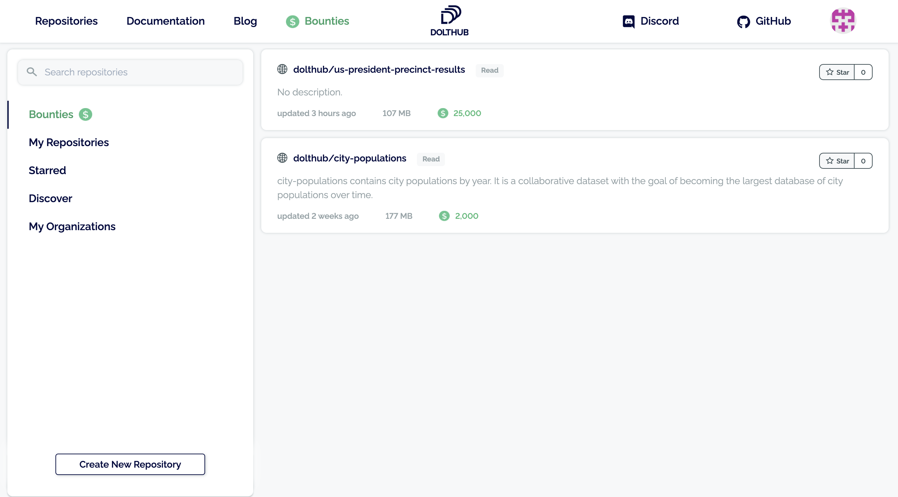
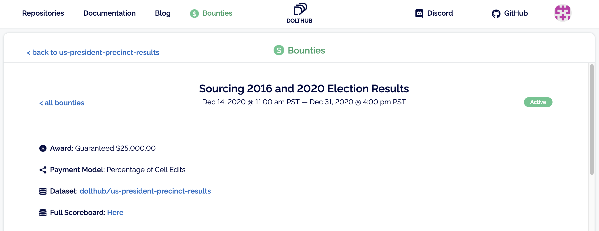
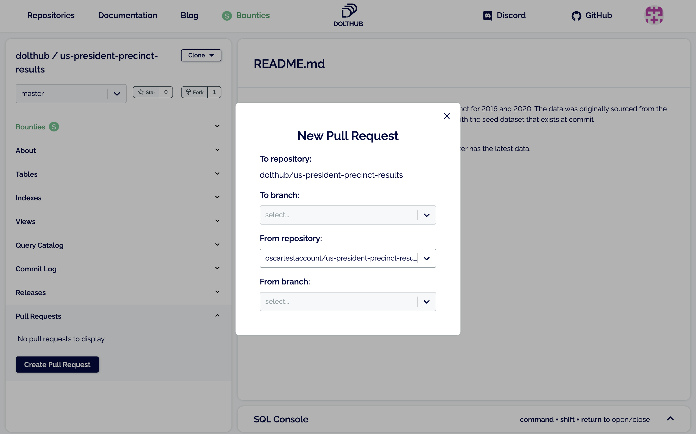

# Bounties

A Data Bounty is a financial reward paid for sourcing all, or part, of a specific dataset. A user or organization that is searching for a particular dataset can attach a financial incentive to getting that dataset. Members of the DoltHub community can get paid for finding the data specified in a bounty.

## Participating

The first thing to do is make sure you have a DoltHub account, which is required to participate in a Data Bounty. Sign up [here](https://www.dolthub.com/signin), or if you have signed up already, carry on reading.

Once you're logged in, you can easily see the list of available data bounties on the [Discover page](https://dolthub.com/profile/bounties):

Let's focus on the `dolthub/us-president-precinct-results` bounty. Head over to the [bounty detail](https://dolthub.com/repositories/dolthub/us-president-precinct-results/bounties/00000000-0000-0000-0000-000000000005) page to see the available rewards: 

Presuming you feel like capturing some of the $25,000 available for gathering precinct level results for the 2016 or 2020 US General Election, then it's time to dive into the details on how to participate.

### Fork the Repository

DoltHub uses the "fork" model for facilitating collaboration. A Data Bounty is a form of collaboration where there is a financial reward associated with an accepted contribution. You can read about DoltHub's collaboration model in greater detail [elsewhere](../getting-started/dolthub#data-collaboration) in our docs.

For now just fork `dolthub/us-president-precinct-results` into your own namespace:

You will then be redirected to the forked repository where you can have a look around:

If you want to get paid, you need to write some data to the repository, so let's turn to that!

### Writing Data

A prerequisite making a Pull Request against the bounty repository from your fork is getting some non-trivial changes into that fork. There are several ways to go about this:

* source a CSV file and upload it directly using our drag and drop functionality, see [docs](https://www.dolthub.com/docs/tutorials/dolthub/#data-publishing_file-upload) for further details
* clone the database and use the command line, SQL, or Doltpy to make changes; see [docs](https://www.dolthub.com/docs/tutorials/writing-to-dolt/) for details

The merge procedure that will compare your fork to the base repository is indifferent to how you made your changes, so long as they are correct.

### Creating a Pull Request

Once you have pushed a commit with some changes you want to get paid for, create a pull request from the base repository, `dolthub/us-president-precinct-results`:

It is _vital_ that your pull request follow the instructions associated with the bounty. Specifically this means you must provide not only the data specified, but any references to sources in the commit message. Citing your sources in the commit message may be the difference when it comes to getting paid.

### Review

The owner of the Data Bounty, in the above example DoltHub, will then review your submission. If you pull request is merged you will be able to see the scoreboard updated with your current pay out. The scoreboard is located on the bounty detail page.

## Creating

Since Data Bounties are currently in beta, you will need to [contact us](https://www.dolthub.com/contact) if you want to create one. We are eager to hear from anyone that is interested in seeding an open dataset by creating a financial incentive, or thinks this is a viable mechanism for purchasing data they are interested in.

## Transparency

Data Bounties hold out the promise of being paid for your contributions. We feel that makes it especially important to be clear and transparent. Consequently the payment calculation mechanism for bounties is open source, and you can find the code [here](https://github.com/dolthub/bounties). This is the code we run to compute the scoreboard on the bounty page.

When the bounty is over we will send an email to the primary email address on the DoltHub account associated with a pull-request that triggers a payout indicating how much we are paying out. The email will ask for payment instructions. We will honor those payment instructions within reason, though we reserve the right to request an alternate reasonable payment mechanism. It is therefore especially important to be in exclusive control of the email you use to sign up for DoltHub.

## Getting Help

If you need help, or have questions, hop onto [Discord](https://discord.com/invite/RFwfYpu) and jump into the \#data-bounties channel. We are excited to welcome new members to our vibrant and growing community!
