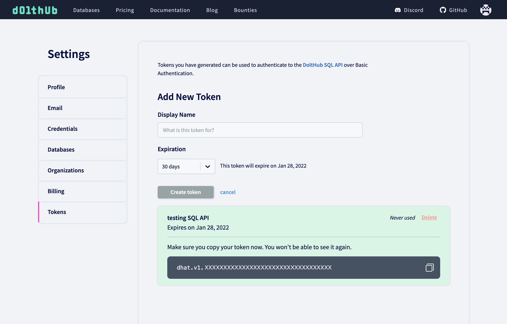

# API

## SQL API

### What is the SQL API?

DoltHub provides an API for accessing Dolt databases via web requests. A Dolt database can be attached to a DoltHub remote and pushed. At that point DoltHub provides an API against which users can execute Dolt SQL with results returned as JSON.

### Example

#### Reading

We will use an example DoltHub database, [dolthub/ip-to-country](https://www.dolthub.com/repositories/dolthub/ip-to-country/) and the Python `requests` library to explore it in the Python console:

```python
import requests
owner, repo = 'dolthub', 'ip-to-country'
res = requests.get('https://dolthub.com/api/v1alpha1/{}/{}'.format(owner, repo))
res.json()
```

This shows our repository metadata as a dictionary:

```text
{'query_execution_status': 'Success',
 'query_execution_message': '',
 'repository_owner': 'dolthub',
 'repository_name': 'ip-to-country',
 'commit_ref': 'master',
 'sql_query': 'SHOW TABLES;',
 'schema': [{'columnName': 'Table',
   'columnType': 'String',
   'isPrimaryKey': False}],
 'rows': [{'Table': 'IPv4ToCountry'}, {'Table': 'IPv6ToCountry'}]}
```

We can now execute a query:

```python
query = '''SELECT * FROM IPv4ToCountry WHERE CountryCode2Letter = "AU"'''
res = requests.get('https://www.dolthub.com/api/v1alpha1/{}/{}/{}'.format(owner, repo, branch), params={'q': query})
res.json()
```

This yields the results as JSON, with both schema and data:

```text
{'query_execution_status': 'RowLimit',
 'query_execution_message': '',
 'repository_owner': 'dolthub',
 'repository_name': 'ip-to-country',
 'commit_ref': 'master',
 'sql_query': 'SELECT * FROM IPv4ToCountry WHERE CountryCode2Letter = "AU"',
 'schema': [{'columnName': 'IPFrom',
   'columnType': 'Int',
   'isPrimaryKey': False},
  {'columnName': 'IpTo', 'columnType': 'Int', 'isPrimaryKey': False},
  {'columnName': 'Registry', 'columnType': 'String', 'isPrimaryKey': False},
  {'columnName': 'AssignedDate', 'columnType': 'Int', 'isPrimaryKey': False},
  {'columnName': 'CountryCode2Letter',
   'columnType': 'String',
   'isPrimaryKey': False},
  {'columnName': 'CountryCode3Letter',
   'columnType': 'String',
   'isPrimaryKey': False},
  {'columnName': 'Country', 'columnType': 'String', 'isPrimaryKey': False}],
 'rows': [{'IPFrom': '16777216',
   'IpTo': '16777471',
   'Registry': 'apnic',
   'AssignedDate': '1313020800',
   'CountryCode2Letter': 'AU',
   'CountryCode3Letter': 'AUS',
   'Country': 'Australia'},
.
.
.
```

As a reminder, this API is in Alpha version, and we will continue to flesh this out, as
well as improve query performance, over time.

You can also explore our SQL API on DoltHub whenever you execute a query:


#### Writing

Since adding, updating, and deleting data can take a bit of time to execute against larger
databases, we made the writable API asynchronous. Therefore we needed to add two new HTTP
endpoints for executing these kinds of queries using the SQL API.

We can use our [SHAQ database](https://www.dolthub.com/repositories/dolthub/SHAQ) as an
example. These are the steps we'd take to update a player's id in the player stats table.

#### 1. Run query

First, we want to hit the write endpoint with our `UPDATE` query. This will start an
asynchronous operation.

```python
owner, repo, from_branch, to_branch = 'dolthub', 'SHAQ', 'main', 'update-player'
query = '''UPDATE player_season_stat_totals SET player_id=714287 WHERE player_id=15404617'''
headers = {
    'authorization': 'token [see Authentication section below for token]'
}
write_res = requests.post(
        f'https://www.dolthub.com/api/v1alpha1/{owner}/{repo}/write/{from_branch}/{to_branch}',
        params={'q': query},
        headers=headers,
    )
write_json = write_res.json()
```

The `main` branch already exists in the database, and providing a `<to_branch>` that
doesn't exist will create this new branch from the `<from_branch>`.

The yielded JSON results include an `operation_name`.

```json
{
  "query_execution_status": "Success",
  "query_execution_message": "",
  "repository_owner": "dolthub",
  "repository_name": "SHAQ",
  "to_branch_name": "update-player",
  "from_branch_name": "main",
  "query": "UPDATE player_season_stat_totals SET player_id=714287 WHERE player_id=15404617",
  "operation_name": "operations/72abb56b-d478-43ae-9a2d-c9602184c7ab"
}
```

#### 2. Poll operation

`operation_name` can be used to poll the second endpoint to check if the operation is done.

```python
def get_operation(op_name):
  op_res = requests.get(
      f'https://www.dolthub.com/api/v1alpha1/{owner}/{repo}/write',
      params={'operationName': op_name},
      headers=headers,
  )
  return op_res.json()


def poll_operation(op_name):
    done = False
    while done == False:
        poll_res = get_operation(op_name)
        done = poll_res['done']
        if done:
            return poll_res
        else:
            time.sleep(3)


res = poll_operation(write_json['operation_name'])
```

A `done` operation will yield a response that includes some query metadata, including from and to commit ids.

```json
{
  "_id": "operations/72abb56b-d478-43ae-9a2d-c9602184c7ab",
  "done": true,
  "res_details": {
    "query_execution_status": "Success",
    "query_execution_message": "Query OK, 2 rows affected. Rows matched: 2  Changed: 2  Warnings: 0.",
    "owner_name": "tbantle",
    "repository_name": "SHAQ",
    "from_commit_id": "518ue176ec13qf563e87uoerkqqepood",
    "to_commit_id": "5sp7i0bov6itma2u04dpk15ui24lrigp"
  }
}
```

#### 3. View changes

Since a lot of Dolt's functionality is exposed via SQL, we can use the commit ids to query
the [`dolt_commit_diff_$tablename`
table](../../reference/sql/version-control/dolt-system-tables.md#dolt_commit_diff_usdtablename) to view the
resulting diff from our `UPDATE` query.

```python
from_commit, to_commit = res['res_details']['from_commit_id'], res['res_details']['to_commit_id']
query = f'''SELECT from_player_id, to_player_id, diff_type FROM `dolt_commit_diff_player_season_stat_totals` WHERE from_commit="{from_commit}" AND to_commit="{to_commit}"'''
diff_res = requests.get(
    f'https://www.dolthub.com/api/v1alpha1/{owner}/{repo}/{to_branch}',
    params={'q': query},
    headers=headers,
)
diff_res.json()
```

We can repeat this process with as many queries as we want. Every query will create a
commit on the `<from_branch>`.

#### 4. Merge changes

Once we're satisfied with our changes, we can merge our branches by hitting the first
endpoint with an empty query.

```python
merge_res = requests.post(
        f'https://www.dolthub.com/api/v1alpha1/{owner}/{repo}/write/{to_branch}/{from_branch}',
        params=None,
        headers=headers,
    )

merge_json = merge_res.json()
pollOperation(merge_json['operation_name'])
```

You can learn more about using the writable SQL API
[here](https://www.dolthub.com/blog/2022-01-12-sql-api-writes/).

### Authentication

API tokens can be used to authenticate calls to the SQL API over Basic Authentication.
This is useful for executing SQL queries against private databases or executing write queries.

First, create an API token in your [settings](https://www.dolthub.com/settings/tokens) on DoltHub. Copy the token right away, as you
won't be able to see it again.



Now you can use this token in the header when executing a query against a private database.

```python
owner, repo, branch = "dolthub", "private-db", "main"
query = """SELECT * FROM testtable"""

res = requests.get(
    "https://www.dolthub.com/api/v1alpha1/{}/{}".format(owner, repo, branch),
    params={"q": query},
    headers={ "authorization": "token [TOKEN YOU COPIED]" },
)

res.json()
```

Please note: You must include a ref name (branch, tag, commit hash, etc) when making authenticated calls to the SQL API using a token. Unauthenticated API requests do not require this. They use the default branch (`main` or `master`).

## CSV API

DoltHub also provides a CSV API for fetching table data as CSVs. You can request a CSV for an individual table or a zip of all table CSVs at a specified commit or branch.

### Example

We will use an example DoltHub database, [dolthub/us-jails](https://www.dolthub.com/repositories/dolthub/us-jails/) and the Python `requests` library to explore it in the Python console.

#### One Table

Download the table `incidents` from `main` branch:

```python
import requests
local_file = 'incidents_main.csv'
res = requests.get('https://www.dolthub.com/csv/dolthub/us-jails/main/incidents')
with open(local_file, 'wb') as file:
  file.write(res.content)
```

Download the table `incidents` at a commit hash:

```python
import requests
local_file = 'incidents_commit.csv'
res = requests.get('https://www.dolthub.com/csv/dolthub/us-jails/u8s83gapv7ghnbmrtpm8q5es0dbl7lpd/incidents')
with open(local_file, 'wb') as file:
  file.write(res.content)
```

#### All Tables

Download a ZIP file of all database tables from the `main` branch:

```python
import requests
local_file = 'us-jails_main.zip'
res = requests.get('https://www.dolthub.com/csv/dolthub/us-jails/main')
with open(local_file, 'wb') as file:
  file.write(res.content)
```

Download a ZIP file of all database tables at a commit hash:

```python
import requests
local_file = 'us-jails_commit.zip'
res = requests.get('https://www.dolthub.com/csv/dolthub/us-jails/u8s83gapv7ghnbmrtpm8q5es0dbl7lpd')
with open(local_file, 'wb') as file:
  file.write(res.content)
```

### Authentication

API tokens can be used to authenticate calls to the CSV API over Basic Authentication. This is useful for downloading data from private databases.

You can use the token in the header when download CSVs from a private database.

```python
import requests
local_file = 'private_db_main.zip'
res = requests.get(
  'https://www.dolthub.com/csv/owner/private-db/main',
  headers={ "authorization": "token [TOKEN YOU COPIED]" },
)
with open(local_file, 'wb') as file:
    file.write(res.content)
```

## Database API

Creates a new database. Python sample code:

```python
import requests
data = {"description": "database description", "ownerName": "dolthub",
        "repoName": "new-database-name", "visibility": "public"}
headers = {
    'authorization': 'token [see Authentication section below for token]'
}
res = requests.post(
    f'https://www.dolthub.com/api/v1alpha1/database',
    json=data,
    headers=headers,
)

res_json = res.json()

```

This yields the results as JSON

```text
{'status': 'Success', 
'message': '', 
 'repository_owner': 'dolthub', 
 'repository_name': 'new-database-name', 
 'description': 'database description', 
 'visibility': 'public'}
```

## Pull request API

### Create a pull request

Creates a pull request. Python sample code:

```python
import requests
data = {"title": "pull request title", "description": "pull request description", "fromBranchName": "from_branch_name", "fromBranchOwnerName": "dolthub",
        "fromBranchRepoName": "repo_name", "toBranchName": "main", "toBranchOwnerName": "dolthub", "toBranchRepoName": "repo_name"}
headers = {
    'authorization': 'token [see Authentication section below for token]'
}
res = requests.post(
    f'https://www.dolthub.com/api/v1alpha1/{owner}/{repo}/pulls',
    json=data,
    headers=headers,
)

res_json = res.json()

```

This yields the results as JSON with a pull ID:

```text
{'status': 'Success', 
'message': '', '
repository_owner': 'dolthub', 
'repository_name': 'repo_name', 
'to_branch_name': 'main', 
'to_owner_name': 'dolthub', 
'to_repository_name': 'repo_name', 
'from_branch_name': 'from_branch_name', 
'from_owner_name': 'dolthub', 
'from_repository_name': 'repo_name', 
'pull_id': '66'}
```

### Create a comment on a pull request

Creates a pull request comment. Python sample code:

```python
import requests
data = {"comment": "pull comment"}
headers = {
    'authorization': 'token [see Authentication section below for token]'
}
res = requests.post(
    f'https://www.dolthub.com/api/v1alpha1/{owner}/{repo}/pulls/{pull_id}/comments',
    json=data,
    headers=headers,
)

res_json = res.json()
```

This yields the results as JSON:

```text
{'status': 'Success', 
'message': '', 
'repository_owner': 'owner_name', 
'repository_name': 'repo_name', 
'pull_id': 'pull_id', 
'comment': 'pull comment'}
```

### Merge a pull request

First, we post to the merge endpoint, this will start an asynchronous operation.

```python
import requests
headers = {
    'authorization': 'token [see Authentication section below for token]'
}
res = requests.post(
    f'https://www.dolthub.com/api/v1alpha1/{owner}/{repo}/pulls/{pull_id}/merge',
    headers=headers,
)

res_json = res.json()

```

This yields the results as JSON with an `operation_name`:

```text
{'status': 'Success', 
'message': '', 
'repository_owner': 'owner_name', 
'repository_name': 'repo_name', 
'pull_id': 'pull_id', 
'operation_name': 'operations/b09a9221-9dcb-4a15-9ca8-a64656946f12'}
```


We can poll the operation to check if the merge operation is done.

```python
import requests
data = {"operationName": "operations/b09a9221-9dcb-4a15-9ca8-a64656946f12"}
headers = {
    'authorization': 'token [see Authentication section below for token]'
}
res = requests.get(
    f'https://www.dolthub.com/api/v1alpha1/{owner}/{repo}/pulls/{pull_id}/merge',
    json=data,
    headers=headers,
)

res_json = res.json()
```

This yields the results as JSON:

```text
{'status': 'Success', 
'message': '', 
'operationName': 'operations/b09a9221-9dcb-4a15-9ca8-a64656946f12', 
'done': True, 
'job_id': '4d785ea4-487b-4065-8365-9229f2fedf5c', 
'repository_owner': 'owner', 
'repository_name': 'repo', 
'pull_id': '65'}
```