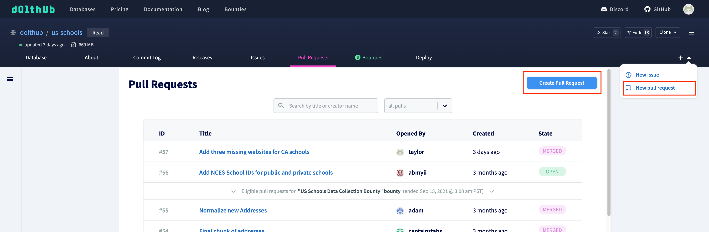
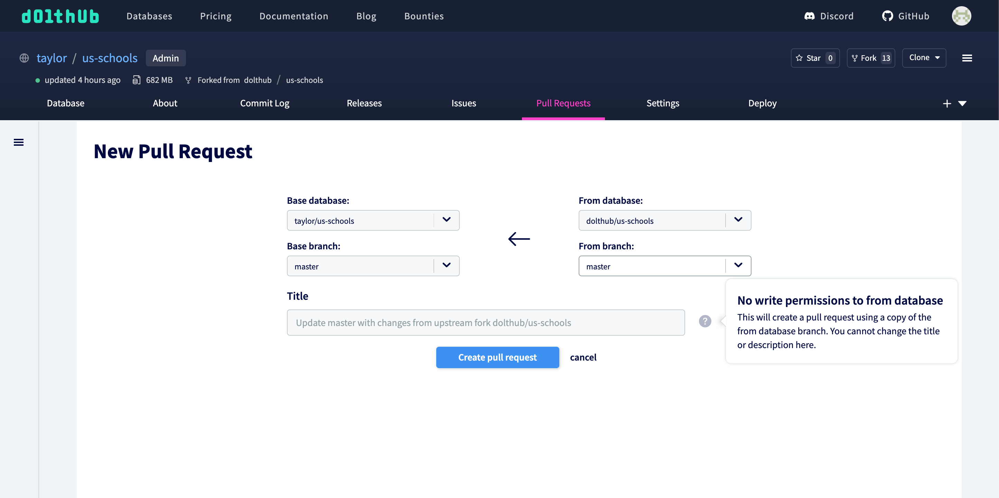

# Forks

## What is a fork?

A fork is a copy of a database. The fork model exists so that you control who can modify your data, and determine what data gets merged. You can continue to pull changes from the database that you forked from, and you can submit [pull requests](./prs.md) back to it. You can use it as a tool to get your changes onto a database, or you can use it to take that database in a different direction.

## How to use forks

Forks on DoltHub are useful in two main ways:

1. You can propose changes to a database you don't have write permissions to
2. You can experiment with or adopt someone else's database for your own use case without making changes to the original data

Using forks to propose changes is commonly used for [data bounties](../../introduction/getting-started/data-bounties.md). You can create a fork, making changes to your fork, and then submit a [pull request](./prs.md) in the original database.

## Difference between GitHub forks and DoltHub forks

GitHub forks are very similar to DoltHub forks in both purpose and practice.

## Example

You can use the fork button on the top right of any database to fork the database to your own namespace. We will use our `us-schools` database as an example.


There is now a fork of `us-schools` in our namespace called `taylor/us-schools`. We can either edit directly on DoltHub or clone and edit using Dolt.

```
% dolt clone taylor/us-schools
cloning https://doltremoteapi.dolthub.com/taylor/us-schools
141,350 of 141,350 chunks complete. 0 chunks being downloaded currently.
```

If you forked a database to do your own experimenting, your work here is done. However, if you'd like to propose changes to the base database, you can create a [pull request](./prs.md) by navigating to `dolthub/us-schools` and clicking one of the new pull request buttons.



Select your fork as the "From database" and select a branch and title.


The owner of the base database (in this case `dolthub`) can then request any changes in your pull request and merge if they approve the request.

You can also update your fork with the latest changes from the upstream database using the pull request form in your own database.


