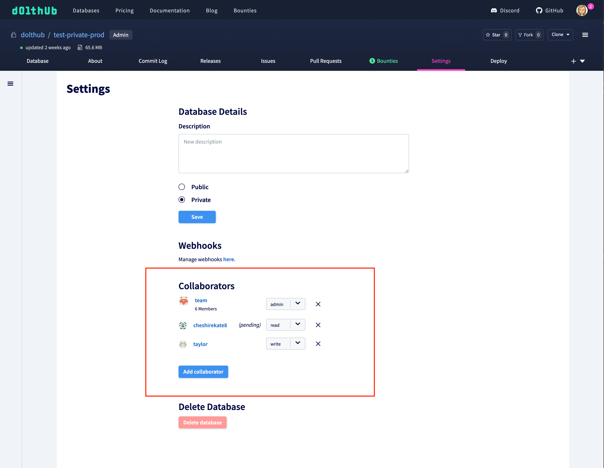

# Permissions

It's important that you have full control over can access or change your data. There are a few ways to control users' roles for your database on DoltHub.

## Read permissions

When you [create a database](https://www.dolthub.com/profile/new-repository) on DoltHub you can create the database as an individual user or as an organization.

All databases are public unless you have a DoltHub Pro account. Having a public database means that anyone, whether they have a DoltHub account or not, can read your database. DoltHub Pro users or organizations can create private databases for free up to 1GB/month, and $50/month after that. You can learn more about our pricing [here](https://www.dolthub.com/pricing).

For user-owned databases, only individuals you add through the collaborators form in your database settings can view your private database.

For organization-owned databases, any member of the organization can read private databases. You can also grant read permissions to a database to individuals outside your organization through the collaborators form in the settings tab of your database.

With read access users are able to view tables, run read-only SQL queries, clone and fork, and create issues and pull requests.

## Write permissions

Databases have two levels of write permissions: write or admin. Users with non-admin write permissions are able to edit any table data or docs within the database. This includes merging pull requests, running any SQL query, importing files, and pushing changes from Dolt. However, they cannot update database settings or manage database collaborators.

Database admins are able to edit any data or settings within a database.

You can add, update, and delete collaborators in the Settings tab on a database page:

## Permissions within organizations

Databases that are owned by organizations have an extra level of flexibility when it comes to database permissions. Any member of an organization has read permissions to both private and public databases. Members can also view some organization information, such as people and teams.

Any owner of an organization has admin permissions to both private and public databases. Organization owners are also able to update their organization's settings and billing. They can make changes to any team within the organization, whether or not they belong to that team.

Teams can be added as collaborators to organization-owned databases. For example, if you have some organization members that you want to have admin access to one (but not all) of your databases, you can create a team for those members and grant the team admin access to the one database in the database Settings tab. This gives you an extra layer of control even within your organization.
