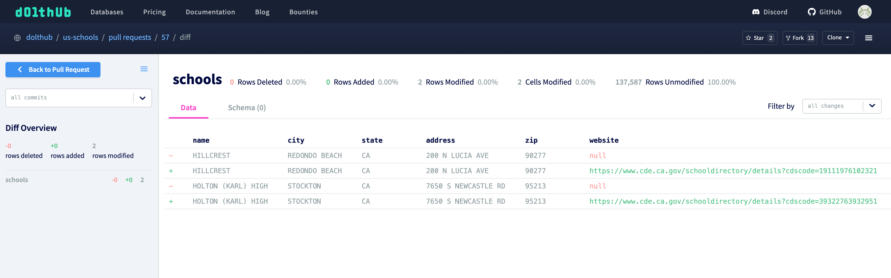
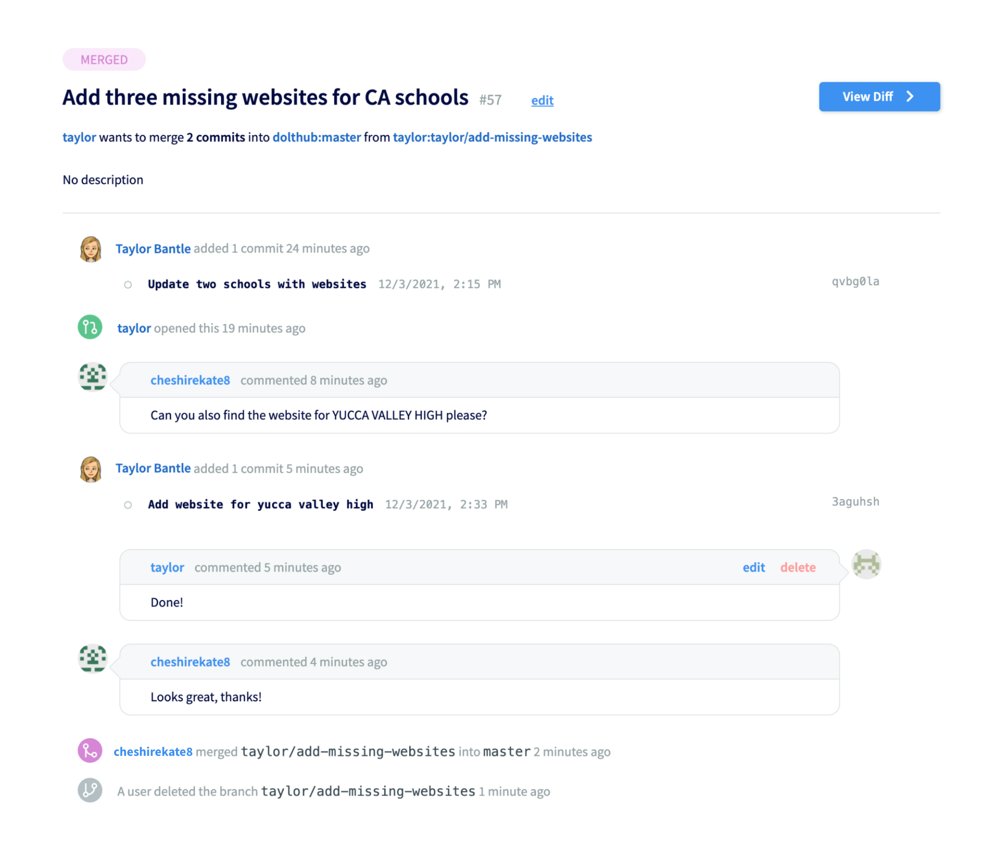

# Pull Requests

## What is a pull request?

Pull requests are a way to propose changes to a database. A pull request is created from a [branch](../dolt/git/branch.md) with new changes that a user would like to make to another branch (commonly the `main` or `master` branch). Once the pull request is opened, the reviewer can easily review the [diff](../dolt/git/diff.md) of the proposed changes and discuss potential improvements or implications of the change. If approved, the pull request can be merged, which will update the base branch with the changes from the feature branch.


## How to use pull requests

You can use pull requests to propose changes for another branch. To create a pull request, you should make changes to a branch on your database or a [fork](./forks.md) of another database. Then you can use the new pull request form to choose your base branch. You can also add a title (required) and description (optional).

## Difference between GitHub pull requests and DoltHub pull requests

GitHub pull requests are similar to DoltHub pull requests in purpose. GitHub pull requests include some extra features that are on our longer-term DoltHub roadmap (like actions, tagging other users as reviewers, etc). Both include a list of commits, comments, and a diff of proposed changes.

Due to the difference in nature of reviewing data vs reviewing code, diffs on DoltHub look a little from diffs on GitHub. On GitHub you compare files, while DoltHub compares changes to data tables (outside of README and LICENSE changes). It's rare to have a pull request on GitHub with a file containing thousands of line changes, while this is much more common for data tables. DoltHub diffs attempt to make reviewing data easier by letting the user focus on one table at a time and filter by added, deleted, or modified rows.

## Example

We will use our [`dolthub/us-schools`](https://www.dolthub.com/repositories/dolthub/us-schools) database as an example. This database was created through one of our [bounties](../../introduction/getting-started/data-bounties.md).

First, we [fork](./forks.md) the database and clone our fork.

```
% dolt clone taylor/us-schools
cloning https://doltremoteapi.dolthub.com/taylor/us-schools
141,350 of 141,350 chunks complete. 0 chunks being downloaded currently

% cd us-schools
```

We check out a new branch for our change, and then use the SQL shell to make some changes to the data. In this case, we'll fill in some missing school websites.

```
% dolt checkout -b taylor/add-missing-websites
Switched to branch 'taylor/add-missing-websites'

% dolt sql
# Welcome to the DoltSQL shell.
# Statements must be terminated with ';'.
# "exit" or "quit" (or Ctrl-D) to exit.

us_schools> update schools set website='https://www.cde.ca.gov/schooldirectory/details?cdscode=19111976102321' where name='HILLCREST' and city='REDONDO BEACH' and state='CA';
Query OK, 1 row affected
Rows matched: 1  Changed: 1  Warnings: 0

us_schools> update schools set website='https://www.cde.ca.gov/schooldirectory/details?cdscode=39322763932951' where name='HOLTON (KARL) HIGH' and city='STOCKTON' and state='CA';
Query OK, 1 row affected
Rows matched: 1  Changed: 1  Warnings: 0]

us_schools> exit;
Bye
```

We can look at the [diff](../dolt/git/diff.md) of our changes. If they look good we add and [commit](../dolt/git/commits.md) the changed table and push our branch to DoltHub.

```
% dolt diff
diff --dolt a/schools b/schools
--- a/schools @ ml65mjlsqpd45htsq1oc741nj4ns64fe
+++ b/schools @ jlrm3n5scc9cdj7sh368i4scik81km32
+-----+--------------------+---------------+-------+---------------------+-------+-----------------------------------------------------------------------+----------+----------------+--------------------------------------+-------------------+---------------------+
|     | name               | city          | state | address             | zip   | website                                                               | category | public_private | district                             | lat               | lon                 |
+-----+--------------------+---------------+-------+---------------------+-------+-----------------------------------------------------------------------+----------+----------------+--------------------------------------+-------------------+---------------------+
|  <  | HILLCREST          | REDONDO BEACH | CA    | 200 N LUCIA AVE     | 90277 | NULL                                                                  | NULL     | PUBLIC         | LOS ANGELES COUNTY SPECIAL EDUCATION | 33.84496307373047 | -118.3777847290039  |
|  >  | HILLCREST          | REDONDO BEACH | CA    | 200 N LUCIA AVE     | 90277 | https://www.cde.ca.gov/schooldirectory/details?cdscode=19111976102321 | NULL     | PUBLIC         | LOS ANGELES COUNTY SPECIAL EDUCATION | 33.84496307373047 | -118.3777847290039  |
|  <  | HOLTON (KARL) HIGH | STOCKTON      | CA    | 7650 S NEWCASTLE RD | 95213 | NULL                                                                  | HIGH     | PUBLIC         | CEA SAN JOAQUIN COUNTY               | 37.89115524291992 | -121.19744110107422 |
|  >  | HOLTON (KARL) HIGH | STOCKTON      | CA    | 7650 S NEWCASTLE RD | 95213 | https://www.cde.ca.gov/schooldirectory/details?cdscode=39322763932951 | HIGH     | PUBLIC         | CEA SAN JOAQUIN COUNTY               | 37.89115524291992 | -121.19744110107422 |
+-----+--------------------+---------------+-------+---------------------+-------+-----------------------------------------------------------------------+----------+----------------+--------------------------------------+-------------------+---------------------+

% dolt add schools && dolt commit -m "Update two schools with websites"
commit qvbg0laf84umi1hkdkiooiciil2gtene
Author: Taylor Bantle <taylor@liquidata.co>
Date:   Fri Dec 03 14:15:38 -0800 2021

	Update two schools with websites

% dolt push origin taylor/add-missing-websites
/ Tree Level: 1, Percent Buffered: 0.00%, Files Written: 0, Files Uploaded: 1, Current Upload Speed: 59 kB/s
```

We can open a pull request in `dolthub/us-schools` by selecting our fork and branch. We also add a title.


The owner of `dolthub/us-schools` can look at the diff and request changes.



Once the changes have been approved, the owner can merge the pull request. The commits from the pull request will show up on the `main` (or `master` in this case) branch.



And we have successful used pull requests to incorporate a change to a database!
