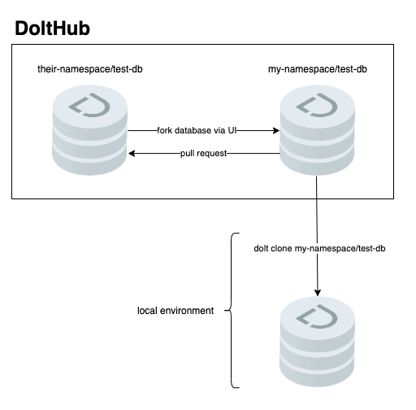
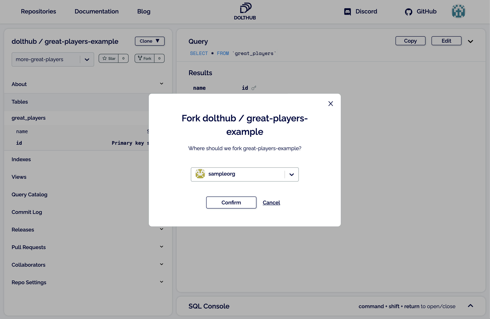

# DoltHub

## Introduction

DoltHub is a collaboration platform for managing Dolt databases. Dolt is the format the data travels in, and provides the SQL query interface. DoltHub builds collaboration tools on top of Dolt to make acquiring, publishing, and collaboratively building datasets using Dolt a joy.

## Signing Up

This tutorial assumes that you have signed up for DoltHub, though you needn't do so to clone public datasets. You can sign up for DoltHub easily [here](https://www.dolthub.com/signin). To follow along with the commands you need to have Dolt installed. See the [installation guide](https://github.com/dolthub/docs/tree/bfdf7d8c4c511940b3281abe0290c8eb4097e6c0/content/installation/README.md), but it's as easy as `brew install dolt`, and we publish `.msi` files for Windows users.

## Data Acquisition

We show several ways to explore data on DoltHub, starting with the most user friendly. Let's say we are interested in the [dolthub/ip-to-country](https://www.dolthub.com/repositories/dolthub/ip-to-country/) mappings that DoltHub publishes. The repo path is `dolthub/ip-to-country`. Throughout this section we will demo the various ways to acquire data against this data set.

### Web

The most accessible way to access data that is stored on Dolt and hosted on DoltHub is to navigate to the database [homepage](https://www.dolthub.com/repositories/dolthub/ip-to-country/):


Click on the SQL console to start writing a query against that Dolt database, using the left hand menu to browse the schema:


Now let's write a query for all the IPv4 codes in Australia:


Executing the query renders the results:


While this is a useful data exploration interface, it doesn't offer the kind of interactivity that a local copy of the data might. Let's switch gears to the command line, where we will see the integration point between Dolt and DoltHub.

### Dolt CLI

The integration point between Dolt and DoltHub is the concept of a "remote." Just like Git, Dolt imagines remotes which are stored in the metadata of the Dolt database. Dolt the command line tool has the ability to clone from remotes, and update them using the familiar commmands `clone` and `pull`. The data arrives as a SQL database, and your Dolt binary allows you to run SQL queries across the data. Let's say we are interested in pulling our example dataset into our local environment, either for use in some production system or for exploration. The database path is `dolthub/ip-to-country`. We can acquire it in a single command:

```text
$ dolt clone dolthub/ip-to-country && cd ip-to-country
cloning https://doltremoteapi.dolthub.com/dolthub/ip-to-country
23,716 of 23,716 chunks complete. 0 chunks being downloaded currently.
```

Now we can launch a SQL interpreter and start executing queries:

```text
$ dolt sql
# Welcome to the DoltSQL shell.
# Statements must be terminated with ';'.
# "exit" or "quit" (or Ctrl-D) to exit.
ip_to_country> select country, count(*) from IPv4ToCountry group by country order by count(*) desc limit 10;
+--------------------+----------+
| Country            | COUNT(*) |
+--------------------+----------+
| United States      | 56127    |
| Russian Federation | 10757    |
| Brazil             | 10607    |
| Germany            | 9226     |
| China              | 8485     |
| Canada             | 8090     |
| United Kingdom     | 8006     |
| Australia          | 7938     |
| India              | 6093     |
| Netherlands        | 5199     |
+--------------------+----------+
```

We also acquired a full history of values for each cell in the database, which we can immediately inspect via the history tables. There are other interesting datasets on DoltHub, and you should head over to our [discover page](https://www.dolthub.com/discover) and check them out, and clone them if they are interesting.

### API \(Alpha\)

DoltHub provides an API for accessing Dolt databases via web requests. A Dolt database can be attached to a DoltHub remote \(see below for details\) and pushed. At that point DoltHub provides an API against which users can execute Dolt SQL with results returned as JSON. Let's turn again to our example repository, [dolthub/ip-to-country](https://www.dolthub.com/repositories/dolthub/ip-to-country/). Let's use the Python `requests` library to explore it in the Python console:

```python
import requests
owner, repo = 'dolthub', 'ip-to-country'
res = requests.get('https://dolthub.com/api/v1alpha1/{}/{}'.format(owner, repo))
res.json()
```

This shows our repository metadata as a dictionary:

```text
{'query_execution_status': 'Success',
 'query_execution_message': '',
 'repository_owner': 'dolthub',
 'repository_name': 'ip-to-country',
 'commit_ref': 'master',
 'sql_query': 'SHOW TABLES;',
 'schema': [{'columnName': 'Table',
   'columnType': 'String',
   'isPrimaryKey': False}],
 'rows': [{'Table': 'IPv4ToCountry'}, {'Table': 'IPv6ToCountry'}]}
```

We can now execute the same sample query we used in our web example:

```python
query = '''SELECT * FROM IPv4ToCountry WHERE CountryCode2Letter = "AU"'''
res = requests.get('https://www.dolthub.com/api/v1alpha1/{}/{}/{}'.format(owner, repo, branch), params={'q': query})
res.json()
```

This yields the results as JSON, with both schema and data:

```text
{'query_execution_status': 'RowLimit',
 'query_execution_message': '',
 'repository_owner': 'dolthub',
 'repository_name': 'ip-to-country',
 'commit_ref': 'master',
 'sql_query': 'SELECT * FROM IPv4ToCountry WHERE CountryCode2Letter = "AU"',
 'schema': [{'columnName': 'IPFrom',
   'columnType': 'Int',
   'isPrimaryKey': False},
  {'columnName': 'IpTo', 'columnType': 'Int', 'isPrimaryKey': False},
  {'columnName': 'Registry', 'columnType': 'String', 'isPrimaryKey': False},
  {'columnName': 'AssignedDate', 'columnType': 'Int', 'isPrimaryKey': False},
  {'columnName': 'CountryCode2Letter',
   'columnType': 'String',
   'isPrimaryKey': False},
  {'columnName': 'CountryCode3Letter',
   'columnType': 'String',
   'isPrimaryKey': False},
  {'columnName': 'Country', 'columnType': 'String', 'isPrimaryKey': False}],
 'rows': [{'IPFrom': '16777216',
   'IpTo': '16777471',
   'Registry': 'apnic',
   'AssignedDate': '1313020800',
   'CountryCode2Letter': 'AU',
   'CountryCode3Letter': 'AUS',
   'Country': 'Australia'},
.
.
.
```

As a reminder, this API is in Alpha version, and we do not currently support authentication for private repositories. We will continue to flesh this out, as well as improve query performance, over time.

## Data Publishing

In the previous section we showed three canonical ways to get data from Dolt databases hosted on DoltHub: a web based SQL query interface, by cloning the database and using Dolt to run SQL against the database, and finally via an API. In this section we switch to pushing data to DoltHub.

### File Upload

Uploading a file to DoltHub is the only way to publish data without using Dolt. Every repository, whether it contains data or not, has a button to upload a file. You'll be taken through a few steps in the upload wizard:

* Choose a base branch \(commits directly to `master` branch for empty repo\)

  

* Choose a table name \(create a new table or update an existing table\)

  

* Upload a file and choose primary keys \(we currently support CSV, PSV, and XLSX files\)
* View and commit changes

  

You can learn more about file upload from [our blog](https://www.dolthub.com/blog/2020-11-13-dolthub-upload-file/).

### Configuration

To publish data on DoltHub using Dolt, the first thing to do is configure your copy of Dolt to recognize DoltHub as a remote to your repo. To do that, and then write to that repo, you need to login. Dolt provides a command for logging in that will launch a browser window, have you authenticate, and create token which your local Dolt will use to identify itself. The steps are straightforward:

```text
$ dolt login
Credentials created successfully.
pub key: t7oc1qsgc8isfq9po0d4kteg8lio9et9...
~/.dolt/creds/<some hash>.jwk
Opening a browser to:
    https://dolthub.com/settings/credentials#t7oc1qsgc8isfq9po0d4kteg8lio9et9...
Please associate your key with your account.
Checking remote server looking for key association.
requesting update
```

This launches a browser window to create a token:


Give the token a name, click create, and you should see control returned to the prompt:

```text
Key successfully associated with user: your-username email: you@email.com
```

You are now logged in and you can push data to DoltHub.

### DoltHub Remotes

Publishing data is equally easy once it's in the Dolt format. In [another section](https://github.com/dolthub/docs/tree/bfdf7d8c4c511940b3281abe0290c8eb4097e6c0/content/writing-to-dolt/README.md) we showed how to write data to Dolt. Let's assume we have some data in a local Dolt repository:

```text
$ cat > great_players.csv
name,id
rafa,1
roger,2
novak,3
andy,4
^C
$ dolt table import -c --pk id great_players great_players.csv
Rows Processed: 4, Additions: 4, Modifications: 0, Had No Effect: 0
Import completed successfully.
$ dolt add great_players
$ dolt commit -m 'Added some initial great players'
commit ht24tetekl12hmek03e6ldl0hbqm8l93
Author: you <you@youremial.com>
Date:   Wed May 06 23:38:45 -0700 2020

    Added some initial great players
```

Now suppose we want to share this data with others. The model for sharing on DoltHub is similar to GitHub, we create a public \(or private, see [pricing](https://www.dolthub.com/pricing)\) repository and add it as a remote to our local repository. Let's start by creating a repository on DoltHub. We can do that easily by heading over to [DoltHub](https://www.dolthub.com/profile/new-repository) with just a few clicks:


Earlier we ran `dolt login` to allow our local copy of Dolt to authenticate with our DoltHub account, we now put this to use by connecting our local Dolt repository to the repository we just created. Just like Git, we add a remote:

```text
$ dolt remote add origin dolthub/great-players-example

$ dolt push origin master
Tree Level: 2 has 3 new chunks of which 0 already exist in the database. Buffering 3 chunks.
Tree Level: 2. 100.00% of new chunks buffered.
Tree Level: 1 has 2 new chunks of which 0 already exist in the database. Buffering 2 chunks.
Tree Level: 1. 100.00% of new chunks buffered.
Successfully uploaded 1 of 1 file(s).
```

And now anyone that wants to consume this data can do so with a _single command_. Once the consumer has run that command they can immediately stand up a MySQL server instance and start querying the data. If you're ready for collaborators you can add them as one on DoltHub.

## Data Collaboration

A major motivator for building Dolt and DoltHub was to create world class tools for data collaboration. Earlier sections of this guide to using DoltHub show how Dolt makes moving data seamless by implementing Git style version control, including `clone`, `pull`, and `pull` operations. This section shows how to use DoltHub's collaboration tools to efficiently coordinate updates to shared datasets.

### Pull Requests

In the simplest case two DoltHub users wish to make updates to the same database on DoltHub. Let's suppose that our esteemed CEO Tim has suddenly developed a passion for tennis, and would like to contribute to [dolthub/great-players-example](https://www.dolthub.com/repositories/dolthub/great-players-example), the database we created in the previous section.


Dolt has a concept of branches, almost identical to branches in Git. A branch is a named pointer to a commit. Users can create pull requests by proposing to merge one branch into another. The model looks something like this:


Note that in the diagram the each user has their own copy of the database, and they use `dolt push origin <branch>` to push their branch to DoltHub.

Let's work through an example of adding some players in a new branch, pushing that branch to DoltHub, and raising a pull request:

```text
$ dolt clone dolthub/great-players-example
cloning https://doltremoteapi.dolthub.com/dolthub/great-players-example
8 of 8 chunks complete. 0 chunks being downloaded currently.
$ cd great-players-example
$ dolt checkout -b more-great-players
Switched to branch 'more-great-players'

$ dolt sql
# Welcome to the DoltSQL shell.
# Statements must be terminated with ';'.
# "exit" or "quit" (or Ctrl-D) to exit.

great_players_example> insert into great_players (name, id) values ('stan', 5);
Query OK, 1 row affected

great_players_example> ^D
Bye

$ dolt diff
diff --dolt a/great_players b/great_players
--- a/great_players @ c2tpkad9e5345sjq2h7e6d9pdp7383a6
+++ b/great_players @ jopmq0sa2lkevugong75vqgpjir8ecve
+-----+------+----+
|     | name | id |
+-----+------+----+
|  +  | stan | 5  |
+-----+------+----+

$ dolt add great_players && dolt commit -m 'Added Stan The Man'
commit 4bsqsuanjsvra3kq7tchqre2kf7qgt29
Author: oscarbatori <oscar@dolthub.com>
Date:   Wed Oct 07 13:53:35 -0700 2020

    Added Stan The Man

$ dolt push origin more-great-players
Tree Level: 3 has 3 new chunks of which 2 already exist in the database. Buffering 1 chunks.
Tree Level: 3. 100.00% of new chunks buffered.
Tree Level: 1 has 2 new chunks of which 1 already exist in the database. Buffering 1 chunks.
Tree Level: 1. 100.00% of new chunks buffered.
Successfully uploaded 1 of 1 file(s).
```

Now we pushed the branch `more-great-players` to DoltHub, we can open a pull request by selecting the appropriate branch:


This pull request can be reviewed and merged:


And we are done!


### Forking a Dolt Database

While this model is fine for small numbers of collaborators with high mutual trust, it doesn't necessarily scale to the kind of mass-participation that has fueled growth in open source software. The practical issues are that the database owners will have to vet and permission every would-be collaborator before granting them permissions. The "fork" model exists to solve this problem. In the fork model users can copy a database into their own namespace or organization.



Let's work through an example by forking the example database we have been working with:



There is now a fork in the namespace `sampleorg`, which we can we clone and edit:

```text
$ dolt clone sampleorg/great-players-example
cloning https://doltremoteapi.dolthub.com/sampleorg/great-players-example
14 of 14 chunks complete. 0 chunks being downloaded currently.
$ cd great-players-example

$ dolt sql
# Welcome to the DoltSQL shell.
# Statements must be terminated with ';'.
# "exit" or "quit" (or Ctrl-D) to exit.

great_players_example> insert into great_players (name, id) values ('marin', 6);
Query OK, 1 row affected
great_players_example> ^D
Bye

$  dolt diff
diff --dolt a/great_players b/great_players
--- a/great_players @ c2tpkad9e5345sjq2h7e6d9pdp7383a6
+++ b/great_players @ 7m0qs6sebr61r00pi8e301tt99cg89dk
+-----+-------+----+
|     | name  | id |
+-----+-------+----+
|  +  | marin | 6  |
+-----+-------+----+

$  dolt add great_players && dolt commit -m 'Added Marin'
commit gt6c904uksachevarvp5pup1cc17pb48
Author: oscarbatori <oscar@dolthub.com>
Date:   Wed Oct 07 14:25:26 -0700 2020

    Added Marin

$ dolt push origin master
Tree Level: 3 has 3 new chunks of which 2 already exist in the database. Buffering 1 chunks.
Tree Level: 3. 100.00% of new chunks buffered.
Tree Level: 1 has 2 new chunks of which 1 already exist in the database. Buffering 1 chunks.
Tree Level: 1. 100.00% of new chunks buffered.
Successfully uploaded 1 of 1 file(s).
```

### Pulls Requests from Forks

We can now create a pull request in a manner similar to the previous section, but instead of choosing only the from and to branches, we now choose the from repository:


This creates a pull request, which will be familiar from the previous section, which we can go ahead and merge!

### Updating Your Fork

One of the benefits of the fork model is being able to continue to get updates from the parent while maintaining a local set of changes. This is a powerful model for data distribution where consumers can continue to receive updates from trusted distributors, while maintaining a set of changes that represent their preferences or views with minimal technical overhead.


Let's continue with our example. Suppose that SampleOrg disagrees with the folks at DoltHub about whether Andy Roddick was a great player. The folks at DoltHub do not believe he was a great player, but the folks at SampleOrg do. However, SampleOrg agree with DoltHub on most other players, and would like to continue getting updates.

We do this by adding the parent as a remote. For a SampleOrg user they can add the parent repository `dolthub/great-players-example` as a remote as follows:

```text
$ dolt remote add upstream dolthub/great-players-example
```

Now let's create a branch that will be used to pull in changes from the `upsteam`, call it `vendor`:

```text
$ dolt branch vendor
```

We can create an entry on `master` to reflect SampleOrg's belief that Andy Roddick was a great player:

```text
$ dolt sql
# Welcome to the DoltSQL shell.
# Statements must be terminated with ';'.
# "exit" or "quit" (or Ctrl-D) to exit.
great_players_example> insert into great_players (name, id) values ('roddick', 7);
```

Now suppose that the DoltHub team has added David Nalbandian to the dataset, an update SampleOrg would like to capture. We can fetch and merge as follows:

```text
$ dolt fetch upstream
Tree Level: 5 has 3 new chunks of which 1 already exist in the database. Buffering 2 chunks.
Tree Level: 5. 100.00% of new chunks buffered.
Tree Level: 4 has 7 new chunks of which 4 already exist in the database. Buffering 3 chunks.
Tree Level: 4. 100.00% of new chunks buffered.
Tree Level: 1 has 2 new chunks of which 1 already exist in the database. Buffering 1 chunks.
Tree Level: 1. 100.00% of new chunks buffered.
Successfully uploaded 1 of 1 file(s).

$ dolt merge upstream/master
Updating gt6c904uksachevarvp5pup1cc17pb48..rqhgn8suonl9ppahntbbhtn888vjlm36
Fast-forward
$ dolt log
commit rqhgn8suonl9ppahntbbhtn888vjlm36
Author: oscarbatori <oscar@dolthub.com>
Date:   Wed Oct 07 19:33:22 -0700 2020

    Added David Nalbandian, what a backhand!
```

Our diff comparing `master` and `vendor` will now show reflect this:

```text
$  dolt diff master vendor
diff --dolt a/great_players b/great_players
--- a/great_players @ 7m0qs6sebr61r00pi8e301tt99cg89dk
+++ b/great_players @ clrm54jkd6ecc0q08fh8pomptumli6c0
+-----+-------+----+
|     | name  | id |
+-----+-------+----+
|  +  | david | 8  |
+-----+-------+----+
```

We have seen two models of collaboration. One suitable for smaller groups of collaborators with high mutual trust, say within an organization. The second model is robust for the kind of mass-participation that occurs when a community decides to maintain a shared dataset.

## Conclusion

This succinctly illustrates the value of Dolt and DoltHub. Dolt provides for the seamless transfer of structured data, and ensures all data arrives ready for use in a familiar query interface. DoltHub provides a layer of collaboration tools.

