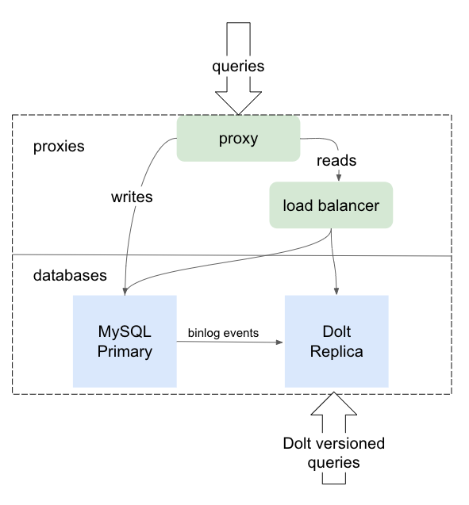

Dolt binlog replication allows a Dolt SQL Server to consume binlog replication events from a MySQL or MariaDB source database. This is a convenient way to try out Dolt in an existing system – there is no need to migrate your database, just configure Dolt as a replica and as your data replicates to the Dolt server, it will build up a commit history. You can access all the data versioning features of Dolt from the Dolt replica to audit how your data has changed, recover deleted data, or view the state of your data at any point in time.




## Requirements for MySQL Primary Server

**Row-Based Replication** – MySQL provides two main formats for binlog event recording (and a third, “mixed” format that combines the two). Dolt's binlog replication requires that binlog events are configured for row-based replication (the default in MySQL 8.0+). Other binlog formats (e.g. statement based replication) will not work correctly.

**GTID-Based Auto-positioning** – MySQL provides two ways for coordinating the replication position in a binlog event stream. The older method relies on specifying the binlog file name and file position; the newer, recommended version relies on Global Transaction Identifiers (GTIDs). Auto-positioning allows the replica to find its position from the binlog event stream, without requiring additional configuration.

**Server_id** – Your MySQL source server must have a non-zero value configured for @@GLOBAL.server_id, or it will not allow replication to start.

You can check the status of all these settings on your MySQL server by running:
```sql
SHOW VARIABLES WHERE Variable_Name LIKE '%gtid_mode' OR Variable_Name LIKE '%enforce_gtid_consistency' OR Variable_Name LIKE '%binlog_format' OR Variable_Name LIKE 'server_id';
```

You should see the results below, although your `server_id` may be different:
```sql
+--------------------------+-------+
| Variable_name            | Value |
+--------------------------+-------+
| binlog_format            | ROW   |
| enforce_gtid_consistency | ON    |
| gtid_mode                | ON    |
| server_id                | 42    |
+--------------------------+-------+
```


## Configuration

If your source database has not purged all of its binlog history and is already operating in GTID mode, then you can rely on the replication process to pull all changes from your source server, with no need to perform a manual data import. You can check this by running
`SELECT @@GLOBAL.GTID_MODE, @@GLOBAL.GTID_PURGED;` on your source database and confirming that `GTID_MODE` is `ON` and `GTID_PURGED` is empty.
However, it is more likely that you will need to first export the data from your source server and import it into your Dolt replica before you can configure and start replication. This is called "warming the replica" and synchronizes it with the primary database before binlog change events start being received.

### Replica Warming
To warm the replica with the state of the source database before starting replication, perform the following steps:

**Enable `GTID_MODE`**: Ensure [the `gtid_mode` system variable](https://dev.mysql.com/doc/refman/5.7/en/replication-options-gtids.html#sysvar_gtid_mode) and [the `enforce_gtid_consistency` system variable](https://dev.mysql.com/doc/refman/8.0/en/replication-options-gtids.html#sysvar_enforce_gtid_consistency) are both set to `ON`. [MySQL's documentation has a great walkthrough on how to safely enable these two settings](https://dev.mysql.com/doc/refman/8.0/en/replication-mode-change-online-enable-gtids.html) for a running database, and the process is safe to use in production.

**Export databases**: With the server running, use [the `mysqldump` utility](https://dev.mysql.com/doc/refman/8.0/en/mysqldump.html) to export the data from all databases on your source MySQL server. Make sure to use the `--single-transaction` flag as well as the `--all-databases` flag (if you want all databases exported). The `--single-transaction` flag is important for safely exporting data while the database is running, and ensures that exported table data is consistent. Note that `--single-transaction` only works with InnoDB databases (the default engine for MySQL since 5.5.5). For example: `mysqldump -uroot --single-transaction --protocol TCP --port 54322 --all-databases > mysql_dump.sql`

**Load databases**: Transfer the dump file from the previous step to the new Dolt replica server, start the Dolt sql-server (e.g. `dolt sql-server -uroot --port 11223`), and load the data into the replica server by running `mysql -uroot --protocol TCP --port 111223 < myDumpFile`. See the [Dolt Data Import Guide](https://docs.dolthub.com/guides/import#mysql-databases) for more details. 


#### Note
- Make sure you load this into a **running** dolt sql-server (i.e. not just `dolt sql`) so that the server has the GTID position information from the dump loaded into memory and is ready to pull binlog events at the correct position.
- If you are testing locally with MySQL and Dolt running on the same host, make sure you use the `--protocol TCP` flag when using the `mysql` client so that it uses a TCP connection and doesn't try to use a socket file. Otherwise, the `mysql` client may not connect to the server you want.  


### Starting Replication
After warming the replica (if necessary), start the Dolt sql-server if you haven’t already, so we can configure it as a replica: `dolt sql-server -uroot --port 11223`

Make sure the Dolt replica server has a unique `server_id` configured. This can be any positive integer, as long as it is unique between the primary server and any other configured replicas. For example: `SET @@PERSIST.server_id=123;`

Configure the replica with the source's connection information:
```sql
CHANGE REPLICATION SOURCE TO SOURCE_HOST='localhost', SOURCE_USER='root', SOURCE_PASSWORD='', SOURCE_PORT=3306;
```

You can optionally configure filtering on the replica by using the `CHANGE REPLICATION FILTER` command and the `REPLICATE_IGNORE_TABLE` or `REPLICATE_DO_TABLE` configuration options. Note that unlike the `CHANGE REPLICATION SOURCE` command, MySQL (and Dolt) do **NOT** persist the filter settings for `CHANGE REPLICATION FILTER`. Currently, replica filter settings must be reapplied after each Dolt SQL Server restart, before you restart replication.

The following example shows how to instruct the replica to ignore data events for tables t1 and t2 in the db01 database. Note that all tables MUST be qualified with the database name and the full list MUST be enclosed in parentheses:
```sql
CHANGE REPLICATION FILTER REPLICATE_IGNORE_TABLE=(db01.t1,db01.t2);
```

Start replication: `START REPLICA;`

View replication status (`\G` is useful here for printing results vertically): `SHOW REPLICA STATUS \G`

Stop replication: `STOP REPLICA;`

Clear out replication source and filtering configuration: `RESET REPLICA ALL;`


## Limitations

**Syntax gaps** – Dolt aims for 100% compatibility with MySQL, but there are still some gaps in supported syntax that we're actively working on filling in. Overall, Dolt supports the **vast** majority of MySQL's syntax, although you may still find a statement that executes on the MySQL primary, but won't execute on the Dolt read-replica because of a syntax gap. Please [let us know](https://github.com/dolthub/dolt/issues/new) if you hit this so we can help find a temporary workaround and fill in the syntax gap for you.    

**Replica mode only** – Dolt can only consume binlog events as a replica; it cannot act as a primary and produce binlog events.

**Replication channels** – only the default replication channel ("") is supported.

**Replica filters** – We currently support only the `REPLICATE_DO_TABLE` and `REPLICATE_IGNORE_TABLE` filtering options. These will filter the data in a table, but in the current implementation you will still see DDL statements for all tables applied, even if you have filtered out their data. For example, even if you have configured filtering to ignore table `db01.t1`, the `CREATE TABLE` statement for `db01.t1` will still be applied to the replica.

**Replication checksums** – We do not currently validate replication checksums due to a limitation in the library we use to deserialize binlog events. If the source server sends events with checksums, they will be ignored. 

Please [cut us an issue](https://github.com/dolthub/dolt/issues/new) if any of the above limitations are an issue for you, and we'll be happy to dig in and see how we can make Dolt’s binlog replication work for your environment.


## Roadmap
_Subject to change based on customer feedback._

**Configurable Dolt commit threshold** – The current Dolt binlog replication implementation creates a Dolt commit for every transaction sent by the source server. This work will give customers control over the frequency of Dolt commits, so that they can be created at specific periods of time (e.g. one commit every 24 hours). Customers can also already manually create Dolt commits by logging into the replica’s SQL shell and using the dolt_commit() stored procedure.

**Replica data loading experience** – The current experience for loading data into a MySQL replica involves getting a dump of the data from the primary, applying that dump to the replica, configuring the replica with the right replication settings, and then turning on replication. Ideally, we would provide an experience where customers can point us at their primary database, and we automatically handle creating the schema, loading the data, and then configuring and enabling replication. This gives customers a very easy way to add Dolt into their system to test out Dolt's versioned history features. This may require a separate process, outside of the DoltDB process, that manages the data import.

**Replication throughput enhancements** – The initial support for MySQL binlog replication handles all replication events on a single go routine/thread. If customers need higher throughput, there are straightforward ways to parallelize the processing of binlog events.

**Replica safety checks and drift detection** – There are edge cases with MySQL binlog replication where data may drift over time. Proactively detecting this drift in the replica and alerting customers, or automatically fixing if possible, would make replication more accurate and safer for customers. Tools like Percona's [pt-table-checksum](https://docs.percona.com/percona-toolkit/pt-table-checksum.html) provide similar functionality. 
