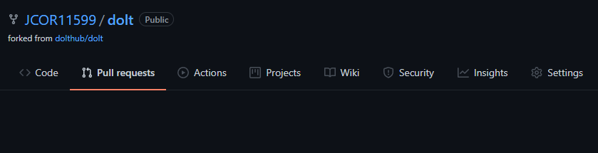
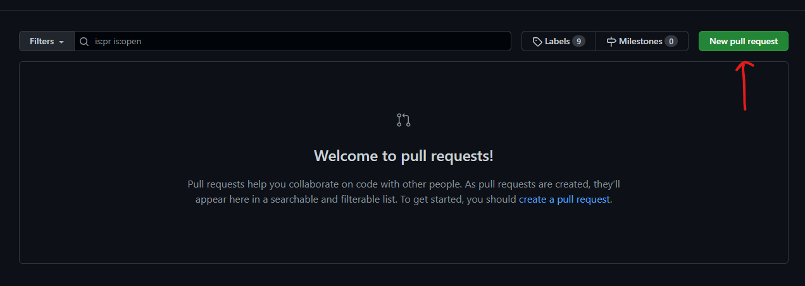
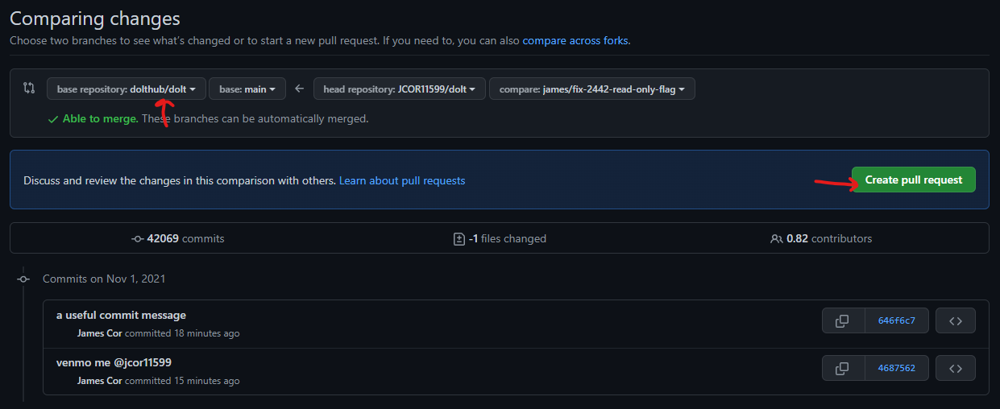

[Dolt](https://doltdb.com) is an open-source SQL database that has Git-like
functionality, including branch, merge, clone, push and pull. As we attract
more and more users with various use cases and ways of integrating Dolt into
their existing workflows and systems, it's not rare for Dolt to need a little
bit of work to support a new client library or upstream dependency. 

Dolt consists of multiple parts:
- [dolt](https://github.com/dolthub/dolt)
- [go-mysql-server](https://github.com/dolthub/go-mysql-server)
- [vitess](https://github.com/dolthub/vitess)

Known issues with each part:
- [dolt issues](https://github.com/dolthub/dolt/issues)
- [go-mysql-server issues](https://github.com/dolthub/go-mysql-server/issues)
- [vitess issues](https://github.com/dolthub/vitess/issues)
	
## Prerequisites
You should know that:
1. Dolt is largely written in [golang](https://golang.org/) and
   you should [install the golang sdk](https://golang.org/dl/) to work with it.

2. Dolt's SCM is [git](https://www.git-scm.com) and you will need to [download
   and install it](https://git-scm.com/downloads) to fetch the source code and
   create pull requests.

3. Dolt's source code is hosted on [github](https://www.github.com) and you
   will want to [create an account](https://github.com/signup) and [follow the
   instructions for authenticating to GitHub with
   SSH](https://docs.github.com/en/github/authenticating-to-github/connecting-to-github-with-ssh)
   if you don't already have one.

# Setup
## Retrieve Source Code
Create a fork of the dolt repo(s) by clicking the fork button at the upper
right of each of the respective dolthub github repos.

Create a directory for your dolt workspace.
```bash
~ $ mkdir dolt_workspace
~ $ cd ~/dolt_workspace
```

Clone each of the dolt repos using Git.
```bash
~/dolt_workspace $ git clone git@github.com:<your-username>/dolt.git
~/dolt_workspace $ git clone git@github.com:<your-username>/go-mysql-server.git
~/dolt_workspace $ git clone git@github.com:<your-username>/vitess.git
```

Add a local dependencies for `dolt` and `go-mysql-server`.
```bash
~/dolt_workspace $ cd ./dolt/go
~/dolt_workspace/dolt/go $ go mod edit -replace github.com/dolthub/go-mysql-server=../../go-mysql-server
~/dolt_workspace/dolt/go $ go mod edit -replace github.com/dolthub/vitess=../../vitess
~/dolt_workspace $ cd ../../go-mysql-server
~/dolt_workspace/go-mysql-server $ go mod edit -replace github.com/dolthub/vitess=../vitess
~/dolt_workspace/go-mysql-server $ cd ..
```

Check that everything is working as expected by running dolt's unit tests
(this might take a few minutes).
```bash
~/dolt_workspace $ cd ./dolt/go
~/dolt_workspace/dolt/go $ go test ./...
?       github.com/dolthub/dolt/go/cmd/dolt     [no test files]
ok      github.com/dolthub/dolt/go/cmd/dolt/cli 0.541s
ok      github.com/dolthub/dolt/go/cmd/dolt/commands    4.890s
.
.
.
ok      github.com/dolthub/dolt/go/store/util/verbose   0.373s
ok      github.com/dolthub/dolt/go/store/util/writers   0.392s
ok      github.com/dolthub/dolt/go/store/valuefile      0.786s
```

## Fix Issue
Refer to these guides to fix bugs specific to each part of dolt:
1. [Contributing to Dolt](./contributing/dolt)
2. [Contributing to Go MySQL Server](./contributing/go-mysql-server)

## Submit Pull Request
Remember to remove local dependencies before pushing your changes.
```bash
~/dolt_workspace $ cd ./dolt/go
~/dolt_workspace $ go mod edit -dropreplace github.com/dolthub/go-mysql-server
~/dolt_workspace $ go mod edit -dropreplace github.com/dolthub/vitess
~/dolt_workspace $ cd ../../go-mysql-server
~/dolt_workspace $ go mod edit -dropreplace github.com/dolthub/vitess
~/dolt_workspace $ cd ..
```

If your fix required changes to multiple projects, commit them in this order:
1. vitess
2. go-mysql-server
3. dolt

Navigate to the pull requests section of your repo(s).



Click on "New pull request".



Make sure the base repository is set to dolthub/dolt and click "Create pull request".



This will trigger the continuous integration tests to run, which make sure the changes
don't break any existing functionality. If all goes well, somebody on the Dolt team
will review the changes, and they'll be approved and merged.
