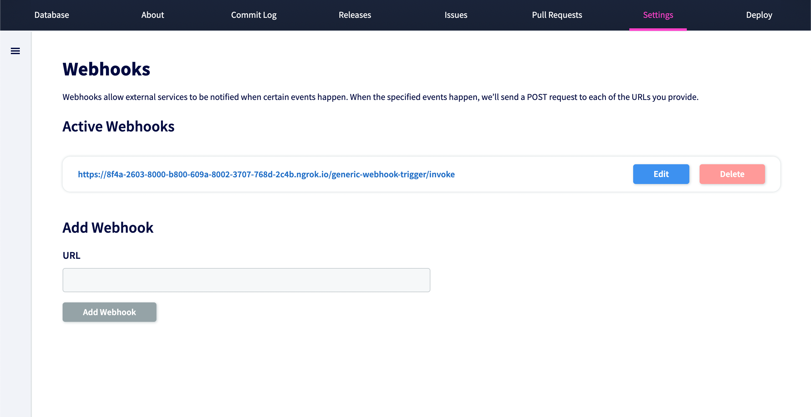

# Hooks

## What is a hook?

Hooks allow you to build or set up integrations that subscribe to certain events on
DoltHub, such as pushing data. You give DoltHub the URL of an HTTP endpoint you've set up
to accept POST requests, and then when certain events happen your endpoint will receive a
payload.

## How to use hooks

Some common workflows involving hooks include:

- Triggering [continuous integration](https://en.wikipedia.org/wiki/Continuous_integration) builds
- Updating an external issue tracker
- Creating automatic releases

## Difference between GitHub hooks and DoltHub hooks

DoltHub hooks currently only support push, pull request and branch events on a database, while GitHub supports a
much [longer list of
events](https://docs.github.com/en/developers/webhooks-and-events/webhooks/webhook-events-and-payloads)
on both [organizations](https://docs.github.com/en/rest/orgs/webhooks) and
[repositories](https://docs.github.com/en/rest/repos#webhooks).

If you have an event you'd like us to support, [file an issue](https://github.com/dolthub/dolthub-issues/issues/new?assignees=tbantle22&labels=enhancement&template=feature_request.md&title=) or reach out to us on [Discord](https://discord.com/invite/RFwfYpu).

## Setting up webhooks: an example

[This blog](https://www.dolthub.com/blog/2020-04-08-data-ci-with-dolthub-webhooks/) covers
an in depth example for how to set up a webhook for a push event on DoltHub. You can add
and manage webhooks in the settings tab of any of your DoltHub databases.



## Events and payloads

### on_push

This event occurs when a commit is pushed.

#### Webhook payload object

The payload delivered for a push event webhook contains information about the push that was made to the database. The payload is a JSON object that includes the following fields:

| Key                  | Type    | Description                                                                    |
| ---------------------| --------| -------------------------------------------------------------------------------|
| `ref`                | string  | The name of the branch that was pushed.                                        |
| `head`               | string  | The SHA of the most recent commit on `ref` after the push.                     |
| `prev`               | string  | The SHA of the most recent commit on `ref` before the push.                    |
| `repository.name`    | string  | The name of the database where the push occurred.                              |
| `repository.owner`   | string  | The owner (username or org name) of the database where the push occurred.      |

An example of the payload:

```json
{
  "ref": "refs/heads/main",
  "head": "ns725d8noah3m0mjjvrilet1rsmcgna2",
  "prev": "6higvr7ic9ndahfruh3kufu409im44jd",
  "repository": {
    "name": "test",
    "owner": "liuliu"
  }
}
```

### on_pull_request

The pull request event webhook is triggered whenever a pull request is created, merged, or closed. The payload includes these fields:

| Key                  | Type    | Description                                                                                  |
| ---------------------| --------| ---------------------------------------------------------------------------------------------|
| `repository.name`    | string  | The name of the database where the push occurred.                                            |
| `repository.owner`   | string  | The owner (username or org name) of the database where the pull request change occurred.     |
| `pullID`             | string  | The ID of the pull request that triggered the webhook.                                       |
| `action`             | string  | The action that triggered the webhook (Opened, Closed, etc.).                                |

An example of the payload object:

```json
{
  "repository": {
    "name": "test",
    "owner": "liuliu"
  },
  "pullID": "15",
  "action": "Opened"
}
```

### on_branch

A branch Event Webhook is triggered when a branch is created or deleted. The payload includes these fields:

| Key                  | Type    | Description                                                                            |
| ---------------------| --------| ---------------------------------------------------------------------------------------|
| `repository.name`    | string  | The name of the database where the push occurred.                                      |
| `repository.owner`   | string  | The owner (username or org name) of the database where the branch change occurred.     |
| `event_name	`        | string  | The name of the event (branch).                                                        |
| `branch`             | string  | The full name of the branch (e.g., refs/heads/main).                                   |
| `action`             | string  | The action that triggered the webhook (deleted or created the branch).                 |

An example of the payload:
```json
{
  "event_name": "branch",
  "repository": {
    "name": "test",
    "owner": "liuliu"
  },
  "branch": "liuliu/workspace-fashionable-sponge",
  "action": "Deleted branch"
}
```
