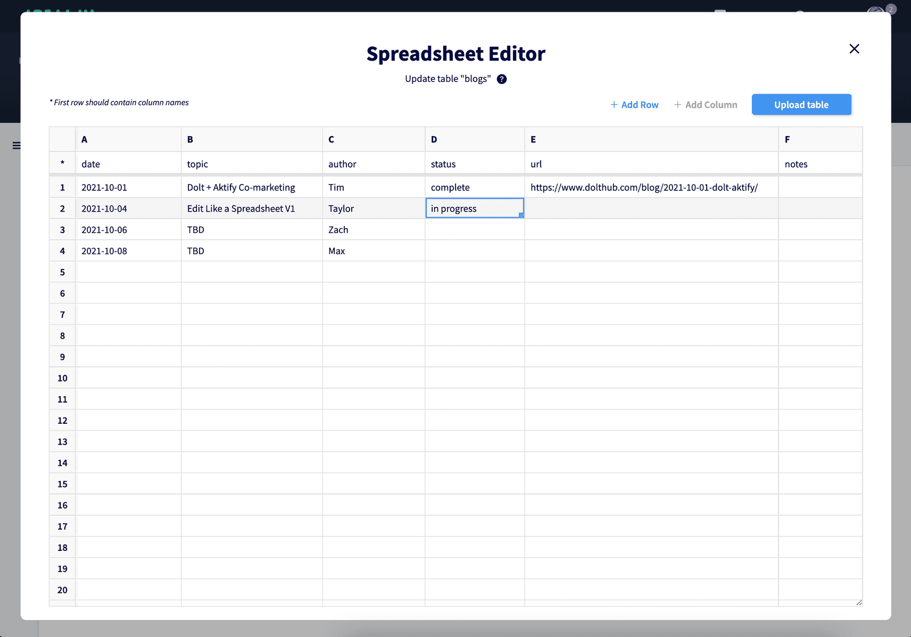

# Get data into Dolt

You can easily load the following data formats into Dolt:

* CSV, JSON, Parquet
* MySQL databases
* Postgres
* Spreadsheets
* Pandas dataframes

We support several commands for this including:

1. [`dolt table import`](https://pandas.pydata.org/docs/reference/api/pandas.read_sql.html)
2. [`LOAD DATA`](https://dev.mysql.com/doc/refman/8.0/en/load-data.html)
3. [`dolt sql`](https://docs.dolthub.com/cli-reference/cli#dolt-sql)

## CSV, JSON, and Parquet Files

The easiest sources of data to work with are CSV, JSON, and Parquet files. These pair best with the custom `dolt table import` 
command.

1. Importing with no schema

Dolt supports importing `csv` files without a defined SQL schema. Consider the following csv file:

```csv
pk,val
1,2
2,3
```

We can import and create a table as follows:

```bash
dolt table import -c --pk=pk mytable file.csv

Rows Processed: 2, Additions: 2, Modifications: 0, Had No Effect: 0
Import completed successfully.
```

We can query the table and see the new schema and data:

```
> dolt sql -q "describe mytable"
+-------+--------------+------+-----+---------+-------+
| Field | Type         | Null | Key | Default | Extra |
+-------+--------------+------+-----+---------+-------+
| pk    | int unsigned | NO   | PRI |         |       |
| val   | int unsigned | NO   |     |         |       |
+-------+--------------+------+-----+---------+-------+

> dolt sql -q "select * from mytable"
+----+-----+
| pk | val |
+----+-----+
| 1  | 2   |
| 2  | 3   |
+----+-----+
```

You can reference the `dolt table import` documentation here to additional ways to modify your database with csv including updating your data, and replacing your existing data.

2. Importing with a schema

In the case of  JSON or Parquet file we require you provide a schema in the form of a `CREATE TABLE` SQL statement. You can also specify a schema for a csv file. Let's walk through the following file.

```json
{
  "rows": [
    {
      "id": 0,
      "first name": "tim",
      "last name": "sehn",
      "title": "ceo"
    },
    {
      "id": 1,
      "first name": "aaron",
      "last name": "son",
      "title": "founder"
    },
    {
      "id": 2,
      "first name": "brian",
      "last name": "hendricks",
      "title": "founder"
    }
  ]
}
```

Our sql schema will look like this:

```sql
CREATE TABLE employees (
    `id` LONGTEXT NOT NULL,
    `first name` LONGTEXT,
    `last name` LONGTEXT,
    `title` LONGTEXT,
    PRIMARY KEY (`id`)
);
```

Putting it all together

```bash
> dolt table import -c -s schema.sql employees file.json
Rows Processed: 3, Additions: 3, Modifications: 0, Had No Effect: 0
Import completed successfully.

> dolt sql -q "select * from employees"
+----+------------+-----------+---------+
| id | first name | last name | title   |
+----+------------+-----------+---------+
| 0  | tim        | sehn      | ceo     |
| 1  | aaron      | son       | founder |
| 2  | brian      | hendricks | founder |
+----+------------+-----------+---------+
```

3. You can also use the MySQL `LOAD DATA` command to work with data that is compatible with the [LOAD DATA api](https://dev.mysql.com/doc/refman/8.0/en/load-data.html). For example
you can load the above `file.csv` as follows:


```sql
create table test(pk int, val int);
LOAD DATA INFILE '/Users/vinairachakonda/misc/test/file.csv' INTO table test FIELDS TERMINATED BY ',' IGNORE 1 LINES;
```

Selecting from above you get 

```
test> select * from test;
+----+-----+
| pk | val |
+----+-----+
| 2  | 3   |
| 1  | 2   |
+----+-----+
```

## MySQL Databases

Migrating your MySQL database to Dolt is easy. We recommend the `mysqldump` program. Let's say you have MySQL server with the following configurations

```yaml
user: root
password: 
host: 0.0.0.0
port: 3306
database: test
```

You can dump the database `test` as follows:

```
mysqldump test -P 3306 -h 0.0.0.0 -u root -p > dump.sql
```

To load into dolt:

```
dolt sql < dump.sql
```

## Postgres

You can load a postgres database into dolt with our custom [pg2mysql](https://github.com/dolthub/pg2mysql) tool. If you have 
a postgres database you can export a postgres dump file with the [pg_dump](https://www.postgresql.org/docs/current/app-pgdump.html#:~:text=pg_dump%20is%20a%20utility%20for,only%20dumps%20a%20single%20database) utility. 

With the a postgres dump file of `file.pgdump` you can convert it into a mysql dump as follows.

```
./pg2mysql.pl < file.pgdump > mysql.sql
```

Finally you can load the mysql file into dolt.

```
dolt sql < mysql.sql
```

## Spreadsheets

There are multiple ways to get spreadsheet data into Dolt. The first is with `dolt table import`. Consider the following excel file: `employees.xlsx`


```bash
0,tim,sehn,ceo
1,aaron,son,founder
2,brian,hendricks,founder
```

Just like a csv file we run the command `dolt table import -c --pk=id employees employees.xlsx` to load the excel file 
into our Dolt. Be sure to give the same name for the table as the spreadsheet's name.

The other way to work with spreadsheet data is with Dolthub ["edit-like-a-spreadsheet"](https://www.dolthub.com/blog/2021-10-04-edit-like-spreadsheet-v1/) feature. You can create a SQL table from scratch with by just inserting values into a spreadsheet.




## Pandas Dataframe

We recommend standard MySQL + Python techniques when intergrating Dolt with Pandas. First you want to connect to your
Dolt database with the [SQLAlchemy](https://www.sqlalchemy.org/) ORM. Here's some sample code below:

```py
from sqlalchemy import create_engine
import pymysql
import pandas as pd

employees = {
    "id": [0, 1, 2],
    "FirstName": ["Tim","Aaron","Brian"],
    "LastName": ["Sehn", "Son", "Hendriks"],
    "Title": ["CEO", "Founder", "Founder"],
}

tableName = "employees"
dataFrame = pd.DataFrame(data=employees)

sqlEngine = create_engine("mysql+pymysql://root:@127.0.0.1/test", pool_recycle=3600)
dbConnection = sqlEngine.connect()

try:
    frame = dataFrame.to_sql(tableName, dbConnection, if_exists="fail")
    print("Table %s created successfully." % tableName)
except Exception as ex:
    print(ex)
finally:
    dbConnection.close()
```

In the above example we are creating a data frame of employees and writing it to our Dolt database. We can then use
the [read_sql](https://pandas.pydata.org/docs/reference/api/pandas.read_sql.html) function to read back data from our MySQL database into Dolt.

```py
frame = pd.read_sql('SELECT * from employees', dbConnection)
print(frame)

#    index  id FirstName  LastName    Title
# 0      0   0       Tim      Sehn      CEO
# 1      2   2     Brian  Hendriks  Founder
# 2      1   1     Aaron       Son  Founder
```

The second way to do this is by exporting your pandas dataframe as a csv file which can then be imported with `dolt 
table import`.

```py
>>> import pandas as pd
>>> df = pd.DataFrame({'name': ['Raphael', 'Donatello'],
...                    'mask': ['red', 'purple'],
...                    'weapon': ['sai', 'bo staff']})
>>> df.to_csv('out.csv', index=False)
```


## Import Best Practices

There are some best practices to keep in mind in order to make importing external data into Dolt as fast as possible. These performances differences are especially relevant with large database (~50GB+).

* Avoid adding foreign keys or unique indexes until after the import is completed.
* Minimize your use of blob types
* If running multiple import jobs back to back, be sure to [garbage collect](https://docs.dolthub.com/cli-reference/cli#dolt-gc) the database
