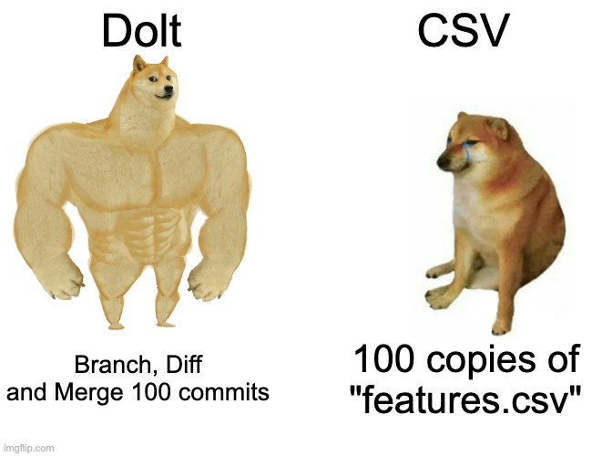
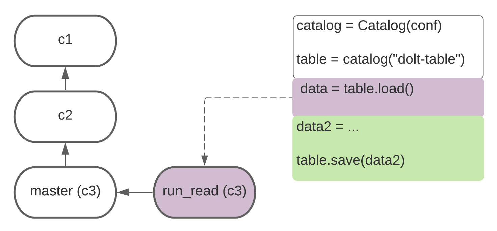

# Versioning Workflow Managers

This article walks-through how to extend workflow managers that
currently copy CSV files with Dolt versioning.

## Background

Data applications differ from traditional applications. Data processes
include experimental experts not versed in software engineering. The
schemas, shape and content of data is fungible. Data pipelines cannot be
versioned only as static code. These common experiences have culminated
in a new discipline: machine learning operations (MLOps).

Better tooling is needed to deliver product engineering grade
organization and reproducibility to ML infrastructure. Workflow
managers, orchestrators and smart notebooks all contribute process
improvements, but they don’t solve data versioning.

This is where Dolt comes in. Dolt is an SQL database with Git
versioning. Tabular data in Dolt is stored in a format that supports
efficient branching, diffing and merging. Dolt tables also inherit the
benefits of production relational databases, including schema
management, horizontal scalability and a SQL query interface.



You would use Dolt's data storage instead of CSVs to track relationships
between tables within and between computational steps. For example, Dolt
tables can efficiently diff to check whether a workflow needs to re-run.
Dolt also tracks lineage and metadata, so every table, schema and row
and change in Dolt will have timestamps, deltas and "blames" associated
with it.

"Workflow managers" help organize production ML pipelines by separating the
concerns of data scientists and infrastructure engineers. Data
versioning straddles science and engineering, and integrating those
features in workflow managers is one of the best ways to improve data
reproducibility.

Workflow managers are divided into two camps at the data layer: 1)
file-system native, and 2) object-native. File-system native workflow
managers might do things like: track whether a compute step has
completed based on the existence of output files; or, automatically load
CSV datasets into DataFrames for ease of experimentation. Object-native
workflows might capture, pickle and save Python objects during a
workflow to make available for later inspection and debugging.

The user experience between these two methods vary, and the appropriate
choice of tool depends on preference and use-case. We will focus on
file-system native data interfaces here. Our [Metaflow integration]() is
an example of an object-native integration if you are interested in
learning more.


## Workflow Integrations

Workflow managers have three features that we use for Dolt integrations:

1. File-system interfaces have save and load methods. Load is used to
   fetch a table, save is used to persist the results of an execution
   task.

2. CSV files are an intermediate data format. Parquet, Excel files and
   others may be supported, but workflow managers usually understand
   CSV. Dolt imports and exports using CSV files for compatibility.

3. Workflow managers log execution metadata. Information about
   dependency names, locations, md5 hashes, time of access are recorded.

We built a library for Dolt that exposes save and load methods,
communicates with workflow managers through CSV files, and supports
metadata hooks for logging Dolt actions into a variety of metadata
systems. Dolt can inject Git versioning in the save/load interfaces. We
focus on branching and commit metadata here.


We will loosely use Kedro’s workflow data interface to ground our
integration in a production context. Kedro’s DataSets meet our three
file-system criteria and naturally extend Dolt versioning. The "Example
Application" diagram acts as a  reference for understanding loading
(purple) and saving (green) data.

## IO With CSV Compatibility

Loading data requires a csv intermediate:

```python
def dolt_export_csv(db: dolt.Dolt, tablename: str, filename: str,
load_args: dict = None):
    exp = ["table", "export", "-f", "--file-type", "csv", tablename,
    filename]
    db.execute(exp)
```

Saving data also uses a CSV file as a communication intermediate
(simplified):

```python
def dolt_import_csv(db: dolt.Dolt, tablename: str, filename: str,
save_args: dict = None):
    mode = "--replace"
    imp = ["table", "import", mode, tablename]
    if "primary_key" in save_args:
        imp.append(f"--pk {save_args[‘primary_key’}")
    imp.append(filename)
    db.execute(imp)
```


Neither of these functions are accessed directly. The load and save
methods wrap these functions with branching, metadata and remote logic.

## Branches

Dolt branches follow Git semantics. Branches are created from specific
commits and progress independently from other branches.



Loading tables in a workflow manager only requires specifying a branch
or a commit. In the diagram above, we read (purple) from the "new"
branch, which points to the version of the data as master.

The easiest way to save data is
to append a new commit to a branch:

```python
br_conf = AppendBranch(branch="master")
```


The green path in the diagram above uses parallel branching to save a
table. Dolt will first checkout commit "c2," overwrite the table via a
file import, and then merge the changes back to master. The branch
configuration for the data save (green) above looks like:

```python
br_conf = MergeBranch(branch_from="c2", merge_to="master")
```

## Metadata

Workflow managers usually track metadata -- execution ids,
timestamps, inputs, outputs, ...etc. CSV files generated during
workflow can usually be downloaded using these path metadata references
after workflow executions.


Dolt metadata can be recorded in a format similar to the diagrams above.
Tables in Dolt benefit from a host of other additional features --
including bidirectional metadata that lets users track executions
starting from data in Dolt.

Metadata is best-placed in the target workflow manager. The example
below passes a callback function for manipulating these pieces of
metadata:

```python
meta_conf = CallbackMeta(fn=lambda x: logger.log(x))
```

## Remotes

Experimenting with Dolt is easiest with local/Git-style cloning. Repos
can be pushed and pulled from DoltHub or an S3 endpoint in workflow
managers:

```python
remote_conf = Remote(url="https://www.dolthub.com/repositories/max-hoffman/state-age")
```

Using Dolt in server-mode with transactional logic is currently in
development.

## Putting It All Together

The load and save functions are where we combine Dolt configs:

```python
save(
    db=doltdb,
    tablename="bar",
    filename=tmpfile,
    save_args=dict(primary_key="c"),
    branch_conf=MergeBranch(branch_from="c2", merge_to="master"),
    meta_conf=CallbackMeta(fn=lambda x: logger.log(x)),
    remote_conf=Remote(url="https://www.dolthub.com/repositories/max-hoffman/state-age")
)
```

Here we import the data in `tmpfile` into the `bar` table of our `doltdb` database.
Column `c` will be a primary key, the commit will use a branch merge
to update master, and our application will log our metadata.
Finallly, the commit update the most recently pulled version of master
before pushing results back to our origin.
