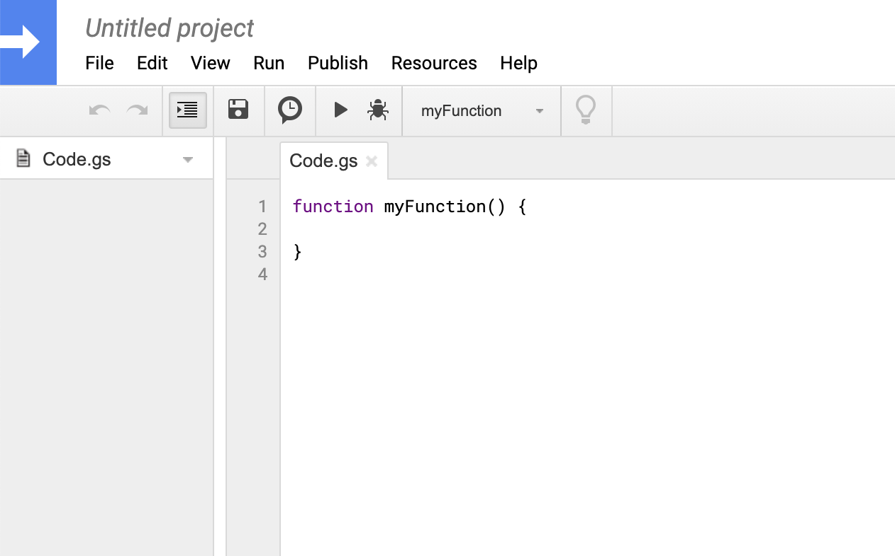
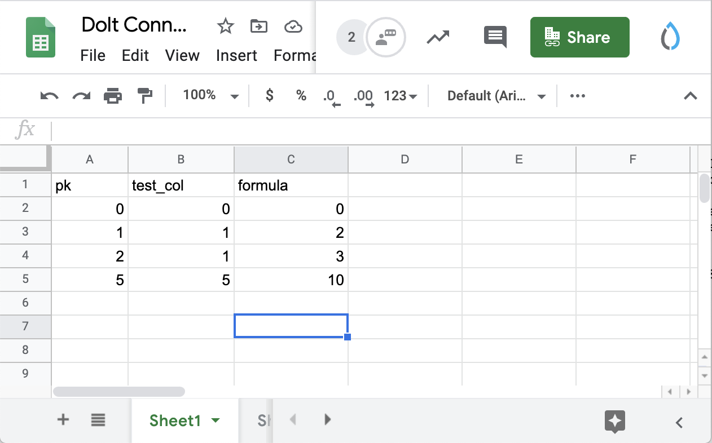

# Spreadsheets

Spreadsheets are a fundamental data analysis tool. If you provide a data tool, it must integrate with spreadsheet software. This document outlines Dolt's supported integrations to various spreadsheet tools: how to read data from Dolt into a spreadsheet, how to write data from a spreadsheet into Dolt, and how to access Dolt versioning functionality from spreadsheets.

## Excel

This document assumes you are using Windows and would like to access a local Dolt database using Excel.

### Reading from Dolt

Again, this document assumes you have a local clone of a Dolt database on your computer. If you would like to read data from a repository pushed to DoltHub, [the web API](../interfaces/api.md) is recommended.

#### Using CSVs

If your data is small enough, it may be practical to export an entire Dolt table as a CSV and then read that CSV into Excel.

To export a table from dolt to a CSV, [install Dolt](../getting-started/installation.md), create or clone the Dolt database you want, and then run the following command in the Dolt directory. `dolt table export test > example.csv` command exports the `test` table to `example.csv`. Test has 3 rows and two columns.

```bash
$ dolt table export test
pk,test_col
0,0
1,1
2,1
$ dolt table export test > example.csv
Successfully exported data.
$ ls example.csv
example.csv
```

Open Microsoft Excel. Select Data &gt; From Text/CSV. Navigate to the `export.csv` file on your computer. Click Import, make sure the preview is correct, click Load and the Dolt table should be loaded in as a new sheet.


Note, you can also export the results of a single query using `dolt sql -r csv -q <query> > export.csv`.

#### Using ODBC

When importing the whole Dolt table to Excel using CSV is impractical due to size or use case, we support the Excel ODBC Connector. You can prune the data you are importing into Excel to the results of a single SQL query. Dolt is a MySQL compatible database. You can connect to it in the same way you would a running MySQL server instance.

The first thing you have to do is start a Dolt SQL Server. To do this navigate to the Dolt repository directory you want to read from and run `dolt sql-server`. This command starts a MySQL compatible server on port 3306 with a user named `root`. It exposes a database named after the Dolt repository directory with dashes \(`-`\) changed to underscores \(`_`\). Thus, `dolt-test` directory name becomes `dolt_test` database name. For the purposes of this example I am running a database named `dolt_test` with user `dolt`.

Now you must install the [MySQL ODBC Connector](https://dev.mysql.com/downloads/connector/odbc/) on your computer. Downloading the appropriate one and running it opens a standard Windows Installer. Once complete, navigate to `Control Panel` &gt; `Administrative Tools` &gt; `ODBC Data Sources` or just search for `ODBC Data Sources`. You'll be greeted by this window:


Click `Add...` and you should see `MySQL ODBC 8.0 ANSI Driver` and `MySQL ODBC 8.0 Unicode Driver`, select the `MySQL ODBC 8.0 ANSI Driver` and click `Finish`. Now you need to enter your connection information. We call the data source Dolt Test, leave the server on TCP and enter `localhost` as the server name, enter the user `dolt`, and the database as `dolt_test`. After entering that information, clicking `Test` should result in a `Connection Successful` dialog. Click `OK` and the new Dolt Test ODBC connector will appear in the list.


Now it's time to read the data into Excel over that connection. Go back to Excel and navigate to `Data` &gt; `Get Data` &gt; `From Other Sources` &gt; `From ODBC`. Pick `Dolt Test` from the drop down and click `OK`. This will bring up the following preview screen where you can navigate to and pick the table you want to import. The test table is in the `dolt_test` database. Clicking `Load` will load the data into the selected sheet.


If you want to return the results of a query instead of a whole table, navigate to `Data` &gt; `Get Data` &gt; `From Other Sources` &gt; `From ODBC`. Pick `Dolt Test` from the drop down and click `Advanced` instead of `OK`. Enter the SQL query you would like to run in the text box. This currently does not work for some versions of Excel because of [a Dolt issue](https://github.com/dolthub/dolt/issues/991). Until this is resolved, if you want to import the results of a query instead of a full table we recommend `dolt sql -r csv -q` and using the CSV instructions of this document.

### Writing to Dolt

Dolt provides a lot of value through it's versioning features when you use it to master datasets that change. You can use Dolt to version and distribute your spreadsheets and take full advantage of distributed version control. Here's how to do that with Excel.

#### Using CSVs

If you have data in an Excel sheet you would like to store and version, exporting that sheet as a CSV and importing it to Dolt is a good option. In effect, you are translating and persisting the sheet as a database table. This database table contains extra information, the database schema \(ie. the data types, the constraints, etc\), that must be inferred from the sheet or defined some other way.

Let's start with the simple case where you already have an existing Dolt table that is in the proper schema. Perhaps you even read the data from Dolt and you have simply modified it and want to store your changes.

In Excel, navigate to the sheet you would like to import to Dolt as a table and click `File` &gt; `Export` &gt; `Change File Type` &gt; `CSV (Comma delimited)`. Then click `Save as`. Name the CSV and place it wherever you'd like on your filesystem. For the purposes of this example, we called the CSV `Sheet1.csv` and placed it in the `dolt-test` directory that houses the Dolt database.

To import this file to Dolt, go to the directory your Dolt database is located in. Then you run the `dolt table import` command with the table and CSV file path as arguments.

```bash
$ dolt table import -r test Sheet1.csv
Rows Processed: 3, Additions: 3, Modifications: 0, Had No Effect: 0
Import completed successfully.
```

Note the use of `-r` or replace. You have two options on import for an existing table, `-u` for update or `r` for replace. `-u` does not delete any existing rows. So, essentially it only adds or updates existing rows. `r` makes the table look exactly like what is in the CSV. I generally use `-r` on most imports.

Now we'll tackle the case where you want to create a new table from a Google Sheet. If you trust Dolt to infer the schema of the table from the data, you can run `dolt table import -c`. `c` stands for create.

```bash
$ dolt table import -c test_types Sheet1.csv
Rows Processed: 3, Additions: 3, Modifications: 0, Had No Effect: 0
Import completed successfully.
$ dolt schema show test_types
test_types @ working
CREATE TABLE `test_types` (
  `pk` INT UNSIGNED NOT NULL COMMENT 'tag:2348',
  `test_col` INT UNSIGNED NOT NULL COMMENT 'tag:7436',
  PRIMARY KEY (`pk`)
);
$ dolt sql -q "select * from test_types"
+----+----------+
| pk | test_col |
+----+----------+
| 0  | 0        |
| 1  | 1        |
| 2  | 1        |
+----+----------+
```

Most of the time, the above will work as you expect. But sometimes, you'll want to specify different types for certain columns or add additional primary keys. You can either specify the schema you would like by writing a `CREATE TABLE` statement and processing it through `dolt sql` or you can have Dolt give you a hint by running `dolt schema import --dry-run`.

```bash
$ dolt schema import -c --pks pk --dry-run schema_import_test Sheet1.csv
CREATE TABLE `schema_import_test` (
  `pk` INT UNSIGNED NOT NULL COMMENT 'tag:9152',
  `test_col` INT UNSIGNED NOT NULL hCOMMENT 'tag:13834',
  PRIMARY KEY (`pk`)
);
```

You can then take that output and modify it to the schema you would like. For instance, you might want to removed the `UNSIGNED` and `NOT NULL` constraints from `test_col`. Once you have the schema you want, process the `CREATE TABLE` statement through `dolt sql` and complete the import by running `dolt table import -r`.

To store the above tables in Dolt as a commit, run `dolt add -A` and `dolt commit`. To send that commit to DoltHub, [set up DoltHub as a remote](../getting-started/dolthub.md#using-dolt) and run `dolt push`.

### Accessing Dolt Versioning

We don't have a compelling story right now for either reading or creating versioning information in Excel. The ability to control branch and commit within Excel could be compelling. The best way to get read access to versioning information from Excel would be to use SQL and [Dolt System tables](../interfaces/sql/dolt-system-tables.md) to query the versioning information you would like using the process outlined in "Reading from Dolt Using ODBC".

We imagine providing this functionality through an Excel Plug In in the future. If this feature is compelling to you, [let us know](https://www.dolthub.com/contact).

## Google Sheets

### Reading from Dolt

This document assumes you have a local Dolt database you would like to read data from into Google Sheets. If you would like to read data from a repository pushed to DoltHub, [the web API](../dolthub/getting-started.md#api-alpha) is recommended.

#### Using CSVs

If your data is small enough, it may be practical to export an entire Dolt table as a CSV and then read that CSV into Google Sheets.

To export a table from dolt to a CSV, [install Dolt](../getting-started/installation.md), create or clone the Dolt database you want, and then run the following command in the Dolt directory. `dolt table export test > example.csv` command exports the `test` table to `example.csv`. Test has 3 rows and two columns.

```bash
$ dolt table export test
pk,test_col
0,0
1,1
2,1
$ dolt table export test > example.csv
Successfully exported data.
$ ls example.csv
example.csv
```

Navigate in your web browser to the desired Google Sheet. Select `File` &gt; `Open`, select the Upload tab, and either drag the `example.csv` file into the web browser window or `Select a file from your device` using the operating system's file system browser. Click `OK` and the Dolt table should be loaded in as a sheet named after the CSV filename.


Note, you can also export the results of a single query using `dolt sql -r csv -q <query> > export.csv`.

#### Using SQL JDBC Connector

When importing the whole Dolt table to Google Sheets is impractical due to size or use case, we support the Google Sheets SQL JDBC Connector. You can prune the data you are importing into your Google Sheets to the results of a single SQL query. Dolt is a MySQL compatible database. You can connect to it in the same way you would a running MySQL server instance.

The first thing you have to do is start a Dolt SQL Server. To do this navigate to the Dolt repository directory you want to read from and run `dolt sql-server`. This command starts a MySQL compatible server on port 3306 with a user named `root`. It exposes a database named after the Dolt repository directory with dashes \(`-`\) changed to underscores \(`_`\). Thus, `dolt-test` directory name becomes `dolt_test` database name. For the purposes of this example I am running a database named `dolt_test` with user `dolt`.

Once you have a running Dolt MySQL-compatible server, you need to open the port it is running on to the internet. If your Dolt sql-server is already running on a host accessible via the internet, you can skip this step. To do this on a home or employer network, we recommend using [ngrok](https://ngrok.com/). `ngrok` is a hosted service that allows you to open a port on your computer to the internet fairly painlessly. First [follow the ngrok installation instructions](https://dashboard.ngrok.com/get-started/setup) for your operating system. Then run `ngrok tcp 3306` \(or substitute 3306 for whichever port you started the sql-server on\). This will start a program with the following output in your terminal:

```text
ngrok by @inconshreveable                                       (Ctrl+C to quit)

Session Status                online
Account                       tim@dolthub.com (Plan: Free)
Version                       2.3.35
Region                        United States (us)
Web Interface                 http://127.0.0.1:4040
Forwarding                    tcp://0.tcp.ngrok.io:15612 -> localhost:3306

Connections                   ttl     opn     rt1     rt5     p50     p90
                              78      0       0.00    0.01    0.05    0.40
```

Now a port on an `ngrok.io` host is open and forwarding traffic through a secure tunnel to a host on your machine. In the above case the `ngrok` host is named `0.tcp.ngrok.io` and the port is `15612`. You can connect to your running Dolt sql-server from anywhere on the internet with this host and port.

Lastly, you use the Google Sheets Script editor to read the data from Dolt over the SQL JDBC Connector and insert the results into your spreadsheet. Open a new script by clicking `Tools` &gt; `Script Editor`. You will be greeted by a new browser tab with an empty editor.



Paste the following code into the script editor:

```text
var server    = '0.tcp.ngrok.io';
var dbName    = 'dolt_test';
var username  = 'dolt';
var password  = '';
var port      = 15612;

var query = 'SELECT * FROM test';

var sheetName = 'Sheet1'

function readDolt() {
  var url  = 'jdbc:mysql://' + server + ':' + port + '/' + dbName;
  var conn = Jdbc.getConnection(url, username, password);

  var results  = conn.createStatement().executeQuery(query);
  var metaData = results.getMetaData();
  var numCols  = metaData.getColumnCount();

  var spreadsheet = SpreadsheetApp.getActive();
  var sheet       = spreadsheet.getSheetByName(sheetName);

  sheet.clearContents();

  var insert = [];

  for (var col = 0; col < numCols; col++) {
    insert.push(metaData.getColumnName(col + 1));
  }

  sheet.appendRow(insert);


  while (results.next()) {
    insert = [];
    for (var col = 0; col < numCols; col++) {
      insert.push(results.getString(col + 1));
    }

    sheet.appendRow(insert);
  }

  results.close();

  conn.close();
}
```

Replace the variables `server`, `dbName`, `username`, `password`, `port`, `query`, and `sheetName` with your desired inputs. When run using the "play icon", this script will clear the contents of the sheet `sheetName` and insert the results of your query.


You can modify that code to do whatever you would like. We wanted to show a simple example of connecting to a Dolt instance to populate a Google sheet. In the future, we may publish a supported Google Sheet Add-On to perform this and other common Dolt functionality.

### Writing To Dolt

Dolt provides a lot of value through it's versioning features when you use it to master datasets that change. You can use Dolt to version and distribute your spreadsheets and take full advantage of distributed version control. Here's how to do that with Google Sheets.

#### Using CSVs

If you have data in a Google Sheet you would like to store and version, exporting that sheet as a CSV and importing it to Dolt is a good option. In effect, you are translating and persisting the sheet as a database table. This database table contains extra information, the database schema \(ie. the data types, the constraints, etc\), that must be inferred from the sheet or defined some other way.

Let's start with the simple case where you already have an existing Dolt table that is in the proper schema. Perhaps you even read the data from Dolt and you have simply modified it and want to store your changes.

In Google Sheets, navigate to the sheet you would like to import to Dolt as a table and click `File` &gt; `Download` &gt; `Comma separated values (.csv, current sheet)`. This will make a CSV file in your default download location named `&lt;Spreadsheet name&gt; - &lt;Sheet Name&gt.csv;`.

To import this file to Dolt, go to the directory your Dolt database is located in. Then, you run the `dolt table import` command with the table and CSV file path as arguments.

```bash
$ dolt table import -r test ~/Downloads/Dolt\ Connection\ Test\ -\ Sheet1.csv
Rows Processed: 3, Additions: 3, Modifications: 0, Had No Effect: 0
Import completed successfully.
```

Note the use of `-r` or replace. You have two options on import for an existing table, `-u` for update or `r` for replace. `-u` does not delete any existing rows. So, essentially it only adds or updates existing rows. `r` makes the table look exactly like what is in the CSV. I generally use `-r` on most imports.

Now we'll tackle the case where you want to create a new table from a Google Sheet. If you trust Dolt to infer the schema of the table from the data, you can run `dolt table import -c`. `c` stands for create.

```bash
$ dolt table import -c test_types ~/Downloads/Dolt\ Connection\ Test\ -\ Sheet1.csv
Rows Processed: 3, Additions: 3, Modifications: 0, Had No Effect: 0
Import completed successfully.
$ dolt schema show test_types
test_types @ working
CREATE TABLE `test_types` (
  `pk` INT UNSIGNED NOT NULL COMMENT 'tag:2348',
  `test_col` INT UNSIGNED NOT NULL COMMENT 'tag:7436',
  PRIMARY KEY (`pk`)
);
$ dolt sql -q "select * from test_types"
+----+----------+
| pk | test_col |
+----+----------+
| 0  | 0        |
| 1  | 1        |
| 2  | 1        |
+----+----------+
```

Most of the time, the above will work as you expect. But sometimes, you'll want to specify different types for certain columns or add additional primary keys. You can either specify the schema you would like by writing a `CREATE TABLE` statement and processing it through `dolt sql` or you can have Dolt give you a hint by running `dolt schema import --dry-run`.

```bash
$ dolt schema import -c --pks pk --dry-run schema_import_test ~/Downloads/Dolt\ Connection\ Test\ -\ Sheet1.csv
CREATE TABLE `schema_import_test` (
  `pk` INT UNSIGNED NOT NULL COMMENT 'tag:9152',
  `test_col` INT UNSIGNED NOT NULL COMMENT 'tag:13834',
  PRIMARY KEY (`pk`)
);
```

You can then take that output and modify it to the schema you would like. For instance, you might want to removed the `UNSIGNED` and `NOT NULL` constraints from `test_col`. Once you have the schema you want, process the `CREATE TABLE` statement through `dolt sql` and complete the import by running `dolt table import -r`.

To store the above tables in Dolt as a commit, run `dolt add -A` and `dolt commit`. To send that commit to DoltHub, [set up DoltHub as a remote](../dolthub/getting-started.md#using-dolt) and run `dolt push`.

#### Using SQL JDBC Connector

If you want to do something more complicated than mirror a Google Sheet in a Dolt table, you can use the SQL JDBC Connector to perform arbitrarily complex imports. You have the power of a full scripting language and SQL database.

For this example we will make a script that mirrors a Google sheet but ignores a column. That column will contain a formula so we don't want to insert that as a string or value in the database. This is a common use case.



First step is to start a `dolt sql-server` and expose a port to the internet as described in "Reading from Dolt Using SQL JDBC Connector". Once that is complete, we again use the Script Editor in Google Sheets. Open a script editor, using `Tools` &gt; `Script Editor` and paste in the following code:

```text
var server    = '0.tcp.ngrok.io';
var dbName    = 'dolt_test';
var username  = 'dolt';
var password  = '';
var port      = 15612;

var sheetName = 'Sheet1';

function writeDolt() {
  var spreadsheet = SpreadsheetApp.getActive();
  var sheet       = spreadsheet.getSheetByName(sheetName);

  var data = sheet.getDataRange().getValues();

  // Clear the table so we mirror the sheet
  var query = 'delete from test';

  var url = 'jdbc:mysql://' + server + ':' + port + '/' + dbName;
  var conn = Jdbc.getConnection(url, username, password);
  conn.createStatement().execute(query);

  // ignore header row by starting index at 1
  for (var i = 1; i < data.length; i++) {
    // Dolt doesn't support prepared statements yet so I have to assemble
    // the query manually
    query = 'insert into test values(';

    // ignore last column (ie. formula) by subtracting 1 from length
    var first = 1;
    for (var j =0; j < data[i].length - 1; j++) {
      if ( first ) {
        first = 0;
      } else {
        query += ',';
      }
      query += data[i][j];
    }
    query += ')';
    conn.createStatement().execute(query);
  }
}
```

This script takes the contents of Sheet1 and inserts it into a table named test. The last column "Formula" is ignored. Go to the terminal your `dolt sql-server` is running in and run `dolt diff` or `dolt sql -q "select * from test"` and you should see the values of the sheet in the database.

```bash
 $ dolt diff
diff --dolt a/test b/test
--- a/test @ le1ug8ierdrpkbs2jljujf15gpsgu990
+++ b/test @ jq7j9mrbsabs05q2pmngi6sqfi48rnm1
+-----+----+----------+
|     | pk | test_col |
+-----+----+----------+
|  +  | 0  | 0        |
|  +  | 1  | 1        |
|  +  | 2  | 1        |
|  +  | 5  | 5        |
+-----+----+----------+
```

You can add and commit these changes with standard Dolt commands `dolt add test` and `dolt commit`.

### Accessing Dolt Versioning

We don't have a compelling story right now for either reading or creating versioning information in Google sheets. The ability to control branch and commit within Google Sheets could be compelling. The best way to get read access to versioning information from Google Sheets would be to use SQL and [Dolt System tables](../interfaces/sql/dolt-system-tables.md) to query the versioning information you would like using the process outlined in "Reading from Dolt Using SQL JDBC Connector".

We imagine providing this functionality through an Google Sheets Add On in the future. If this feature is compelling to you, [let us know](https://www.dolthub.com/contact).
