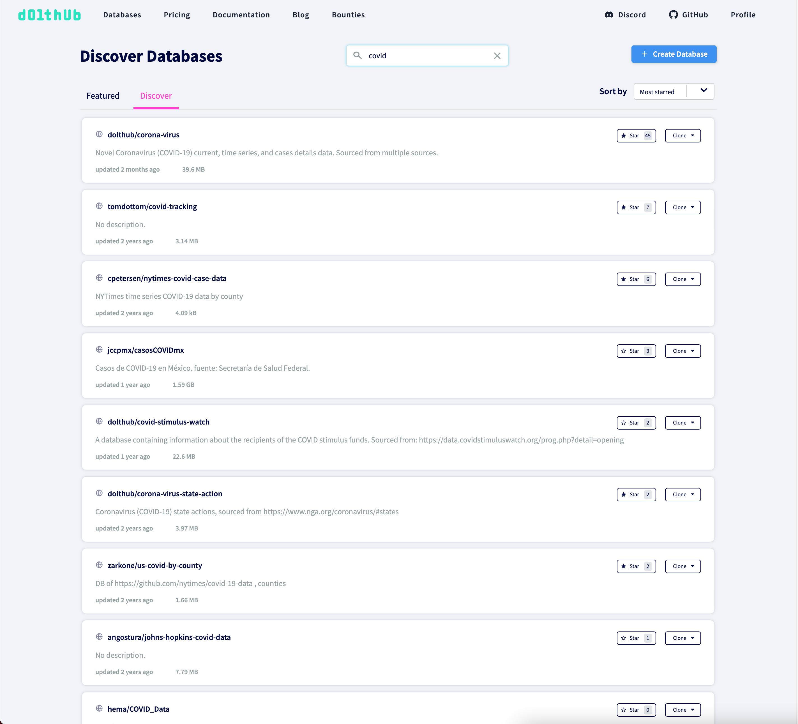
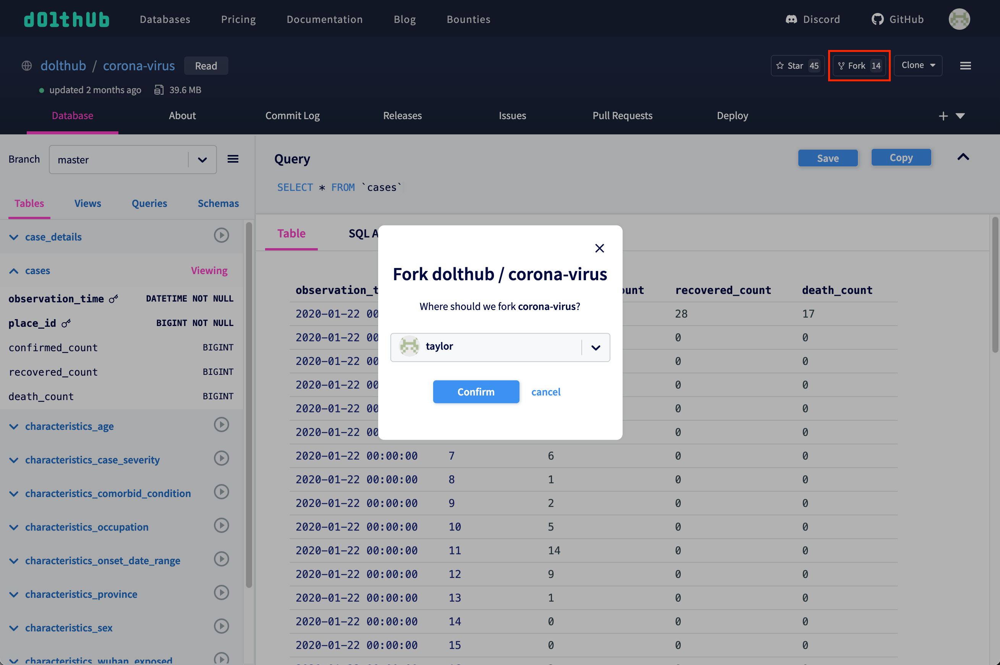
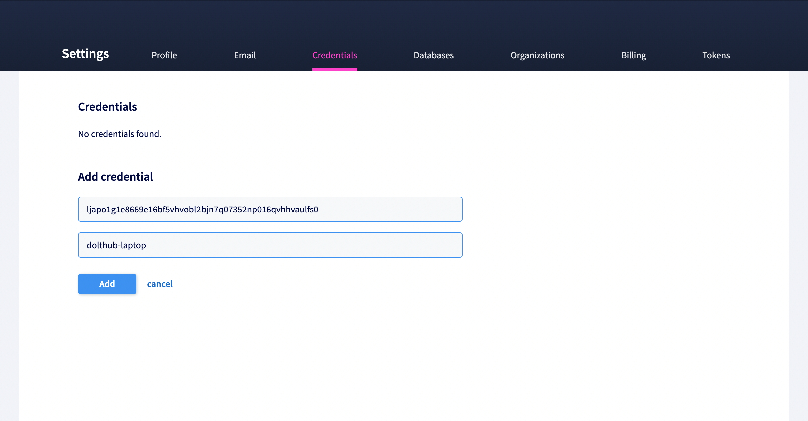
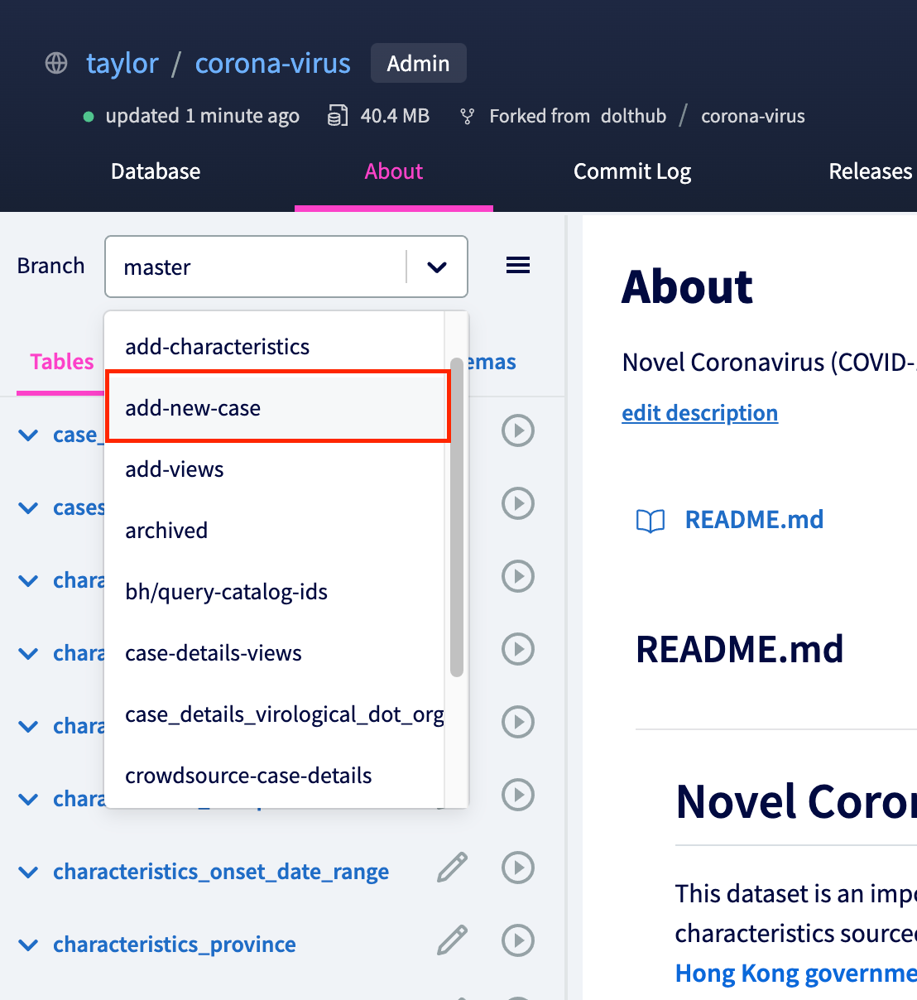

# Data Sharing on DoltHub

## Find data on DoltHub

Our [discover page](https://www.dolthub.com/discover) on DoltHub lets you find public databases created by users in our community. You can easily share these databases and adopt them for your own use cases.



## Clone data locally

See an interesting database you'd like to make changes to? Get the database locally with just one command (assuming you have [Dolt installed](../installation)), which is found on every database page:


We are going to use the [`dolthub/corona-virus`](https://www.dolthub.com/repositories/dolthub/corona-virus) database as an example

```
% dolt clone dolthub/corona-virus
cloning https://doltremoteapi.dolthub.com/dolthub/corona-virus
16,690 of 16,690 chunks complete. 0 chunks being downloaded currently.

% cd corona-virus
```

## Make some changes

Once you've cloned a database from DoltHub, you can use the SQL shell to make a change to the data. We're going to add a row to the `cases` table on a new branch:

```
% dolt checkout -b add-new-case
Switched to branch 'add-new-case'

% dolt sql
# Welcome to the DoltSQL shell.
# Statements must be terminated with ';'.
# "exit" or "quit" (or Ctrl-D) to exit.
corona_virus> insert into cases (observation_time, place_id, confirmed_count, recovered_count, death_count) values("2021-12-07", 39, 400, 100, 3);
Query OK, 1 row affected
corona_virus> exit;
Bye
```

You can see how the insert query changed the `cases` table by viewing the [diff](../../concepts/dolt/diff.md):

```
% dolt diff
diff --dolt a/cases b/cases
--- a/cases @ ullgt5s1i14g1vgndmuhek3269fjsvbc
+++ b/cases @ 3tfb3onk0r7i13hq1aohqj55lnsft912
+-----+---------------------+----------+-----------------+-----------------+-------------+
|     | observation_time    | place_id | confirmed_count | recovered_count | death_count |
+-----+---------------------+----------+-----------------+-----------------+-------------+
|  +  | 2021-12-07 00:00:00 | 39       | 400             | 100             | 3           |
+-----+---------------------+----------+-----------------+-----------------+-------------+
```

If the change looks good we add the table and commit:

```
% dolt add cases && dolt commit -m "Add new case for today"
commit pk9fei8l35php871j2gptaaa92v0e324
Author: Taylor Bantle <taylor@liquidata.co>
Date:   Tue Dec 07 11:43:56 -0800 2021

	Add new case for today

```

### Fork the database on DoltHub

Now that we've made a change locally using Dolt, we want to push the change back to DoltHub so that it can be incorporated into the database.

Since we don't have write permissions to `dolthub/corona-virus`, we need to fork it to our own namespace. This is easily done using the fork button:



Now we have a database in our namespace that we can write to (`taylor/corona-virus`).

### Setup your clone as a remote

Now that we have a fork of the original database, we need to add a remote to our locally cloned database.

```
% dolt remote add taylor taylor/corona-virus
% dolt remote
origin
taylor
```

We now have two remotes: `origin` which refers to the `dolthub/corona-virus` database on DoltHub, and `taylor` which refers to the fork `taylor/corona-virus` on DoltHub.

## Dolt Login

Before we can push changes to our remote, we need to log in to Dolt so that it can recognize DoltHub as the remote database. First, run the `dolt login` command:

```
% dolt login
Credentials created successfully.
pub key: <some hash>
/Users/taylor/.dolt/creds/<another hash>.jwk
Opening a browser to:
	https://dolthub.com/settings/credentials#<some hash>
Please associate your key with your account.
Checking remote server looking for key association.
```

This will open your browser to the credentials settings page with the hash from above populated in the "Public key" field. Add a name for the token and click `Create`:



You should see this message if it was successful:

```
Key successfully associated with user: taylor email taylor@dolthub.com
```

You are now logged in and can push data to DoltHub.

### Pushing changes to remote

We want to push the new branch we made changes to locally to the remote fork.

```
% dolt push taylor add-new-case
| Tree Level: 1, Percent Buffered: 0.00%, Files Written: 0, Files Uploaded: 1, Current Upload Speed: 22 kB/s
```

When you navigate to the fork on DoltHub, you'll see the new branch in the branch selector dropdown on the left:



## Create a pull request to the parent database

In order to incorporate this change into the parent database (`dolthub/corona-virus`), we need to create a [pull request](../../concepts/dolthub/prs.md). A pull request is a way to propose changes to a database and discuss these changes with the database owners.

To create a pull request, we first navigate to the parent database. In the "Pull Requests" tab click on the "Create Pull Request" button. Choose your fork as the "From database" and add a title and description.


## Next Steps

The database owner can now view your changes and request updates if needed. You can make changes to your pull request by creating a new commit with a change on the same branch and pushing again. Once the owner is satisfied with the change they can decide to merge the pull request, which would update the parent database's main branch.
