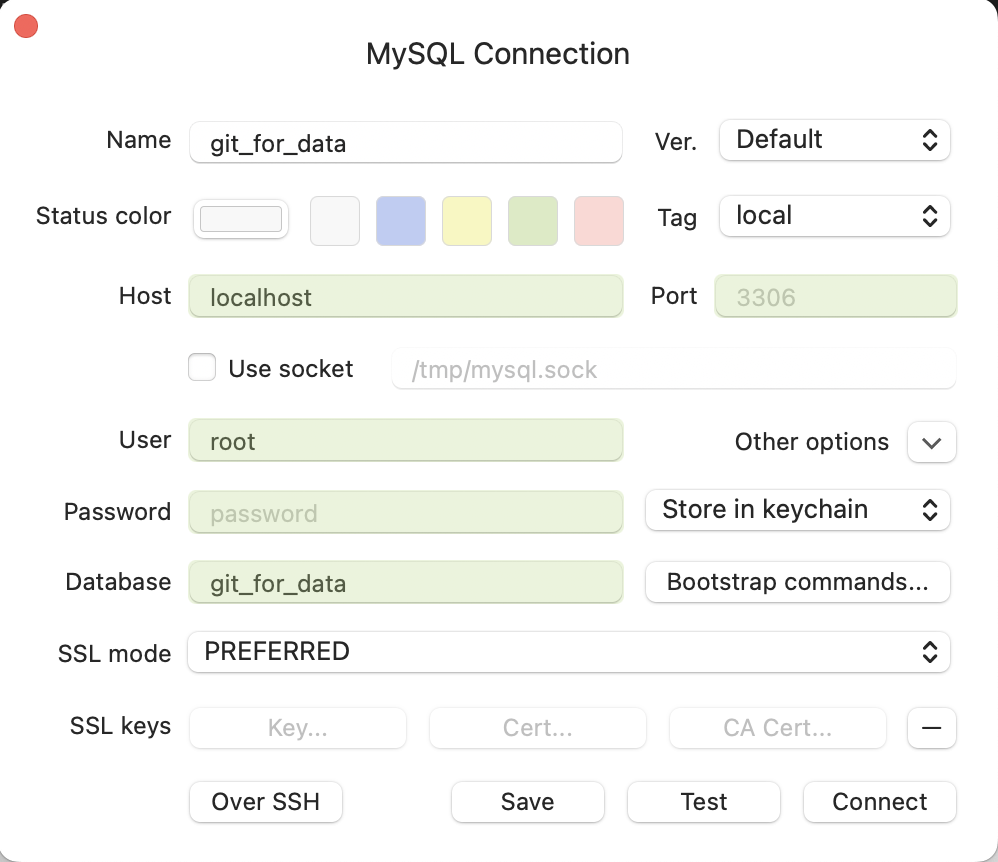
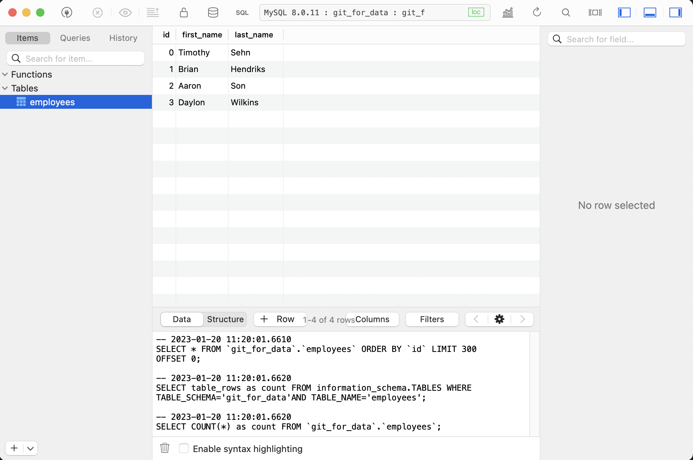

Dolt is Git for Data. You can use Dolt's command line interface to
version control data like you version control files with Git. Git
versions files, Dolt versions tables.

Once you have [Dolt installed](../installation.md), type `dolt` and you'll start to feel the `git` vibes immediately.

```bash
$ dolt
Valid commands for dolt are
                init - Create an empty Dolt data repository.
              status - Show the working tree status.
                 add - Add table changes to the list of staged table changes.
                diff - Diff a table.
               reset - Remove table changes from the list of staged table changes.
               clean - Remove untracked tables from working set.
              commit - Record changes to the repository.
                 sql - Run a SQL query against tables in repository.
          sql-server - Start a MySQL-compatible server.
                 log - Show commit logs.
              branch - Create, list, edit, delete branches.
            checkout - Checkout a branch or overwrite a table from HEAD.
               merge - Merge a branch.
           conflicts - Commands for viewing and resolving merge conflicts.
         cherry-pick - Apply the changes introduced by an existing commit.
              revert - Undo the changes introduced in a commit.
               clone - Clone from a remote data repository.
               fetch - Update the database from a remote data repository.
                pull - Fetch from a dolt remote data repository and merge.
                push - Push to a dolt remote.
              config - Dolt configuration.
              remote - Manage set of tracked repositories.
              backup - Manage a set of server backups.
               login - Login to a dolt remote host.
               creds - Commands for managing credentials.
                  ls - List tables in the working set.
              schema - Commands for showing and importing table schemas.
               table - Commands for copying, renaming, deleting, and exporting tables.
                 tag - Create, list, delete tags.
               blame - Show what revision and author last modified each row of a table.
         constraints - Commands for handling constraints.
             migrate - Executes a database migration to use the latest Dolt data format.
         read-tables - Fetch table(s) at a specific commit into a new dolt repo
                  gc - Cleans up unreferenced data from the repository.
       filter-branch - Edits the commit history using the provided query.
          merge-base - Find the common ancestor of two commits.
             version - Displays the current Dolt cli version.
                dump - Export all tables in the working set into a file.
                docs - Commands for working with Dolt documents.
```

That's right, all the git commands your used to like `checkout`, `diff`, and `merge` are all implemented on top of SQL tables instead of files. Dolt really is [Git for Data](https://www.dolthub.com/blog/2020-03-06-so-you-want-git-for-data/).

# Configure Dolt

After installing Dolt, the first thing you must do is set the `user.name` and `user.email` config variables. This information will be used to attribute each Dolt commit to you. Defining the Git equivalent variables is also required by Git.

```bash
$ dolt config --global --add user.name "Tim Sehn"
$ dolt config --global --add user.email "tim@dolthub.com"
```

After running these commands you can see a file with them in your `~/.dolt` directory.

```bash
$ ls ~/.dolt/config_global.json 
/Users/timsehn/.dolt/config_global.json
```

# Navigate to the directory where you would like your data stored

Dolt needs a place to store your databases. I'm going to put my databases in `~/dolt`.

```bash
$ cd ~
$ mkdir dolt
$ cd dolt
```

# Initialize a database

Like Git, Dolt relies on directories to store your databases. The directories will have a hidden `.dolt` directory where your database is stored after you run `dolt init`. So, let's make a directory called `git_for_data` that will house our `dolt` database, `cd` to it, and run `dolt init`.

```bash
$ mkdir git_for_data
$ cd git_for_data
$ dolt init
Successfully initialized dolt data repository.
```

You now have a fresh Dolt database. It has a single entry in `dolt log`.

```bash
$ dolt log
commit f06jtfp6fqaak6dkm0olmv175atkbhl3 (HEAD -> main) 
Author: timsehn <tim@dolthub.com>
Date:  Wed Jan 18 17:02:38 -0800 2023

        Initialize data repository

```

# Make a table

Git versions files. Dolt versions tables. 

In Git, you usually use a text editor to make files. In Dolt, there a few ways to make tables. You can import a file, like a CSV. You can run SQL offline via the command line. Or you can start a SQL server and run SQL online. I'll walk through examples of each in this document as we go.

Let's make our table initially from a CSV. Dolt supports creating tables via the `dolt table import` command. In Dolt, tables have schema and data. With `dolt table import`, Dolt automatically infers the schema from the data, making it easier to version CSVs without having to worry about types.

Here's our CSV file. We're going to use a simple list of employees here at DoltHub.

```bash
$ cat employees.csv  
id,first_name,last_name
0,Tim,Sehn
1,Brian,Hendriks
2,Aaron,Son
```

`dolt table import` is fairly simple. You pass in a table name and the file path as well as the `--create-table`, `--replace-table` or `--update-table` option. We're going to pass in `--create-table` because we're making a new table.

We're going to pass in the `id` column as a primary key as well. [Primary keys](https://www.tutorialspoint.com/sql/sql-primary-key.htm) in Dolt make for better diffs. Dolt can identify rows across versions by Primary Key. I'm trying to limit the database talk here being "Getting Started: Git for Data" and all but I'll need to introduce a couple other database concepts as well. Dolt is like Git and MySQL had a baby.

```bash
$ dolt table import --create-table --pk id employees employees.csv
Rows Processed: 3, Additions: 3, Modifications: 0, Had No Effect: 0
Import completed successfully.
```

We can make sure it's there using the `dolt status` command. Dolt has a staging area just like Git so right now it is in the working set but not staged.

```bash
$ dolt status
On branch main
Untracked files:
  (use "dolt add <table>" to include in what will be committed)
	new table:      employees
```

We can inspect the table using SQL on the command line. Dolt allows you to run queries from the command line using `dolt sql -q`. This is often more convenient, especially in the Git for Data use case, than starting a server and opening a MySQL client. Dolt supports the MySQL flavor of SQL.

```
$ dolt sql -q "show tables" 
+------------------------+
| Tables_in_git_for_data |
+------------------------+
| employees              |
+------------------------+

$ dolt sql -q "describe employees"
+------------+----------------+------+-----+---------+-------+
| Field      | Type           | Null | Key | Default | Extra |
+------------+----------------+------+-----+---------+-------+
| id         | int            | NO   | PRI | NULL    |       |
| first_name | varchar(16383) | YES  |     | NULL    |       |
| last_name  | varchar(16383) | YES  |     | NULL    |       |
+------------+----------------+------+-----+---------+-------+

$ dolt sql -q "select * from employees"
+----+------------+-----------+
| id | first_name | last_name |
+----+------------+-----------+
| 0  | Tim        | Sehn      |
| 1  | Brian      | Hendriks  |
| 2  | Aaron      | Son       |
+----+------------+-----------+
```

# Make a Dolt commit

Everything looks good so it's time to `add` and `commit` our new `employees` table. This is just like adding and committing a new file in Git. Tables start off untracked so you must explicitly add them, just like new files in Git.

```bash
$ dolt add employees
$ dolt status
On branch main
Changes to be committed:
  (use "dolt reset <table>..." to unstage)
	new table:      employees
$ dolt commit -m "Added new employees table containing the founders of DoltHub"
commit aq86v87h1g05i5cdht6v6tptp70eibms (HEAD -> main) 
Author: timsehn <tim@dolthub.com>
Date:  Thu Jan 19 14:56:13 -0800 2023

        Added new employees table containing the founders of DoltHub

$ dolt status
On branch main
nothing to commit, working tree clean
$ dolt log
commit aq86v87h1g05i5cdht6v6tptp70eibms (HEAD -> main) 
Author: timsehn <tim@dolthub.com>
Date:  Thu Jan 19 14:56:13 -0800 2023

        Added new employees table containing the founders of DoltHub

commit f06jtfp6fqaak6dkm0olmv175atkbhl3 
Author: timsehn <tim@dolthub.com>
Date:  Wed Jan 18 17:02:38 -0800 2023

        Initialize data repository

```

And inspecting the log it looks like we're good! As you can see, Dolt takes "Git for Data" very literally.

# Examine a diff

Now, I want to add an employee and change my name from "Tim" to "Timothy", you know, to be professional. I'm going to do that through the command line SQL interface and show you the diff.

```bash
$ dolt sql -q "insert into employees values (3, 'Daylon', 'Wilkins')"
Query OK, 1 row affected (0.00 sec)
$ dolt sql -q "update employees set first_name='Timothy' where last_name like 'S%'" 
Query OK, 2 rows affected (0.00 sec)
Rows matched: 2  Changed: 2  Warnings: 0
$ dolt diff
diff --dolt a/employees b/employees
--- a/employees @ m3qr6lhb8ad6fc5puvsaiv5ladajfi9r
+++ b/employees @ uvrbmnv52n2m25gpmom92qf4723bn9og
+---+----+------------+-----------+
|   | id | first_name | last_name |
+---+----+------------+-----------+
| < | 0  | Tim        | Sehn      |
| > | 0  | Timothy    | Sehn      |
| < | 2  | Aaron      | Son       |
| > | 2  | Timothy    | Son       |
| + | 3  | Daylon     | Wilkins   |
+---+----+------------+-----------+
```

That's not right! Diffs in Dolt are a powerful way to ensure you changed exactly what you thought you've changed, ensuring data quality.

# Oh no! I made a mistake.

Just like with Git, In Dolt I can roll back a number of ways. I can `checkout` the table or `reset --hard`. Let's `checkout` the table.

```bash
$ dolt checkout employees
$ dolt diff 
$ dolt sql -q "select * from employees"
+----+------------+-----------+
| id | first_name | last_name |
+----+------------+-----------+
| 0  | Tim        | Sehn      |
| 1  | Brian      | Hendriks  |
| 2  | Aaron      | Son       |
+----+------------+-----------+
```

Now, I'll re-run the correct queries and check the diff tyo make sure I did it right this time.

```bash
$ dolt sql -q "insert into employees values (3, 'Daylon', 'Wilkins')"
Query OK, 1 row affected (0.00 sec)
$ dolt sql -q "update employees set first_name='Timothy' where first_name='Tim'"
Query OK, 1 row affected (0.00 sec)
Rows matched: 1  Changed: 1  Warnings: 0
$ dolt diff                                                          
diff --dolt a/employees b/employees
--- a/employees @ m3qr6lhb8ad6fc5puvsaiv5ladajfi9r
+++ b/employees @ 72aq85jbhr83v4gmh73v550gupk4mr3k
+---+----+------------+-----------+
|   | id | first_name | last_name |
+---+----+------------+-----------+
| < | 0  | Tim        | Sehn      |
| > | 0  | Timothy    | Sehn      |
| + | 3  | Daylon     | Wilkins   |
+---+----+------------+-----------+
```

Looks like I got it right this time. I'll make a commit.

```bash
$ dolt commit -am "Added Daylon. Make Tim Timothy."
commit envoh3j93s47idjmrn16r2tka3ap8s0d (HEAD -> main) 
Author: timsehn <tim@dolthub.com>
Date:  Thu Jan 19 16:55:14 -0800 2023

        Added Daylon. Make Tim Timothy.

```

# Create a branch

Dolt is also a drop in replacement for MySQL. So, if you like working in a SQL Workbench like [TablePlus](https://tableplus.com/) or [Datagrip](https://www.jetbrains.com/datagrip/) instead of the command line, I will show you how now. This is the closest you will get to using something like Visual Studio Code with Git.

In your terminal, run:

```bash
$ dolt sql-server
Starting server with Config HP="localhost:3306"|T="28800000"|R="false"|L="info"|S="/tmp/mysql.sock"
```

Your terminal will just hang there. This means the server is running. Any errors will be printed in this terminal. Just leave it there.

Now we can connect with TablePlus. Download and open TablePlus. Click "Create a new connection...". Select MySQL and click "Create". You'll be granted with a set of options. Fill it i
n like so.



Click connect and you'll be presented with a familiar database workbench GUI.



Now we want to make some changes on a branch. You can so this by running the following SQL.

```SQL
call dolt_checkout('-b','modifications');
insert INTO employees values (5,'Taylor', 'Bantle');
call dolt_commit('-am', 'Modifications on a branch');
```

Notice how the Git command line is implemented as [SQL stored procedures](https://docs.dolthub.com/sql-reference/version-control/dolt-sql-procedures). Write operations like `checkout` and `commit` are implemented as [stored procedures](https://docs.dolthub.com/sql-reference/version-control/dolt-sql-procedures) and read operations like `diff` and `log` are implemented as [system tables](https://docs.dolthub.com/sql-reference/version-control/dolt-system-tables).

In TablePlus, you click SQL, enter the SQL and the "Run Current" which should generate something that looks the following output.


Alright, now that we've shown you that you can work in server mode, let's get back to the command line like true Gits. Hit `Ctrl-C` on the server terminal to kill the server. You'll notice we have two branches:

```bash
$ dolt branch
* main                                          	
  modifications
```

Let's checkout the branch and see that Taylor is on it.

```bash
$ dolt checkout modifications
Switched to branch 'modifications'
$ dolt sql -q "select * from employees"
+----+------------+-----------+
| id | first_name | last_name |
+----+------------+-----------+
| 0  | Timothy    | Sehn      |
| 1  | Brian      | Hendriks  |
| 2  | Aaron      | Son       |
| 3  | Daylon     | Wilkins   |
| 5  | Taylor     | Bantle    |
+----+------------+-----------+

$ dolt diff main
diff --dolt a/employees b/employees
--- a/employees @ 72aq85jbhr83v4gmh73v550gupk4mr3k
+++ b/employees @ pacpigp52ubvo5gcrl29h61310kt9p3s
+---+----+------------+-----------+
|   | id | first_name | last_name |
+---+----+------------+-----------+
| + | 5  | Taylor     | Bantle    |
+---+----+------------+-----------+
```

Branches work the exact same way as Git. Make a branch so that your changes don't effect other people.

# Merge to Main

Finally, let's merge it all to main and delete our branch.

```bash
$ dolt checkout main
Switched to branch 'main'
$ dolt merge modifications
Updating envoh3j93s47idjmrn16r2tka3ap8s0d..74m09obaaae0am5n7iucupt2od1lhi4v
Fast-forward
$ dolt sql -q "select * from employees"
+----+------------+-----------+
| id | first_name | last_name |
+----+------------+-----------+
| 0  | Timothy    | Sehn      |
| 1  | Brian      | Hendriks  |
| 2  | Aaron      | Son       |
| 3  | Daylon     | Wilkins   |
| 5  | Taylor     | Bantle    |
+----+------------+-----------+
$ dolt branch -d modifications
$ dolt branch
* main    
```

I got a fast-forward merge, just like Git, since there were no other changes on main.

# Conclusion

As you can see, Dolt is Git For Data. The Dolt command line works exactly like the Git command line except the versioning target is tables instead of files.