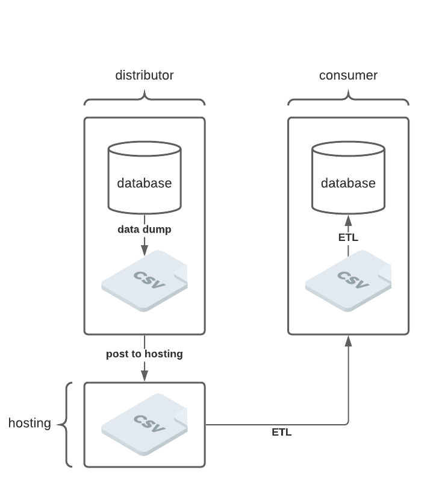
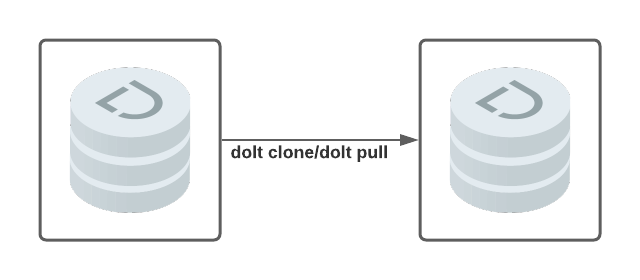
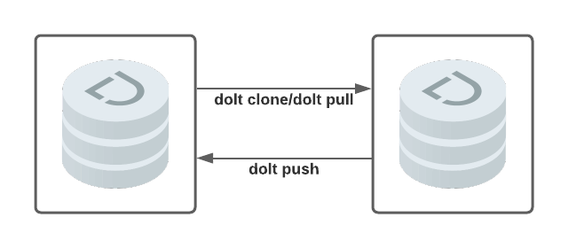

One the primary inspirations for building Dolt was the friction associated with distributing and collaborating on datasets.

## Distribution
Organizations using existing relational databases that want to share data, freely or commercially, have to extract that data from their internal database(s). They must then choose to host the data somewhere in a consumable format. For example, an organization might dump each table in a database they want to share into a collection of CSVs, and host them on a download site. Consumers of this data have to stitch the data together into whatever query interface they happen to be using.



Dolt does it differently. Dolt supports Git-like remotes, and users can acquire and update data with simple `clone` and `pull` operations. Dolt databases travel as a database. Schema, typing, and history are preserved. The query engine works immediately against the data when it lands:
```
~/Documents/dolt-dbs|>>  dolt clone dolthub/ip-to-country && cd ip-to-country
cloning https://doltremoteapi.dolthub.com/dolthub/ip-to-country
32,832 of 32,832 chunks complete. 0 chunks being downloaded currently.
~/Documents/dolt-dbs/ip-to-country|>>  dolt sql
# Welcome to the DoltSQL shell.
# Statements must be terminated with ';'.
# "exit" or "quit" (or Ctrl-D) to exit.
ip_to_country> show tables;
+---------------+
| Table         |
+---------------+
| IPv4ToCountry |
| IPv6ToCountry |
+---------------+
ip_to_country>
```



In this way Dolt eliminates ETL work by reducing the need for data cleaning and transformations. Tables arrive ready to be queried. Data scientists and analysts worry about the facts of the data, not setup and cleaning.

## Collaboration
Some datasets can benefit from corrections. Existing data distribution models do not take account of this. This is a disadvantage to consumers who have to maintain ad-hoc mechanisms for laying in their own corrections. Furthermore, distributors do not benefit from corrections in a seamless way.

Dolt has native support for two-way collaboration inspired by Git. Users can branch and push suggested changes to vendors and collaborators, subject to appropriate permissions.


