In DoltLab's current version, there is no Administrator (Admin) web-based UI or dashboard as it is still in development. In the meantime,
the following information can help DoltLab Admins manually perform some common administration tasks, see below for details.

1. [File Issues and View Release Notes](#issues-release-notes)
2. [Backup DoltLab Data](#backup-restore-volumes)
3. [Upgrade DoltLab Versions Without Data Loss](#upgrade-doltlab)
4. [Send Service Logs To DoltLab Team](#send-service-logs)
5. [Connect with the DoltLab Team](#connect-with-doltlab-team)
6. [Authenticate a Dolt Client to use DoltLab Account](#auth-dolt-client)
7. [Monitor DoltLab with cAdvisor and Prometheus](#prometheus)
8. [Connect to an SMTP Server with Implicit TLS](#smtp-implicit-tls)
9. [Troubleshoot SMTP Server Connection Problems](#troubleshoot-smtp-connection)
10. [Prevent Unauthorized User Account Creation](#prevent-unauthorized-users)
11. [Use an external Database server with DoltLab](#use-external-database)
12. [Expose DoltLab on a closed host with ngrok](#expose-doltlab-ngrok)
13. [DoltLab Jobs](#doltlab-jobs)
14. [Disable Usage Metrics](#disable-metrics)
15. [Migrate Old Format DoltLab Databases](#migrate-doltlab-databases)
16. [Use custom Logo on DoltLab instance](#use-custom-logo)
17. [Customize automated emails](#customize-automated-emails)
18. [Customize DoltLab colors](#customize-colors)
19. [Use a domain name with DoltLab](#use-domain)
20. [Add Super Admins to a DoltLab instance](#add-super-admins)
21. [Run DoltLab on Hosted Dolt](#doltlab-hosted-dolt)
22. [Serve DoltLab over HTTPS with a TLS reverse proxy](#doltlab-https-proxy)
23. [Serve DoltLab over HTTPS natively](#doltlab-https-natively)
24. [Improve DoltLab Performance](#doltlab-performance)
25. [Configure SAML Single-Sign-on](#doltlab-single-sign-on)
26. [Automated Remote Backups](#doltlab-automated-backups)

<h1 id="issues-release-notes">File Issues and View Release Notes</h1>

DoltLab's source code is currently closed, but you can file DoltLab issues or view DoltLab's [release notes](https://github.com/dolthub/doltlab-issues/releases) in our [issues repository](https://github.com/dolthub/doltlab-issues).

<h1 id="backup-restore-volumes">Backup and Restore Volumes</h1>

DoltLab currently persists all data to local disk using Docker volumes. To backup or restore DoltLab's data, we recommend the following steps which follow Docker's official [volume backup and restore documentation](https://docs.docker.com/storage/volumes/#back-up-restore-or-migrate-data-volumes), with the exception of DoltLab's PostgreSQL server. DoltLab <= `v0.8.4` uses PostgreSQL as its database and DoltLab `v1.0.0`+ uses Dolt. To backup the PostgreSQL server we recommend dumping the database with `pg_dump` and restoring the database from the dump using `psql`. To backup the Dolt server we recommend using Docker's volume backup and restore process, or Dolt's built-in backup and restore features.

<h2 id="backup-restore-remote-data-user-data-dolt-server-data"><ins>Backing Up and Restoring Remote Data, User Uploaded Data, and Dolt Server data with Docker</ins></h2>

To backup DoltLab's remote data, the database data for all database on a given DoltLab instance, leave DoltLab's services up and run:

```bash
# backup remote data stored in DoltLab RemoteAPI's volume and save to a tar file
docker run --rm --volumes-from doltlab_doltlabremoteapi_1 -v $(pwd):/backup ubuntu tar cvf /backup/remote-data.tar /doltlab-remote-storage
```

This will create a tar file called `remote-data.tar` in your working directory.

To backup user uploaded files, run:

```bash
# backup remote data stored in DoltLab RemoteAPI's volume and save to a tar file
docker run --rm --volumes-from doltlab_doltlabfileserviceapi_1 -v $(pwd):/backup ubuntu tar cvf /backup/user-uploaded-data.tar /doltlab-user-uploads
```

This will create a tar file called `user-uploaded-data.tar` in your working directory.

To backup Dolt server data, run:

```bash
# backup Dolt's root volume
docker run --rm --volumes-from doltlab_doltlabdb_1 -v $(pwd):/backup ubuntu tar cvf /backup/doltlabdb-root.tar /.dolt

# backup Dolt's config volume
docker run --rm --volumes-from doltlab_doltlabdb_1 -v $(pwd):/backup ubuntu tar cvf /backup/doltlabdb-configs.tar /etc/dolt

# backup Dolt's data volume
docker run --rm --volumes-from doltlab_doltlabdb_1 -v $(pwd):/backup ubuntu tar cvf /backup/doltlabdb-data.tar /var/lib/dolt

# backup Dolt's local backup volume
docker run --rm --volumes-from doltlab_doltlabdb_1 -v $(pwd):/backup ubuntu tar cvf /backup/doltlabdb-backups.tar /backups
```

Before restoring DoltLab's volumes from a backup, first, stop the running DoltLab services, `prune` the Docker containers, and remove the old volume(s):

```bash
cd doltlab

# stop the DoltLab services
docker-compose stop

# prune containers
docker container prune

# remove the remote data volume
docker volume rm doltlab_doltlab-remote-storage

# remove the user uploaded data
docker volume rm doltlab_doltlab-user-uploads

# remove the Dolt server root volume
docker volume rm doltlab_doltlabdb-dolt-root

# remove the Dolt server config volume
docker volume rm doltlab_doltlabdb-dolt-configs

# remove the Dolt server data volume
docker volume rm doltlab_doltlabdb-dolt-data

# remove the Dolt server local backups volume
docker volume rm doltlab_doltlabdb-dolt-backups
```

Next, [start DoltLab's services](./installation.md#start-doltlab) using the `start-doltlab.sh` script. After the script completes, stop DoltLab once more with `docker-compose stop`. Doing this will recreate the required containers so that their volumes can be updated with the commands below.

Once the services are stopped, `cd` into the directory containing the `remote-data.tar` backup file and run:

```bash
# restore remote data from tar
docker run --rm --volumes-from doltlab_doltlabremoteapi_1 -v $(pwd):/backup ubuntu bash -c "cd /doltlab-remote-storage && tar xvf /backup/remote-data.tar --strip 1"
```

To restore user uploaded data, `cd` into the directory containing `user-uploaded-data.tar` and run:

```bash
# restore remote data from tar
docker run --rm --volumes-from doltlab_doltlabfileserviceapi_1 -v $(pwd):/backup ubuntu bash -c "cd /doltlab-user-uploads && tar xvf /backup/user-uploaded-data.tar --strip 1"
```

To restore Dolt server root data, `cd` into the directory containing `doltlabdb-root.tar` and run:

```bash
# restore Dolt server root data from tar
docker run --rm --volumes-from doltlab_doltlabdb_1 -v $(pwd):/backup ubuntu bash -c "cd /.dolt && tar xvf /backup/doltlabdb-root.tar --strip 1"
```

To restore Dolt server config data, `cd` into the directory containing `doltlabdb-configs.tar` and run:

```bash
# restore Dolt server config data from tar
docker run --rm --volumes-from doltlab_doltlabdb_1 -v $(pwd):/backup ubuntu bash -c "cd /etc/dolt && tar xvf /backup/doltlabdb-configs.tar --strip 2"
```

To restore Dolt server data, `cd` into the directory containing `doltlabdb-data.tar` and run:

```bash
# restore Dolt server data from tar
docker run --rm --volumes-from doltlab_doltlabdb_1 -v $(pwd):/backup ubuntu bash -c "cd /var/lib/dolt && tar xvf /backup/doltlabdb-data.tar --strip 3"
```

To restore Dolt server local backup data, `cd` into the directory containing `doltlabdb-backups.tar` and run:

```bash
# restore Dolt server local backups data from tar
docker run --rm --volumes-from doltlab_doltlabdb_1 -v $(pwd):/backup ubuntu bash -c "cd /backups && tar xvf /backup/doltlabdb-backups.tar --strip 1"
```

You can now restart DoltLab, and should see all data restored from the `tar` files.

<h2 id="backup-restore-postgres-data"><ins>Backing Up and Restoring PostgreSQL Data</ins></h2>

For DoltLab versions <= `v0.8.4`, to backup data from DoltLab's postgres server, we recommend executing a data dump with `pg_dump`. To do so, keep DoltLab's services up and run:

> For DoltLab `v0.7.0` and later, use `--network doltlab` below.

```bash
# dump postgres to postgres-dump.sql
docker run --rm --network doltlab_doltlab -e PGPASSWORD=<POSTGRES_PASSWORD> -v $(pwd):/doltlab-db-dumps postgres:13-bullseye bash -c "pg_dump --host=doltlab_doltlabdb_1 --port=5432 --username=dolthubadmin dolthubapi > /doltlab-db-dumps/postgres-dump.sql"
```

The value of `PGPASSWORD` should be the `POSTGRES_PASSWORD` set when DoltLab was first deployed.

To restore a postgres server from `postgres-dump.sql`, first stop the running DoltLab services, remove the stopped containers, and remove the old postgres server volume:

```bash
cd doltlab

# stop DoltLab
docker-compose stop

# remove containers
docker container prune

# remove old postgres data volume
docker volume rm doltlab_doltlabdb-data
```

Next, edit the `postgres-dump.sql` file by adding the line `SET session_replication_role = replica;` near the top of the file:

```sql
SET statement_timeout = 0;
SET lock_timeout = 0;
SET idle_in_transaction_session_timeout = 0;
SET client_encoding = 'UTF8';
SET standard_conforming_strings = on;
SELECT pg_catalog.set_config('search_path', '', false);
SET check_function_bodies = false;
SET xmloption = content;
SET client_min_messages = warning;
SET row_security = off;

/* We add this to disable triggers and rules during import */
SET session_replication_role = replica;
...
```

[Start DoltLab's services](./installation.md#start-doltlab) again using the `start-doltlab.sh` script. After the script completes, `cd` into the directory containing the `postgres-dump.sql` file and run:

> For DoltLab `v0.7.0` and later, use `--network doltlab` below.

```bash
# import the postgres dump into the running server
docker run --rm --network doltlab_doltlab -e PGPASSWORD=<POSTGRES_PASSWORD> -v $(pwd):/doltlab-db-dumps postgres:13-bullseye bash -c "psql --host=doltlab_doltlabdb_1 --port=5432 --username=dolthubadmin dolthubapi < /doltlab-db-dumps/postgres-dump.sql"
```

<h2 id="backup-restore-dolt-server-backup"><ins>Backing Up and Restoring Dolt Server with `dolt backup`</ins></h2>

DoltLab `v1.0.0`+ uses Dolt as its database. To back up the Dolt server of DoltLab using Dolt's built-in backup and restore features, keep DoltLab's services up and open a connection to the database. The quickest way to do this is with the `./shell-db.sh` script included with DoltLab:

```bash
DOLT_PASSWORD=<DOLT_PASSWORD> ./shell-db.sh
...
mysql>
```

Next, add a local backup using the `DOLT_BACKUP()` stored procedure. By default, DoltLab uses a Docker volume backed by the host's disk that allows you to create backups of the Dolt server. These backups will be located at `/backups` from within the Dolt server container. To create persistent backups, simply use `/backups` as the path prefix to the backup names:

```bash
mysql> call dolt_backup('add', 'local-backup', 'file:///backups/dolthubapi/2023/06/01');
+---------+
| success |
+---------+
|       1 |
+---------+
1 row in set (0.00 sec)
```

The above snippet will create a new backup stored at `/backups/dolthubapi/2023/06/01` within the Dolt server container, and persisted to the host using the Docker volume `doltlab_doltlabdb-dolt-backups`.

You can sync the backup with the `sync` command:

```bash
mysql> call dolt_backup('sync', 'local-backup');
+---------+
| success |
+---------+
|       1 |
+---------+
1 row in set (0.00 sec)
```

The local backup is now synced, and you can now disconnect the shell.

At the time of this writing, Dolt only supports restoring backups using the CLI. To restore the Dolt server from a local backup, stop DoltLab's services using `docker-compose stop`.
Then, use the `./dolt_db_cli.sh` included with DoltLab to open a container shell with access to the Dolt server volumes.

Delete the existing `./dolthubapi` directory located at `/var/lib/dolt` from within this container:

```bash
./dolt_db_cli.sh
root:/var/lib/dolt# ls
dolthubapi
root:/var/lib/dolt# rm -rf dolthubapi/
```

Doing this removes the existing Dolt server database. Now, use [dolt backup restore](https://docs.dolthub.com/cli-reference/cli#dolt-backup) to restore the database from the backup located at `/backups/dolthubapi/2023/06/01`:

```bash
root:/var/lib/dolt# dolt backup restore file:///backups/dolthubapi/2023/06/01 dolthubapi

root:/var/lib/dolt# ls
dolthubapi
```

The database has now been successfully restored, and you can now restart DoltLab.

<h1 id="send-service-logs">Send Service Logs to DoltLab Team</h1>

DoltLab is composed of [multiple services](https://www.dolthub.com/blog/2022-02-25-doltlab-101-services-and-roadmap/) running in a single Docker network via Docker compose. Logs for a particular service can be viewed using the `docker logs <container name>` command. For example, to view to logs of `doltlabapi` service, run:

```bash
docker logs doltlab_doltlabapi_1
```

If you need to send service logs to the DoltLab team, first locate the logs on the host using the `docker inspect` command, then `cp` the logs to your working directory:

```bash
DOLTLABAPI_LOGS=$(docker inspect --format='{{.LogPath}}' doltlab_doltlabapi_1)
cp "$DOLTLABAPI_LOGS" ./doltlab-api-logs.json
```

Next change permissions on the copied file to enable reads by running:

```bash
chmod 0644 ./doltlab-api-logs.json
```

Finally, download the copied log file from your DoltLab host using `scp`. You can then send this and any other log files to the DoltLab team member you're working with via email.

<h1 id="upgrade-doltlab">Upgrading DoltLab</h1>

Upgrading to newer versions of DoltLab requires downtime. This means that DoltLab Admins will need to kill the old version of DoltLab, and install the newer one.

In addition, some early versions have different database schemas than newer ones. If the docker volumes of an old version of DoltLab contain non-precious or test-only data, then DoltLab Admins can simply remove these Docker volumes and run the `start-doltlab.sh` script from the newer DoltLab version. This script will simply create new Docker volumes with the appropriate schema for that DoltLab version.

If you want to upgrade your DoltLab version without losing any data, please follow the upgrade guidelines below.

<h2 id="upgrade-v111-v200"><ins>Upgrade from DoltLab <code>v1.1.1</code> to <code>v2.0.0+</code></ins></h2>

The upgrade process for DoltLab `v1.1.1` to `v2.0.0` has not changed, and only requires replacing DoltLab `v1.1.1` with DoltLab `v2.0.0`, the way previous upgrades did.

However, DoltLab `v2.0.0` is the first version of DoltLab that supports Enterprise mode, a configuration exclusive to DoltLab Enterprise customers. Prior to `v2.0.0`, DoltLab was released with enterprise features _included_. However, these exclusive features are now unsupported by DoltLab `v2.0.0` for non-enterprise customers.

If you are currently using the any of the following enterprise features in DoltLab <= `v1.1.1`, you will lose them by upgrading to DoltLab `v2.0.0`:

* [Custom Automated Emails](#customize-automated-emails)
* [Custom Logo](#use-custom-logo)
* [Custom Color Themes](#customize-colors)
* [Super Admins](#add-super-admins)

<h2 id="upgrade-v084-v100"><ins>Upgrade from DoltLab <code>v0.8.4</code> to <code>v1.0.0+</code></ins></h2>

DoltLab `v0.8.4` is the final version of DoltLab released using PostgreSQL as the database backing DoltLab's API. Starting with DoltLab `v1.0.0`, DoltLab runs on Dolt.

If your current DoltLab instance is older than `v0.8.4`, you must first upgrade to this version _before_ upgrading to DoltLab `v1.0.0`. This ensures your DoltLab instance contains the necessary schema changes required to run the database migration script included with DoltLab `v1.0.0` called `./migrate_postgres_dolt.sh`.

`./migrate_postgres_dolt.sh` will copy all existing PostgreSQL data from your old DoltLab instance into DoltLab `v1.0.0`'s Dolt database.

Let's walkthrough how to perform this upgrade and database migration with an example.

On a host running DoltLab `v0.8.4`, we first stop DoltLab with `docker-compose stop`. Next, we download and unzip DoltLab `v1.0.0` to the same location as the previous version of DoltLab.

Before running the migration script, we will start DoltLab `v1.0.0` for the first time using the `./start-doltlab.sh` script, then once DoltLab is started, shut it back down. Doing this quick, start-then-stop will create the new Docker volumes required for running DoltLab `v1.0.0` and the migration script. Now, we can run `./migrate_postgres_dolt.sh` included with DoltLab `v1.0.0` and supply the environment variable values we used for our DoltLab `v0.8.4` instance. This script will automatically move our data from PostgreSQL to Dolt:

```bash
POSTGRES_PASSWORD=<POSTGRES_PASSWORD> \
DOLT_PASSWORD=<DOLT_PASSWORD> \
DOLTHUBAPI_PASSWORD=<DOLTHUBAPI_PASSWORD> \
./migrate_postgres_dolt.sh
```

Once the script completes, DoltLab `v1.0.0` can be started and all data from `v0.8.4` will be present.

<h2 id="upgrade-v060-v070"><ins>Upgrade from DoltLab <code>v0.6.0</code> to <code>v0.7.0+</code></ins></h2>

Starting with DoltLab `v0.7.0`, the `./start-doltlab.sh` script will create a `doltlab` docker network externally, instead of allowing Docker Compose to create the network automatically. If you're upgrading to `v0.7.0` or higher from an earlier DoltLab version, remove any `doltlab` or `*_doltlab` networks on the host before installing `v0.7.0`.

<h2 id="upgrade-v030-plus"><ins>Upgrade from DoltLab <code>v0.3.0+</code></ins></h2>

DoltLab versions >= `v0.3.0` support schema migrations without data loss. To upgrade to a DoltLab version after `v0.3.0`, simply stop your old version of DoltLab, then download and unzip the newer DoltLab version to the same location as your previous version. This will ensure that when you [start the new version](./installation.md#start-doltlab) of DoltLab using the `start-doltlab.sh` script, the old DoltLab version's Docker volumes get attached to the new version's containers.

```bash
# stop old DoltLab
cd doltlab
docker-compose stop
cd ../
rm -rf doltlab

# download and unzip newer DoltLab
curl -OL https://doltlab-releases.s3.amazonaws.com/linux/amd64/doltlab-latest.zip
unzip doltlab-latest.zip -d doltlab

# start DoltLab
cd doltlab
./start-doltlab.sh
```

<h2 id="upgrade-v020-v030"><ins>Upgrade from DoltLab <code>v0.2.0</code> to <code>v0.3.0</code></ins></h2>

To upgrade without data loss, follow the same instructions for upgrading found in the [Upgrade from DoltLab <code>v0.1.0</code> <code>v0.2.0</code>](#upgrade-v010-v020) section.

<h2 id="upgrade-v010-v020"><ins>Upgrade from DoltLab <code>v0.1.0</code> to <code>v0.2.0</code> Without Data Loss</ins></h2>

To upgrade DoltLab `v0.1.0` to `v0.2.0`, leave DoltLab `v0.1.0`'s services running and connect a PostgreSQL client from inside the `doltlab_doltlab` Docker network to the running `doltlab_doltlabdb_1` server. On the DoltLab host machine, run:

```bash
# dump data from DoltLab v0.1.0's postgres server to doltlab-db-dumps
docker run --rm --network doltlab_doltlab -e PGPASSWORD=<POSTGRES_PASSWORD> -v $(pwd):/doltlab-db-dumps postgres:13-bullseye bash -c "pg_dump --data-only --host=doltlab_doltlabdb_1 --port=5432 --username=dolthubadmin dolthubapi > /doltlab-db-dumps/doltlab-v0.1.0-dump-data-only.sql"
```

The value of `PGPASSWORD` should be the `POSTGRES_PASSWORD` set when DoltLab `v0.1.0` was first deployed. You should now see the SQL dump file called `doltlab-v0.1.0-dump-data-only.sql`.

Next, edit the `doltlab-v0.1.0-dump-data-only.sql` file by adding the line `SET session_replication_role = replica;` near the top of the file:

```sql
SET statement_timeout = 0;
SET lock_timeout = 0;
SET idle_in_transaction_session_timeout = 0;
SET client_encoding = 'UTF8';
SET standard_conforming_strings = on;
SELECT pg_catalog.set_config('search_path', '', false);
SET check_function_bodies = false;
SET xmloption = content;
SET client_min_messages = warning;
SET row_security = off;

/* We add this to disable triggers and rules during import */
SET session_replication_role = replica;
...
```

You can now stop the DoltLab `v0.1.0` services and delete the Docker caches and stopped containers on the host by running:

```bash
cd doltlab

# stop DoltLab
docker-compose stop

# remove containers
docker container prune
```

<!-- TODO: have them backup data first? -->

Next, remove the Docker volume used with DoltLab `v0.1.0`'s `doltlab_doltlabdb_1` postgres server by running:

```bash
docker volume rm doltlab_doltlabdb-data
```

[Download DoltLab](./installation.md#download-doltlab) `v0.2.0`, unzip it's contents, and [start DoltLab](./installation.md#start-doltlab) `v0.2.0`'s services by running the `start-doltlab.sh` script.

After the script completes, confirm DoltLab `v0.2.0`'s services are running with `docker ps`:

```bash
docker ps
CONTAINER ID   IMAGE                                                             COMMAND                  CREATED       STATUS       PORTS                                                                                     NAMES
3f47c64db5af   public.ecr.aws/dolthub/doltlab/dolthub-server:v0.2.0              "docker-entrypoint.s…"   2 hours ago   Up 2 hours   3000/tcp                                                                                  doltlab_doltlabui_1
444819d72e64   public.ecr.aws/dolthub/doltlab/dolthubapi-graphql-server:v0.2.0   "docker-entrypoint.s…"   2 hours ago   Up 2 hours   9000/tcp                                                                                  doltlab_doltlabgraphql_1
d2f5583a19fb   public.ecr.aws/dolthub/doltlab/dolthubapi-server:v0.2.0           "/app/go/services/do…"   2 hours ago   Up 2 hours                                                                                             doltlab_doltlabapi_1
defdd789c7c3   public.ecr.aws/dolthub/doltlab/doltremoteapi-server:v0.2.0        "/app/go/services/do…"   2 hours ago   Up 2 hours   0.0.0.0:100->100/tcp, :::100->100/tcp, 0.0.0.0:50051->50051/tcp, :::50051->50051/tcp      doltlab_doltlabremoteapi_1
93d8c28b9762   public.ecr.aws/dolthub/doltlab/fileserviceapi-server:v0.2.0       "/app/go/services/fi…"   2 hours ago   Up 2 hours                                                                                             doltlab_doltlabfileserviceapi_1
e3adba4e26ce   envoyproxy/envoy-alpine:v1.18-latest                              "/docker-entrypoint.…"   2 hours ago   Up 2 hours   0.0.0.0:80->80/tcp, :::80->80/tcp, 0.0.0.0:4321->4321/tcp, :::4321->4321/tcp, 10000/tcp   doltlab_doltlabenvoy_1
20dbd21a94ff   public.ecr.aws/dolthub/doltlab/postgres-server:v0.2.0             "docker-entrypoint.s…"   2 hours ago   Up 2 hours   5432/tcp                                                                                  doltlab_doltlabdb_1
```

Now, connect a PostgreSQL client from inside the `doltlab_doltlab` Docker network to the running `doltlab_doltlabdb_1` server to perform the data dump import. Then, update the `has_dolt` column in the `users` table.

```bash
# import the data dump into the running DoltLab v0.2.0 postgres server
docker run --rm --network doltlab_doltlab -e PGPASSWORD=<POSTGRES_PASSWORD> -v $(pwd)/doltlab-db-dumps:/doltlab-db-dumps postgres:13-bullseye bash -c "psql --host=doltlab_doltlabdb_1 --port=5432 --username=dolthubadmin dolthubapi < /doltlab-db-dumps/doltlab-v0.1.0-dump-data-only.sql"

# update the users table to prevent DoltLab v0.2.0 error
docker run --rm --network doltlab_doltlab -e PGPASSWORD=<POSTGRES_PASSWORD> -v $(pwd)/doltlab-db-dumps:/doltlab-db-dumps postgres:13-bullseye bash -c "psql --host=doltlab_doltlabdb_1 --port=5432 --username=dolthubadmin dolthubapi -c 'update users set has_dolt = 'false';'"
```

You have now completed the upgrade, and should no be running DoltLab `v0.2.0` with your postgres data from DoltLab `v0.1.0`.

<h1 id="connect-with-doltlab-team">Connect with the DoltLab Team</h1>

If you need to connect to a DoltLab team member, the best way to do so is on [Discord](https://discord.gg/s8uVgc3), in the `#doltlab` server.

<h1 id="auth-dolt-client">Authenticate a Dolt Client to use a DoltLab Account</h1>

As of Dolt `v0.39.0`, the [dolt login](../../reference/cli/cli.md#dolt-login) command can be used to authenticate against DoltLab instances.

To authenticate a client against DoltLab with this command, use the `--auth-endpoint`, `--login-url`, and `--insecure` arguments to point your Dolt client at the DoltLab instance you want to authenticate against.

`--auth-endpoint` should point at the [DoltLab RemoteAPI Server](https://www.dolthub.com/blog/2022-02-25-doltlab-101-services-and-roadmap/#doltlab-remoteapi-server) running on port `50051`.
`--login-url` should point at the DoltLab instance's credentials page.
`--insecure` a boolean flag, should be used since DoltLab does not currently support TLS `gRPC` connections.

```bash
dolt login --insecure --auth-endpoint doltlab.dolthub.com:50051 --login-url http://doltlab.dolthub.com/settings/credentials
```

Running the command will open your browser window to the `--login-url` with credentials populated in the "Public Key" field. Simply add a "Description" and click "Create", then return to your terminal to see your Dolt client successfully authenticated.

```bash
Credentials created successfully.
pub key: 9pg8rrkaqouuno4rihdlkb6pvaf16t134dscb68dlg0u0261rmtg
/.dolt/creds/cepi47m5sojotm8s2e8rkqm9fdjocidsc42canggvb8e0.jwk
Opening a browser to:
	http://doltlab.dolthub.com/settings/credentials#9pg8rrkaqouuno4rihdlkb6pvaf16t134dscb68dlg0u0261rmtg
Please associate your key with your account.
Checking remote server looking for key association.
requesting update
requesting update


Key successfully associated with user: <user> email <email>
```

For Dolt clients < `v0.39.0`, or to authenticate without using the `dolt login` command, first run the [dolt creds new](../../reference/cli/cli.md#dolt-creds-new) command, which will output a new public key:

```bash
dolt creds new
Credentials created successfully.
pub key: fef0kj7ia389i5atv8mcb31ksg9h3i6cji7aunm4jea9tccdl2cg
```

Copy the generated public key and run the [dolt creds use](../../reference/cli/cli.md#dolt-creds-use) command:

```bash
dolt creds use fef0kj7ia389i5atv8mcb31ksg9h3i6cji7aunm4jea9tccdl2cg
```

Next, login to your DoltLab account, click your profile image, then click "Settings" and then "Credentials".

Paste the public key into the "Public Key" field, write a description in the "Description" field, then click "Create".

Your Dolt client is now authenticated for this DoltLab account.

<h1 id="prometheus">Monitor DoltLab with cAdvisor and Prometheus</h1>

As of DoltLab `v0.3.0`, [Prometheus](https://prometheus.io/) [gRPC](https://grpc.io/) service metrics for [DoltLab's Remote API Server](https://www.dolthub.com/blog/2022-02-25-doltlab-101-services-and-roadmap/#doltlab-remoteapi-server), `doltlabremoteapi`, and [DoltLab's Main API server](https://www.dolthub.com/blog/2022-02-25-doltlab-101-services-and-roadmap/#doltlab-api-server), `doltlabapi`, are published on port `7770`.

The metrics endpoints for these services are available at endpoints corresponding to their container name. For DoltLab's Remote API, thats `:7770/doltlabremoteapi`, and for DoltLab's Main API that's `:7770/doltlabapi`.

You can view the `doltlabremoteapi` service metrics for our DoltLab demo instance here, [http://doltlab.dolthub.com:7770/doltlabremoteapi](http://doltlab.dolthub.com:7770/doltlabremoteapi) and you can view the `doltlabapi` service metrics here [http://doltlab.dolthub.com:7770/doltlabapi](http://doltlab.dolthub.com:7770/doltlabapi).

To make these endpoints available to Prometheus, open port `7770` on your DoltLab host.

We recommend monitoring DoltLab with [cAdvisor](https://github.com/google/cadvisor), which will expose container resource and performance metrics to Prometheus. Before running `cAdvisor`, open port `8080` on your DoltLab host as well. `cAdvisor` will display DoltLab's running containers via a web UI on `:8080/docker` and will publish Prometheus metrics for DoltLab's container at `:8080/metrics` by default.

Run `cAdvisor` as a Docker container in daemon mode with:

```bash
docker run -d -v /:/rootfs:ro -v /var/run:/var/run:rw -v /sys:/sys:ro -v /var/lib/docker/:/var/lib/docker:ro -v /dev/disk/:/dev/disk:ro -p 8080:8080 --name=cadvisor --privileged gcr.io/cadvisor/cadvisor:v0.39.3
```

To run a Prometheus server on your DoltLab host machine, first open port `9090` on the DoltLab host. Then, write the following `prometheus.yml` file on the host:

```yaml
global:
  scrape_interval: 5s
  evaluation_interval: 10s
scrape_configs:
  - job_name: cadivsor
    static_configs:
      - targets: ["host.docker.internal:8080"]
  - job_name: prometheus
    static_configs:
      - targets: ["localhost:9090"]
  - job_name: doltlabremoteapi
    metrics_path: "/doltlabremoteapi"
    static_configs:
      - targets: ["host.docker.internal:7770"]
  - job_name: doltlabapi
    metrics_path: "/doltlabapi"
    static_configs:
      - targets: ["host.docker.internal:7770"]
```

Then, start the Prometheus server as a Docker container running in daemon mode:

```bash
docker run -d --add-host host.docker.internal:host-gateway --name=prometheus -p 9090:9090 -v "$(pwd)"/prometheus.yml:/etc/prometheus/prometheus.yml:ro prom/prometheus:latest --config.file=/etc/prometheus/prometheus.yml
```

`--add-host host.docker.internal:host-gateway` is only required if running the Prometheus server on the DoltLab host. If running it elsewhere, this argument may be omitted, and the `host.docker.internal` hostname in `prometheus.yml` can be changed to the hostname of your DoltLab host.

<h1 id="smtp-implicit-tls">Connect to an SMTP Server with Implicit TLS</h1>

Starting with DoltLab `v0.4.2`, connections to existing SMTP servers using implicit TLS (on port `465`, for example) are supported. To connect using implicit TLS, edit the `docker-compose.yaml` included in the DoltLab zip. Under the `doltlabapi` section, in the `command` block, add the following argument:

```yaml
...
doltlabapi:
  ...
  command:
    ...
    -emailImplicitTLS
    ...
```

After adding the argument, restart DoltLab for it to take effect. Additionally, TLS verification can be skipped by adding the additional argument `-emailInsecureTLS`.

<h1 id="troubleshoot-smtp-connection">Troubleshoot SMTP Server Connection Problems</h1>

DoltLab requires a connection to an existing SMTP server in order for users to create accounts, verify email addresses, reset forgotten passwords, and collaborate on databases.

Starting with DoltLab `v0.4.1`, the [default user](./installation.md#doltlab-default-user) `admin` is created when DoltLab starts up, which allows admins to sign in to their DoltLab instance even if they are experiencing SMTP server connection issues.

To help troubleshoot and resolve SMTP server connection issues, we've published the following [go tool](https://gist.github.com/coffeegoddd/66f5aeec98640ff8a22a1b6910826667) to help diagnose the SMTP connection issues on the host running DoltLab.

Starting with DoltLab `v0.4.2`, this tool is now included as an executable binary in DoltLab's zip, called `smtp_connection_helper`.

For usage run `./smtp_connection_helper --help` which will output:

```bash

'smtp_connection_helper' is a simple tool used to ensure you can successfully connect to an smtp server.
If the connection is successful, this tool will send a test email to a single recipient from a single sender.
By default 'smtp_connection_helper' will attempt to connect to the SMTP server with STARTTLS. To use implicit TLS, use --implicit-tls

Usage:

./smtp_connection_helper \
--host <smtp hostname> \
--port <smtp port> \
--from <email address> \
--to <email address> \
--message {This is a test email message sent with smtp_connection_helper!} \
--subject {Testing SMTP Server Connection} \
--client-hostname {localhost} \
--auth <plain|login|external|anonymous|oauthbearer|disable> \
[--username smtp username] \
[--password smtp password] \
[--token smtp oauth token] \
[--identity smtp identity] \
[--trace anonymous trace] \
[--implicit-tls] \
[--insecure]


```

To send a test email using `plain` authentication, run:

```bash
./smtp_connection_helper \
--host existing.smtp.server.hostname \
--port 587 \ #STARTTLS port
--auth plain \
--username XXXXXXXX \
--password YYYYYYY \
--from email@address.com \
--to email@address.com
Sending email with auth method: plain
Successfully sent email!
```

To send a test email using `plain` authentication with implicit TLS, run:

```bash
./smtp_connection_helper \
--host existing.smtp.server.hostname \
--port 465 \ #TLS Wrapper Port
--implicit-tls \
--auth plain \
--username XXXXXXXX \
--password YYYYYYY \
--from email@address.com \
--to email@address.com
Sending email with auth method: plain
Successfully sent email!
```

To quickly get up and running with an existing SMTP server, we recommend using [Gmail's](https://www.gmail.com). Once you've created a Gmail account, navigate to [your account page](https://myaccount.google.com/) and click the [Security](https://myaccount.google.com/security) tab. Under the section "How you sign in to Google", click `2-Step Verification`. If you have not yet setup 2-Step Verification, follow the prompts on this page to enable it.

After 2-Step Verification is set up, at the bottom of the page click "App passwords". Select app `Mail` and select a device, then click "Generate" to generate a password. This generated password can be supplied along with your Gmail email address to send emails with `smtp_connection_helper` and DoltLab.

```bash
./smtp_connection_helper \
--host smtp.gmail.com \
--port 587 \
--auth plain \
--username example@gmail.com \
--password <generated App password> \
--from example@gmail.com \
--to email@address.com
Sending email with auth method: plain
Successfully sent email!
```

<h1 id="prevent-unauthorized-users">Prevent Unauthorized User Account Creation</h1>

DoltLab for non-enterprise use currently supports explicit email whitelisting to prevent account creation by unauthorized users.

To enable DoltLab's email whitelisting feature, edit the `docker-compose.yaml` file included in DoltLab's zip.

Under the `doltlabapi` section, in the `command` block, remove the argument `-dolthubWhitelistAllowAll`. Restart your DoltLab instance for this to take effect.

Once DoltLab is restarted, your DoltLab instance will now check a PostgreSQL table called `email_whitelist_elements` before permitting account creation. Only user's with email addresses present in this table will be able to create accounts on your DoltLab instance.

To whitelist an email for account creation in your instance, you will need to insert their email address into the `email_whitelist_elements` table.

As of DoltLab `v0.4.2`, a script to easily connect to your DoltLab instance's running PostgreSQL server is included in the zip, called `shell-db.sh`.

Use this script by supplying the `POSTGRES_PASSWORD` you used to start your DoltLab instance, as `PGPASSWORD` here. Run:

```bash
PGPASSWORD=<your postgres password> ./shell-db.sh
```

You will see a `dolthubapi=#` PostgresSQL prompt connected to your DoltLab instance.

You can now execute the following `INSERT` to allow a specific user with `example@address.com` to create an account on your DolLab instance:

```sql
INSERT INTO email_whitelist_elements (email_address, updated_at, created_at) VALUES ('example@address.com', CURRENT_TIMESTAMP, CURRENT_TIMESTAMP);
```

<h1 id="use-external-database">Use an external Database server with DoltLab</h1>

For DoltLab `v0.8.4` and earlier, you can connect a DoltLab instance to an external PostgreSQL server version `13` or later. To connect, in DoltLab's `docker-compose.yaml`, supply the host and port for the external server to `doltlabapi`'s `-pghost` and `-pgport` arguments.

```yaml
  doltlabapi:
    ...
    command:
      ...
      -pghost <host>
      -pgport <port>
      ...
```

You can also remove the `doltlabdb` section and all references to it and `doltlabdb-data` in the `docker-compose.yaml` file.

Before (re)starting DoltLab with this change, you will also need to execute the following statements in your external PostgreSQL server:

```sql
CREATE ROLE dolthubapi WITH LOGIN PASSWORD '$DOLTHUBAPI_PASSWORD';
CREATE DATABASE dolthubapi;
GRANT ALL PRIVILEGES ON DATABASE dolthubapi TO dolthubapi;
CREATE EXTENSION citext SCHEMA public;
GRANT ALL PRIVILEGES ON ALL TABLES IN SCHEMA public TO dolthubapi;
```

For DoltLab `v1.0.0` or later, you can connect a DoltLab instance to an external Dolt server version `v1.0.0` or later. To connect, in DoltLab's `docker-compose.yaml`, supply the host and port for the external server to `doltlabapi`'s `-doltHost` and `-doltPort` arguments.

```yaml
  doltlabapi:
    ...
    command:
      ...
      -doltHost <host>
      -doltPort <port>
      ...
```

Like with the external PostgreSQL changes described above, you can remove the `doltlabdb` section and all references to it and `doltlabdb-dolt-data`, `doltlabdb-dolt-root`, `doltlabdb-dolt-configs`, and `doltlabdb-dolt-backups` in the `docker-compose.yaml` file.

Finally, before (re)starting DoltLab with this change, you will also need to execute the following statements in your external Dolt server:

```sql
CREATE USER 'dolthubadmin' IDENTIFIED BY '<password>';
CREATE USER 'dolthubapi' IDENTIFIED BY '<password>';
GRANT ALL ON *.* TO 'dolthubadmin';
GRANT ALL ON dolthubapi.* TO 'dolthubapi';
```

<h1 id="expose-doltlab-ngrok">Expose a DoltLab instance with ngrok</h1>

As of DoltLab `v0.5.5`, DoltLab instances can be exposed with [ngrok](https://ngrok.com/). ["How to expose DoltLab with ngrok"](https://www.dolthub.com/blog/2022-08-08-expose-doltlab-with-ngrok/) contains the instructions for this process, however, we do not recommend doing this for production DoltLab instances. This process requires one of DoltLab's services to be run _without_ authentication, which may expose sensitive data. Do this at your own risk.

<h1 id="doltlab-jobs">DoltLab Jobs</h1>

Jobs were [recently introduced](https://www.dolthub.com/blog/2022-10-07-dolthub-jobs-and-doltlab-v0.6.0/) on [DoltHub](https://www.dolthub.com) and are available now on DoltLab ^`v0.7.0`. DoltLab Jobs are stand-alone, long-running Docker containers that perform specific tasks for DoltLab users behind the scenes. DoltLab `v0.7.0` includes a single Job type, the Import Job, for large file imports. But, additional Jobs will be added in subsequent versions of DoltLab.

As a result of the new Jobs infrastructure, DoltLab now requires more memory and disk. The amount of each of these depends on how users will use your instance. Here are the current end user limits of DoltLab Jobs as of `v0.7.0`:

| Job Type    | Database Size Limit | File Size Limit                    |
| ----------- | ------------------- | ---------------------------------- |
| File Import | 150 GB              | 1 GB for `.csv`, 200 MB for `.sql` |

If you want to run a DoltLab instance that can support these end user limits, we recommend running DoltLab on a host with at least 64 GB of memory, and 20 TBs of disk. These recommended amounts will decrease as we continue to improve Dolt's resource efficiency and utilization.

<h2 id="doltlab-job-import"><ins>Import Jobs</ins></h2>

Under the hood, when a user uploads a file to DoltLab, a new Job is kicked off that copies that file into a new Docker container running a `dolt` binary. This Job container executes `dolt table import <file>` or `dolt sql < <file>`, depending on the file type of the uploaded file, which imports the data into a clone of the target database. The container finishes by opening a pull request containing the imported data.

What's import to note about the Import Job process is how it can impact disk and memory utilization on a DoltLab host.

For example, let's say a user uploads a 100 MB `.csv` on a 10 GB DoltLab database. First, the uploaded file is downloaded into the Job container, writing, temporarily, the 100 MB file to disk. Second, the target database is cloned into the container, using an additional 10 GB's of disk. Finally, the import process begins with `dolt table import <file>`, which uses additional disk (a variable amount), in the form of [temporary files](https://www.dolthub.com/blog/2021-08-13-generational-gc/) that Dolt writes to disk in order to perform the import.

Importing also uses a variable amount of memory depending on the size of the cloned database and the size of the file being imported. In our example, the import completes in about 30 seconds, but uses about 5 GB of memory at its peak.

For this reason, we recommend running DoltLab on a host with as much disk and memory as you can, especially if your users plan on doing large file imports, or a large number of imports in parallel.

Import performance, memory and disk utilization are all areas of concentration for our team in the coming months. We are committed to bringing all of these down for Dolt, DoltHub, and DoltLab, so stay tuned for updates.

<h1 id="disable-metrics">Disable Usage Metrics</h1>

By default, DoltLab collects first-party metrics for deployed instances. We use DoltLab's metrics to determine how many resources to allocate toward its development and improvement.

As of `v0.7.0`, DoltLab does not collect third-party metrics, and additionally, DoltLab's first-party metrics can be disabled. To disable metrics, edit the `start-doltlab.sh` script and remove `run_with_metrics` from the `_main` function.

<h1 id="migrate-doltlab-databases">Migrate Old Format DoltLab Databases</h1>

Unlike [DoltHub](https://www.dolthub.com), DoltLab does not support automatic database migration for old format Dolt databases. Instead, old format database hosted on DoltLab need to be migrated manually. To migrate a DoltLab database:

1. Create a new database on DoltLab.
2. Clone the database you want to migrate.
3. Run `dolt migrate` in the cloned database.
4. Add the remote of the new DoltLab database to the cloned database with `dolt remote add <remote name> http://<host ip>:50051/<owner>/<new db name>`.
5. Push the migrated clone to the new database with `dolt push <remote name> <branch name>`.

<h1 id="use-custom-logo">Use custom logo on DoltLab instance</h1>

Starting with DoltLab `v0.7.6`, DoltLab allows administrators to customize the logo used across their DoltLab instance. At the time of this writing, custom logos used on DoltLab can have a maximum height of `24px` and a maximum width of `112px`. If a custom logo is used on DoltLab, the footer of the DoltLab instance will display the text "Powered by DoltLab" below the custom logo.

You can use a custom logo on DoltLab by creating an `admin-config.yaml` file. By default, DoltLab will look for this file in the unzipped `doltlab` directory that contains DoltLab's other assets. However, this path can be overridden by setting the environment variable `ADMIN_CONFIG`.

```yaml
# admin-config.yaml
logo: /path/to/custom/logo.png
```

Add the field `logo` to the `admin-config.yaml` file with the absolute path of custom logo. `png`, `svg`, and `jpeg` are the supported image file types for the custom logo.

Save the file, and restart your DoltLab instance using the `start-doltlab.sh` script. When DoltLab restarts, you will see the custom logo in place of the DoltLab logo.

<h1 id="customize-automated-emails">Customize automated emails</h1>

Starting with DoltLab `v0.7.6`, and ending with `v1.1.1`, DoltLab allows administrators to customize the automated emails their DoltLab instance sends to its users. 

As of DoltLab >= `v2.0.0`, this feature is now exclusive to DoltLab Enterprise.

Included in the DoltLab zip is a directory called `templates` that stores the [golang text template files](https://pkg.go.dev/text/template) your DoltLab instance will use to generate emails. Each file is named according to use case and the names of the files should NOT be changed.

- `email/collabInvite.txt` sent to invite user to be a database collaborator.
- `email/invite.txt` sent to invite a user to join an organization.
- `email/issueComment.txt` sent to notify user that an issue received a comment.
- `email/issueState.txt` sent to notify user that an issue's state has changed.
- `email/pullComment.txt` sent to notify user that a pull request received a comment.
- `email/pullCommits.txt` sent to notify user that a pull request received a commit.
- `email/pullReview.txt` sent to notify user that a pull request review's state has changed.
- `email/pullState.txt` sent to notify user that a pull request's state has changed.
- `email/recoverPassword.txt` sent to provide user with a link to reset their password.
- `email/resetPassword.txt` sent to notify a user that their password has been reset.
- `email/verify.txt` sent to a user to verify their email account.

To alter the text within one of the above files, we recommend only changing the hardcoded text between the [Actions](https://pkg.go.dev/text/template#hdr-Actions) and replacing the use of `{{.App}}`, which normally evaluates to "DoltLab", with the name of your company or team.

You should not change any template definitions, indicated with `{{define "some-template-name"}}` syntax, within these files as `doltlabapi` specifically uses these
definitions.

To better illustrate how to modify these files, let's look at an example. Here is the default `email/verify.txt` template:

```
{{define "verifySubject" -}}
[{{.App}}] Please verify your email address.
{{- end}}

{{define "verifyHTML" -}}
<html>
	<body>
		<p>To secure access to your {{.App}} account, we need you to verify your email address: {{.Address}}.
		<p><a href="{{.BaseURL}}/users/{{.Username}}/emailAddresses/{{.Address}}/verify?token={{.Token}}">Click here to verify your email address.</a>
		<p>You’re receiving this email because you created a new {{.App}} account or added a new email address. If this wasn’t you, please ignore this email.
	</body>
</html>
{{- end}}

{{define "verifyText" -}}
Hi,

To secure access to your {{.App}} account, we need you to verify your email address: {{.Address}}.

Click the link below to verify your email address:

{{.BaseURL}}/users/{{.Username}}/emailAddresses/{{.Address}}/verify?token={{.Token}}

You're receiving the email because you created a new {{.App}} account or added a new email address. If this wasn't you, please ignore this email.
{{- end}}
```

Above, three templates are defined `verifySubject`, `verifyHTML`, and `verifyText`. We will not add or remove any of these templates and we won't change their names, but we will replace the `{{.App}}` field with the name of our company, Acme, Inc.'s DoltLab instance, "AcmeLab". We'll also modify the hardcoded text to be specific to our DoltLab instance's users.

After replacing `{{.App}}` with "AcmeLab", our file looks like:

```
{{define "verifySubject" -}}
[AcmeLab] Please verify your email address.
{{- end}}

{{define "verifyHTML" -}}
<html>
	<body>
		<p>To secure access to your AcmeLab account, we need you to verify your email address: {{.Address}}.
		<p><a href="{{.BaseURL}}/users/{{.Username}}/emailAddresses/{{.Address}}/verify?token={{.Token}}">Click here to verify your email address.</a>
		<p>You’re receiving this email because you created a new AcmeLab account or added a new email address. If this wasn’t you, please ignore this email.
	</body>
</html>
{{- end}}

{{define "verifyText" -}}
Hi,

To secure access to your AcmeLab account, we need you to verify your email address: {{.Address}}.

Click the link below to verify your email address:

{{.BaseURL}}/users/{{.Username}}/emailAddresses/{{.Address}}/verify?token={{.Token}}

You're receiving the email because you created a new AcmeLab account or added a new email address. If this wasn't you, please ignore this email.
{{- end}}
```

Lastly, let's customize this email with the contact information of our AcmeLab admin, in case users have any questions. We want to add the same
information to the `verifyHTML` template and the `verifyText` template so that it appears for either supported email format:

```
{{define "verifySubject" -}}
[AcmeLab] Please verify your email address.
{{- end}}

{{define "verifyHTML" -}}
<html>
	<body>
    <p>Thank you for signing up for AcmeLab!
		<p>To secure access to your AcmeLab account, we need you to verify your email address: {{.Address}}.
		<p><a href="{{.BaseURL}}/users/{{.Username}}/emailAddresses/{{.Address}}/verify?token={{.Token}}">Click here to verify your email address.</a>
		<p>You’re receiving this email because you created a new AcmeLab account or added a new email address. If this wasn’t you, please ignore this email.
    <p> If you need further assistance, please reach out to Kevin at kevin@acmeinc.com.
	</body>
</html>
{{- end}}

{{define "verifyText" -}}
Thank you for signing up for AcmeLab!

To secure access to your AcmeLab account, we need you to verify your email address: {{.Address}}.

Click the link below to verify your email address:

{{.BaseURL}}/users/{{.Username}}/emailAddresses/{{.Address}}/verify?token={{.Token}}

You're receiving the email because you created a new AcmeLab account or added a new email address. If this wasn't you, please ignore this email.

If you need further assistance, please reach out to Kevin at kevin@acmeinc.com.

{{- end}}
```

Once we save our edits, we can restart our DoltLab instance for the changes to take affect.

<h1 id="customize-colors">Customize DoltLab colors</h1>

Starting with DoltLab `v0.8.1`, and ending with `v1.1.1`, DoltLab allows administrators to customize the color of certain assets across their DoltLab instance.

As of DoltLab >= `v2.0.0`, this feature is now exclusive to DoltLab Enterprise.

You can specify custom RGB values for DoltLab's assets by defining them in an `admin-config.yaml` file. By default, DoltLab will look for this file in the unzipped `doltlab` directory that contains DoltLab's other assets. However, this path can be overridden by setting the environment variable `ADMIN_CONFIG`.

```yaml
# admin-config.yaml DoltLab >= v0.8.1, <= v1.1.1
theme:
  custom:
    rgb_accent_1: "252, 66, 201"
    rgb_background_accent_1: "24, 33, 52"
    rgb_background_gradient_start: "31, 41, 66"
    rgb_button_1: "61, 145, 240"
    rgb_button_2: "31, 109, 198"
    rgb_link_1: "31, 109, 198"
    rgb_link_2: "61, 145, 240"
    rgb_link_light: "109, 176, 252"
```

```yaml
# admin-config.yaml DoltLab >= v2.0.0
enterprise:
  theme:
    custom:
      rgb_accent_1: "252, 66, 201"
      rgb_background_accent_1: "24, 33, 52"
      rgb_background_gradient_start: "31, 41, 66"
      rgb_button_1: "61, 145, 240"
      rgb_button_2: "31, 109, 198"
      rgb_link_1: "31, 109, 198"
      rgb_link_2: "61, 145, 240"
      rgb_link_light: "109, 176, 252"
```

Add the field `theme`, then `custom` to the `admin-config.yaml` file. In the `custom` block, specify the RGB values you'd like for each of the possible fields. The values above are the default RGB values used in DoltLab.

After adding your custom values, save the file, and restart your DoltLab instance using the `start-doltlab.sh` script. When DoltLab restarts, you will see the custom colors across the site.

<h1 id="use-domain">Use a domain name with DoltLab</h1>

It's common practice to provision a domain name to use for a DoltLab instance. To do so, secure a domain name and map it to the _stable_, public IP address of the DoltLab host. Then, supply the domain name as the value to the `HOST_IP` environment variable when starting DoltLab. Let's look at an example using services offered by AWS.

Let's say we've have set up and run an EC2 instance with the latest version of DoltLab and have successfully configured its Security Group to allow ingress traffic on `80`, `100`, `4321`, and `50051`. By default, this host will have a public IP address assigned to it, but this IP is unstable and will change whenever the host is restarted.

First, we should attach a stable IP to this host. To do this in AWS, we can provision an [Elastic IP Address (EIP)](https://docs.aws.amazon.com/AWSEC2/latest/UserGuide/elastic-ip-addresses-eip.html#using-instance-addressing-eips-allocating).

Next, we should associate the EIP with our DoltLab host by following [these steps](https://docs.aws.amazon.com/AWSEC2/latest/UserGuide/elastic-ip-addresses-eip.html#using-instance-addressing-eips-associating). Once this is done, the DoltLab host should be reachable by the EIP.

Finally, we can provision a domain name for the DoltLab host through [AWS Route 53](https://docs.aws.amazon.com/Route53/latest/DeveloperGuide/domain-register.html). After registering the new domain name, we need to create an `A` record that's attached to the EIP of the DoltLab host. To do so, follow the steps for creating records outlined [here](https://docs.aws.amazon.com/Route53/latest/DeveloperGuide/resource-record-sets-creating.html).

Your DoltLab host should now be accessible via your new domain name. You can now stop your DoltLab server and replace the value of the environment variable `HOST_IP` with the domain name, then restart DoltLab.

In the event you are configuring your domain name with an Elastic Load Balancer, ensure that it specifies Target Groups for each of the ports required to operate DoltLab, `80`, `100`, `4321`, and `50051`.

<h1 id="add-super-admins">Add Super Admins to a DoltLab instance</h1>

Starting with DoltLab `v1.0.1`, and ending with `v1.1.1`, DoltLab allows administrators to specify users who will be "super admins" on their DoltLab instance.

As of DoltLab >= `v2.0.0`, this feature is now exclusive to DoltLab Enterprise.

A DoltLab "super admin" is a user who can has unrestricted access and the highest possibly permission level on all organizations, teams, and databases on a DoltLab instance. This allows these users to write to any database, public or private, merge pull-requests, delete databases and add or remove organization/team members. By default there are no "super admins" registered on a DoltLab instance, including the default user `admin`.

You can define super admins for a DoltLab instance by defining them in an `admin-config.yaml` file. By default, DoltLab will look for this file in the unzipped `doltlab` directory that contains DoltLab's other assets. However, this path can be overridden by setting the environment variable `ADMIN_CONFIG`.

```yaml
# admin-config.yaml DoltLab >= v1.0.1, <= v1.1.1
super_admins: ["user1@example.com", "user2@example.com"]
```

```yaml
# admin-config.yaml DoltLab >= v2.0.0
enterprise:
  super_admins: ["user1@example.com", "user2@example.com"]
```

Add the field `super_admins` to the `admin-config.yaml` file and provide a list of email addresses associated with the DoltLab users who will be super admins. These addresses must be verified by the DoltLab users associated with them for their super admin privileges to take effect.

After adding this field, save the file, and restart your DoltLab instance using the `start-doltlab.sh` script. When DoltLab restarts, your instance will have super admin users.

<h1 id="doltlab-hosted-dolt">Run DoltLab on Hosted Dolt</h1>

Starting with DoltLab `v1.0.0`, DoltLab can be configured to use a [Hosted Dolt](https://hosted.doltdb.com) instance as its application database. This allows DoltLab administrators to use the feature-rich SQL workbench Hosted Dolt provides to interact with their DoltLab database.

To configure a DoltLab to use a Hosted Dolt, follow the steps below as we create a sample DoltLab Hosted Dolt instance called `my-doltlab-db-1`.

<h2 id="doltlab-hosted-dolt-create-deployment">Create a Hosted Dolt Deployment</h2>

To begin, you'll need to create a Hosted Dolt deployment that your DoltLab instance will connect to. We've created a [video tutorial](https://www.dolthub.com/blog/2022-05-20-hosted-dolt-howto/) for how to create your first Hosted Dolt deployment, but briefly, you'll need to create an account on [hosted.doltdb.com](https://hosted.doltdb.com) and then click the "Create Deployment" button.

You will then see a form where you can specify details about the host you need for your DoltLab instance:

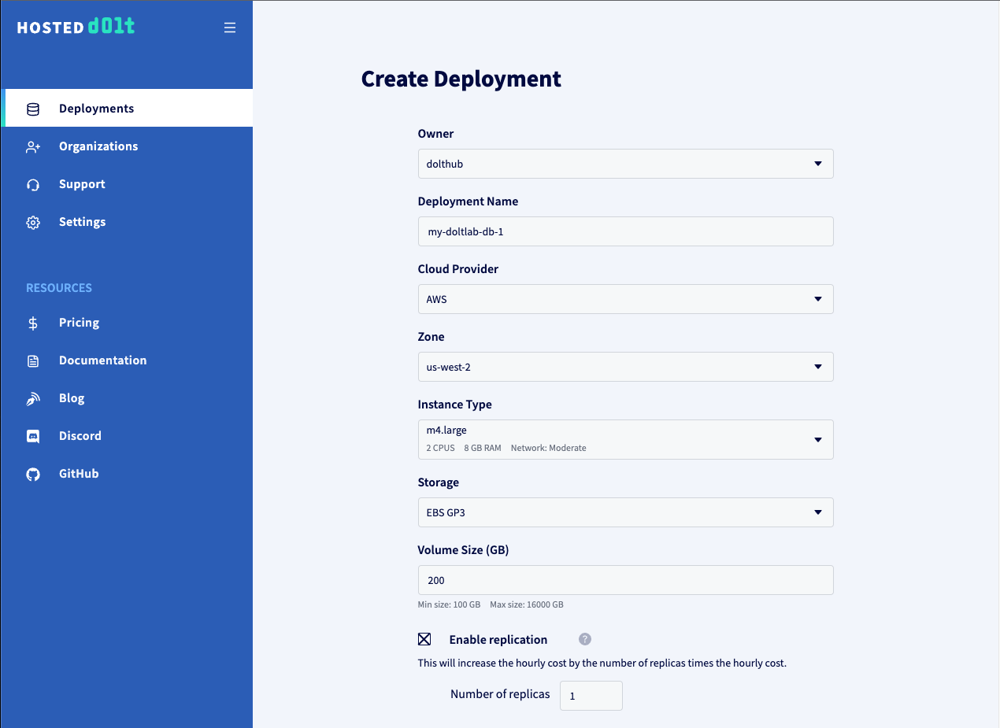

In the image above you can see that we defined our Hosted Dolt deployment name as `my-doltlab-db-1`, selected an AWS EC2 host with 2 CPU and 8 GB of RAM in region `us-west-2`. We've also requested 200 GB of disk. For DoltLab, these settings should be more than sufficient.

We have also requested a replica instance by checking the "Enable Replication" box, and specifying `1` replica, although replication is not required for DoltLab.


If you want the ability to [clone this Hosted Dolt instance](https://www.dolthub.com/blog/2023-04-17-cloning-a-hosted-database/), check the box "Enable Dolt Credentials". And finally, if you want to use the SQL workbench feature for this hosted instance (which we recommend) you should also check the box "Create database users for the SQL Workbench".

You will see the hourly cost of running the Hosted Dolt instance displayed above the "Create Deployment" button. Click it, and wait for the deployment to reach the "Started" state.

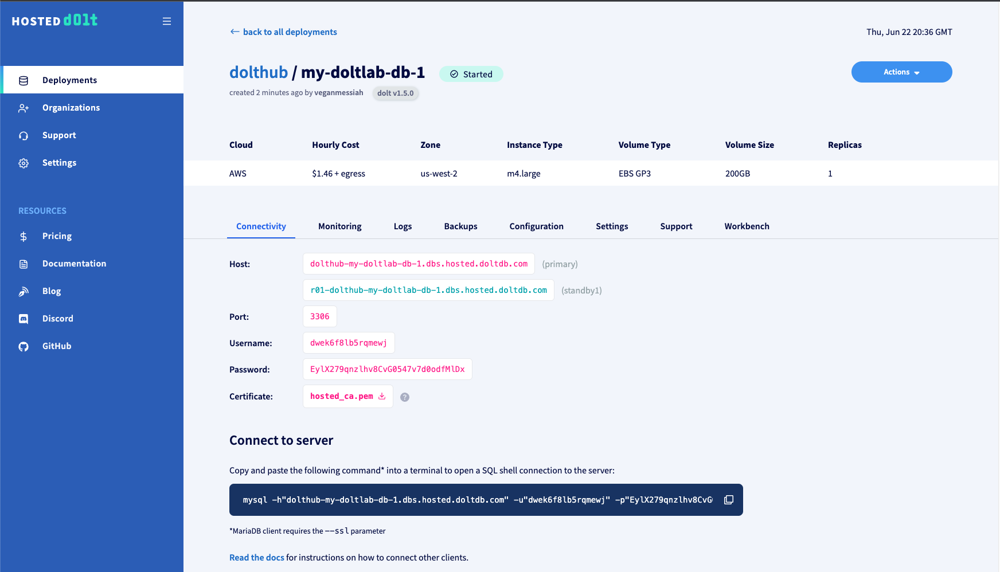

Once the deployment has come up, the deployment page will display the connection information for both the primary host and the replica, and each will be ready to use. Before connecting a DoltLab instance to the primary host, though, there are a few remaining steps to take to ensure the host has the proper state before connecting DoltLab.

First, click the "Configuration" tab and uncheck the box "behavior_disable_multistatements". DoltLab will need to execute multiple statements against this database when it starts up. You can also, optionally, change the log_level to "debug". This log level setting will make sure executed queries appear in the database logs, which is helpful for debugging.


Click "Save Changes".

Next, navigate to the "Workbench" tab and check the box "Enable Writes". This will allow you to execute writes against this instance from the SQL workbench. Click "Update".

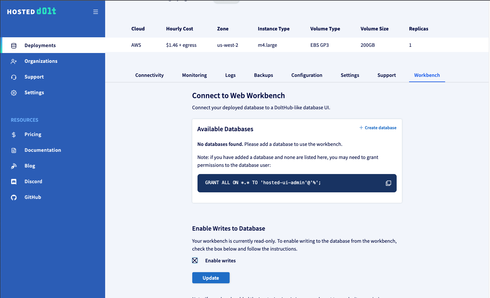

Then, with writes enabled, on this same page, click "Create database" to create the database that DoltLab expects, called `dolthubapi`.

Finally, create the required users and grants that DoltLab requires by connecting to this deployment and running the following statements:

```sql
CREATE USER 'dolthubadmin' IDENTIFIED BY '<password>';
CREATE USER 'dolthubapi' IDENTIFIED BY '<password>';
GRANT ALL ON *.* TO 'dolthubadmin';
GRANT ALL ON dolthubapi.* TO 'dolthubapi';
```

You can do this by running these statements from the Hosted workbench SQL console, or by connecting to the database using the mysql client connection command on the "Connectivity" tab, and executing these statements from the SQL shell.

This instance is now ready for a DoltLab connection.

<h2 id="doltlab-hosted-dolt-edit-docker-compose">Edit DoltLab's Docker Compose file</h2>

To connect DoltLab to `my-doltlab-db-1`, ensure that your DoltLab instance is stopped, and remove references to `doltlabdb` in DoltLab's `docker-compose.yaml` file.

You can also remove references to `doltlabdb-dolt-data`, `doltlabdb-dolt-root`, `doltlabdb-dolt-configs`, and `doltlabdb-dolt-backups` from the `volumes` section, as these were only necessary for DoltLab's default Dolt server.

```yaml
  # commenting out all references to doltlabdb
  #
  #
  # doltlabdb:
  #  image: public.ecr.aws/dolthub/doltlab/dolt-sql-server:v1.0.2
  #  command:
  #    -l debug
  #  environment:
  #    DOLT_PASSWORD: "${DOLT_PASSWORD}"
  #    DOLTHUBAPI_PASSWORD: "${DOLTHUBAPI_PASSWORD}"
  #  networks:
  #    - default
  #  volumes:
  #    - doltlabdb-dolt-data:/var/lib/dolt
  #    - doltlabdb-dolt-root:/.dolt
  #    - doltlabdb-dolt-configs:/etc/dolt
  #    - doltlabdb-dolt-backups:/backups
  doltlabenvoy:
     image: envoyproxy/envoy-alpine:v1.18-latest
     command:
       -c /envoy.yaml
...
  doltlabui:
    depends_on:
      # - doltlabdb
      - doltlabenvoy
      - doltlabremoteapi
      - doltlabapi
      - doltlabgraphql
      - doltlabfileserviceapi
...
    networks:
      - default
networks:
  default:
    external:
      name: doltlab
volumes:
  # doltlabdb-dolt-data:
  # doltlabdb-dolt-root:
  # doltlabdb-dolt-configs:
  # doltlabdb-dolt-backups:
  doltlab-remote-storage:
  doltlab-user-uploads:
```

There's one additional edit to the `docker-compose.yaml` file to make before we can start DoltLab. Edit the value of the `-doltHost`argument in the `doltlabapi.command` section to match the host of the primary `my-doltlab-db-1` host. In our example, this would be `dolthub-my-doltlab-db-1.dbs.hosted.doltdb.com`.

```yaml
...
  doltlabapi:
...
    command:
      -doltlab
      -outboundInternalServiceEndpointHost doltlabenvoy
      -iterTokenEncKeysFile /iter_token.keys
      -iterTokenDecKeysFile /iter_token.keys
      -doltUser dolthubapi
      -doltHost dolthub-my-doltlab-db-1.dbs.hosted.doltdb.com # update the host to point to the primary deployment
      -doltPort 3306
      -tlsSkipVerify # hosted dolt requires TLS, but we will skip verification for now
...
```

You will also need to add the argument `-tlsSkipVerify` to the `doltlabapi.command` section. Save these changes to the file, and you can now start DoltLab using the `start-doltlab.sh` script.

Make sure that the `DOLT_PASSWORD` environment variable matches the password you used when creating user `dolthubadmin`, and `DOLTHUBAPI_PASSWORD` matches the password you used when creating user `dolthubapi`.

Once DoltLab is running successfully against `my-doltlab-db-1`, you can create a database on DoltLab, for example called `test-db`, and you will see live changes to the database reflected in the Hosted Dolt workbench:

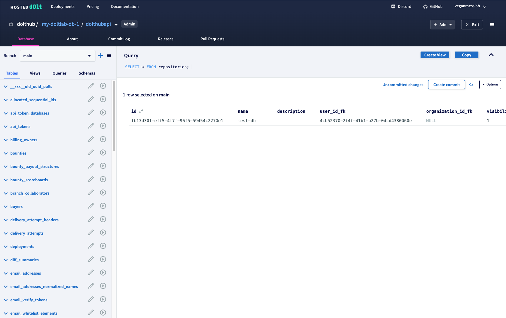

<h1 id="doltlab-https-proxy">Serve DoltLab over HTTPS with a TLS reverse proxy</h1>

Starting with DoltLab `v1.0.5`, it is possible to serve a DoltLab instance behind a TLS reverse proxy. You may want to do this if you want to serve your DoltLab instance over `HTTPS` instead of `HTTP`. Let's walkthrough an example of how to run a DoltLab instance behind an [nginx](https://www.nginx.com/) TLS proxy, running on the same host. We will use [doltlab.dolthub.com](https://doltlab.dolthub.com) as our example.

Before you begin you will need to create valid TLS certificates on the DoltLab host. You can provision these from a [Certificate Authority](https://en.wikipedia.org/wiki/Certificate_authority) or do so with a free tool like [certbot](https://certbot.eff.org/). For this example we have created valid certs with `certbot`, `/etc/letsencrypt/live/doltlab.dolthub.com/fullchain.pem` and `/etc/letsencrypt/live/doltlab.dolthub.com/privkey.pem`.

To start, shut down your DoltLab instance if it is currently running, then open four new ports on your DoltLab host. These ports will be used to forward requests to DoltLab's existing `HTTP` ports.

In our example we will using the following new ports: `443`, `143`, `5443`, and `50043`. `443` will route requests to port `80` where DoltLab's UI is served. `143` will forward requests to port `100` where DoltLab serves database data from. `5443` will forward requests to `4321`, which DoltLab uses to enable user file uploads. And, finally, `50043` will map to `50051`, the port used by clients for cloning, pushing, pulling, and fetching data.

At this time you can also close ports `80`, `100`, `4321`, and `50051` on the DoltLab host, as these no longer need to be reachable on the public internet.

Next, edit DoltLab's `docker-compose.yaml` and amend the arguments under `doltlabremoteapi.command`:

```yaml
  doltlabremoteapi:
...
    command:
      # change value of `-http-host`, adding the HOST_IP before the colon and the new TLS database data serving port (143) after the colon
      -http-host "doltlab.dolthub.com:143"
      -http-scheme "https" # add `-http-scheme` with value `https`
      -backingStoreHostNameOverrideKey ":143" # update this with TLS database data serving port as well
```

There are 2 arguments that need to change, and one new argument to add. As you can see from the above snippet, `-http-host` needs to be updated with the `HOST_IP` value followed by a colon and the new TLS database data serving port. Since we use `HOST_IP=doltlab.dolthub.com`, and we are mapping TLS port `143` to `HTTP` port `100`, our new value is `doltlab.dolthub.com:143`.

We also need to change the port in the value of `-backingStoreHostNameOverrideKey` to reflect this same TLS port, so our value here is `:143`.

Lastly, we need to add the argument `-http-scheme https` to this `command` block.

Next, edit the `doltlabapi.command` section:

```yaml
  doltlabapi:
...
    command:
      # change the url scheme to `https`
      -websiteURL "https://doltlab.dolthub.com"
      # change the scheme to `https` and the port to the new TLS file upload port (5443)
      -userImportUploadsFileServiceBrowserHost "https://doltlab.dolthub.com:5443"
```

Here we change the value of `-websiteURL` to have an `https` scheme. We also change the value of   `-userImportUploadsFileServiceBrowserHost` so that the url scheme is `https` and the port after the colon is `5443`, the new TLS port we are using to forward requests to DoltLab's user file upload service running on `HTTP` port `4321`.

Save the changes to this file.

Next, [install nginx v1.13.10 or higher](https://docs.nginx.com/nginx/admin-guide/installing-nginx/installing-nginx-open-source/) on the DoltLab host. For this example, the open source version can be installed on Ubuntu with:

```bash
sudo apt update
sudo apt install nginx
```

Ensure `nginx` is running with:

```bash
sudo systemctl status nginx
● nginx.service - nginx - high performance web server
     Loaded: loaded (/lib/systemd/system/nginx.service; enabled; vendor preset: enabled)
     Active: active (running) since Fri 2023-08-18 20:51:50 UTC; 3 days ago
       Docs: https://nginx.org/en/docs/
   Main PID: 2913065 (nginx)
      Tasks: 5 (limit: 18734)
     Memory: 9.8M
     CGroup: /system.slice/nginx.service
             ├─2913065 nginx: master process /usr/sbin/nginx -c /etc/nginx/nginx.conf
             ├─3844184 nginx: worker process
             ├─3844185 nginx: worker process
             ├─3844186 nginx: worker process
             └─3844187 nginx: worker process

Aug 18 20:51:50 ip-10-2-3-125 systemd[1]: Starting nginx - high performance web server...
Aug 18 20:51:50 ip-10-2-3-125 systemd[1]: Started nginx - high performance web server.
```

Then, edit the `nginx` configuration file located at `/etc/nginx/nginx.conf` to be the following:

```
user  nginx;
worker_processes  auto;

error_log  /var/log/nginx/error.log notice;
pid        /var/run/nginx.pid;


events {
    worker_connections  1024;
}


http {
    include       /etc/nginx/mime.types;
    default_type  application/octet-stream;

    log_format  main  '$remote_addr - $remote_user [$time_local] "$request" '
                      '$status $body_bytes_sent "$http_referer" '
                      '"$http_user_agent" "$http_x_forwarded_for"';

    access_log  /var/log/nginx/access.log  main;

    sendfile        on;
    #tcp_nopush     on;

    keepalive_timeout  65;

    #gzip  on;

    # include /etc/nginx/conf.d/*.conf;

    client_max_body_size 1024M;

    ssl_session_cache   shared:SSL:10m;
    ssl_session_timeout 10m;

    server {
        listen 443 ssl;

        ssl_certificate     /etc/letsencrypt/live/doltlab.dolthub.com/fullchain.pem;
        ssl_certificate_key /etc/letsencrypt/live/doltlab.dolthub.com/privkey.pem;
        ssl_protocols       TLSv1 TLSv1.1 TLSv1.2;
        ssl_ciphers         HIGH:!aNULL:!MD5;

        location / {
            proxy_pass http://127.0.0.1:80;
            proxy_http_version 1.1;
            proxy_set_header Host $host;
            proxy_set_header X-Real-IP $remote_addr;
            proxy_set_header X-Forwarded-Host $host;
            proxy_set_header X-Forwarded-Port $server_port;
            proxy_set_header X-Forwarded-For $proxy_add_x_forwarded_for;
            proxy_set_header X-Forwarded-Proto https;
        }                
    }
    
    server {
        listen 143 ssl;

        ssl_certificate     /etc/letsencrypt/live/doltlab.dolthub.com/fullchain.pem;
        ssl_certificate_key /etc/letsencrypt/live/doltlab.dolthub.com/privkey.pem;
        ssl_protocols       TLSv1 TLSv1.1 TLSv1.2;
        ssl_ciphers         HIGH:!aNULL:!MD5;

        location / {
            proxy_pass http://127.0.0.1:100;
            proxy_http_version 1.1;
            proxy_set_header Host $host;
            proxy_set_header X-Real-IP $remote_addr;
            proxy_set_header X-Forwarded-Host $host;
            proxy_set_header X-Forwarded-Port $server_port;
            proxy_set_header X-Forwarded-For $proxy_add_x_forwarded_for;
            proxy_set_header X-Forwarded-Proto https;
        }                
    }
    
    server {
        listen 5443 ssl;

        ssl_certificate     /etc/letsencrypt/live/doltlab.dolthub.com/fullchain.pem;
        ssl_certificate_key /etc/letsencrypt/live/doltlab.dolthub.com/privkey.pem;
        ssl_protocols       TLSv1 TLSv1.1 TLSv1.2;
        ssl_ciphers         HIGH:!aNULL:!MD5;

        location / {
            proxy_pass http://127.0.0.1:4321;
            proxy_http_version 1.1;
            proxy_set_header Host $host;
            proxy_set_header X-Real-IP $remote_addr;
            proxy_set_header X-Forwarded-Host $host;
            proxy_set_header X-Forwarded-Port $server_port;
            proxy_set_header X-Forwarded-For $proxy_add_x_forwarded_for;
            proxy_set_header X-Forwarded-Proto https;
        }                
    }

    server {
        listen 50043 ssl http2;

        ssl_certificate     /etc/letsencrypt/live/doltlab.dolthub.com/fullchain.pem;
        ssl_certificate_key /etc/letsencrypt/live/doltlab.dolthub.com/privkey.pem;
        ssl_protocols       TLSv1 TLSv1.1 TLSv1.2;
        ssl_ciphers         HIGH:!aNULL:!MD5;

        location / {
            grpc_pass grpc://127.0.0.1:50051;
        }                
    }
}

```

The above configuration file includes `server` blocks that route the new TLS ports to the proper `HTTP` ports of DoltLab and use the TLS certificates we created earlier with `certbot`. Importantly, the `server` block for `50043` used by clients for cloning, pushing, pulling, and fetching must be configured with `http2` and as a `grpc_pass`.

Save the changes to the configuration file and reload `nginx` with: `nginx -s reload`. This will make the configuration changes take effect.

Finally, restart DoltLab using the `./start-doltlab.sh` script with two additional environment variables:

```bash
export USE_HTTPS=1 # enable https support in the DoltLab frontend
export DOLTLAB_REMOTE_PORT=50043 # set to new TLS port for cloning/pushing/pulling/fetching (50043)
...
./start-doltlab.sh
```

Once your DoltLab instance comes up, it will be served on `HTTPS` via the `nginx` TLS proxy.

<h1 id="doltlab-https-natively">Serve DoltLab over HTTPS natively</h1>

Starting with DoltLab `v1.0.6`, it is possible to run DoltLab over `HTTPS` with TLS natively. To do so, make sure that port `443` is open on the host running DoltLab (as well as the other required ports `100`, `4321`, and `50051`) and that you have a valid TLS certificate that uses the `HOST_IP` of the DoltLab host. We recommend creating a TLS certificate using [certbot](https://certbot.eff.org/).

To start DoltLab with TLS, you will run the `./start-doltlab.sh` script with the argument `https`, and will need to supply two additional environment variables:

```bash
...
export TLS_CERT_CHAIN=<path to TLS certificate chain>
export TLS_PRIVATE_KEY=<path to TLS private key>
./start-doltlab.sh https
```

Once the services are spun up, DoltLab will be available at `https://${HOST_IP}`.

<h1 id="doltlab-performance">Improve DoltLab Performance</h1>

Starting with DoltLab `v1.1.0`, it is possible to limit the number of concurrent Jobs running on a DoltLab host by adding optional arguments to the `doltlabapi` block of the `docker-compose.yaml` or `docker-compose-tls.yaml` files.

When user's upload files on a DoltLab instance, or merge a pull request, DoltLab creates a Job corresponding to this work. These Jobs spawn new Docker containers that performs the required work.

By default, DoltLab imposes no limit to the number of concurrent Jobs that can be spawned. As a result, a DoltLab host might experience resources exhaustion as the Docker engine uses all available host resources for managing it's containers.

To prevent resource exhaustion, the following can be added in DoltLab >= `v1.1.0` to limit the number of concurrent Jobs, ensuring DoltLab will not run more jobs than the configured limit, at any one time:

```yaml
# docker-compose.yaml
...
  doltlabapi:
...
    command:
...
      -jobConcurrencyLimit "5"
      -jobConcurrencyLoopSeconds "10"
      -jobMaxRetries "5"
```

`-jobConcurrencyLimit` limits number of concurrent Jobs a DoltLab instance will run at any given time. A value of `0` indicates no limit.

`-jobConcurrencyLoopSeconds` is the number of seconds Job Scheduler will wait before looking for more Jobs to schedule. Default is `10` seconds.

`jobMaxRetries` is the number of times the Job Scheduler will retry scheduling a Job before permanently giving up, requiring the Job to be recreated.

<h1 id="doltlab-single-sign-on">Configure SAML Single-Sign-On</h1>

DoltLab Enterprise => `v2.0.0` supports SAML single-sign-on. To configure your DoltLab instance to use single-sign-on, you will first need an Identity Provider (IP) to provide you with a metadata descriptor.

For example, [Okta](https://www.okta.com/), a popular IP, provides an endpoint for downloading the metadata descriptor for a SAML application after you register an application on their platform.

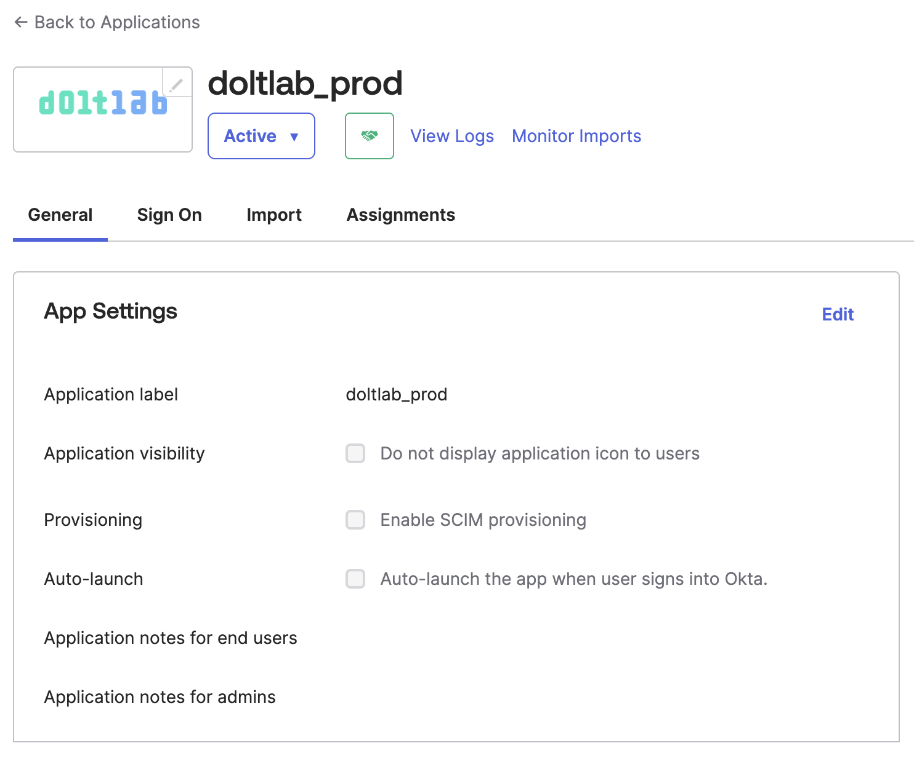

During registration, Okta will ask you for the "Single Sign On Url" and an "Audience Restriction" for the application.

Use the domain/host IP address of your DoltLab instance followed by `/sso/callback` for the "Single Sign On Url", and use that same domain/host IP address followed by just "/sso" for the "Audience Restriction". Since this example will be for `https://doltlab.dolthub.com`, we'll use `https://doltlab.dolthub.com/sso/callback` and `https://doltlab.dolthub.com/sso` respectively.

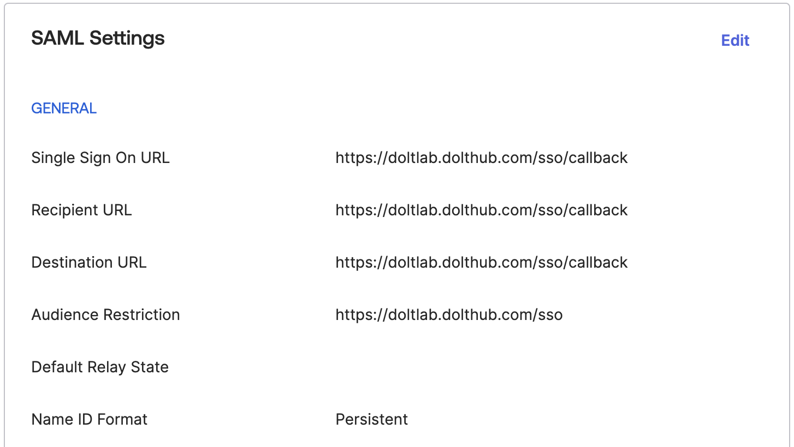

Be sure to also set "Name ID Format" to "Persistent".

Then, download the metadata Okta provides for this application to your DoltLab host.

Next, run the `./gen_saml_certs.sh` script included with DoltLab `v2.0.0` to generate a SAML signing key and certificate. This script will create two files, `./saml_key.pem` and `./saml_cert.pem` DoltLab will use for signing SAML requests.

Finally, edit the `./docker-compose.yaml` file for DoltLab so that the following arguments are added to the `doltlabapi.command` block and `doltlabapi.volumes` block:

```yaml
  doltlabapi:
    command:
      ...
      -samlKeyFile "/saml_key.pem"
      -samlCertFile "/saml_cert.pem"
      -samlMetadataDescriptor "/saml_metadata"
      ...
    volumes:
      ...
      - ${PWD}/saml_key.pem:/saml_key.pem
      - ${PWD}/saml_cert.pem:/saml_cert.pem
      - ${PWD}/saml_metadata:/saml_metadata # ./saml_metadata is the metadata descriptor downloaded from the IP
      ...
```

Save these changes to the `./docker-compose.yaml` file and restart your DoltLab instance for them to take effect.

When SAML single-sign-on is configured for DoltLab, you will see the SAML option on the sign-in page:


Next, as user `admin`, login to your DoltLab instance and navigate to Profile > Settings > SSO.

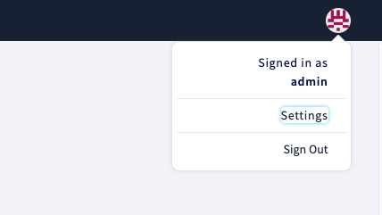

On this tab you will see the following:


`Assertion Consumer Service Url` displays the url where Okta should send the SAML assertion.

`Entity ID/Login Url` displays the url users can use to login to DoltLab using the IP, but they can now simply use the option available on the sign-in page.

`IP Metadata Descriptor` is a metadata descriptor for this DoltLab instance, and can be downloaded and supplied to the IP if it requires service providers to upload metadata.

`Certificate` can be downloaded if you want to add a signature certificate to the IP to verify the digital signatures.

Your DoltLab instance will now use single-sign-on through your IP for user login and account creation.

<h1 id="doltlab-automated-backups">Automated Remote Backups</h1>

DoltLab Enterprise => `v2.0.3` supports automated database backups for DoltLab's application Dolt server. Support for automated backups for each Dolt database on a DoltLab instance is currently underway and will be added soon.

To configure your DoltLab instance to automatically back up its Dolt database server, first, provision either a GCP bucket or and AWS S3 bucket and Dynamo DB table. You will need these to resources to create a remote backup. Oracle Cloud Infrastucture storage buckets may be used as well, starting with DoltLab >= `v2.0.6`.

Dolt supports a [backup](https://docs.dolthub.com/sql-reference/server/backups#dolt-backup-command) command which can be used to create backups of a Dolt instance.

Let's walk through setting up automated backups using an AWS remote backup first.

<h2 id="aws-remote-backup">AWS Remote Backup</h2>

Dolt can use an [AWS Remote](https://www.dolthub.com/blog/2021-07-19-remotes/) as a backup destination, but requires that two resources be provisioned. As stated in [this helpful blog post](https://www.dolthub.com/blog/2021-07-19-remotes/#aws-remotes), "AWS remotes use a combination of Dynamo DB and S3. The Dynamo table can be created with any name but must have a primary key with the name `db`."

For our example, let's create an AWS S3 bucket called `test-doltlab-application-db-backups`.

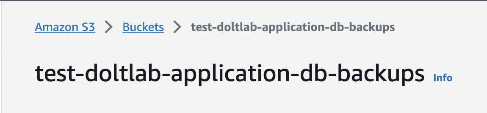

Let's also create a Dynamo DB table in the same AWS region, and call it `test-doltlab-backup-application-db-manifest`. Notice its uses the required partition key (primary key) `db`.

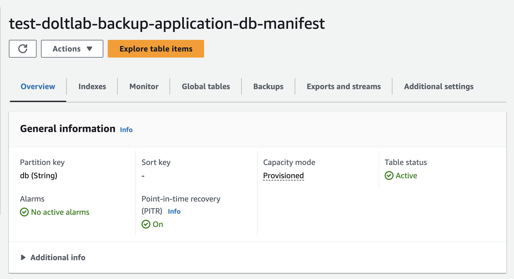

The AWS remote url for our DoltLab instance which is determined by the template `aws://[dolt_dynamo_table:dolt_remotes_s3_storage]/backup_name`, will be `aws://[test-doltlab-backup-application-db-manifest:test-doltlab-application-db-backups]/my_doltlab_backup`.

We've also granted read and write access for these resources to an IAM role called `DoltLabBackuper`.

It's now time to update our DoltLab instance configuration to automatically backup it's Dolt server data to our AWS remote.

First, ensure that the AWS credentials on the DoltLab host can be used to assume the role `DoltLabBackuper`. Create a AWS config file that contains:

```
[profile doltlab_backuper]
role_arn = arn:aws:iam::<aws account number>:role/DoltLabBackuper
region = <aws region>
source_profile = default
```

Then use the AWS CLI to confirm this profile can be used on your DoltLab host:

```
AWS_SDK_LOAD_CONFIG=1 \
AWS_REGION=<aws region> \
AWS_CONFIG_FILE=<path to config file> \
AWS_SDK_LOAD_CONFIG=1 \
AWS_PROFILE=doltlab_backuper \
aws sts get-caller-identity
{
    "UserId": "<user id>:botocore-session-1700511795",
    "Account": <aws account number>,
    "Arn": "arn:aws:sts::<aws account number>:assumed-role/DoltLabBackuper/botocore-session-1700511795"
}
```

Next, we shut down our running DoltLab instance to make changes to the `docker-compose.yaml` file. In the `doltlabdb` secion, uncomment the AWS environment variables in the `doltlabdb.environment` block, as well as the ones in the `doltlabdb.volumes` block.

```yaml
...
  doltlabdb:
  ...
    environment:
      DOLT_PASSWORD: "${DOLT_PASSWORD}"
      DOLTHUBAPI_PASSWORD: "${DOLTHUBAPI_PASSWORD}"

      ## Uncomment the AWS environment variables
      ## to mount AWS credentials into server container. This allows
      ## for backing up to AWS remotes.

      AWS_PROFILE: "${AWS_PROFILE}"
      AWS_SDK_LOAD_CONFIG: "1"
      AWS_SHARED_CREDENTIALS_FILE: "/.aws/credentials"
      AWS_CONFIG_FILE: "/.aws/config"
      AWS_REGION: "${AWS_REGION}"

      ## Uncomment to mount GCP credentials into server container. This allows
      ## for backing up to GCP remotes.

      # GOOGLE_APPLICATION_CREDENTIALS=/gcloud_credentials.json
    networks:
      - default
    volumes:
      - doltlabdb-dolt-data:/var/lib/dolt
      - doltlabdb-dolt-root:/.dolt
      - doltlabdb-dolt-configs:/etc/dolt
      - doltlabdb-dolt-backups:/backups

      ## Uncomment the AWS environment variables
      ## to mount AWS credentials into server container. This allows
      ## for backing up to AWS remotes.

      - ${AWS_SHARED_CREDENTIALS_FILE}:/.aws/credentials
      - ${AWS_CONFIG_FILE}:/.aws/config

      ## Uncomment to mount GCP credentials into server container. This allows
      ## for backing up to GCP remotes.

      # - ${GOOGLE_APPLICATION_CREDENTIALS}:/gcloud_credentials.json
...
```

Doing so will mount the AWS credentials on the host, into the Dolt server container, which is required for authenticating pushes as `DoltLabBackuper` to our AWS remote.

Next, uncomment the `backup-syncer`, `prometheus`, and `alertmanager` sections in the `docker-compose.yaml` file as well.

```yaml
...
  ## Uncomment backup-syncer for configuring automated backups.

backup-syncer:
   depends_on:
     - doltlabdb
     - doltlabenvoy
     - doltlabapi
   image: public.ecr.aws/doltlab/backup-syncer:v2.0.3
   command:
     -dolthubapiHost doltlabapi
     -dolthubapiPort 60051
     -doltUser dolthubadmin
     -doltHost doltlabdb
     -doltPort 3306
     -backupUrlBase "${DOLT_BACKUP_URL}"
     -doltDatabaseName dolthubapi
     -cron "0 0 * * *" # everyday at 12am
     -backupOnBoot
   environment:
     DOLT_PASSWORD: "${DOLT_PASSWORD}"
   networks:
    - default

  ## Uncomment prometheus for DoltLab go service metrics.
  ## Should be used with backup-syncer and alertmanager for automated backup alerts.

prometheus:
   depends_on:
     - doltlabenvoy
     - doltlabapi
   image: prom/prometheus:latest
   command:
     --config.file=/etc/prometheus/prometheus.yaml
   ports:
     - "9090:9090"
   networks:
     - default
   volumes:
     - ${PWD}/prometheus-alert.rules:/etc/prometheus/alerts.rules
     - ${PWD}/prometheus.yaml:/etc/prometheus/prometheus.yaml
alertmanager:
   depends_on:
     - doltlabenvoy
     - doltlabapi
   image: prom/alertmanager:latest
   command:
     --config.file=/etc/alertmanager/alertmanager.yaml
   networks:
     - default
   ports:
     - "9093:9093"
   volumes:
     ${PWD}/alertmanager.yaml:/etc/alertmanager/alertmanager.yaml
...
```

`backup-syncer` is the service responsible for calling [DOLT_BACKUP](https://docs.dolthub.com/sql-reference/server/backups#sync-a-backup-from-sql) on DoltLab's Dolt server. By default, this service will backup the Dolt database whenever it starts, and then again at midnight each night. The backup schedule can be set with the `-cron` argument.

`prometheus` and `alertmanager` are [Prometheus](https://prometheus.io/) and [AlertManager](https://prometheus.io/docs/alerting/latest/alertmanager/) instances used to notify DoltLab administrators of failed backup attempts.

In order for `alertmanager` to notify you of backup failures, edit the `./alertmanager.yaml` file and include the SMTP authentication information:

```yaml
global:
  smtp_from: no-reply@example.com
  smtp_auth_username: my-username
  smtp_auth_password: ******
  smtp_smarthost: smtp.gmail.com:587

receivers:
  - name: doltlab-admin-email
    email_configs:
      - to: me@example.com
        send_resolved: true

route:
  receiver: "doltlab-admin-email"
  group_wait: 30s
  group_interval: 2m
  repeat_interval: 4h
  routes:
    - receiver: "doltlab-admin-email"
      group_by: [alertname]
      matchers:
        - app =~ "backup-syncer"
        - severity =~ "page|critical"
```

For more configuration options, please consult the [AlertManager documentaion](https://prometheus.io/docs/alerting/latest/configuration/).

Finally, restart DoltLab using the `./start-doltlab.sh` script, adding the following environment variables:

```bash
...
AWS_PROFILE=doltlab_backuper \
AWS_SHARED_CREDENTIALS_FILE=/absolute/path/to/aws/credentials \
AWS_CONFIG_FILE=/absolute/path/to/aws/config \
AWS_REGION=aws-region \
DOLT_BACKUP_URL="aws://[test-doltlab-backup-application-db-manifest:test-doltlab-application-db-backups]/my_doltlab_backup" \
./start-doltlab.sh
```

The `backup-syncer` service will start backing up the DoltLab application database and you will see your backups stored in your S3 bucket, and the manifest stored in your DynamoDB table.

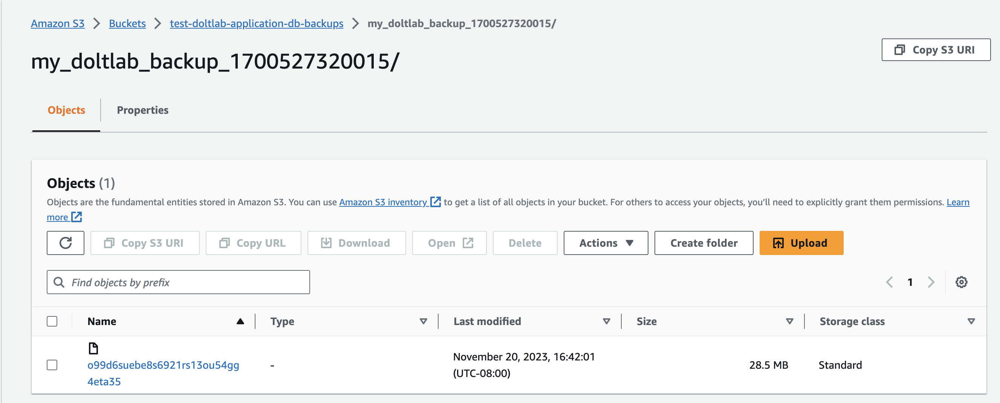

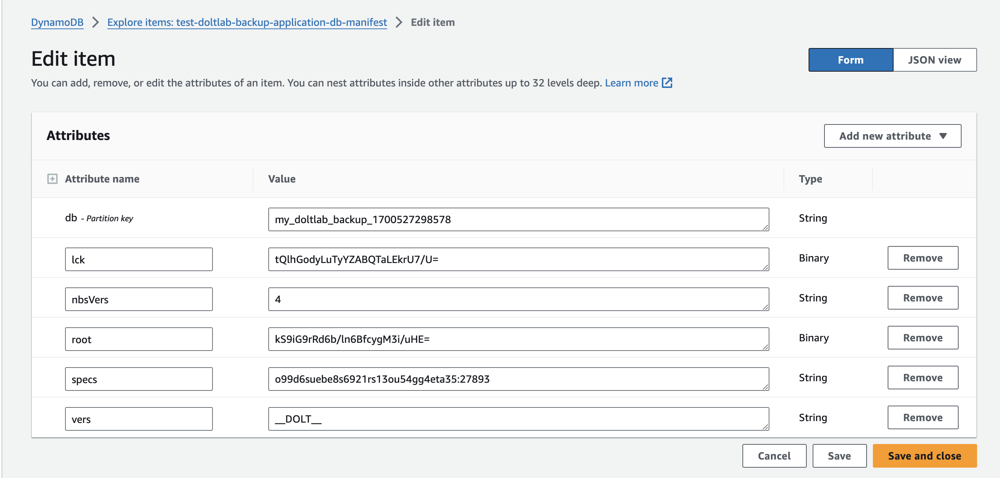

Your DoltLab's Dolt server is now automatically backing up to your AWS remote.

<h2 id="gcp-remote-backup">GCP Remote Backup</h2>

To backup DoltLab's Dolt server to a GCP remote, first create a bucket in GCP. This will be the only required resource needed.

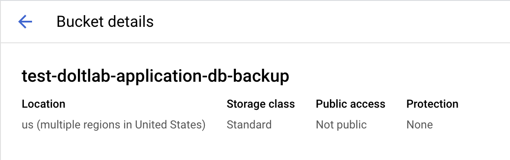

Next, add GCP JSON credentials to your DoltLab host. You can find information about GCP credentials [here](https://cloud.google.com/sdk/gcloud/reference/auth/application-default/login).

Following the Dolt's url template for GCP remotes as outlined in [this blog](https://www.dolthub.com/blog/2021-07-19-remotes/#gcp-remotes), the remote url we will use for this bucket will be `gs://test-doltlab-application-db-backup/my_doltlab_backup`.

Ensure you have stopped your running DoltLab instance, then, like we did for the AWS remote, we are going to uncomment the `GOOGLE_APPLICATION_CREDENTIALS` environment variables in the `doltlabdb.environment` and `doltlabdb.volumes` block of DoltLab's `./docker-compose.yaml` file.

```yaml
...
  doltlabdb:
  ...
    environment:
      DOLT_PASSWORD: "${DOLT_PASSWORD}"
      DOLTHUBAPI_PASSWORD: "${DOLTHUBAPI_PASSWORD}"

      ## Uncomment the AWS environment variables
      ## to mount AWS credentials into server container. This allows
      ## for backing up to AWS remotes.

      #AWS_PROFILE: "${AWS_PROFILE}"
      #AWS_SDK_LOAD_CONFIG: "1"
      #AWS_SHARED_CREDENTIALS_FILE: "/.aws/credentials"
      #AWS_CONFIG_FILE: "/.aws/config"
      #AWS_REGION: "${AWS_REGION}"

      ## Uncomment to mount GCP credentials into server container. This allows
      ## for backing up to GCP remotes.

      GOOGLE_APPLICATION_CREDENTIALS: /gcloud_credentials.json
    networks:
      - default
    volumes:
      - doltlabdb-dolt-data:/var/lib/dolt
      - doltlabdb-dolt-root:/.dolt
      - doltlabdb-dolt-configs:/etc/dolt
      - doltlabdb-dolt-backups:/backups

      ## Uncomment the AWS environment variables
      ## to mount AWS credentials into server container. This allows
      ## for backing up to AWS remotes.

      #- ${AWS_SHARED_CREDENTIALS_FILE}:/.aws/credentials
      #- ${AWS_CONFIG_FILE}:/.aws/config

      ## Uncomment to mount GCP credentials into server container. This allows
      ## for backing up to GCP remotes.

      - ${GOOGLE_APPLICATION_CREDENTIALS}:/gcloud_credentials.json
...
```

Additionally, uncomment the `backup-syncer`, `prometheus`, and `alertmanager` like we did for the AWS remote.

Finally, restart your DoltLab instance using the `./start-doltlab.sh` script while supplying the following additional environment variables:

```bash
...
GOOGLE_APPLICATION_CREDENTIALS=/absolute/path/to/gcloud/credentials \
DOLT_BACKUP_URL="gs://test-doltlab-application-db-backup/my_doltlab_backup" \
./start-doltlab.sh
```

Your DoltLab instance will now automatically back up its application Dolt server to your GCP bucket.

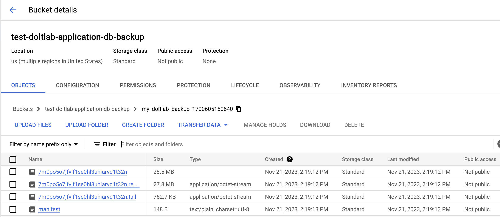

<h2 id="oci-remote-backup">OCI Remote Backup</h2>

To backup DoltLab's Dolt server to an OCI remote, first create a bucket in OCI. This will be the only required resource needed.

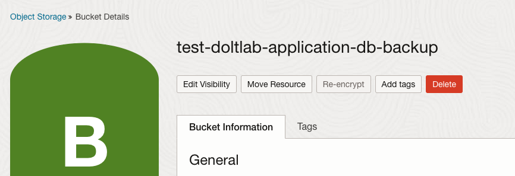

Next, install the `oci` CLI tool on your DoltLab host, and run `oci setup config` to create a configuration file with credentials authorized to access your bucket. You can find information about creating an config file [here](https://docs.oracle.com/en-us/iaas/Content/API/SDKDocs/cliinstall.htm#configfile).

`oci setup config` will create a config file and private key file that you will then need to mount into the `doltlabdb` container.

First, edit the generated config file so that the `key_file` field contains the absolute path of where the generate key file will be mounted in the `doltlabdb` container.

```
[DEFAULT]
user=ocid1.user.oc1..<unique_ID>
fingerprint=<your_fingerprint>
key_file=/oci_private_key.pem
tenancy=ocid1.tenancy.oc1..<unique_ID>
region=us-ashburn-1
```

In the above example, we've changed `key_file` to point to `/oci_private_key.pem`, where DoltLab will mount the private key file. Save these changes.

Following the Dolt's url template for OCI remotes as outlined in [this blog](https://www.dolthub.com/blog/2021-07-19-remotes/#oci-remotes), the remote url we will use for this bucket will be `oci://test-doltlab-application-db-backup/my_doltlab_backup`.

Ensure you have stopped your running DoltLab instance, then, like we did for the AWS and GCP remotes, we are going to uncomment the `OCI_CONFIG_FILE` and `OCI_KEY_FILE` environment variables in the `doltlabdb.environment` and `doltlabdb.volumes` block of DoltLab's `./docker-compose.yaml` file.

```yaml
...
  doltlabdb:
  ...
    environment:
      DOLT_PASSWORD: "${DOLT_PASSWORD}"
      DOLTHUBAPI_PASSWORD: "${DOLTHUBAPI_PASSWORD}"
...

      ## Uncomment to mount OCI credentials into server container. This allows
      ## for backing up to OCI remotes.

      OCI_CONFIG_FILE: /oci_config
    networks:
      - default
    volumes:
      - doltlabdb-dolt-data:/var/lib/dolt
      - doltlabdb-dolt-root:/.dolt
      - doltlabdb-dolt-configs:/etc/dolt
      - doltlabdb-dolt-backups:/backups

...

      ## Uncomment for backing up to OCI remotes.

      - ${OCI_CONFIG_FILE}:/oci_config
      - ${OCI_KEY_FILE}:/oci_private_key.pem
...
```

Additionally, uncomment the `backup-syncer`, `prometheus`, and `alertmanager` like we did for the AWS and GCP remotes.

Finally, restart your DoltLab instance using the `./start-doltlab.sh` script while supplying the following additional environment variables:

```bash
...
OCI_CONFIG_FILE=/absolute/path/to/oci/config \
OCI_KEY_FILE=/absolute/path/to/oci/private/key.pem \
DOLT_BACKUP_URL="oci://test-doltlab-application-db-backup/my_doltlab_backup" \
./start-doltlab.sh
```

Your DoltLab instance will now automatically back up its application Dolt server to your OCI bucket.

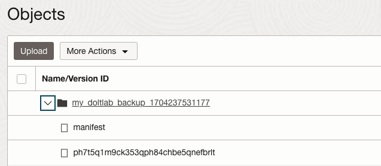
