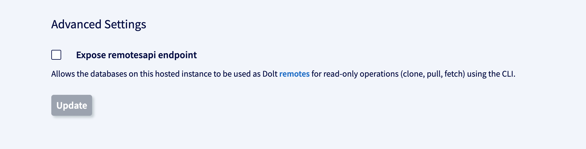
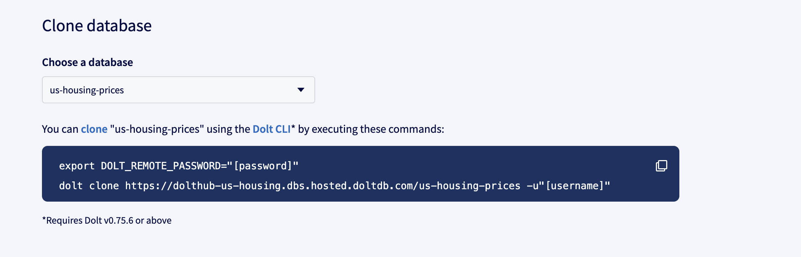

## How it works

In some cases you might want to clone your database from Hosted so that you can access
Dolt's [command line interface](../../reference/cli.md). While much of the command line is
[available in SQL](../../reference/sql/version-control/README.md) there are some
CLI-specific features that can be helpful for debugging your database offline.

In order to clone from Hosted, we needed to add support for exposing the databases on a
Hosted sql-server as a read-only remotesapi endpoint. When you run sql-server with this
configuration, it will:

1. Listen on an indicated port and serve read-only remotesapi traffic on that port
2. Use any server-side TLS associated with the sql-server itself as part of that listener
3. Use the deployment's user and password in the sql-server config as password
   authentication credentials for accessing the exposed data

Once you allow the remotesapi to be exposed for your Hosted deployment (available only for
deployments with Web PKI certificates), you can simply set a `DOLT_REMOTE_PASSWORD`
environment variable and provide a username to the `dolt clone` command. You'll see these
instructions in the Connectivity tab of your deployment page.

## Example

When you're using Hosted as your production database, there might be some
performance-heavy operations or tests you want to run in isolation so you don't impact
production, such as beta testing a considerable schema migration or running a big
analytics query. [Clone](../../reference/cli.md#dolt-clone) makes it easy to get a local
copy of your Hosted database with one command. Do whatever potentially destructive or
performance-degrading operations on your laptop while respecting your production database.

1. Expose remotesapi endpoint

In order to enable cloning from your Hosted database, first expose the [remotesapi
endpoint](../../reference/cli.md#dolt-sql-server). This will set the port for a server
which can expose the databases in the sql-server over remotesapi.

**Note that this will only work for deployments that use a Web PKI certificate.**



2. Set remote password and run clone command with user flag

To authenticate against it, you have to set a `DOLT_REMOTE_PASSWORD` environment variable
and pass along a `--user` flag to the `dolt clone` command. You can find these
instructions in the Connectivity tab on your deployment page.



After running the `dolt clone` command, you should have a local copy of your Hosted
database.

```shell
% dolt clone https://dolthub-us-housing.dbs.hosted.doltdb.com/us-housing-prices -u"username"
cloning https://dolthub-us-housing.dbs.hosted.doltdb.com/us-housing-prices
% cd us-housing-prices
% dolt sql -q "select count(*) from sales"
+----------+
| count(*) |
+----------+
| 13844603 |
+----------+
```

3. Sync your local copy with upstream changes

Now we can run whatever queries or schema migrations we want without affecting production.
If there are updates to the database, easily sync your local copy using [`dolt
fetch`](https://docs.dolthub.com/cli-reference/cli#dolt-fetch) or [`dolt
pull`](https://docs.dolthub.com/cli-reference/cli#dolt-pull).

Assuming your password environment variable is still set, you can authenticate these
commands to your remotesapi endpoint in the same way by passing the `--user` flag:

```shell
% dolt pull --user "[username]"
% dolt fetch --user "[username]"
```

Note that this remotesapi endpoint is currently read-only. Writes to remotesapi, such as
[`dolt push`](https://docs.dolthub.com/cli-reference/cli#dolt-push), are not supported
yet.
