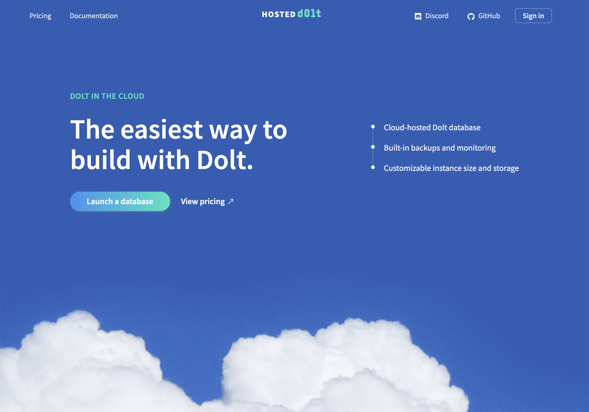
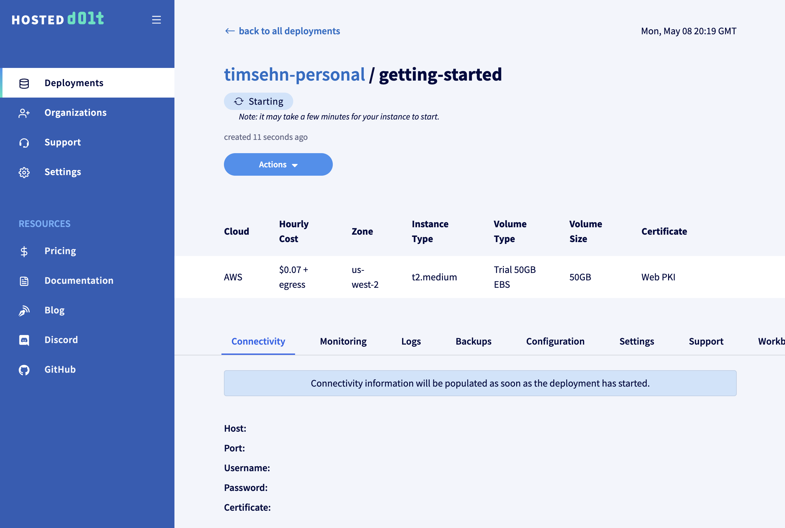
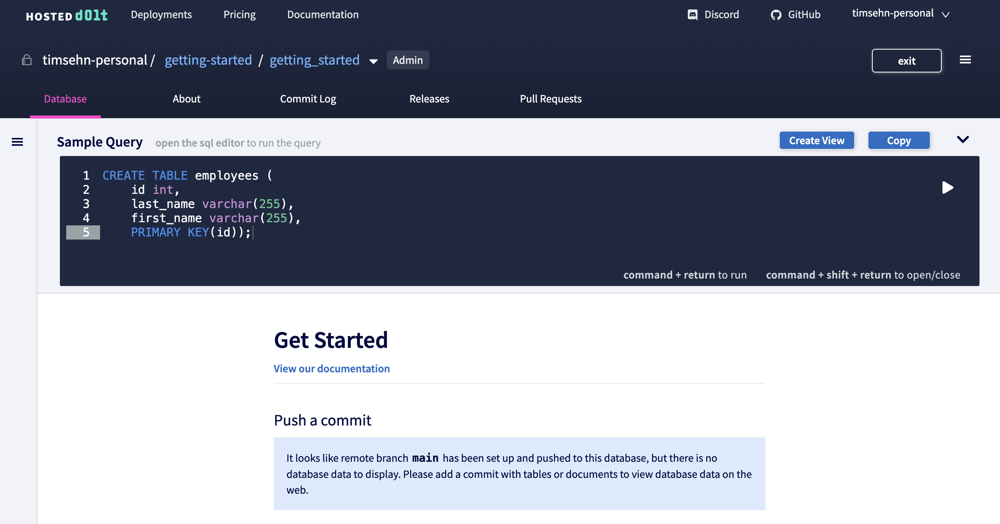
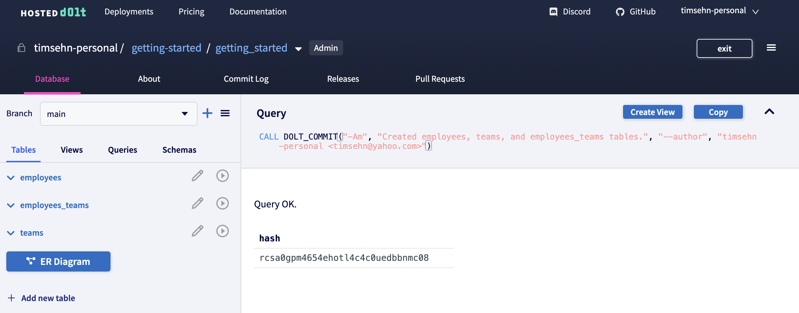
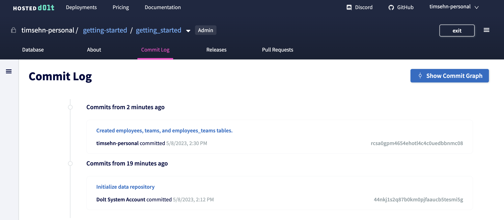
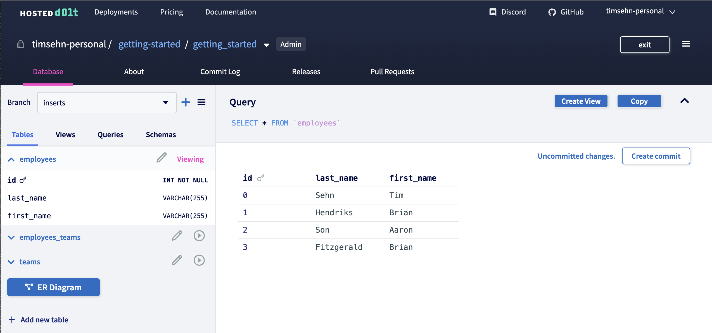
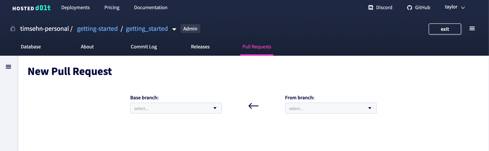
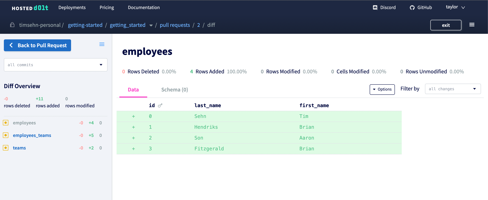

# Create an account

Your journey today starts on the internet. Open a web browser and navigate to https://hosted.doltdb.com. You should be greeted by this welcoming site (pun intended).



Click the "Sign In" button on the top right. A Sign In form will appear. Click the Create account tab.


Either use your Google account or use a valid email to create a Hosted Dolt account. Once you've chosen a username and clicked the Create Account button, use that account to Sign In. Once you sign in, your landing page will be an empty deployments page.


# Create a Deployment

Now it's time to create a deployment. A deployment is a dedicated cloud host running the world's first and only version controlled SQL database, Dolt. This cloud host can be in Amazon Web Services (AWS) or Google Cloud Platform (GCP). This cloud host is monitored and backed up for you so you don't need to worry about operating it.

Start by clicking the "Create Deployment" button.


Give your deployment a name. I called mine `getting-started`.

There are a few of options. You can safely leave the defaults except we're going to use the $50 trial instance and enable using Hosted Dolt as a remote endpoint. To switch to the trial instance, select `t2.medium` from the instance type dropdown. To enable Hosted Dolt as a remote endpoint, select the "Use Web PKI Certificate" and "Expose remotesapi endpoint" options.


Click the "Create Deployment" button. Your deployment will go into "Starting" phase.



It will take a minute or two to launch your deployment. Our control plane is procuring an EC2 host, installing Dolt and all of our monitoring utilities on it, starting Dolt, and making the SQL endpoint visible to the internet.

Once the deployment completes your deployment page will look something like this. Note the connectivity information. This is the host, port, username, and password you use to connect to the deployed Dolt. You can make new usernames and passwords and delete this one, but you use this username and password to set up your database permissions. We won't cover that in this getting started but [here's a helpful guide](https://www.dolthub.com/blog/2022-08-19-dolt-permissions-introduction/) if you need it.


You now have a cloud deployed Dolt! Let's do something interesting with it.

# Use the built-in SQL workbench

Dolt is a version controlled SQL database. Let's make some tables to show off how to use it.

There are three ways to read or write from Hosted Dolt. You can:

1. Connect any MySQL-compatible client to it
2. Use the built-in SQL Workbench
3. Make a local [clone](https://www.dolthub.com/blog/2023-04-17-cloning-a-hosted-database/)

In this blog, we will show off (1) and (2) but we're going to start with the Workbench because it is the easiest to use.

## Start the Workbench

Click on the Workbench tab of your deployment.


The workbench has writes off by default. We will turn those on and create a database. Click the "Enable writes" option and "Update" button at the bottom. Then, click the "+ Create database" link in the Available Databases box. I called my database "`getting_started`. The workbench will immediately open once you create your database.


This should feel like a standard SQL workbench like Tableplus or Datagrip but it's web-based and has some extra Dolt-specific features like a Commit Log and Pull Requests.

## Create Some Tables

Now let's create some tables using SQL. We're going to enter the following SQL queries into the query box. You have to run them one at a time.

```SQL
create table employees (
    id int,
    last_name varchar(255),
    first_name varchar(255),
    primary key(id));
create table teams (
    id int,
    team_name varchar(255),
    primary key(id));
create table employees_teams(
    team_id int,
    employee_id int,
    primary key(team_id, employee_id),
    foreign key (team_id) references teams(id),
    foreign key (employee_id) references employees(id));
```



I click the "Play" button to execute the queries. After running a query you are presented with a diff off the working set. You can start to see how Dolt's versioning capabilities make for a powerful workbench experience.


I finish up by subsequently running the last two create table queries.


## Create a Dolt Commit

Now time to use my first Dolt feature! I'm going to create a [Dolt Commit](https://docs.dolthub.com/concepts/dolt/git/commits). Make a Dolt commit when you want to preserve the state of the Dolt database permanently for future reference.

To make a Dolt Commit I click the Create Commit Button and am prompted to enter a commit message.


After clicking "Commit", I see that I've created a brand new commit hash.



I can also see my new commit in the Commit Log.



The built in Workbench in Hosted Dolt gives you a powerful web GUI to interact with Dolt. It has all the features of a workbench like Tableplus or Datagrip combined with features of GitHub like a commit log and Pull Requests. We'll be demoing Hosted Pull Requests later so keep reading.

# Add a collaborator

Dolt is a [multiplayer database](https://www.dolthub.com/blog/2022-10-17-multiplayer-database/). It works best when you have multiple editors collaborating.

I'm going to add [Taylor](https://www.dolthub.com/team#taylor) as a collaborator. This will give Taylor permissions to see my deployment, use the workbench, and make a pull request.

Navigate out of the workbench and back to the deployment page by clicking the name of your deployment. In this case `getting-started` in the breadcrumbs at the top of the workbench page. Click the "Settings" tab.


Click the "Add Collaborator" button, find the user you are looking for and select the permissions level you want to give him or her. In this case, I made Taylor an `admin`.


Finish up by clicking the "Add Collaborator" button.

Taylor can now access the deployment page to get connectivity information. Her mission is to add rows to these new tables and make a Pull Request for me to review. Taylor actually did the next section as you can tell from the Hosted Dolt screenshots.

# Connect a MySQL client

Dolt is a MySQL-compatible database. You can connect any client that can connect to MySQL to it. We're going to use the MySQl client that comes with MySQL in this section to connect to Dolt.

## Install

Head over to the [MySQL Getting Started documentation](https://dev.mysql.com/doc/mysql-getting-started/en/) and install MySQL on your machine. I used [Homebrew](https://brew.sh/) to install MySQL on my Mac.

MySQL comes with a MySQL server called `mysqld` and a MySQL client called `mysql`. You're only interested in the client. After following the instructions from MySQL's documentation and opening a terminal, make sure you have a copy of the mysql client on your path:

```
% mysql --version
mysql  Ver 8.0.29 for macos12.2 on x86_64 (Homebrew)
```

## Connect

Now, to connect the mysql client to Dolt, you need the host, port, username, and password from the Connectivity tab.


Then, in your terminal send in that information as arguments to mysql. The connectivity table even has a convenient section to copy/paste this information.


```sh
$ mysql -h"timsehn-personal-getting-started.dbs.hosted.doltdb.com" -u"nvcqnc7i1znv57pj" -p"ojZ7HCXel1Ho1aHUvvWW4hWu1HlqSRMK"
mysql: [Warning] Using a password on the command line interface can be insecure.
Welcome to the MySQL monitor.  Commands end with ; or \g.
Your MySQL connection id is 17
Server version: 5.7.9-Vitess

Copyright (c) 2000, 2023, Oracle and/or its affiliates.

Oracle is a registered trademark of Oracle Corporation and/or its
affiliates. Other names may be trademarks of their respective
owners.

Type 'help;' or '\h' for help. Type '\c' to clear the current input statement.

mysql>
```

This MySQL client is connected to your Hosted Dolt instance. Any changes you make here will be visible to users of the workbench or any other client connected to the Hosted Dolt database.

## Create a branch

So let's be safe and make our changes on a [branch](https://docs.dolthub.com/concepts/dolt/git/branch). A branch in Dolt is a lightweight way of isolating your changes from the "main" copy of the database. Since our goal is to make a Pull Request in the SQL Workbench, making a branch is necessary as pull requests are done between two branches, in this case "main" and our new branch.

In Dolt SQL, version control read operations are exposed as [system tables](https://docs.dolthub.com/sql-reference/version-control/dolt-system-tables) or [functions](https://docs.dolthub.com/sql-reference/version-control/dolt-sql-functions). Version control write operations are exposed as [procedures](https://docs.dolthub.com/sql-reference/version-control/dolt-sql-procedures).

If you are familiar with the Git command line, finding the appropriate system table, function, or procedure is easy. In our case, we want to create a branch called `inserts` and switch to it to make our changes. We know in Git we can create a new branch with `git checkout -b` or `git branch`. Checkout will switch to that branch after Git creates it. This is a write operation so it must be a procedure in Dolt SQL. The convention in Dolt SQL is the Git equivalent commands are prefixed with `dolt_` and arguments are passed in the command line fashion. So, in our case, we want to checkout a new branch called `inserts` we run `call dolt_checkout('-b', 'inserts');`. If you know Git and SQL, you already know how to use Dolt.

```sql
mysql> use getting_started;
Database changed
mysql> call dolt_checkout('-b', 'inserts');
+--------+
| status |
+--------+
|      0 |
+--------+
1 row in set (0.02 sec)

mysql> select active_branch();
+-----------------+
| active_branch() |
+-----------------+
| inserts         |
+-----------------+
1 row in set (0.02 sec)
```

Great, Taylor is now on a new branch and can safely make her changes.

## Insert some rows

This is easy if you know SQL. In the MySQL client on the `inserts` branch, Taylor ran the following SQL to add a few of the early employees here at DoltHub and assign them to teams.

```SQL
insert into employees values
    (0, 'Sehn', 'Tim'),
    (1, 'Hendriks', 'Brian'),
    (2, 'Son','Aaron'),
    (3, 'Fitzgerald', 'Brian');
insert into teams values
    (0, 'Engineering'),
    (1, 'Sales');
insert into employees_teams(employee_id, team_id) values
    (0,0),
    (1,0),
    (2,0),
    (0,1),
    (3,1);
```

Seems like it worked.

```sql
mysql> select * from dolt_status;
+-----------------+--------+----------+
| table_name      | staged | status   |
+-----------------+--------+----------+
| employees       |      0 | modified |
| employees_teams |      0 | modified |
| teams           |      0 | modified |
+-----------------+--------+----------+
3 rows in set (0.55 sec)
```

Finally, I have to make a Dolt commit to be able to merge my changes. I can do that by running `call dolt_add()` and `call dolt_commit()`.

```sql
mysql> call dolt_add('.');
+--------+
| status |
+--------+
|      0 |
+--------+
1 row in set (0.03 sec)

mysql> call dolt_commit('-m', 'inserted early employees');
+----------------------------------+
| hash                             |
+----------------------------------+
| 525tp1vsc8mkid5hj9gicibrlbri05c0 |
+----------------------------------+
1 row in set (0.04 sec)
```

Let's head back over to the workbench to make a Pull Request.

## Make and Review a Pull Request

The Hosted Dolt workbench supports pull requests and human review of your Hosted Dolt database. Head back over to your browser with the Hosted Dolt Web UI up and go to the Workbench tab. Click the `getting_started` database to open a workbench for it.

As you can see on the "main" branch there are no rows inserted in the tables.


But on the inserts branch there are!



We want to make a pull request from the inserts branch to the main branch, review our changes, and then merge inserts branch into the main branch if everything looks good. To do this we click the Pull Requests tab and click the "Create Pull Request" button.



Taylor selects the to branch as main and the from branch as inserts. She has the opportunity to add a name and description of the changes to help the reviewer figure out what I've done.


Finally, she clicks "Create pull request". She now sends me this Pull Request link for review.


## Review and Merge

On the Pull Request Page, I have access to a human readable diff of the changes under review.



Pull Requests give me the opportunity to have my database changes reviewed in the same way code is reviewed. I can click through the tables and make sure the changes are valid. I can add comments and discuss with my teammates. In this case, everything looks good so I will merge this pull request. On the Pull Request page, I click the green "Merge" button.

I head back over to the main branch and see Taylor's changes are now live.


