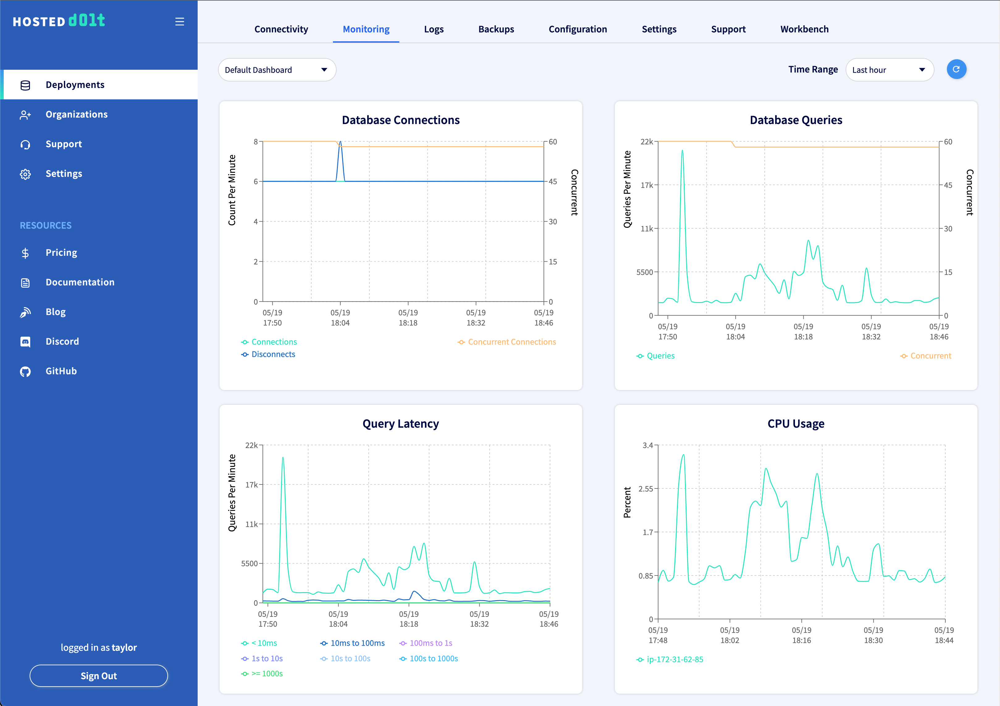
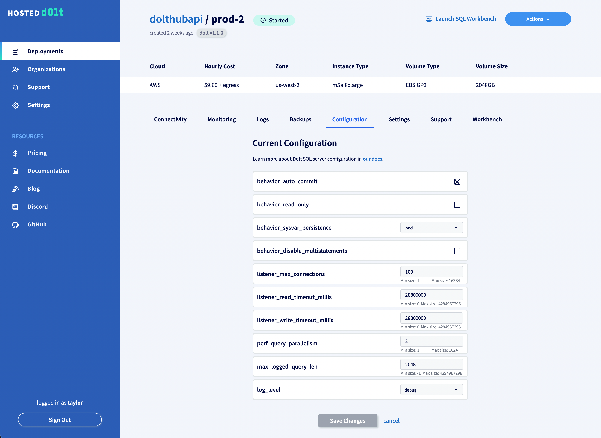
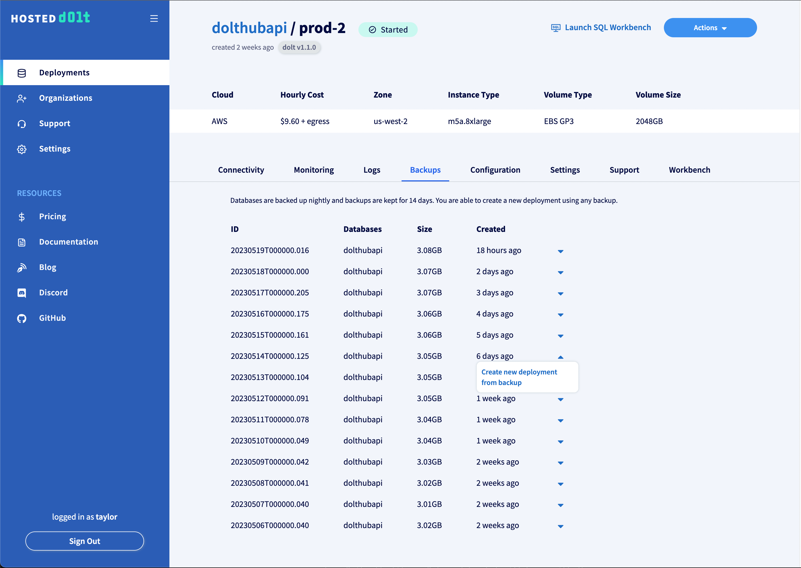
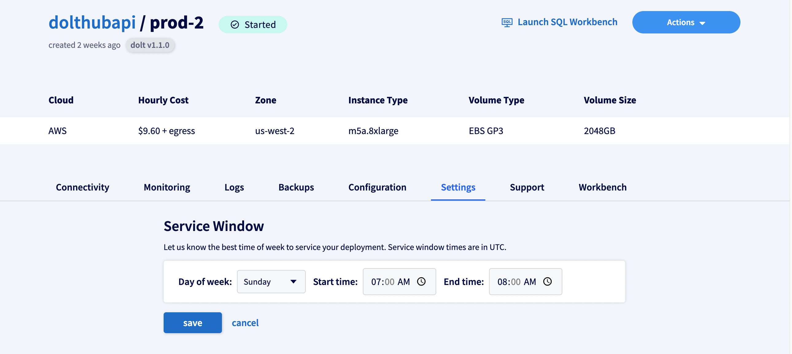
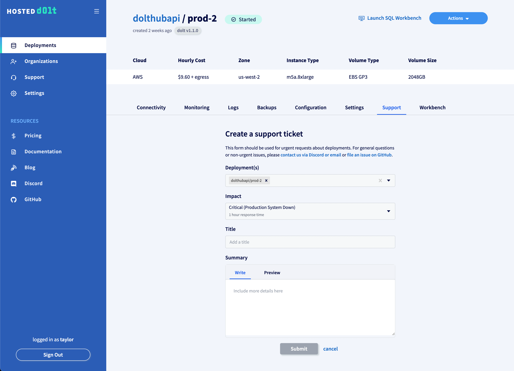
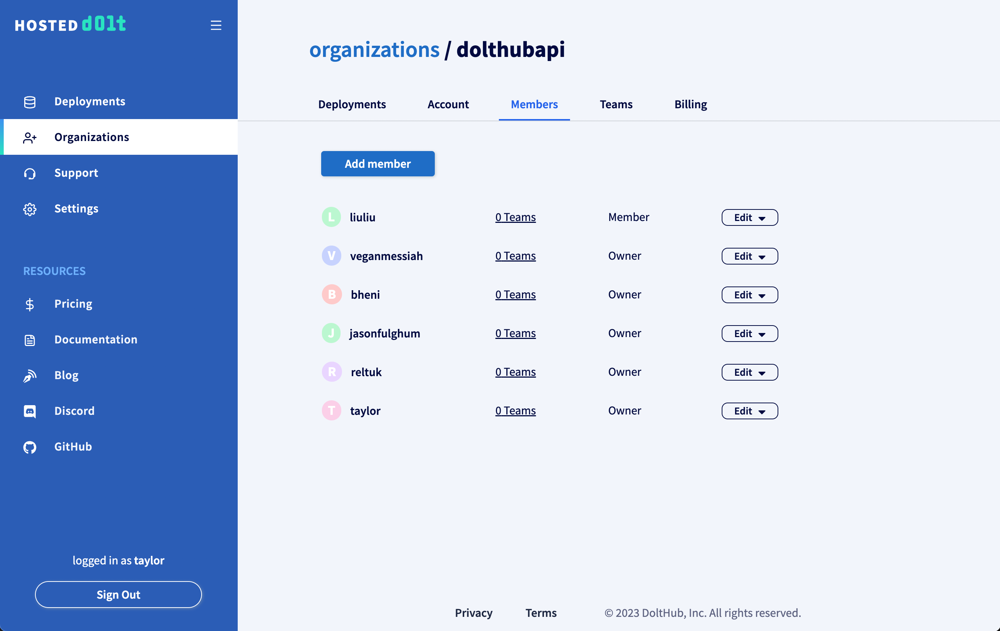
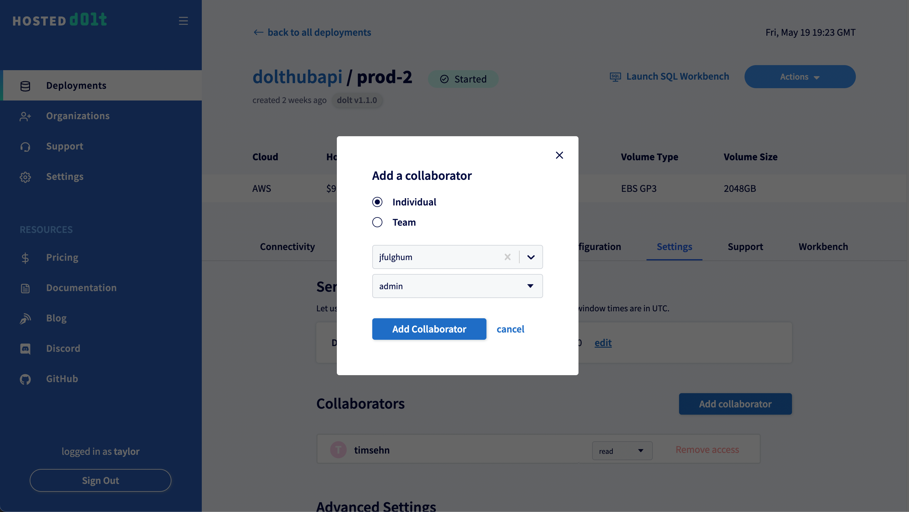
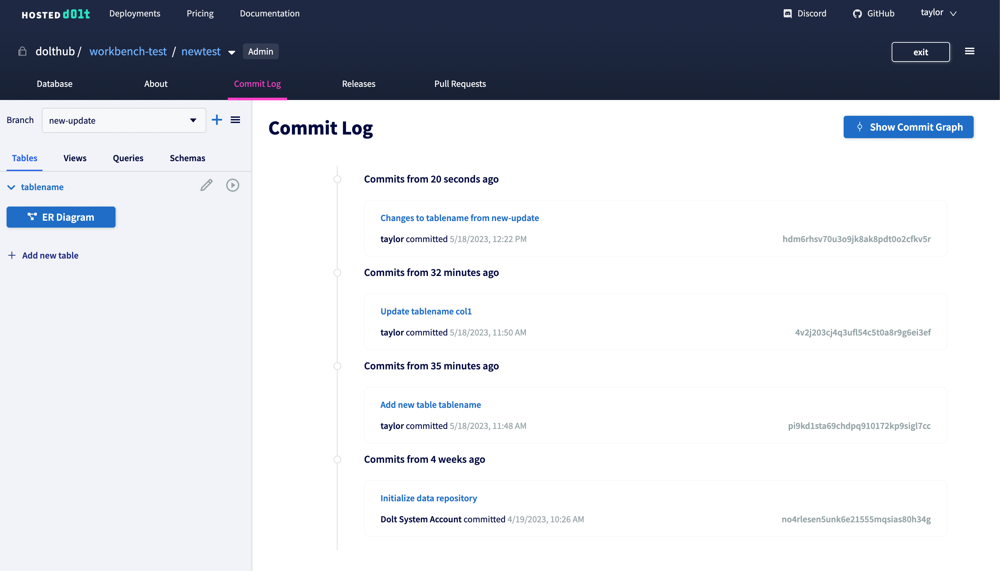
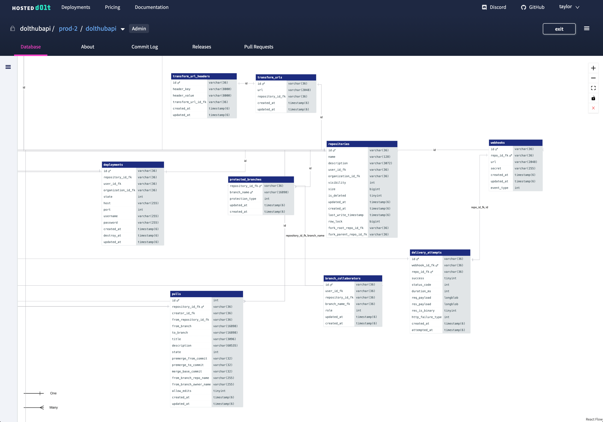

# Version control

[Dolt](https://doltdb.com) is a database like no other. There are numerous Dolt version
control features that you won't find elsewhere. Hosted Dolt gives you all the version
control features of a running Dolt server without the hassle of running it yourself. For
example:

- Create branches of your data.
- Merge changes you make with changes made by other people, and resolve conflicts using SQL.
- Look at the state of the data a given commit.
- Diff data between two commits or branches.
- Revert the changes made by a commit.

# Operations

## Logs

While your database is running we collect logging so you can monitor your database. View
and download logs from any time period from the deployment console.


## Monitoring

We also collect metrics on your running database and display graphs so you can see
performance and usage in real time.



## Custom configuration

Dolt has a myriad of [configuration options](../../reference/sql/server/configuration.md).
Most of these can be changed on the running server by setting the appropriate [system
variable](../../reference/sql/version-control/dolt-sysvars.md). However, Hosted Dolt
provides a simple UI for viewing and changing your deployment's custom configuration.



## Replication

Enable replication for your deployment and tell us how many replicas you want. You'll get
logs and metrics for each server.


## Backups

Full copies of all your databases are backed up nightly. These backups are kept for 14
days.



As a version controlled database, Dolt can handle many of the situations where a backup
would be needed by other databases. If you drop a table or write a bad delete statement
you can revert to the previous commit. That said, there are still cases where a backup is
needed, including dropping a database, hardware issues, data corruption, and destroying
your history.

You can create a new deployment from any backup. Restoring from a backup currently
requires you to create a support ticket.

Learn more about backups [here](https://www.dolthub.com/blog/2022-08-31-hosted-backups/).

## Dolt upgrades

We're releasing [new versions of Dolt](https://github.com/dolthub/dolt/releases) at least
once per week. Set your service window and your deployed Dolt version will automatically
get upgraded weekly to the latest available version with minimal downtime.



Or if you want to upgrade Dolt immediately, you can use the "Update Dolt version now"
button in the Actions dropdown.

## Enterprise Support

Hosted Dolt comes with enterprise support. [Our team](https://www.dolthub.com/team) of
veteran cloud service engineers will keep your database operating smoothly.

File support tickets directly from your deployment console and our on call team member
will get back to you within the hour.



Learn more about our support ticket system
[here](https://www.dolthub.com/blog/2022-07-13-hosted-dolt-incident-manager/).

## Access management

Easily manage access to your deployment using the same permissions model as
[DoltHub](../../concepts/dolthub/permissions.md) and
[GitHub](https://docs.github.com/en/repositories/managing-your-repositorys-settings-and-features/managing-repository-settings/managing-teams-and-people-with-access-to-your-repository).

Create a deployment under an organization. All organization members have read access to
your deployment. Create a team, add members, and give the whole team admin permission to
your deployment.



Need to add a one-off collaborator to a specific deployment? Add that user as a
collaborator in your deployment's Settings tab.



# Quick Start

## Trial instance

To lower the cost barrier, Hosted Dolt offers [trial
instance](https://www.dolthub.com/blog/2022-10-24-hosted-trial-instances/) for $50 a
month. For $50 you get a t2.medium running in EC2 with 50GB of storage. There is no time
limit for these instances. This isn't a 30-day trial. It's an instance perfect for
trialing Dolt.

## Connect from anywhere using any MySQL client

Dolt is a drop in replacement for MySQL. You can connect to your instance using your
favorite MySQL client using the connectivity information in the Connectivity tab of your
deployment console.


# SQL Workbench

## User Friendly Build-In Web GUI

Each deployment comes with a built-in SQL workbench, inspired by
[DoltHub's](https://www.dolthub.com) database page. Browse your data in read-only mode or
allow writes and make changes to your database from the web. The workbench comes with your
favorite DoltHub features, including [pull requests](#pull-requests), [diffs](#diffs),
[commit logs](#commit-log), [ORM diagrams](#orm-diagrams), and more!


Learn more about the SQL workbench [here](./sql-workbench.md).

## Pull Requests

Create pull requests for human review of changes to your database.


## Diffs

Analyze your data and schema changes in a diff and debug issues in specific commits.


## Commit Log

View an audit log of all changes made to your data.



## ER Diagrams

Visualize the entities in your database as well as the relationship between tables.



# Dolt Ecosystem

## Clone a Hosted Instance

In some cases you might want to clone your database from Hosted Dolt so that you can
access Dolt's [command line interface](../../reference/cli.md). Hosted provides an option
to expose your instance's remotesapi endpoint to allow clone, fetch, and pull from your
Hosted.


Learn more in our [cloning guide](./cloning.md).

## Use DoltHub as a Remote

To interact with DoltHub from your Hosted instance, you can use DoltHub as a
[remote](../../concepts/dolt/git/remotes.md). We have [SQL
remote](https://www.dolthub.com/blog/2021-09-22-sql-remotes) operations such as
`dolt_clone`, `dolt_pull`, and `dolt_push` that let you interact with remotes using SQL.
You can add Dolt credentials to your Hosted instance to authenticate certain operations,
like cloning a private database from DoltHub or pushing changes to a DoltHub database you
have write permissions to.

```sql
mysql> call dolt_clone('dolthub/user_metrics');
+--------+
| status |
+--------+
|      0 |
+--------+
1 row in set (0.71 sec)

mysql> show databases;
+--------------------+
| Database           |
+--------------------+
| information_schema |
| mysql              |
| user_metrics       |
+--------------------+
3 rows in set (0.05 sec)
```

Learn more in our [DoltHub as a remote guide](./dolthub-as-remote.md).
