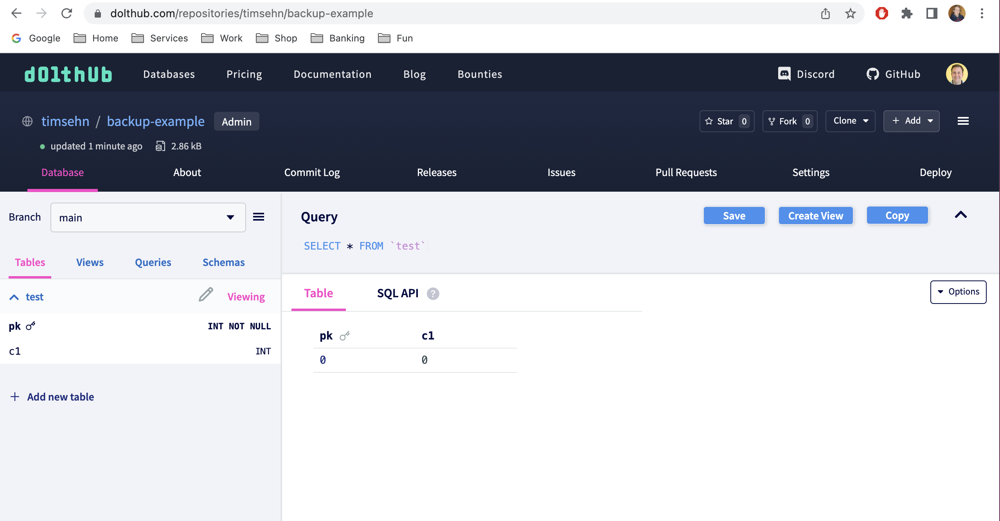

# Backups

There are several ways to safely backup Dolt databases and Dolt SQL servers. If you are using [Hosted Dolt](../../../products/hosted/README.md), then you get automatic backups without having to configure anything. If you are running your own Dolt SQL server, then you need to handle your own backups using one of the approaches below.

Backing up through [point-in-time snapshots at a block device level](#point-in-time-snapshots-on-block-devices) is often the easiest approach and what we recommended if this works for your setup. Backing up by [copying files at a file system level](#copying-files-on-file-systems) can also work in some cases, but requires that no Dolt processes are reading or writing any data while the file copy operation is in progress. You can also roll your own custom solutions by [pushing to remotes](#pushing-to-remotes) or using the [Dolt backup command](#dolt-backup-command). Make sure you include [all additional configuration files](#additional-sql-server-configuration) needed to fully restore your Dolt SQL server environment. As with any backup solution, it is important that you regularly test your backup and restore processes.

## Point-in-Time Snapshots on Block Devices

If you are running a Dolt SQL server with the data directory (i.e. the directory where your databases are stored) on a block device that supports point-in-time snapshots, such as AWS Elastic Block Store (EBS), then you can take advantage of these snapshots for backing up your databases and configuration. In most cases, this will handle the versioned content of your databases as well as [all additional configuration files](#additional-sql-server-configuration). Because of how point-in-time snapshots work, this operation is consistent and safe to perform, even when the Dolt SQL server is running. Because of its simplicity and safety, this is our recommended approach for backing up your Dolt SQL server.

## Copying Files on File Systems

Unlike block devices that support point-in-time snapshots, you **cannot** rely on the same safety and consistency guarantees at the file system layer. This is true whether you are using a local file system or a file system service such as AWS Elastic File System. You cannot rely on copying the contents of a file system for a safe backup. It is possible that the file system copy operation will not capture a consistent set of files and you risk being unable to restore the backup. However, if you are able to fully stop the Dolt SQL server and ensure no Dolt processes are using the file system data, then you can safely copy the files at the file system level for a backup. This is only safe if no Dolt processes are using the data, so you should use extra caution to ensure that Dolt is not running if you want to pursue this approach. Otherwise, if you are not able to stop the Dolt SQL Server to perform a backup, you should rely on one of the backup approaches described below.

## Pushing to Remotes

Using remotes for backups is suitable for some use cases, but be aware that using remotes for backups only backs up to the current commit of a branch, not the working set or other branches. Pushing to a remote creates an off server copy of the branch being pushed. Frequently pushing to a remote can serve as a backup for some use cases.

### Configure a remote

This example uses DoltHub as a remote, but you can use Dolt with [other remotes like filesystem, AWS S3, and GCS](https://www.dolthub.com/blog/2021-07-19-remotes/). I created an empty database on DoltHub and [configured the appropriate read and write credentials on this host](../../../products/dolthub/data-sharing.md#dolt-login).

```bash
% dolt remote add backup https://doltremoteapi.dolthub.com/timsehn/backup-example
$ dolt remote -v
backup https://doltremoteapi.dolthub.com/timsehn/backup-example
```

### Backup by Pushing a Branch

```sql
mysql> use backup_example;
mysql> create table test (pk int, c1 int, primary key(pk));
mysql> insert into test values (0,0);
mysql> call dolt_add('test');
mysql> call dolt_commit('-m', "Created table and inserted values to be backed up");
+----------------------------------+
| hash                             |
+----------------------------------+
| slm5cql6ri8l4vd7uemvqhj6p2e2g98k |
+----------------------------------+
mysql> call dolt_push('backup', 'main');
+---------+
| success |
+---------+
| 1       |
+---------+
```

Using DoltHub or DoltLab as a remote provides a web UI to your backups.



## `dolt backup` Command

Dolt also has backups, accessed with the [`dolt backup` command](../../cli/cli.md#dolt-backup) via the CLI or the [`dolt_backup()` stored procedure](../version-control/dolt-sql-procedures.md#dolt_backup) via SQL. These backups look more like traditional database backups. The entire state of the database, including uncommitted changes on all branches, are copied to another location.

### Create a backup

To create a backup you first configure a backup using syntax similar to the [remote](../../../concepts/dolt/git/remotes.md) syntax.

```bash
$ mkdir -p /Users/timsehn/liquidata/dolt/backups/backup-example
$ dolt backup add local-backup file:///Users/timsehn/liquidata/dolt/backups/backup-example
$ dolt backup sync local-backup
Uploaded 3.1 kB of 3.1 kB @ 0 B/s.
$
```

You can use any valid Dolt remote, including [AWS S3, GCS](https://www.dolthub.com/blog/2021-07-19-remotes/), and DoltHub remotes. For example, to backup to a DoltHub remote:

```bash
$ dolt backup add dolthub-backup https://doltremoteapi.dolthub.com/username/my-database-backup
$ dolt backup sync dolthub-backup
```

The repository `username/my-database-backup` will need to have already been created on DoltHub and your Dolt CLI will need to be authenticated to write to it.

It's important to note that syncing a backup to a remote will overwrite every existing branch and working set. The state of the remote repository becomes exactly the state of the database which is synced to it. In particular, remote branches will be deleted if they do not exist in the local database and all existing branches are pushed without regard to merged state, whether the push is a fast-forward of an existing remote branch, etc. If you want to keep more than one version of a backup, you should use different remote URLs.

Syncing a backup to an existing backup remote is incremental. It only copies the novel data which has changed since the last sync.

### Sync a backup from SQL

You can use the `dolt_backup` SQL procedure to sync backups from within SQL.

```sql
mysql> use backup_example;
mysql> insert into test values (1,1);
mysql> call dolt_backup('sync', 'local-backup');
+---------+
| success |
+---------+
| 1       |
+---------+
```

### Restore from a backup

The backup command called with the restore option looks a lot like the [dolt clone command](../../cli/cli.md#dolt-clone).

```bash
$ dolt backup restore file:///Users/timsehn/liquidata/dolt/backups/backup-example backup-restore
Downloaded 14 chunks, 3.5 kB @ 0 B/s.

$ cd backup-restore/
backup-restore $ dolt sql -q "select * from test"
+----+----+
| pk | c1 |
+----+----+
| 0  | 0  |
| 1  | 1  |
+----+----+
```

Note the working set changes were also restored.

Backups are currently configured on a per-database basis. In a sql-server context with multiple databases, unique backup remotes should be configured for each database and each database should be synced individually.

## Additional SQL Server Configuration

Using the Dolt `backup` command or pushing to a remote will copy the contents and versioned history of a single database. To ensure you have everything needed to recreate your complete Dolt SQL server environment, you should also capture the following configuration and include it with your database backups.

- **SQL Server Configuration File** – You should make sure you have a backed up copy of the YAML configuration file you use to configure your Dolt SQL server. If you keep your configuration in source control (e.g. to use it to automate your Dolt SQL server environment with Terraform) and never make any manual edits to your configuration file outside of source control, then you may choose to skip this file.
- **Global Dolt Configuration Directory** – Dolt reads instance global configuration from the `.dolt` directory in the current user's `HOME` directory, or optionally, from the directory set with the `DOLT_ROOT_PATH` environment variable. Global configuration can contain values such as SQL variables that persist between SQL server restarts, and credentials.
- **[Users and Grants](../../../concepts/dolt/sql/users-grants.md) Database** – Access control information, such as users and grants, lives in the system `mysql` database (the same as a traditional MySQL database server). To backup this information, we recommend using the `mysqldump` tool to dump the contents of the `mysql` database (e.g. `mysqldump mysql  --flush-privileges --insert-ignore -uroot > dump.sql`). That dump file can then be piped into a running Dolt SQL server to execute each SQL statement and recreate all the users and grants from the previous environment.
- **Per-Database Configuration File** – Each Dolt database can have local configuration settings applied through [the `dolt config` command](../../cli/cli.md#dolt-config). These settings are stored in the `.dolt/config.json` file inside each database directory and should be included in backups if any configuration values are applied.
- **Per-Database State File** – Each Dolt database has a file stored at `.dolt/repo_state.json` inside each database directory that contains additional metadata for a database, such as the configured remotes.
- **Per-Database Branch Permission Tables** – The `dolt_branch_control` and `dolt_branch_namespace` tables enable SQL server administrators to [control how users can interact with branches](branch-permissions.md) in a running SQL server. These system tables will not be automatically included in backups when pushing to a remote or using `dolt backup` and need to be backed up if you are using these features. We recommend using `mysqldump` to dump the contents of these two tables (e.g. `mysqldump -uroot <database name> dolt_branch_control dolt_branch_namespace`).
