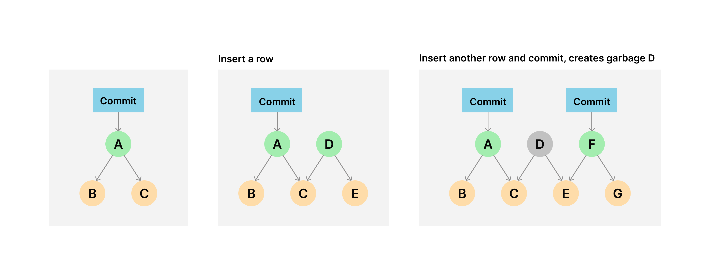
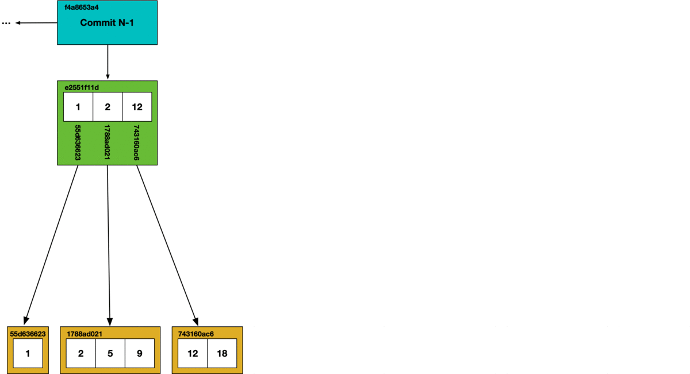
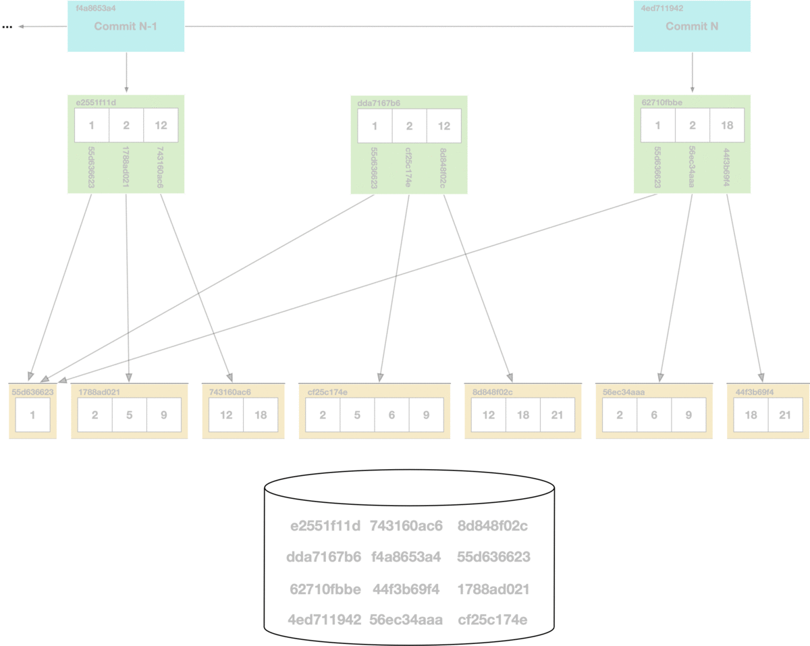

# When to run garbage collection on your SQL server

It is now safe to run garbage collection on your running SQL server. To prevent concurrent
writes potentially referencing garbage collected chunks, running
[`dolt_gc`](../version-control/dolt-sql-procedures.md#dolt_gc) will break all open
connections to the running server.

[Shallow GC](#shallow-gc) happens automatically for certain operations, so it's possible
it won't affect the size of your database that much when you run it.

Online GC isn't safe yet on a cluster replica, but it will fail.

# Offline GC vs Online GC

We originally implemented garbage collection for the offline use case. We didn't need to
worry about concurrent writes to the database. When we implemented online GC we needed a
way to make sure concurrent writes didn't reference garbage collected chunks. To make sure
online GC runs safely, it currently breaks all open connections to a running server.

## How garbage is created

Writes to Dolt can result in multiple chunks of the [prolly
tree](https://www.dolthub.com/blog/2020-04-01-how-dolt-stores-table-data) being rewritten,
which [writes a large portion of the
tree](https://www.dolthub.com/blog/2020-05-13-dolt-commit-graph-and-structural-sharing/#cant_share).
When you perform write operations without committing or delete a branch containing novel
chunks garbage is created.



## Offline GC

Originally, running `dolt gc` took every branch and its working set and iterated through
each referenced chunk. All referenced chunks were copied to a new table file, the old
table files were deleted, and replaced with the new table file. This could be very
expensive for large databases.

We implemented [generational garbage
collection](https://www.dolthub.com/blog/2021-08-13-generational-gc) to improve this,
which instead splits storage into two categories: old generation (oldgen) and new
generation (newgen). All chunks start in newgen. When garbage collection is run, we
iterate through every branch and the chunks they reference, ignoring referenced chunks and
its children if found in oldgen. All chunks found that are not in oldgen are written to a
file, which is added to oldgen.

Once that process is done, we walk the chunks referenced by the working set, again
ignoring chunks and its children if found in oldgen. Chunks that are only in newgen are
written to a file, which becomes the source of newgen chunks. All other newgen files are
deleted.

New edits result in new chunks being added to newgen. Running `dolt gc` again will be very
fast since it operates on a smaller set of data as most chunks are already in oldgen and
will be ignored.

For more detailed information about how garbage collection works in Dolt check out these
articles:

- [How Dolt Stores Table Data](https://www.dolthub.com/blog/2020-04-01-how-dolt-stores-table-data)
- [Garbage Collection in Dolt](https://www.dolthub.com/blog/2020-10-16-garbage-collection-in-dolt)
- [Generational Garbage Collection](https://www.dolthub.com/blog/2021-08-13-generational-gc)

## Online GC

Online garbage collection is a way to garbage collect table files while a `dolt
sql-server` is running. Using the offline implementation of garbage collection on a
running sql server couldn't work due to concurrent writes potentially referencing garbage
collected chunks. We needed to make some changes to Dolt to ensure online garbage
collection leaves the database in a useable state.

# Automated GC

We eventually want to support automated garbage collection during events that generate a
lot of garbage, such as file imports. It will need to be interruptable.

# How online garbage collection works

## Shallow GC

Shallow garbage collection is a less complete but faster garbage collection that prunes
unreferenced table files. Each `Commit` call creates a new table file. Once the maximum
number of table files is exceeded, we conjoin them, which can leave behind some table file
garbage.

During shallow garbage collection we iterate through all table files and remove any that
aren't referenced in the manifest.

The two issues we needed to solve for shallow GC in an online context were:

1. Preventing newly created table files from being garbage collected accidentally, and
2. Gracefully failing if a table file doesn't exist before writing the new contents to the
   manifest.

We solved #1 by skipping any table file in the pruning process that has been updated more
recently than the manifest. The second was solved by adding a check that all tables exist
in the chunk source before updating the manifest.

Online shallow GC is available using the [stored procedure for
GC](../version-control/dolt-sql-procedures.md#dolt_gc):

```sql
CALL DOLT_GC('--shallow');
```

## Full GC

### Background

The main challenge to implementing full online GC was how to handle concurrent writes
while garbage collection was running. In order to implement Git-like functionality in a
SQL database, Dolt stores table data in a Merkle DAG, which looks like this:


Each table value includes the schema for the table and the table data, encoded in a
Prolly-tree. Prolly-trees allow efficient structural sharing of table data across various
versions of the data. Performing write operations is equivalent to writing new Prolly-trees. As
new trees are constructed, they will write only the new chunks that are needed and
structurally share where possible.



During garbage collection, we use a [mark and
sweep](https://en.wikipedia.org/wiki/Tracing_garbage_collection) algorithm. Each chunk
that is reached in the commit graph has its hash marked as safe, all other chunks are
deleted from the store.



Unlike the CLI, using Dolt as a server allows multiple concurrent clients. If online
garbage collection runs concurrently with SQL writes, we can get dangling references. In
the garbage collection process illustrated above, if a write occurs that creates a new
Prolly-tree referencing a hash that's been removed during garbage collection, it will
create a dangling reference. Dangling references can corrupt the state of the database, so
in order to support online garbage collection we had to figure out a way to prevent
concurrent writes from creating dangling references.

### Implementation

Our original approach for online GC was to block all writes while garbage collection was
active and add a sanity check to all `Put` chunk calls for any dangling references.

Once we worked through a few issues that surfaced while implementing these sanity checks,
we realized the sanity checks during `Put` caused significant performance regressions to
writes. We were able to fix these regressions by speeding up the address walks during the
sanity checks and by moving the sanity checks to commit time instead of `Put`.

The current version of online GC (which break all open connections to the running server)
is available using the [stored procedure for
GC](../version-control/dolt-sql-procedures.md#dolt_gc):

```sql
CALL DOLT_GC();
```
