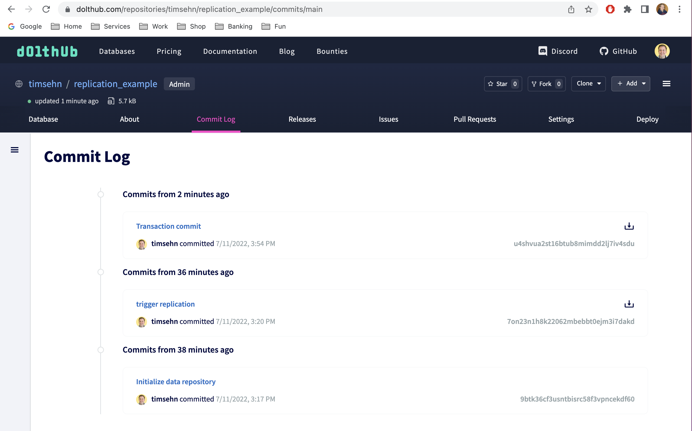

# Replication

Dolt supports [replication](../../../concepts/dolt/rdbms/replication.md). Dolt uses a remote as a middleman to facilitate replication between the master and read replicas. Dolt replication triggers on a [Dolt commit](../../../concepts/dolt/git/commits.md).


Note, read replication is only available in [Dolt SQL Server](../../../concepts/dolt/rdbms/server.md) context. You cannot trigger replication with a CLI `dolt commit`. If you would like to trigger replication from the command line, use `dolt sql -q "call dolt_commit()"`.

Dolt relies on [system variables](../../../concepts/dolt/sql/system-variables.md) to configure replication. The following system variables effect replication:

1. [`@@dolt_replicate_to_remote`](../version-control/dolt-sysvars.md#doltreplicatetoremote) - Used to set up a master.
2. [`sqlserver.global.dolt_skip_replication_errors`](../version-control/dolt-sysvars.md#doltskipreplicationerrors) - Makes replication errors warnings not errors.
3. [`@@dolt_transaction_commit`](../../../reference/sql/version-control/dolt-sysvars.md#dolt_transaction_commit) - Make every transaction `COMMIT` a Dolt commit to force all writes to replicate.
4. [`@@dolt_async_replication`](../version-control/dolt-sysvars.md#doltasyncreplication) - Make replication asynchronous.
5. [`@@dolt_read_replica_remote`](../version-control/dolt-sysvars.md#doltreadreplicaremote) - Used to set up a remote.
6. [`@@dolt_replicate_heads`](../version-control/dolt-sysvars.md#doltreplicateheads) - Used to configure specific branches (ie. HEADs) to replicate.
7. [`@@dolt_replicate_all_heads`](../version-control/dolt-sysvars.md#doltreplicateallheads) - Replicate all branches (ie. HEADs).

## Configuring a Master

 To set up a master, you use the [`@@dolt_replicate_to_remote` system variable](../version-control/dolt-sysvars.md#doltreplicatetoremote). You set that variable to the name of the remote you would like to use for replication.

In this example I am going to use a DoltHub remote to facilitate replication.

You can set up replication in your Dolt configuration. This configuration is read every time you start a SQL server or run `dolt sql`.

```bash
$ dolt remote add origin timsehn/replication_example
$ dolt config --add --local sqlserver.global.dolt_replicate_to_remote origin
```

The next time you create a Dolt commit in a running SQL server or with a `dolt sql` command, Dolt will attempt to push the changes to the remote.

```bash
$ dolt sql -q "create table test (pk int, c1 int, primary key(pk))"
$ dolt sql -q "insert into test values (0,0)"
Query OK, 1 row affected
$ dolt sql -q "call dolt_commit('-am', 'trigger replication')"
+----------------------------------+
| hash                             |
+----------------------------------+
| 7on23n1h8k22062mbebbt0ejm3i7dakd |
+----------------------------------+
```

And we can see the changes are pushed to the remote.


### Stopping Replication

To stop replication unset the configuration variable.

```
dolt config --unset --local sqlserver.global.dolt_replicate_to_remote
Config successfully updated.
```

Note, if you have a running SQL server you must restart it so it can pick up the new configuration.

### Making every Transaction Commit a Dolt Commit

Often, a master would like to replicate all transaction `COMMIT`s, not just Dolt commits. You can make every transaction `COMMIT` a Dolt commit by setting the [system variable](./system-variables.md), [`@@dolt_transaction_commit`](../../../reference/sql/version-control/dolt-sysvars.md#dolt_transaction_commit). With this setting, you lose the ability to enter commit messages.

```bash
$ dolt config --add --local sqlserver.global.dolt_transaction_commit 1
$ dolt sql -q "insert into test values (1,1)"
Query OK, 1 row affected
 $ dolt log -n 1
commit u4shvua2st16btub8mimdd2lj7iv4sdu (HEAD -> main) 
Author: Tim Sehn <tim@dolthub.com>
Date:  Mon Jul 11 15:54:22 -0700 2022

        Transaction commit
```

And now on the remote.



### Warn instead of fail on Replication Errors

Set the [`sqlserver.global.dolt_skip_replication_errors` system variable](../version-control/dolt-sysvars.md#doltskipreplicationerrors) to print warnings rather than error if replication is misconfigured.

Without this set, if we have a replication error, it fails the action.

```bash
$ dolt config --add --local sqlserver.global.dolt_replicate_to_remote broken
$ dolt sql -q "call dolt_commit('-m', 'empty commit', '--allow-empty')"
failure loading hook; remote not found: 'broken'
replication_example $ dolt log -n 1
commit u4shvua2st16btub8mimdd2lj7iv4sdu (HEAD -> main) 
Author: Tim Sehn <tim@dolthub.com>
Date:  Mon Jul 11 15:54:22 -0700 2022

        Transaction commit

```

But if we set the `@@dolt_skip_replication_errors` variable, we get a warning instead.

```bash
$ dolt config --add --local sqlserver.global.dolt_skip_replication_errors 1
Config successfully updated.
$ dolt sql -q "call dolt_commit('-m', 'empty commit', '--allow-empty')"
failure loading hook; remote not found: 'broken'
+----------------------------------+
| hash                             |
+----------------------------------+
| jco517ifl1em82f5at2eo75el28dgglt |
+----------------------------------+
$ dolt log --n 1
commit jco517ifl1em82f5at2eo75el28dgglt (HEAD -> main) 
Author: Tim Sehn <tim@dolthub.com>
Date:  Mon Jul 11 16:02:01 -0700 2022

        empty commit

```

### Asynchronous replication

By default, replication is synchronous. The push must complete before the commit procedure returns. You can enable asynchronous replication using the [`@@dolt_async_replication` system variable](../version-control/dolt-sysvars.md#doltasyncreplication). This setting will increase the speed of Dolt commits at the expense of consistency with replicas.

```bash
$ dolt config --add --local sqlserver.global.dolt_async_replication 1
Config successfully updated.
```

## Configuring a Replica

To start a replica, you first need a clone. I'm going to call my clone `read_replica`. 

```bash
$ dolt clone timsehn/replication_example read_replica
cloning https://doltremoteapi.dolthub.com/timsehn/replication_example
28 of 28 chunks complete. 0 chunks being downloaded currently.
dolt $ cd read_replica/
```

Now, I'm going to configure my read replica to "pull on read" from origin. To do that I use the [`@@dolt_read_replica_remote system variable`](../version-control/dolt-sysvars.md#doltreadreplicaremote). I also must configure which branches (ie. HEADs) I would like to replicate using either [`@@dolt_replicate_heads`](../version-control/dolt-sysvars.md#doltreplicateheads) to pick specific branches or [`@@dolt_replicate_all_heads`](../version-control/dolt-sysvars.md#doltreplicateallheads) to replicate all branches.

```bash
$ dolt config --add --local sqlserver.global.dolt_read_replica_remote origin
Config successfully updated.
$ dolt config --add --local sqlserver.global.dolt_replicate_heads main
Config successfully updated.
$ dolt sql -q "select * from test"
+----+----+
| pk | c1 |
+----+----+
| 0  | 0  |
| 1  | 1  |
+----+----+
```

Now on the master.

```
$ dolt sql -q "insert into test values (2,2); call dolt_commit('-am', 'Inserted (2,2)');"
Query OK, 1 row affected
+----------------------------------+
| hash                             |
+----------------------------------+
| i97i9f1a3vrvd09pphiq0bbdeuf8riid |
+----------------------------------+
```

And back to the replica.

```bash
$ dolt sql -q "select * from test"
+----+----+
| pk | c1 |
+----+----+
| 0  | 0  |
| 1  | 1  |
| 2  | 2  |
+----+----+
$ dolt log -n 1
commit i97i9f1a3vrvd09pphiq0bbdeuf8riid (HEAD -> main, origin/main) 
Author: Tim Sehn <tim@dolthub.com>
Date:  Mon Jul 11 16:48:37 -0700 2022

        Inserted (2,2)

```

### Replicate all branches

Only one of  [`@@dolt_replicate_heads`](../version-control/dolt-sysvars.md#doltreplicateheads)  or [`@@dolt_replicate_all_heads`](../version-control/dolt-sysvars.md#doltreplicateallheads) can be set at a time. So I unset `@@dolt_replicate_heads` and set `@@dolt_replicate_all_heads`.

```bash
read_replica $ dolt config --unset --local sqlserver.global.dolt_replicate_heads
Config successfully updated.
read_replica $ dolt config --add --local sqlserver.global.dolt_replicate_all_heads 1
Config successfully updated.
```

Now I'm going to make a new branch on the master and insert a new value on it.

```bash
$ dolt sql -q "call dolt_checkout('-b', 'branch1'); insert into test values (3,3); call dolt_commit('-am', 'Inserted (3,3)');"
+--------+
| status |
+--------+
| 0      |
+--------+
Query OK, 1 row affected
+----------------------------------+
| hash                             |
+----------------------------------+
| 4nrcqks869nrg4jofvuk72iui6hbk1bs |
+----------------------------------+
```

The read replica now has the change when I try and read it.

(Found buggy behavior with dolt_checkout on replica)

```bash
read_replica $ dolt sql -q "call dolt_checkout('branch1'); select * from test;"
+--------+
| status |
+--------+
| 0      |
+--------+
error on line 1 for query  select * from test: replication failed: working set not found
replication failed: working set not found
read_replica $ dolt branch
  branch1                                       	
* main                                          	
read_replica $ dolt checkout branch1
Switched to branch 'branch1'
read_replica $ dolt sql -q "select * from test;"
+----+----+
| pk | c1 |
+----+----+
| 0  | 0  |
| 1  | 1  |
| 2  | 2  |
| 3  | 3  |
+----+----+
```

### Auto-fetching

(Need to test this)

Dolt supports auto-fetching branches on demand for read replication in
certain circumstances:

1. Clients that connect to a missing branch:

`mysql://127.0.0.1:3306/mydb/feature-branch`

2. `USE`ing a missing branch:

```SQL
USE `mydb/feature-branch`
```

In either case, a read replica will pull the indicated branch from the remote middleman. If the branch is not on the replica, a new remote tracking branch, head branch, and working set will be created.

## Failover

If the master database processing writes fails, queries will either need to be routed to a replica, or queue/fail until the master restarts. We do not have a purpose-built solution or documentation for failover recovery yet.

In the meantime, it is possible to use push/pull replication to maintain a standby server. If the primary server fails, the standby and proxy would need to walk through a series of steps to create a new primary:

1. Standby server disables read-only mode if it was used as a read replica previously.
2. Standby server recovers the most recent transactions, either from the remote middleman or a primary backup.
3. Standby sets the replication source configuration to push on write.
4. Proxy layer directs write queries to the formerly standby, now primary server.

## Multi-Master

We do not have specific solutions or documentation to run Dolt as an OLTP database with multiple masters. It is possible to connect several write targets with a common remote middleman, but they would need to reconcile merge conflicts in the same way an offline Dolt database does. Providing a transactional layer to enforce multi-master (to avoid merge conflicts) or a way to automatically resolve merge conflicts is necessary to run Dolt as a multi-master database effectively.