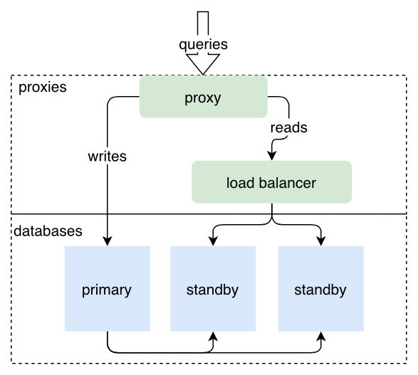

# Replication

Dolt supports three forms of [replication](../../../../concepts/dolt/rdbms/replication.md).

In [Remote-Based Replication](remote-based-replication.md), Dolt uses a remote as a middleman to facilitate replication between the
primary and read replicas. In this mode, Dolt replication triggers on a [Dolt
commit](../../../../concepts/dolt/git/commits.md).

This is the simplest form of replication to configure and administer. Use this form of replication
when you do **not** need the hot-standby support of Direct-to-Standby Replication and you do **not**
need to replicate from a MySQL primary using MySQL's binlog protocol. See 
[Choosing a Replication Mode](choosing-replication-mode.md) for more 
details on the differences between Remote-Based Replication and Hot Standby Replication.

In [Direct-to-Standby Replication (Hot Standby Replication)](direct-to-standby-replication.md), the primary dolt sql-server instance replicates all writes to a
set of configured standby servers. In this mode, there is no intermediate
[remote](../../../../concepts/dolt/git/remotes.md) and **all** SQL transaction commits
are replicated, compared to Remote-Based Replication where only Dolt commits are replicated.

Use this form of replication when you have high-availability requirements, need a hot standby
server ready to swap in for the primary, and you do **not** need to replicate from a MySQL primary
using MySQL's binlog protocol. See [Choosing a Replication Mode](choosing-replication-mode.md) for more 
details on the differences between Remote-Based Replication and Hot Standby Replication. 

In [MySQL binlog replication](binlog-replication.md) the dolt sql-server instance receives
binlog events from a MySQL primary and applies them, while periodically making dolt commits to create a
versioned history. In this mode, you can hook up a Dolt sql-server to existing data in a MySQL or
MariaDB database and track changes to your data in the Dolt sql-server without
having to commit to migrating your entire database to Dolt. Note that binlog replication is one way,
so any changes made on the dolt sql-server will not replicate back to the primary.

TODO: binlog image

Use this form of replication when you have an existing MySQL or MariaDB database and you want an
easy way to get your data replicated to a Dolt database where you can use Dolt's time travel, diff,
merge, and audit capabilities.


### Note
Replication is only available in the [Dolt SQL
Server](../../../../concepts/dolt/rdbms/server.md) context. You cannot
trigger replication with a CLI `dolt commit`, `dolt merge`, or other
command line invocations. If you would like to trigger replication
from the command line, use `dolt sql` and the SQL equivalent of the
CLI command you want, e.g. `dolt sql -q "call dolt_commit(...)"`. This
gap will be addressed in future releases of the tool.


