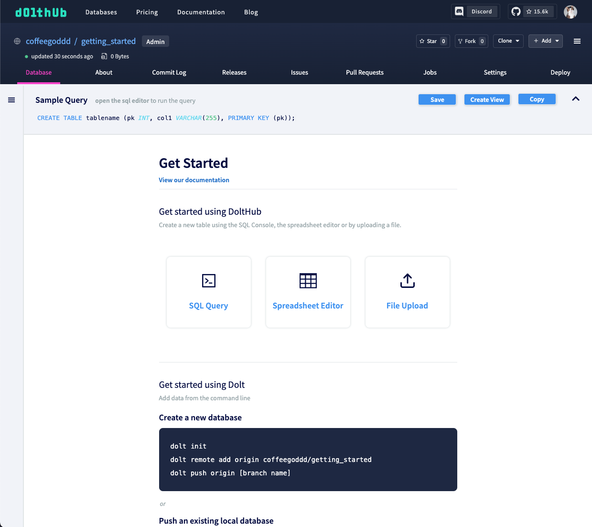
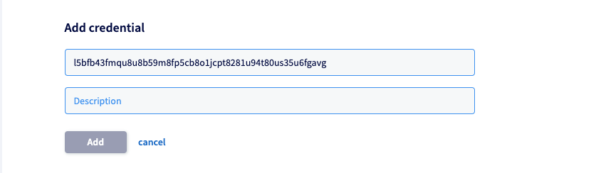
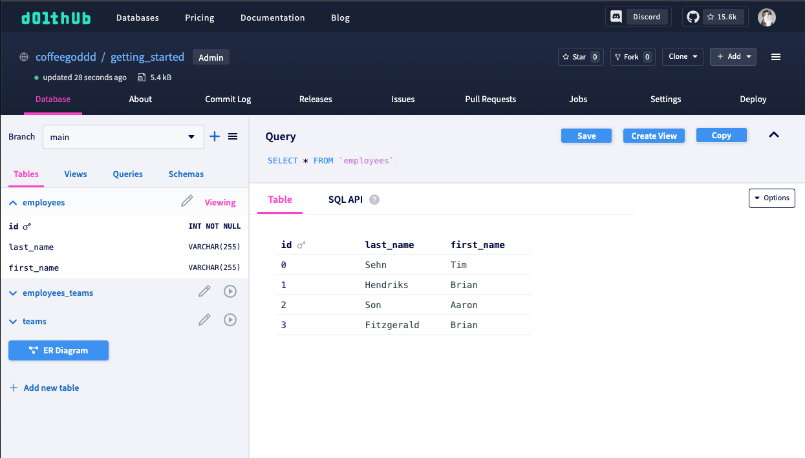
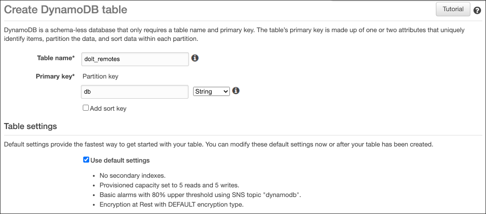

# What are Remotes?

Just like Git, Dolt supports syncing with a [remote database](../../../concepts/dolt/git/remotes.md). A remote is a copy of your database that is distinct from your local copy. It usually is stored on a separate host or service for fault tolerance. The primary use cases are disaster recovery and collaboration. More conceptual description of remotes can be found [here](../../../concepts/dolt/git/remotes.md).

# Configuring Remotes

Remotes are configured using the [`remote` command](../../cli.md#dolt-remote). You configure a remote with a name and a URL. When you want to use the remote, you refer to it by name. When you clone a remote, a remote named `origin` is automatically configured for you.

<h1 id="pushing-to-remote">Pushing to a remote</h1>

Let's go through an example of how you can push data from a local Dolt database to a remote. In this example, we'll use the running Dolt server we created in the [Getting Started](https://docs.dolthub.com/introduction/getting-started/database) section to push a branch to [DoltHub.com](https://www.dolthub.com).

To do this, we'll need to authenticate our Dolt server against the remote so that it can perform writes.

First, we'll need to create an account or [sign-in](https://www.dolthub.com/signin) if we already one.

Next, we're going to create a database on DoltHub.com that will serve as the remote for our local Dolt server.



Next, we can run the command [dolt login](https://docs.dolthub.com/cli-reference/cli#dolt-login) from our local Dolt CLI client. This command will help us authenticate our local client to DoltHub.com, associating our client with our DoltHub identity.

```
dolt login
Credentials created successfully.
pub key: l5bfb43fmqu8u8b59m8fp5cb8o1jcpt8281u94t80us35u6fgavg
/Users/dustin/.dolt/creds/6h68h8brsfu9580rqupi3h9icfhtd5s28ikoguejqqesq.jwk
Opening a browser to:
	https://dolthub.com/settings/credentials#l5bfb43fmqu8u8b59m8fp5cb8o1jcpt8281u94t80us35u6fgavg
Please associate your key with your account.
Checking remote server looking for key association.
Retrying in 2
```

This command opens a web browser to DoltHub's credentials page where it will populate the Public Key field with a newly generated public key. In this example that public key is `pub key: l5bfb43fmqu8u8b59m8fp5cb8o1jcpt8281u94t80us35u6fgavg`.

On the credentials page, we just need to provide a description for our new key and click "Add". 



Our local Dolt client (and running Dolt server) are now successfully authenticated to push to DoltHub databases where we have write access. The final output of `dolt login` will read:

```
Key successfully associated with user: coffeegoddd email dustin@dolthub.com
```

The reason both our local Dolt client _and_ running Dolt server are now authenticated for DoltHub.com is because they both reference the same local directory Dolt uses to manage its global state. This directory can be set by defining `DOLT_ROOT_PATH`, but by default, will be created at `$HOME/.dolt`. This directory houses global (client and server) configuration as well as all remote credentials, which are located in `$HOME/.dolt/creds`.

It's important to be aware of this global state directory in the event you wanted to authenticate a Dolt server running from within a container. To do so, you should run `dolt login` using a Dolt CLI client outside of the containerized environment to create new remote credentials, then mount your local `$HOME/.dolt` directory to the `DOLT_ROOT_PATH` of the container. This ensures that the Dolt server in the container has the credentials to write to your remote.

Using a MySQL client connected to the running Dolt server, let's give pushing to DoltHub.com a try. We're going to push our `main` branch, so first we check it out:

```
mysql> call dolt_checkout('main');
+--------+---------------------------+
| status | message                   |
+--------+---------------------------+
|      0 | Switched to branch 'main' |
+--------+---------------------------+
1 row in set (0.02 sec)
```

Now, we need to add the remote address for the DoltHub database we created to the Dolt server:

```
mysql> call dolt_remote('add', 'origin', 'coffeegoddd/getting_started');
+--------+
| status |
+--------+
|      0 |
+--------+
1 row in set (0.03 sec)
```

And then we can push:

```
mysql> call dolt_push('origin', 'main');
+--------+
| status |
+--------+
|      0 |
+--------+
1 row in set (0.77 sec)
```

And the data from our local Dolt server is now available on DoltHub.com!



# Remote Actions

Sync functionality is supported via the [`clone`](../../cli.md#dolt-clone), [`fetch`](../../cli.md#dolt-fetch), [`push`](../../cli.md#dolt-push), and [`pull`](../../cli.md#dolt-pull).

# Remote Options

## DoltHub

[DoltHub](https://www.dolthub.com) is a remote operated by DoltHub Inc. Public repositories are free. Private repositories are free up to a Gigabyte. After a Gigabyte, private repositories are $50 a month and scale up in cost after 100GB. DoltHub adds a web GUI to your remotes along with Forks, Pull Requests, and Issues.

See the [Getting Started Guide for DoltHub](../../../introduction/getting-started/data-sharing.md) on how to get started with a DoltHub remote.

## DoltLab

[DoltLab](https://www.doltlab.com) is a version of [DoltHub](https://www.dolthub.com) you can deploy in your own network. It looks very similar to DoltHub. See the [DoltLab Guide](../../../guides/doltlab/installation.md) if you are interested in using DoltLab as a remote.

## Filesystem

Filesystem based remotes allow you to push/pull data from any location that can be accessed via the filesystem. This may be a directory on your local disk, or any other storage location that can be mounted to the filesystem. To add a filesystem based remote use a URL with the `file://` protocol.

**Linux / OSX Examples**

 * Adding a remote 
```
dolt remote add origin file:///Users/brian/datasets/menus  
```
 * Cloning
```
dolt clone file:///Users/brian/datasets/menus
```

**Windows Examples**

 * Adding a remote
```
dolt remote add origin file:///c:/Users/brian/datasets/menus
```
 * Cloning 
```
dolt clone file:///c:/Users/brian/datasets/menus
```

It's important to note that a directory-based remote is not the same as a workspace for a dolt clone, and the directory listed above as a remote file URL is not a dolt repository created or cloned with the [Dolt](https://doltdb.com) cli. Similarly, a [Dolt](https://doltdb.com) repository directory's file URL [cannot be used as a remote directly](https://github.com/dolthub/dolt/issues/1860).

## AWS

AWS remotes use a combination of DynamoDB and S3. The Dynamo table can be created with any name but must have a primary
key with the name "db".



This single DynamoDB table can be used for multiple unrelated remote repositories.  Once you have a DynamoDB table, and an S3 bucket setup you can add an AWS remote using a URL with the protocol `aws://`. To add a remote named "origin" to my "menus" repository using an S3 bucket named `dolt_remotes_s3_storage` and a DynamoDB table named `dolt_dynamo_table` you would run:

```
dolt remote add origin aws://[dolt_dynamo_table:dolt_remotes_s3_storage]/menus
```

This same URL can then be used to clone this database by another user.

```
dolt clone aws://[dolt_remotes:dolt_remotes_storage]/menus
```

In order to initialize your system to be able to connect to your AWS cloud resources see [Amazon's documentation](https://docs.aws.amazon.com/cli/latest/userguide/cli-configure-files.html) on configuring your credential file. [Dolt](https://doltdb.com) also provides additional parameters you may need to provide when adding an AWS remote such as `aws-creds-profile`, and `aws-region`.`aws-creds-profile` allows you to select a profile from your credential file. If it is not provided then the default profile is used. `aws-region` allows you to specify the region in which your DynamoDB table and S3 bucket are located. If not provided, it will use the default region from the current profile.

```
dolt remote add --aws-creds-profile prod-profile --aws-region us-west-2 origin aws://[dolt_dynamo_table:dolt_remotes_s3_storage]/menus
```

or 

```
dolt clone --aws-creds-profile prod-profile --aws-region us-west-2 origin aws://[dolt_dynamo_table:dolt_remotes_s3_storage]/menus
```

## GCS

Google Cloud Platform remotes use Google Cloud Storage (GCS). You can create or use an existing GCS bucket to host one or more [Dolt](https://doltdb.com) remotes. To add a GCP remote provide a URL with the `gs://` protocol like so:

```
dolt remote add origin gs://BUCKET/path/for/remote
```

In order to initialize [Dolt](https://doltdb.com) to use your GCP credentials you will need to install the `gcloud` command line tool and run `gcloud auth login`. See the [Google document](https://cloud.google.com/sdk/gcloud/reference/auth/login) for details.

## HTTP(s) Remotes

[Dolt](https://doltdb.com) supports remotes which use the protocol `http://` and `https://`. Remote servers must implement the GRPC methods defined by the [ChunkStoreService interface](https://github.com/dolthub/dolt/blob/master/proto/dolt/services/remotesapi/v1alpha1/chunkstore.proto#L23). This is the way by which [DoltHub](https://dolthub.com) itself provides remote functionality. When you add a [DoltHub](https://dolthub.com) remote via `dolt remote add origin owner/repository` or do a `dolt clone owner/repository` [Dolt](https://doltdb.com) is just providing shorthand notation for the URL. When you run `dolt remote -v` you can see that [Dolt](https://doltdb.com) adds an `https://` URL with the host `doltremoteapi.dolthub.com` as can be seen here:

```
$dolt remote add origin Dolthub/menus

$dolt remote -v
origin https://doltremoteapi.dolthub.com/Dolthub/menus
```

[Dolt](https://doltdb.com) provides a [sample remote server](https://github.com/dolthub/dolt/tree/master/go/utils/remotesrv) that we use for integration testing which could be deployed to serve your remotes as well, though you would want to extend the sample functionality to support things like auth. In our integration tests we install and run the remote server locally:

```
remotesrv --http-port 1234 --dir ./remote_storage
```

This starts a server listening on port 50051 for our grpc requests, and runs a file server on port 1234 which provides upload, and download functionality similar to S3 / GCS locally.  We use the url `http://localhost:50051/test-org/test-repo` when adding a remote or cloning from this remote server.