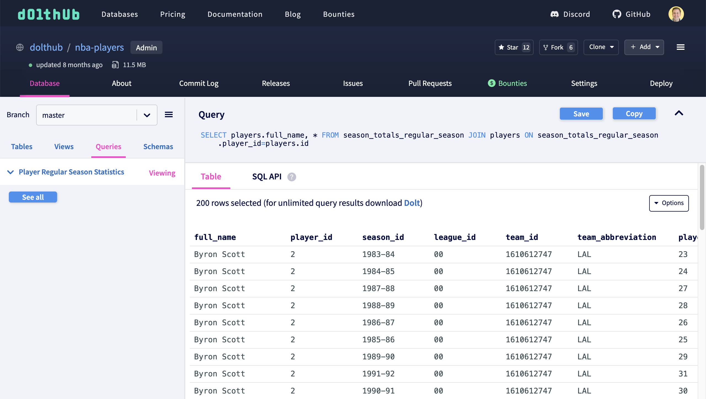

# Saved Queries

Dolt is a database designed for sharing. Dolt ships with a feature called "Saved Queries". Saved queries are queries that are created and versioned along with the database itself. You can use saved queries to make your Dolt database easier to use by adding examples of how the data in the database could be queried.

To create a saved query, you can use the Dolt CLI to save a SQL query for future use by yourself or others. You can also execute saved queries by name in using the command line.

```
us-businesses $ dolt sql --save "Example saved query" -q "show tables"
+----------------+
| Table          |
+----------------+
| business_types |
| businesses     |
| naics          |
| sic            |
+----------------+
us-businesses $ dolt sql -x "Example saved query"
Executing saved query 'Example saved query':
show tables
+----------------+
| Table          |
+----------------+
| business_types |
| businesses     |
| naics          |
| sic            |
+----------------+
```

This query is written to a special Dolt system table `dolt_query_catalog`. You can add, modify, or delete saved queries by changing that system table.

```
us-businesses $ dolt sql -q "select * from dolt_query_catalog"
+---------------------+---------------+---------------------+-------------+-------------+
| id                  | display_order | name                | query       | description |
+---------------------+---------------+---------------------+-------------+-------------+
| Example saved query | 1             | Example saved query | show tables |             |
+---------------------+---------------+---------------------+-------------+-------------+
us-businesses $ dolt sql -q "delete from dolt_query_catalog where id ='Example saved query'"
Query OK, 1 row affected
us-businesses $ dolt sql -q "select * from dolt_query_catalog"
+----+---------------+------+-------+-------------+
| id | display_order | name | query | description |
+----+---------------+------+-------+-------------+
+----+---------------+------+-------+-------------+
us-businesses $ dolt sql --save "Example saved query" -q "show tables" -m "You can even add a long description"
+----------------+
| Table          |
+----------------+
| business_types |
| businesses     |
| naics          |
| sic            |
+----------------+
us-businesses $ dolt sql -q "select * from dolt_query_catalog"
+---------------------+---------------+---------------------+-------------+-------------------------------------+
| id                  | display_order | name                | query       | description                         |
+---------------------+---------------+---------------------+-------------+-------------------------------------+
| Example saved query | 1             | Example saved query | show tables | You can even add a long description |
+---------------------+---------------+---------------------+-------------+-------------------------------------+
```

DoltHub displays these queries in the Queries tab of your database for easy use.


