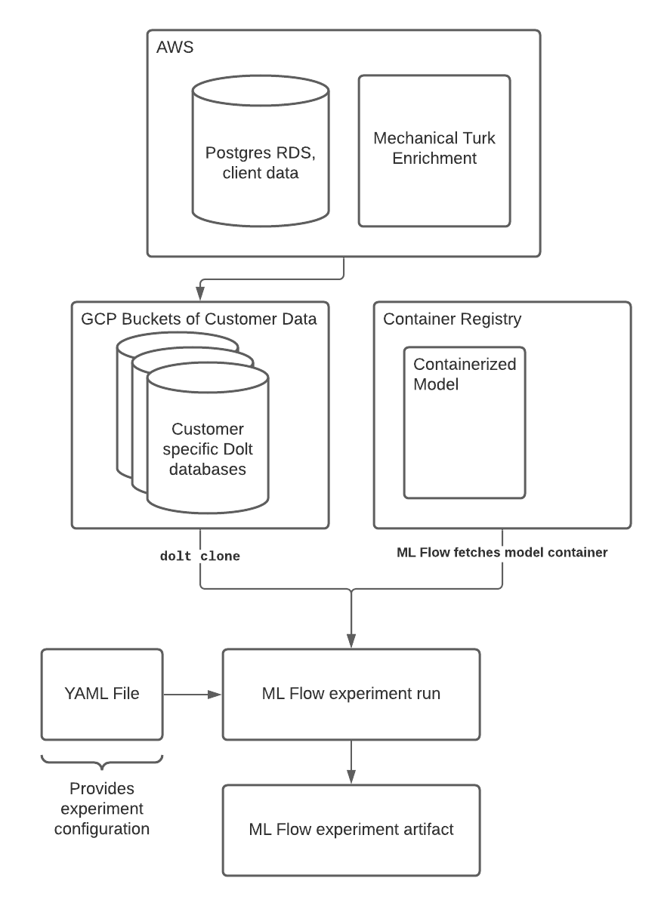

[Kalido](https://www.kalido.me/) creates tools, powered by proprietary AI, to match people based on skills to connections, teams, projects and jobs. Their goal is to create value for individuals and organizations by better matching individuals with opportunities. Much of the data is text, in the form of resumes, project descriptions, and anything else that would help match people with projects and teams.

## Kalido's Data Problem
In order to deliver relevant NLP models to clients, Kalido ingest client data for model training. The client data is stored in a Postgres RDS instance on AWS. This presented two challenges:
- *data versioning:* it was difficult to backtrack which version of data was being used to prepare new models as the Postgres data could be updated by the client
- *model reproducibility:* without robust data versioning of the data used at the time of training, there was no hope of reproducing the result of a given model

In order to solve for this the Kalido team started snapshotting versions of the data landing in Postgres in CSV files and storing them in Git LFS. While this technically solved for versioning and reproducibility, it proved operationally and technically unsatisfactory.

## Shortcomings of Git LFS
With Git LFS, each “table” was managed as a CSV in a GitHub repository, and cloned/pulled when needed. This setup had several major pain points:
- There were many situations where required CSVs were spread across multiple Git repositories, with no coherent mechanism for retrieving data from more than one repository.
- Given a Git repository containing several CSVs, the code often needed different CSVs at different commits, meaning that a various checkout operations had to be performed every time a CSV is read.
- Git LFS is slow for repositories with large numbers of files, even if those files are themselves relatively small.

These pain points motivated Kalido to look for a more suitable solution that delivered versioning and reproducibility to their model delivery pipeline.

## Dolt + Kalido
Around the beginning of April 2021, as a way to capture the benefits of Git-style versioning for the data they were ingesting, Kalido started experimenting with Dolt. Dolt features that immediately stood out were:
- storage layer commit graph with clear SHAs that exposed the ability to query the state of a table “as of” any commit in the commit graph
- ability to push to a remote repository, specifically since Kalido uses Google Cloud Platform (GCP) Dolt working with GCP buckets was a value add
- native support of structured data, which suits NLP use-cases

Kalido’s customer data comes from a Postgres RDS instance, and is enriched with data sent out to Amazon Mechanical Turk for manual labelling. This enriched third party data is stored in Dolt as the input to Kalido’s models:



Training configuration is a YAML file which among other things specifies the data and the ML model. The format for the data is `table_name@sha` and the in-house training software will then pull this data by just running `read_pandas(table_name, sha)` and potentially concatenate different tables listed. For example we might have something like this:

```yaml
train:
- client_data@SHA1
- labelled_data@SHA2
- random_stuff@SHA1
test:
- some_table@SHA1
```

As mentioned above, the model training code then can then execute simple statements to pull the required version of the data:
```python
input_data = read_pandas(table_name, sha)
```

This allows the Kalido team to architect their pipelines with the required reproducibility and lineage features needed without manipulate Git repositories and files.

## Conclusion
The technical lead on Kalido's model delivery pipeline summed things up succinclyl:
> Dolt is useful because it simplifies things a lot. We can have all the training data in one place, be able to read off at specific commits corresponding to specific points in time. We can also see diffs, allowing us to understand, and possibly automate, when we need to retrain a client’s model.

We are excited by Kalido's mission and use-case. We think Dolt can lead to better data management for teams operating complex model delivery pipelines, and Kalido's use of dolt highlights how.
