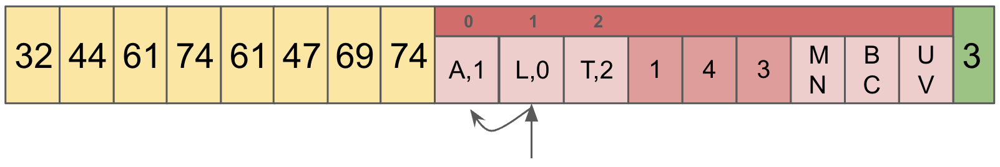

Storage of information is the bedrock of every Database in existence. The logical application concepts by which you store that information is where a lot of Database discussion occurs. In Dolt's case, [Prolly Trees](./prolly-tree.md) allow for some of its key properties like structural sharing and fast diffs. For many databases, Dolt included, the abstraction of how those data structures are written to disk is somewhat secondary. Dolt uses a custom content-addressed block store to store data on disk.

# Core Access Patterns

In our [Prolly Tree documentation](./prolly-tree.md), you'll find a lot of pictures that look like this.

It is important to remember that this is a representation of a structured object. The green entity is a list of addresses which point to other entities. All of these entities have addresses, such as `t1ms3n`, and the values are byte arrays. In Dolt, we call this byte array value a "Chunk". Every piece of information in a Dolt database is stored as Chunks.

This is such a fundamental truth, it's worth repeating in bold: __Every piece of information in a Dolt database is stored as Chunks.__

Chunks are [content addressed](https://en.wikipedia.org/wiki/Content-addressable_storage) byte buffers. Their address is the SHA512 checksum of the byte buffer truncated to 20 bytes. Content addressable systems have a few characteristics which make them interesting and useful:

1) Strict Hierarchy of Information. For chunks which refer to other chunks, it's impossible to create chunks out of order because you can't refer to a chunk without its address. It's impossible to have cycles in your data.
2) Chunk corruption can be detected. If you read a chunk from disk and its checksum doesn't match you know that something is wrong.
3) Idempotent Persistence. If something on the write path fails and you need to write it again, there is no risk of corruption given (1) and (2).

[Merkle Trees and DAGs](https://en.wikipedia.org/wiki/Merkle_tree) depend on content addressed storage, and Dolt embraces them fully.

Given that all Dolt data is stored as Chunks, we want to access these chunks by two primary operations:

1) __Contains__: We need a fast way to determine if a given storage file has the chunk in question. This comes up when we have multiple files and we don't actually know where the given chunk is. We need to be able to do this without accessing the disk excessively.
2) __Retrieve__: Get the data out.

Both of these patterns have batch equivalents.

By keeping this level of simplicity, the storage system doesn't need to know anything about the contents of the Chunks. The serialization and deserialization of application data is performed at a layer above the storage system.

## Noms Block Store

[Noms](https://github.com/attic-labs/noms) is foundational to Dolt's existence. The Noms team started out using a key value store system to store Chunks, but it proved to be suboptimal. So, they developed the [Noms Block Store (NBS)](https://github.com/attic-labs/noms/tree/master/go/nbs). The NBS file format lives on as the only way to store Dolt data currently.

NBS stores Chunks in files which have the following structure:

1) Footer: Fixed size end of the file which tells us primarily how many Chunks there are stored in the entire file.
2) Index: A deterministically sized (based on the footer) block of the file which contains all address information.
3) ChunkRecords: zero-addressed Chunk Data.

The index is where most of the complexity resides. The index is made up of three sections:

1) Prefix Map: This is the first 8 bytes of the Chunk addresses, coupled with an ordinal. The Prefixes are sorted so that we can do a binary search on the map to find a set of addresses which are in the file which have the given prefix. This binary search greatly reduces the search space needed to find the location the chunk requested. The ordinal is used to indicate the offset into Lengths and Suffixes.
2) Lengths: This tracks the length of the Chunk at each ordinal.
3) Address Suffixes: The address at that ordinal, minus the 8 bytes of the prefix which are redundant.

### Contains

The algorithm to determine if the storage file contains a given address:

1) Strip the first 8 bytes of the address, and call that the Prefix.
2) Perform a binary search on the Prefix map, once one is found search the vicinity for additional matches.
3) For the set of matched Prefixes, grab the Address Suffix at the associated Ordinal. This results in the suffix set.
4) For the set of suffixes, compare each to the last twelve bytes of the address your are looking for.
5) If one matches, the Chunk exists in the file.

Given that we are using SHA512 to calculate our addresses, we assume there is a decent distribution of addresses. Therefore, the time intensive portion of this algorithm is the binary search on the Prefix Map, which is `O(log2(N))`, where `N` is the number of chunks.

In the following example, there are 3 keys: `ABC`, `LMN`, and `TUV`. For each, the first character is considered the Prefix, and the second two are the Suffix.

Let's determine if the storage file contains `ABC`. First we need to read the footer, which tells us there are 3 chunks in this file. Using that, we calculate the offsets for the index from the end of the file. Using a seek operation, we load and parse this information for the duration of the process.

Now that we have the Prefix Map in memory, we pull the prefix, `A` off of our desired address `ABC`. The Prefix Map contains `A`,`L`,`T`, so doing a binary search we determine that the index `0` contains the prefix.

This example contains no collisions in the Prefix Map, but in the general case we find all matches, and gather the Ordinals. In this case, the Ordinal is `1`. The Ordinal in the index into the Lengths and Suffixes.

Now, we compare the Suffix found at that location with the Suffix we are looking for, `BC`, and since they match, we know that this file contains the `ABC` Chunk.

### Retrieve

To Retrieve the object requires additional steps. Using the Contains algorithm, we get the Ordinal of the Chunk found, then:

6) Sum all values in the Lengths array up to the Ordinal. This is the byte offset into ChunkRecords.
7) Perform a disk seek operation to the ChunkRecords portion of the file, and read the length of the chunk from that offset.
8) Snappy Decompress the byte array, and you are done!

Note that step (6) has a `O(N)` operation in it, but we calculate those values at the time we load the Index initially. Loading the Index is a `O(N)` operation, but we only do it once.

To continue our example, to retrieve the value for `ABC`, using the Ordinal `1` from before, we find the sum of all lengths before the Ordinal in question. In our example, we don't have many things to sum up since our Ordinal is `1`. I should have thought of that before I made these pretty pictures!

The goal of this step is to get the offset and length of the Chunk. By summing all of the lengths of Chunks which become before the one we care about, we get the offset. Then the length is simply the value in the Ordinal position. In our case, offset is 1, and length is 4.

The value for Chunk `ABC` is `44 61 74 61`! Well, technically we'd need to decompress that, but let's leave that for another time. Looking up `LMN` and `TUV` is an exercise left to the reader.

To recap, here is a gif!

The critical piece here is that the Index does most of the heavy lifting. It's loaded into memory at server start up, and as a result we confine all of our lookup code to that memory. It's only after we've determined the full offset of the Chunk that we venture into that yellow block, which requires a disk read.