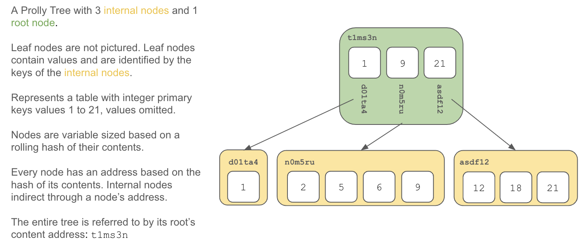

"Prolly Tree" is short for ["Probabilistic B-tree"](https://github.com/attic-labs/noms/blob/master/doc/intro.md#prolly-trees-probabilistic-b-trees). "Prolly Tree" was coined by the good folks who built [Noms](https://github.com/attic-labs/noms), who as far as we can tell invented the data structure. We here at [DoltHub](https://www.dolthub.com) have immense respect for their pioneering work, without which [Dolt](https://www.doltdb.com) would not exist.

A Prolly Tree is a data structure closely related to a [B-tree](https://en.wikipedia.org/wiki/B-tree). Prolly Trees are generally useful but have proven particularly effective as the basis of [the storage engine](https://docs.dolthub.com/architecture/storage-engine) for [version controlled databases](https://www.dolthub.com/blog/2022-08-04-database-versioning/).

# Motivation

Let's say you need a data structure with the following properties:

1. **B-tree like performance** - Specifically on reads and writes. 
2. **Fast Diffs** - The ability to compare two versions efficiently. 
3. **Structural Sharing** - Any given portion of the data shared between versions is only stored once.

A Prolly Tree delivers these properties.

Operation | B-Trees | Prolly Trees
--------- | ------- | ------------
1 Random Read | logk(n) | logk(n)
1 Random Write | logk(n) | (1+k/w)*logk(n)
Ordered scan of one item with size z | z/k | z/k
Calculate diff of size d | n | d
Structural sharing | ❌ | ✅

**n**: total leaf data in tree, **k**: average block size, **w**: window width

As you can see a Prolly Tree approximates B-tree performance on reads and writes while also offering the ability to compute differences in time proportional to the size of differences rather than the total size of the data. Prolly Trees can also structurally share portions of the tree between versions due to the content-addressed nature of their intermediary storage.

Let's dive a bit deeper and show you how.

# How Prolly Trees work

Prolly Trees are a variant of B-trees so let's first review some key B-tree concepts and then dive into how Prolly Trees work in light of those concepts.

## B-tree Review

A B-tree is data structure that maps keys to values. A B-tree stores key-value pairs in leaf nodes in sorted order. Internal nodes of a B-tree store pointers to children nodes and key delimiters; everything reachable from a pointer to a child node falls within a range of key values corresponding to the key delimiters before and after that pointer within the internal node.

A B-tree is optimized for a tradeoff between write and read performance. It's more expensive to maintain than dropping tuples into a heap without any ordering constraints, but when data is stored in a B-tree it's much quicker to seek to a given key and to do an in-order traversal of the keys with their values.

However, finding the differences between two B-trees requires scanning both trees and comparing all values, an operation that scales with the size of the tree. This operation is slow for large trees.

Also, writes to B-trees are not history independent, the order of the writes internally changes the structure of the tree. Thus, storage cannot be easily shared between two versions of the same tree.

## Building a Prolly Tree

The easiest way to understand Prolly trees is to walk through, step-by-step, how we build one. You start with a map of keys to values. Using the above B-tree example, we have keys between 1 and 21. The values don't really matter. Just imagine them dangling off the keys.

1. **Sort**: Sort the map by its key value, so that it is laid out in order. 

2. **Determine Chunk Boundaries**: Use a seed, the size of the current chunk, the key value and a strong hash function to calculate whether this current entry represents a new chunk boundary. Any time the hash value is below a target value, form a chunk boundary and start a new block. Here's the chunking step on our leaf nodes:

3. **Hash each Chunk**: You now have the leaf nodes of the Prolly Tree. Compute the content address of each block by applying a strong hash function to its contents. You store the contents in a content addressed block store. Here our blocks have been addressed and stored in the block store:

4. **Finished?**: If the length of your list of content addresses is 1, then you are done. This is the content address of your tree.

5. **Build a New Map** Otherwise, form the next layer of your Prolly Tree by creating a map of the highest key value in the chunk and the content address of the chunk. Here's what the entries for the first internal level of the tree would look like for our example:

6. **Return to Step 2**: Use this new map step 2. The algorithm terminates when step 4's condition is reached.

Following these steps results in the following Prolly Tree. 

## Modifying a Prolly Tree

The magic of Prolly Trees is not seen on construction, but on modification. As you'll see, modifying a Prolly Tree changes the minimal amount of content addresses. Minimal modification means more structural sharing of contents because fewer content addresses change. It is also the basis of fast diff which is accomplished by comparing content addresses.

### Update a Value

If we update a value, we walk the tree by key to the leaf node holding the value. We then create the new leaf chunk by directly modifying the existing value in a copy of the existing chunk (ie. [copy on write](https://en.wikipedia.org/wiki/Copy-on-write)). After the edit, we recalculate the content address of the chunk. We then walk up the tree recalculating each internal content address up to the root of the tree. 

Note, this is only true for fixed-size value updates. If you change the length of a value, then we do have to re-chunk. Changes to NULL values or strings are not fixed length updates.

### Insert Keys

We can insert keys at the beginning, middle, or end of the key space. It's helpful to visualize each type of insert.

When we insert a key, we walk the tree by key to the leaf node where the key belongs. We then edit the chunk, calculate whether to split the chunk or not, and then recalculate the content address. Note, a key insert or a delete has a small probability of changing an existing chunk boundary. If the computed hash values for the keys, combined with the size of chunk at those keys, happens to choose a different chunk boundary, the chunk will be split at the new boundary. Finally, we walk up the tree recalculating each content address up to the root of the tree.

In Dolt's Prolly Tree implementation, chunks are set to be on average 4 kilobytes. This means that you can imagine a probability of 1/4096 or 0.02% of triggering a chunk boundary shift when changing a single byte. In practice, it's quite a bit more complicated. As we'll discuss later, the size of the chunk is considered when computing a chunk boundary split. So, the larger the chunk, the greater the probability the chunk will be split on the addition of a new key. Conversely, for small chunks, the probability of a chunk split is very small. This means that every edit to a table in Dolt is a minimum of 4Kb multiplied by the depth of the tree with some small probability of writing multiple chunks.

#### At the Beginning

When you insert a key at the beginning of the key space, the tree is modified along the left edge.

#### At the end

When you insert a key at the end of the key space, the tree is modified along the right edge.

#### In the middle

When you insert a key in the middle of the key space, the tree is modified along a spline.

### Delete a key

When you delete a key, the tree is modified under the same rules as an insert.

# Properties

## History Independence

A key property of a Prolly tree that enables fast diff and structural sharing is history independence. No matter which order you insert, update, or delete values, the Prolly tree is the same. This is best seen through example.

Consider a map with 4 integer keys, `(1, 2, 3, 4)` pointing at the same values. Before hand we know the combination of keys `(1, 2)` will trigger a chunk boundary. We can know this beforehand because chunk boundaries are based on the size of the chunk and its contents. No matter which order we insert, update, or delete, if we will end up with a tree with two leaf nodes `(1, 2)`, and `(3,4)`. This also happens to be true if the values at these keys are different. The tree will be the same but the the chunks will have different addresses.

Let's say we insert the chunks in sequential order.

Then, let's say we insert the keys in reverse order.

As you can see, we end up with the same Prolly Tree no matter which order we insert the values. It's a fun exercise to try and come up with a sequence of inserts, updates, and deletes that result in a different tree that contains the same values. It's fun because you can't. The Prolly Tree algorithm always spits out the same tree.

## Fast Diff

Given history independence, the Prolly Tree difference calculation becomes quite simple. If the hash of the root chunk is the same the entire subtree is the same. Thus, one must just walk the tree down to the leaves, ignoring hashes that are equal. Hashes that are different represent the difference.

Let's see how this algorithm works in practice. Recall the Prolly Tree where I updated the value in key 9. Let's compare it to our originally built Prolly Tree.

Start by comparing the root hashes. They are necessarily different.

Then walk both chunks identifying the subtree hashes that are different. In this case, a single hash is different.

Follow the pointer to the next layer and compare those chunks, finding the hashes that are different. If you are in a leaf node, produce the values that are different.

As you can see this algorithm scales with the size of the differences, not the size of the tree. This makes finding small differences in even large tress very fast.

## Structural Sharing

Recall that Prolly trees are stored in a content addressed block store where the content address forms the lookup key for the block. 

Thus, any blocks that share the same content address are only stored in the block store once. When they need to be retrieved they are retrieved via content address. This means that any blocks shared across versions will only be in the block store once.

As noted earlier, in Dolt's Prolly Tree implementation, the block size is set to be on average 4 kilobytes. Thus, a single change will cause a change in the block store of 4 kilobytes times the size of the tree on average.

# The Nitty Gritty Details

Now that you have the general details, let's dive into some details highlighting some of the things we learned iterating on the Noms implementation of Prolly Trees and finally landing on Dolt's stable Prolly Tree implementation.

## Controlling Chunk Size

The original Noms implementation of Prolly Trees was susceptible to a chunk size problem. You would end up with many small chunks and a few large ones. The chunk size was a geometric distribution with an average size of 4 kilobytes.

This is the pattern one would expect from repeated rolls of a rolling hash function. Let's imagine you have a six-sided die. You walk along the road picking up pebbles. For each pebble, you put it in a bag and roll the die. If the die shows 6 you get a new bag. The average number of pebbles you have in each bag is 3.5 but you will mostly have bags with one pebble and a few bags with >10 pebbles. The pebbles in the Noms case was the key-value byte stream and the dice was the rolling hash function.

Large chunks create a particular problem, especially on the read path, because you are more likely to be reading from large chunks. Within each chunk a binary search is performed to find the key you want. The larger the chunk the slower this is at log2(n) chunk size. So, you really want to keep a normally distributed chunk size.

To fix this, Dolt's Prolly Tree implementation considers the chunk size when deciding whether to make a boundary. Given a target probability distribution function (PDF), Dolt uses its associated cumulative distribution function (CDF) to decide the probability of splitting a chunk of size x. Specifically, we use the formula `(CDF(end) - CDF(start)) / (1 - CDF(start))` to calculate the target probability. So, if the current chunk size is 2000 bytes the probability of triggering a boundary by appending a 64 byte key-value pair is `(CDF(2064) - CDF(2000) / 1 - CDF(2000)`. In Dolt, we want our chunk size normally distributed around 4 kilobytes and by using the above approach, we get that.

## Only Consider Keys

Noms original Prolly Tree implementation considered keys and values when deciding when to make a chunk boundary. Dolt's implementation only considers keys.

Dolt's Prolly Trees have the advantage of backing a SQL database. SQL databases define schema with fixed types. Fixed types have maximum sizes. Thus, any updates to values can be done in place because the values will be the same size. If we compute the rolling hash on only keys, any update to values is guaranteed not to shift the chunk boundary. This is a desirable property that improves update performance.

Moreover, Noms rolling hash function, [buzhash](https://github.com/silvasur/buzhash), performed poorly for byte streams with low entropy. Tables with ordered keys, specifically time series data where very little changes at each sample, were problematic. This would again lead to very large chunks as no chunk boundary was triggered because most of the byte stream considered by the rolling hash function was the same. By considering only keys, which again are necessarily unique, Dolt's hash function created chunk boundaries more normally.

One subtlety of this change is that Dolt now chunks to an average number of key, values pairs rather than an average size of 4 kilobytes, but this difference disappears when used in concert with chunk size consideration in the probability of creating chunk boundaries.

## Less Flexible Block Store

Prolly Trees themselves are block store agnostic. So if you only care about the Prolly Tree data structure, you can skip this section.

Noms block store encoded the types of the data in the store. Dolt's block store is built for a SQL database with fixed schema. Thus, type information is stored out of band of the block store and a [more specific, less flexible layout of data on disk is used](https://www.dolthub.com/blog/2022-05-20-new-format-alpha/). This new, type-less layout improves Dolt read and write performance.

# Explaining Algorithmic Performance

Recall this table:

Operation | B-Trees | Prolly Trees
--------- | ------- | ------------
1 Random Read | logk(n) | logk(n)
1 Random Write | logk(n) | (1+k/w)*logk(n)
Ordered scan of one item with size z | z/k | z/k
Calculate diff of size d | n | d
Structural sharing | ❌ | ✅

**n**: total leaf data in tree, **k**: average block size, **w**: window width

We now understand what `n`, `k`, and `w` are in the context of B-Trees and Prolly Trees. As you can see, B-Trees and Prolly Trees offer similar read performance. Prolly Trees pay a slight performance penalty on writes due to the small probability of a chunk split. However, Prolly Trees can produce differences in time proportional to the size of the differences, rather than the size of the tree.

# How Prolly Trees are used in Dolt

In Dolt, [all data in the database is stored in Prolly Trees](https://docs.dolthub.com/architecture/storage-engine#commit-graph). 

For table data, a map of primary key to data columns is stored in a Prolly Tree. Similarly, secondary indexes are maps of index values to the primary key identifying each row. Schemas are stored as Prolly trees to make calculating the root of the database easy. Keyless tables are implemented as every column is a primary key with a count of the number of duplicate rows as the value.

# Prolly Trees In Practice

This all looks good on paper. How do Prolly Trees work in practice? On a standard suite of `sysbench` performance tests, Dolt is approximately [2X slower than MySQL](https://docs.dolthub.com/sql-reference/benchmarks/latency). 

Upon profiling, we find most of the performance difference to be unrelated to Prolly Trees. The performance difference comes from:

1. Dolt is implemented in Golang. MySQL is implemented in C.
2. MySQL's SQL analyzer is faster than Dolt's because it is more mature.
3. MySQL does fewer transformations on data than Dolt to get it into the necessary wire format.

Dolt can [compute diffs in time proportional to the size of the differences](https://www.dolthub.com/blog/2022-06-03-dolt-diff-vs-sqlite-diff/). Dolt structurally shares [data across versions](https://www.dolthub.com/blog/2023-12-06-sizing-your-dolt-instance/#version-storage).