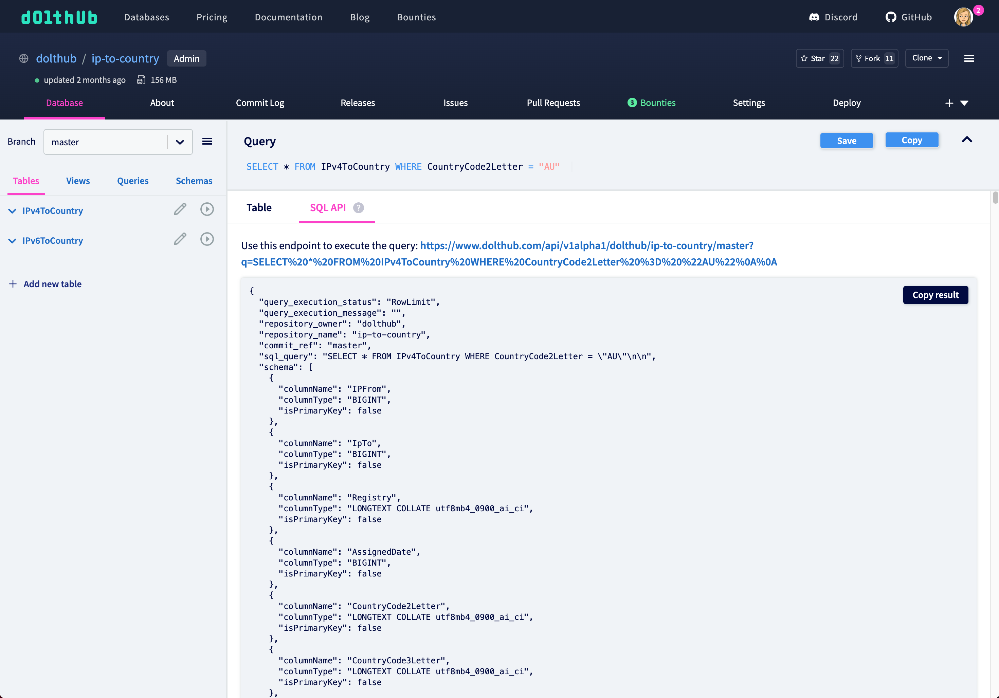

# SQL

DoltHub provides an API for accessing Dolt databases via web requests. A Dolt database can be attached to a DoltHub remote and pushed. At that point DoltHub provides an API against which users can execute Dolt SQL with results returned as JSON.


Please make sure to send your requests to `https://www.dolthub.com` instead of `https://dolthub.com`.


## Reading

### Using the default branch


[sqlRead.json](../../../.gitbook/assets/dolthub-api/sqlRead.json)


We will use an example DoltHub database, [dolthub/ip-to-country](https://www.dolthub.com/repositories/dolthub/ip-to-country/) and the Python `requests` library to explore it in the Python console:

```python
import requests

owner, database = 'dolthub', 'ip-to-country'
res = requests.get('https://dolthub.com/api/v1alpha1/{}/{}'.format(owner, database))
res.json()
```

This shows our database metadata as a dictionary:

```python
{'query_execution_status': 'Success',
 'query_execution_message': '',
 'repository_owner': 'dolthub',
 'repository_name': 'ip-to-country',
 'commit_ref': 'main',
 'sql_query': 'SHOW TABLES;',
 'schema': [{'columnName': 'Table',
   'columnType': 'longtext'}],
 'rows': [{'Table': 'IPv4ToCountry'}, {'Table': 'IPv6ToCountry'}]}
```

### Specifying a ref


[sqlRead.json](../../../.gitbook/assets/dolthub-api/sqlRead.json)


We can now execute a query:

```python
query = '''SELECT * FROM IPv4ToCountry WHERE CountryCode2Letter = "AU"'''
res = requests.get(
  'https://www.dolthub.com/api/v1alpha1/{}/{}/{}'.format(owner, database, branch),
  params={'q': query},
  )
res.json()
```

This yields the results as JSON, with both schema and data:

```python
{'query_execution_status': 'RowLimit',
 'query_execution_message': '',
 'repository_owner': 'dolthub',
 'repository_name': 'ip-to-country',
 'commit_ref': 'main',
 'sql_query': 'SELECT * FROM IPv4ToCountry WHERE CountryCode2Letter = "AU"',
 'schema': [{'columnName': 'IPFrom',
   'columnType': 'Int'},
  {'columnName': 'IpTo', 'columnType': 'Int'},
  {'columnName': 'Registry', 'columnType': 'String'},
  {'columnName': 'AssignedDate', 'columnType': 'Int'},
  {'columnName': 'CountryCode2Letter',
   'columnType': 'String'},
  {'columnName': 'CountryCode3Letter',
   'columnType': 'String'},
  {'columnName': 'Country', 'columnType': 'String'}],
 'rows': [{'IPFrom': '16777216',
   'IpTo': '16777471',
   'Registry': 'apnic',
   'AssignedDate': '1313020800',
   'CountryCode2Letter': 'AU',
   'CountryCode3Letter': 'AUS',
   'Country': 'Australia'},
.
.
.
]}
```

As a reminder, this API is in Alpha version, and we will continue to flesh this out, as well as improve query performance, over time.

You can also explore our SQL API on DoltHub whenever you execute a query:



## Writing

Since adding, updating, and deleting data can take a bit of time to execute against larger databases, we made the writable API asynchronous. Therefore we needed to add two HTTP endpoints for executing these kinds of queries using the SQL API.

We can use our [SHAQ database](https://www.dolthub.com/repositories/dolthub/SHAQ) as an example. These are the steps we'd take to update a player's id in the player stats table.

### 1. Run query


[sqlWrite.json](../../../.gitbook/assets/dolthub-api/sqlWrite.json)


First, we want to hit the write endpoint with our `UPDATE` query. This will start an asynchronous operation.

```python
owner, database, from_branch, to_branch = 'dolthub', 'SHAQ', 'main', 'update-player'
query = '''UPDATE player_season_stat_totals SET player_id=714287 WHERE player_id=15404617'''
headers = {
    'authorization': 'token [see Authentication section for token]'
}

write_res = requests.post(
        f'https://www.dolthub.com/api/v1alpha1/{owner}/{database}/write/{from_branch}/{to_branch}',
        params={'q': query},
        headers=headers,
    )
write_json = write_res.json()
```


Note: for larger queries you can put the query in the request body (`json={"query": [your query]}`) instead of using the query parameter.


The `main` branch already exists in the database, and providing a `<to_branch>` that doesn't exist will create this new branch from the `<from_branch>`.

The yielded JSON results include an `operation_name`.

```json
{
  "query_execution_status": "Success",
  "query_execution_message": "Operation created. Poll the operation endpoint to see the execution status of this query.",
  "repository_owner": "dolthub",
  "repository_name": "SHAQ",
  "to_branch_name": "update-player",
  "from_branch_name": "main",
  "query": "UPDATE player_season_stat_totals SET player_id=714287 WHERE player_id=15404617",
  "operation_name": "operations/72abb56b-d478-43ae-9a2d-c9602184c7ab"
}
```

### 2. Poll operation


[sqlWrite.json](../../../.gitbook/assets/dolthub-api/sqlWrite.json)


`operation_name` can be used to poll the second endpoint to check if the operation is done.

```python
def get_operation(op_name):
  op_res = requests.get(
      f'https://www.dolthub.com/api/v1alpha1/{owner}/{database}/write',
      params={'operationName': op_name},
      headers=headers,
  )
  return op_res.json()


def poll_operation(op_name):
    done = False
    while done == False:
        poll_res = get_operation(op_name)
        done = poll_res['done']
        if done:
            return poll_res
        else:
            time.sleep(3)


res = poll_operation(write_json['operation_name'])
```

A `done` operation will yield a response that includes some query metadata, including from and to commit ids.

```json
{
  "_id": "operations/72abb56b-d478-43ae-9a2d-c9602184c7ab",
  "done": true,
  "res_details": {
    "query_execution_status": "Success",
    "query_execution_message": "Query OK, 2 rows affected. Rows matched: 2  Changed: 2  Warnings: 0.",
    "owner_name": "tbantle",
    "repository_name": "SHAQ",
    "from_commit_id": "518ue176ec13qf563e87uoerkqqepood",
    "to_commit_id": "5sp7i0bov6itma2u04dpk15ui24lrigp"
  }
}
```

### 3. View changes

Since a lot of Dolt's functionality is exposed via SQL, we can use the commit ids to query the `dolt_commit_diff_$tablename` table to view the resulting diff from our `UPDATE` query.

```python
from_commit, to_commit = res['res_details']['from_commit_id'], res['res_details']['to_commit_id']
query = f'''SELECT from_player_id, to_player_id, diff_type FROM `dolt_commit_diff_player_season_stat_totals` WHERE from_commit="{from_commit}" AND to_commit="{to_commit}"'''

diff_res = requests.get(
    f'https://www.dolthub.com/api/v1alpha1/{owner}/{database}/{to_branch}',
    params={'q': query},
    headers=headers,
)
diff_res.json()
```

We can repeat this process with as many queries as we want. Every query will create a commit on the `<from_branch>`.

### 4. Merge changes

Once we're satisfied with our changes, we can merge our branches by hitting the first endpoint with an empty query.

```python
merge_res = requests.post(
        f'https://www.dolthub.com/api/v1alpha1/{owner}/{database}/write/{to_branch}/{from_branch}',
        params=None,
        headers=headers,
    )

merge_json = merge_res.json()
poll_operation(merge_json['operation_name'])
```

You can learn more about using the writable SQL API [here](https://www.dolthub.com/blog/2022-01-12-sql-api-writes/).
