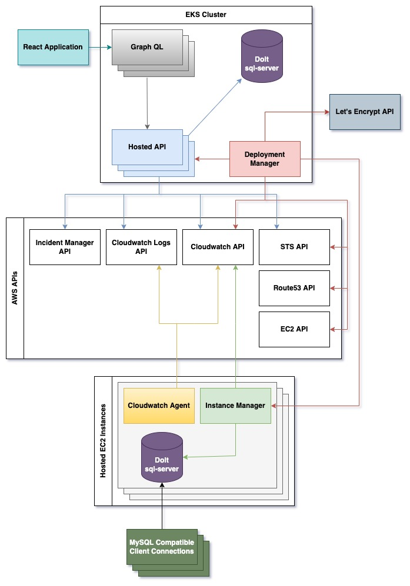

Before Hosted Dolt, if you wanted to run [Dolt](https://doltdb.com) as your OLTP database
you had to stand up your own instances deployed with the Dolt binary, and then handle all
your own monitoring, alerting, and upgrades. This page will go through the infrastructure
behind Hosted Dolt and the decision to use Dolt as our production OLTP server.

# Architecture

The diagram below shows the key pieces of infrastructure used to run
[https://hosted.doltdb.com](https://hosted.doltdb.com).

In building [https://hosted.doltdb.com](https://hosted.doltdb.com) we used many of the
same technologies used on [DoltHub](https://dolthub.com). Our website runs on React. It
communicates with GraphQL servers which provide a translation layer for the Hosted API.
The Hosted API is a Golang service providing GRPC endpoints which drive the website, and
the hosted control plane. All state is managed through a Dolt sql-server instance.

The Deployment Manager is a Golang service which polls the Hosted API to understand what
should be deployed. It also polls the EC2 API to understand what instances are currently
running. It communicates with the running instances to get the health of hosted instances.
With the full picture of what should be deployed, and what is currently running, it will
use the EC2 API to create and destroy instances. New hosted instances are created using
the user's spec and a prebuilt
[AMI](https://docs.aws.amazon.com/AWSEC2/latest/UserGuide/AMIs.html). The AMI has the
[latest Dolt](https://github.com/dolthub/dolt/releases), [Amazon's Cloudwatch
Agent](https://docs.aws.amazon.com/AmazonCloudWatch/latest/monitoring/Install-CloudWatch-Agent.html)
and our Instance Manager. After an instance is created we generate certificates, and
create an [A record](https://www.cloudflare.com/learning/dns/dns-records/dns-a-record/)
using [Route 53](https://aws.amazon.com/route53/). Next it will generate either a
self-signed cert, or a WebPKI certificate using [Let's
Encrypt](https://letsencrypt.org/)'s API based on the options selected by the user. Once
that is complete the Deployment Manager will make a deploy request to the Instance
Manager.

The Instance Manager is another Golang application which runs on hosted instances and
provides GRPC endpoints which are only open to the Deployment Manager. Once an instance is
up the Deployment Manager sends a deploy request to the Instance Manager. The request
includes all the information needed to start including IAM credentials and certificates.
Once Dolt is running the Instance Manager will respond to heartbeat requests from the
Deployment Manager, and poll the [Dolt](https://doltdb.com) Prometheus endpoint to get
application level metrics which it sends to Cloudwatch.

Also running on the instance, [Amazon's Cloudwatch
Agent](https://docs.aws.amazon.com/AmazonCloudWatch/latest/monitoring/Install-CloudWatch-Agent.html)
handles pushing logs to Cloudwatch as well as getting host level metrics such as cpu,
memory, and disk usage.

Once a new deployment is complete, the Deployment Manager will update the Hosted API with
information such as the DNS to reach the host, the instance and volume ids, and other
information about the deployment. After that the Deployment Manager continuously sends
heartbeat requests, and monitors the state of running deployments.

# Using Dolt

When we started building the backend for
[https://hosted.doltdb.com](http://hosted.doltdb.com) we thought we would use an identical
tech stack to what is used on [DoltHub](https://dolthub.com). This means using Postgres as
our OLTP DB. But the more we thought about it, the more we wanted to use
[Dolt](https://doltdb.com) instead. Dolt has some killer features that make it great
choice for our application DB. First, the ability to clone the database in order to debug
and develop locally is incredibly powerful. Also, in the case of an operational event, the
ability to look at the diffs in the data and [rollback
changes](https://www.dolthub.com/blog/2022-04-29-dolt-revert/) can significantly help with
our ability to [recover from
outages](https://www.dolthub.com/blog/2022-04-14-atlassian-outage-prevention/). Dolt also
allows for the integration of CI/CD systems that can verify the quality of the data and
look at how it's changed. These systems can look at things like the statistical variations
of fields throughout the history of the commit graph.

Additionally, how can we tell others to use it for their applications if we aren't using
it ourselves? This has many other benefits. We are learning a lot about operating our own
software, and hitting errors before our customers do. As an example, failed Dolt
transactions left the working set of a connection in a state with conflicts and did not
automatically roll back changes. Dolt required you to resolve the conflicts, or rollback
the transaction explicitly. The standard MySQL behavior automatically rolls back when a
transaction fails, and the [library we use](https://github.com/gocraft/dbr) to interact
with our database relies on this behavior (Explicitly calling `rollback` after a failed
transaction is a NOP). So we changed the behavior of Dolt to match that of MySQL.

Resolving conflicts is not something MySQL supports so requiring conflict resolution in
order to continue after a failed transaction would cause problems when integrating with
standard MySQL tools and libraries. In order to support a workflow that involves merging
and conflict resolution, Dolt allows you to create branches, work transactionally against
your branch, then merge your changes with changes made by other users. If merging your
changes results in a conflict, you have the ability to see the cells in conflict, and
resolve the conflicts using standard SQL syntax.
