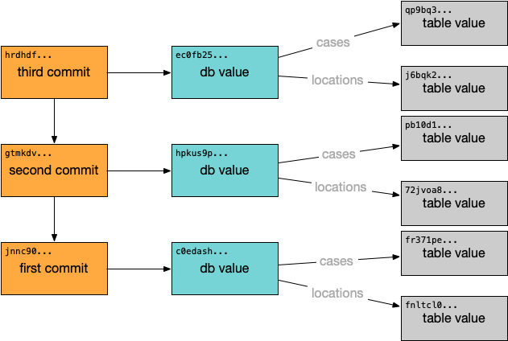

# Commits

## What is a Commit?

A commit signals to Dolt that you would like to save the state of the current database permanently for future reference. In practice, this stores the root hash (or reference) of the database in a graph of all the commits with a link to its parent commit. If the commit is a merge commit, the commit will have multiple parents.



Commit hashes are SHA-256 encoded hashes of the entire database. Commit hashes look like `t5d5inj4bpc1fltrdm9uoscjdsgebaih`. These are abbreviations of the entire hash that Dolt understands. When referring to a specific commit, this is the identifier you use.

A Dolt commit is different from a standard SQL transaction commit. Dolt supports both which can be a bit confusing.

## How to use Commits

Dolt uses commits as the basis of comparison between two versions of a database. You can ask Dolt to do things like:

- Show me the differences between these two commits
- Give me the common ancestor of these two commits
- Make my current database look like this commit
- Show me the difference between my current database and the last commit
- Show me all the commits since this database was created
- Show me who created this commit and the message they left when he or she made it

You should make a commit when you want to be able to use the current version of the database to do one of the above things.

To create a commit, you tell Dolt you want to make one on the command line or in the SQL interface. A user and commit message are required. Your user is defined in configuration. You provide a commit message via the user interface.

## Difference between Git Commits and Dolt commits

Git commits and Dolt commits are very similar in purpose and practice.

In Dolt, you can create a commit via the SQL interface. There is no analogue in Git.

## Example

### Adding a table and making a commit

#### CLI

```
docs $ dolt sql -q "create table docs (pk int, primary key(pk))"
docs $ dolt add .
docs $ dolt status
On branch main
Changes to be committed:
  (use "dolt reset <table>..." to unstage)
	new table:      docs
docs $ dolt commit -m "Added example table docs"
commit 7vureh3qotrr02sog3tjgjk73sqmc2de
Author: Tim Sehn <tim@dolthub.com>
Date:   Mon Dec 06 13:25:55 -0800 2021

	Added example table docs

```

#### SQL

```
docs $ dolt sql -q "create table docs_sql (pk int, primary key(pk))"
docs $ dolt sql -q "call dolt_commit('-a', '-m', 'Added docs_sql example table. Use -a to stage all changes for commit ie. skip dolt add')"
+-------------------------------------------------------------------------------------------------------------------+
| dolt_commit('-a', '-m', 'Added docs_sql example table. Use -a to stage all changes for commit ie. skip dolt add') |
+-------------------------------------------------------------------------------------------------------------------+
| v42og53ru3k3hak3decm23crp5p6kd2f                                                                                  |
+-------------------------------------------------------------------------------------------------------------------+
```

### Creating an empty commit

```
docs $ dolt commit --allow-empty -m "This is a commit"
commit bo318l76dq3bdvu1ie84d4nmv4hpi4km
Author: Tim Sehn <tim@dolthub.com>
Date:   Thu Dec 02 16:55:00 -0800 2021

	This is a commit

docs $ dolt sql -q "call dolt_commit('-a', '--allow-empty', '-m', 'This is a commit')"
+--------------------------------------------------------------+
| dolt_commit('-a', '--allow-empty', '-m', 'This is a commit') |
+--------------------------------------------------------------+
| u73s2mb1ho4mj1ldkof939vampo93bld                             |
+--------------------------------------------------------------+
```
