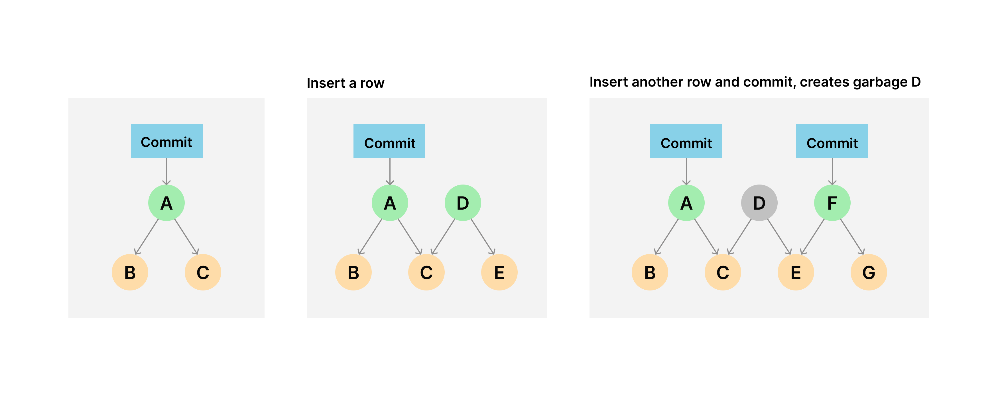

# How garbage is created

Doltgres creates on disk garbage. Doltgres transactions that do not have a corresponding Doltgres commit create on disk garbage. This garbage is most noticeable after large data imports.

Specifically, writes to Doltgres can result in multiple chunks of the [prolly
tree](https://www.dolthub.com/blog/2020-04-01-how-dolt-stores-table-data) being rewritten,
which [writes a large portion of the
tree](https://www.dolthub.com/blog/2020-05-13-dolt-commit-graph-and-structural-sharing/#cant_share).
When you perform write operations without committing or delete a branch containing novel
chunks, garbage is created.

## Online

You can run garbage collection on your running SQL server using [`select dolt_gc`](../version-control/dolt-sql-procedures.md#dolt_gc) through any connected client. To prevent concurrent
writes potentially referencing garbage collected chunks, running
[`select dolt_gc`](../version-control/dolt-sql-procedures.md#dolt_gc) will break all open
connections to the running server. In flight queries on those connections may fail and must be retried. Re-establishing connections after they are broken is safe.

At the end of the run, the connection which ran `select dolt_gc()` will be left open in order to deliver the results of the operation itself. The connection will be left in a terminally broken state where any attempt to run a query on it will result in the following error:

`ERROR 1105 (HY000): this connection was established when this server performed an online garbage collection. this connection can no longer be used. please reconnect.`

The connection should be closed. In some connection pools it can be awkward to cause a single connection to actually close. If you need to run `select dolt_gc()` programmatically, one work around is to use a separate connection pool with a size of 1 which can be closed after the run is successful.

NOTE: Performing GC on [a cluster replica](../server/replication.md) which is in standby mode is not yet supported, and running `select dolt_gc()` on the replica will fail.

# Automated GC

We eventually want to support automated garbage collection during events that generate a
lot of garbage, such as file imports. It will need to be interruptable.
