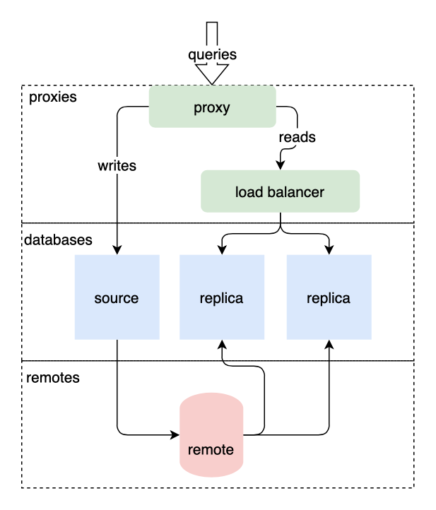
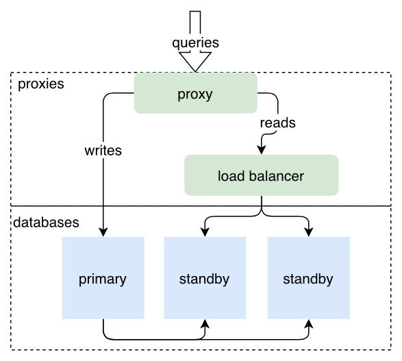
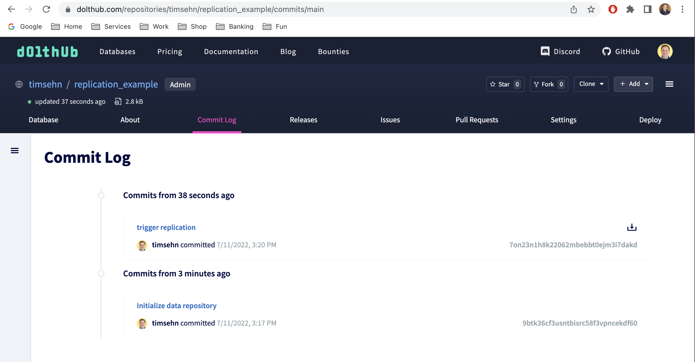

# Replication

Doltgres can [replicate data](../../../concepts/rdbms/replication.md) between two or more
Doltgres servers, or can be a read-replica for a Postgres server. This page describes the two supported
replication modes between a Doltgres primary server and Doltgres replica servers. See the [Postgres
to Doltgres Replication guide](../../../guides/replication-from-postgres.md) for more information on
setting up a Doltgres server as a read-replica for a Postgres server.

In **Remote-Based Replication**, Doltgres uses a remote as a middleman to facilitate replication between the
primary and read replicas. In this mode, Doltgres replication triggers on a [Doltgres
commit](../../../concepts/git/commits.md).



This is the simplest form of replication to configure and administer. Use this form of replication
when you do **not** need the hot-standby support of Direct-to-Standby Replication. See [Direct vs
Remote Replication](replication.md#direct-vs.-remote-replication) for more details on the
differences between Remote-Based Replication and Hot Standby Replication.

In **Direct-to-Standby Replication**, the primary dolt sql-server instance replicates all writes to
a set of configured standby servers. In this mode, there is no intermediate
[remote](../../../concepts/git/remotes.md) and all SQL transaction commits are replicated, not
just Doltgres commits.



Use this form of replication when you have high-availability requirements, and need a hot standby
server ready to swap in for the primary. See [Direct vs Remote
Replication](replication.md#direct-vs.-remote-replication) for more details on the differences
between Remote-Based Replication and Hot Standby Replication.

The rest of this page describes configuration and considerations for both types of
replication, starting with replication through a remote.

# Replication Through a Remote

## Configuration

Doltgres relies on [system variables](../../../concepts/sql/system-variables.md) to configure
replication. The following system variables affect replication:

1. [`@@dolt_replicate_to_remote`](../version-control/dolt-sysvars.md#dolt_replicate_to_remote).
   **Required for a primary.** The primary will push to the remote named on any branch or tag
   update. If more than one database is being served, each must have a remote with the given name.
1. [`@@dolt_read_replica_remote`](../version-control/dolt-sysvars.md#dolt_read_replica_remote).
   **Required for a replica.** The replica will pull from the remote named at transaction start.
1. [`@@dolt_replicate_heads`](../version-control/dolt-sysvars.md#dolt_replicate_heads). **Either this
   variable or `@@dolt_replicate_all_heads` must be set on a replica.** Used to configure specific
   branches (ie. HEADs) to pull. Set to a comma-separated list of branches to be replicated. The
   wildcard `*` may be used to match zero or more characters in a branch name and is useful for
   selecting multiple branches. Has no effect on a primary.
1. [`@@dolt_replicate_all_heads`](../version-control/dolt-sysvars.md#dolt_replicate_all_heads).
   **Either this variable or `@@dolt_replicate_heads` must be set on a replica.** Pull all branches
   and tags on a read replica (ie. HEADs). Defaults to 0. Has no effect on a primary.
1. [`@@dolt_replication_remote_url_template`](../version-control/dolt-sysvars.md#dolt_replication_remoteurl_template).
   _Optional._ Set to a URL template to configure the replication remote for newly created
   databases. Without this variable set, only databases that existed at server start time will be
   replicated.
1. [`@@dolt_skip_replication_errors`](../version-control/dolt-sysvars.md#dolt_skip_replication_errors).
   Makes replication errors warnings, instead of errors. Defaults to 0.
1. [`@@dolt_transaction_commit`](../../../reference/sql/version-control/dolt-sysvars.md#dolt_transaction_commit).
   Makes every transaction `COMMIT` a Doltgres commit to force all writes to replicate. Default 0.
1. [`@@dolt_async_replication`](../version-control/dolt-sysvars.md#dolt_async_replication). Set to 1
   to make replication pushes asynchronous, which means that read replicas will be eventually
   consistent with the primary. Defaults to 0.

### Configuring a Primary

To set up a primary, you use the [`@@dolt_replicate_to_remote` system
variable](../version-control/dolt-sysvars.md#doltreplicatetoremote). You
set that variable to the name of the remote you would like to use for
replication.

Set the appropriate server variables:

```sql
call dolt_remote('add', 'origin', 'file:///var/share/myremote/');
ALTER SYSTEM SET dolt_replicate_to_remote 'origin';
```



### Note

The `ALTER SYSTEM SET` syntax is not yet supported. For the time being, you must set system
variables in the `config.yaml` file.



The next time you create a Dolt commit, Doltgres will attempt to push the changes to the remote.

```sql
create table test (pk int, c1 int, primary key(pk));
insert into test values (0,0);
call dolt_commit('-Am', 'trigger replication');
```

After a `DOLT_COMMIT()`, changes are pushed to the configured remote.



#### Stopping Replication

To stop replication unset the configuration variable.

```
ALTER SYSTEM SET dolt_replicate_to_remote '';
```

Note, you must restart the server after changing replication configuration for changes to take
effect.

#### Making every Transaction Commit a Doltgres Commit

Often, a primary would like to replicate all transaction `COMMIT`s,
not just Doltgres commits. You can make every transaction `COMMIT` a Doltgres
commit by setting the [system variable](../../../concepts/sql/system-variables.md),
[`@@dolt_transaction_commit`](../../../reference/sql/version-control/dolt-sysvars.md#dolt_transaction_commit). With
this setting, you lose the ability to enter commit messages.

```sql
ALTER SYSTEM SET dolt_transaction_commit TO 1;
```



### Note

The `ALTER SYSTEM SET` syntax is not yet supported. For the time being, you must set system
variables in the `config.yaml` file.



#### Asynchronous replication

By default, replication is synchronous. The push must complete before
the transaction commits. You can enable asynchronous replication using
the [`@@dolt_async_replication` system
variable](../version-control/dolt-sysvars.md#doltasyncreplication). This
setting will increase the speed of Dolt commits, but make read
replicas eventually consistent.

```sql
ALTER SYSTEM SET dolt_async_replication TO 1
```

### Configuring a Replica

To start a replica, you first need a clone. I'm going to call my clone
`read_replica`.

```sql
call dolt_clone('file:///var/share/remote/replication_example', 'read_replica');
```

Now, I'm going to configure my read replica to "pull on read" from
origin. To do that I use the [`@@dolt_read_replica_remote system
variable`](../version-control/dolt-sysvars.md#doltreadreplicaremote). I
also must configure which branches (ie. HEADs) I would like to
replicate using either
[`@@dolt_replicate_heads`](../version-control/dolt-sysvars.md#doltreplicateheads)
to pick specific branches or
[`@@dolt_replicate_all_heads`](../version-control/dolt-sysvars.md#doltreplicateallheads)
to replicate all branches.

```sql
ALTER SYSTEM SET dolt_replicate_heads TO 'main';
ALTER SYSTEM SET dolt_read_replica_remote TO 'origin';
select * from test;
+----+----+
| pk | c1 |
+----+----+
| 0  | 0  |
| 1  | 1  |
+----+----+
```

You must restart the replica server for changes to take effect.

Now back on the primary:

```sql
insert into test values (2,2);
call dolt_commit('-am', 'Inserted (2,2)');
+----------------------------------+
| hash                             |
+----------------------------------+
| i97i9f1a3vrvd09pphiq0bbdeuf8riid |
+----------------------------------+
```

And back to the replica.

```sql
select * from test;
+----+----+
| pk | c1 |
+----+----+
| 0  | 0  |
| 1  | 1  |
| 2  | 2  |
+----+----+
```

#### Replicate all branches

Only one of
[`@@dolt_replicate_heads`](../version-control/dolt-sysvars.md#doltreplicateheads)
or
[`@@dolt_replicate_all_heads`](../version-control/dolt-sysvars.md#doltreplicateallheads)
can be set at a time. So I unset `@@dolt_replicate_heads` and set
`@@dolt_replicate_all_heads`.

```sql
ALTER SYSTEM SET dolt_replicate_heads TO '';
ALTER SYSTEM SET dolt_replicate_all_heads TO 1"
```

Now I'm going to make a new branch on the primary and insert a new value on it.

```sql
call dolt_checkout('-b', 'branch1');
insert into test values (3,3);
call dolt_commit('-am', 'Inserted (3,3)');
```

The read replica now has the change when I try and read the new branch.

```sql
call dolt_checkout('branch1');
select * from test;"
+----+----+
| pk | c1 |
+----+----+
| 0  | 0  |
| 1  | 1  |
| 2  | 2  |
| 3  | 3  |
+----+----+
```

### Replicating multiple databases

By running the SQL server with the `--data-dir` option, you can manage
multiple Dolt databases in the same server environment. If replication
is enabled, all databases are replicated. A remote with the name given
by `@@dolt_read_replica_remote` (for replicas) or
`@@dolt_replicate_to_remote` (for primaries) must exist for every
database in the server.

Whenever working with more than one database in a server with
replication enabled, it's recommended to set
`@@dolt_replication_remote_url_template` so that newly created
databases are replicated as well. Without this setting, newly created
databases won't begin replicating until they have an individual remote
configured and the server is restarted. With this setting, newly
created databases on a primary automatically get a remote configured
using the URL template provided and begin pushing to it.

`@@dolt_replication_remote_url_template` must be a valid Dolt remote
URL, with the replacement token `{database}` in it. Some examples:

```sql
ALTER SYSTEM SET dolt_replication_remote_url_template = 'file:///share/doltRemotes/{database}'; -- file based remote
ALTER SYSTEM SET dolt_replication_remote_url_template = 'aws://dynamo-table:s3-bucket/{database}'; -- AWS remote
ALTER SYSTEM SET dolt_replication_remote_url_template = 'gs://mybucket/remotes/{database}'; -- GCP remote
```

For some remotes, additional configuration for authorization may be
required in your environment. **Note**: not all remote types support
automatic database creation yet.

On read replicas, setting `@@dolt_replication_remote_url_template`
will cause new databases created on the primary to be cloned to the
replica when they are first used.

### Deleting branches

Branches deleted on a primary database will also be deleted on any
read replicas.

### Failover

No automated failover is possible using remote-based replicas, because there is no way to promote a
read replica into a primary without a restart. To configure a database cluster that supports
automated failover, please use [direct-to-standby replication
instead](replication.md#direct-to-standby-replication).

### Multi-Primary

We do not have specific solutions or documentation to run Dolt as an
OLTP database with multiple primaries. It is possible to connect
several write targets with a common remote middleman, but they would
need to reconcile merge conflicts in the same way an offline Dolt
database does. Providing a transactional layer to enforce multi-primary
(to avoid merge conflicts) or a way to automatically resolve merge
conflicts is necessary to run Dolt as a multi-primary database
effectively.

# Direct to Standby Replication

## Configuration

Replication direct to a standby is configured through the sql-server's YAML
configuration. For example, if we have two servers, `dolt-1.db` and
`dolt-2.db`, and we want to configure them for high-availability, we will
typically configure them to replicate writes to each other.

On `dolt-1.db`, we will have a `config.yaml` like:

```yaml
cluster:
  standby_remotes:
    - name: standby
      remote_url_template: http://dolt-2.db:50051/{database}
  bootstrap_role: primary
  bootstrap_epoch: 1
  remotesapi:
    port: 50051
```

On `dolt-2.db`, we will have:

```yaml
cluster:
  standby_remotes:
    - name: standby
      remote_url_template: http://dolt-1.db:50051/{database}
  bootstrap_role: standby
  bootstrap_epoch: 1
  remotesapi:
    port: 50051
```

Some important things to note:

1. On each server, the standby remote URL points to the other server in the
   cluster.

2. `cluster.remotesapi.port` configures the port that the sql-server will
   listen on to receive replicated writes. It should match the port appearing in
   the `remote_url_template`.

3. The `cluster.bootstrap_role` between the two servers is different. This
   configuration says that when the `dolt-1.db` server comes up, it will behave
   as the primary and will be enabled for writes. `dolt-2.db`, on the other hand,
   will be a standby replica; it will be accept read requests and writes
   replicated from the primary.

The `bootstrap_role` and `bootstrap_epoch` only apply to a newly run server.
Once the server has been running on a host, it will persist its current role
and role epoch, and those will take priority over anything configured in the
bootstrap configuration.

### Bootstrap Remotes

If databases already exist when the `doltgres sql-server` instance is started, they will need to
have corresponding remotes as configured in the `cluster.standby_remotes` configuration. Any
database created database through SQL `CREATE DATABASE` will automatically have remotes created
corresponding to the `remote_url_templates`. The recommended way to run `doltgres sql-server` in cluster
mode is in a newly empty directory with:

```sh
$ doltgres --config server.yaml --data-dir .
```

and then to create databases through the SQL interface.

If you want to create databases beforehand, you should create corresponding
remotes as well. For example, on `dolt-1.db` above, I could run:

```sql
CREATE DATABASE appdb;
\c appdb;
CALL dolt_remote('add', 'standby', 'http://dolt-2.db:50051/appdb');
```

## Replication Behavior

All SQL transactions and branch HEAD updates for all dolt databases are
replicated. Newly created databases are replicated to the standby remotes.
Branch deletes are replicated.

Currently, the following things are not replicated:

1. `DROP DATABASE`. To drop a database, you will need to run the DROP DATABASE
   command on both the primary and on all standbys.

2. Users and grants. To create or alter a user or a grant, you need to run the
   corresponding SQL user and grant statements on both the primary and all the
   standbys.

## Replication Role and Epoch

When running with direct replication, each sql-server instance has a configured
role it is playing in the cluster. It is either the `primary`, which means it
accepts writes through SQL and replicates those writes to every configured
`standby_remote`, or it is a `standby`, which means it does not accept writes
over SQL but it does accept replication writes from other sql-servers. When a
server is configured to be a primary, it will not accept replication writes.
When a server is configured to be a standby, it will not attempt to replicate
its databases to its configured `standby_remotes`.

Every time a server assumes a role, it assumes it at particular configuration
epoch. This configuration epoch can only increase &mdash; attempting to assume a role
at a lower configuration epoch, or a different role at the current
configuration epoch, will fail.

A server's configured role can be manually changed by calling a stored procedure,
`dolt_assume_cluster_role`. This can be used for controlled and lossless
failover from a primary to a standby. It can also be used to promote a standby
to a primary when a primary is lost, although in that case the failover is not
guaranteed to be lossless.

To make the current primary become a standby, run the following:

```sql
CALL dolt_assume_cluster_role('standby', 2)
```

where `2` is the new configuration epoch and must be higher than the current
epoch. The behavior will be the following:

1. The server will be put into read-only mode.

2. Every running SQL connection, except for the `CALL dolt_assume_cluster_role`
   call itself, will be canceled and the connection for the queries will be
   terminated.

3. The call will block until replication of every database to each
   `standby_replica` is completed.

4. If the final replications complete successfully, the new role and new
   configuration epoch are applied. If the final replications time out or fail,
   the new role is not assumed &mdash; the database is placed back into read-write
   mode and remains a `primary` at the old epoch.

5. If the call is successful, the connection over which it was made will be
   tainted. It will fail all queries with an error asking the user to reconnect.

To make a current standby become a primary, run the following:

```sql
CALL dolt_assume_cluster_role('primary', 2)
```

where `2` is the new configuration epoch and must be higher than the current
epoch. The behavior will be the following:

1. The server will be put into read-write mode.

2. Every running SQL connection, except for the `CALL dolt_assume_cluster_role`
   call itself, will be canceled and the connection for the queries will be
   terminated.

3. The new role and epoch will be applied on the server.

4. The connection over which the call was made will be tainted. It will fail
   all queries with an error asking the user to reconnect.

In the configured example, if you run the first statement on `dolt-1.db` and
the second statement on `dolt-2.db`, you will have performed an oderly failover
from `dolt-1.db` to make `dolt-2.db` the new primary.

### Atomatic Role Transitions

It can happen that server instances learn about new role configuration from
their peers as they attempt to replicate writes or when they receive a
replication request. In some of these cases, the server can automatically
transition to a new role based on the incoming traffic or based on what it
learns from its standby remote when it attempts to replicate. In particular,
the following can happen:

1. When a `primary` is replicating to a `standby_remote`, if it learns that the
   `standby_remote` is itself currently configured to be a `primary` at a
   configuration epoch which is higher than the replicating server, the
   replicating server will immediately transition to be a `standby` at the same
   epoch as the epoch of the `standby_remote`.

2. When a server receives a replication request, and the incoming request is
   from a configured `primary` which is at a higher configuration epoch than the
   server itself, the server will immediately transition to be a `standby` at the
   same configuration epoch as the server which is making the incoming replication
   request.

In both cases, the transition will cause all existing queries and connections
to the sql-server to be killed.

One further case can arise. If at any point, two servers communicate and they
see that they are both configured as role primary in the same configuration
epoch, that represents a fundamental misconfiguration of the cluster. The
servers will transition to a special role, `detected_broken_config`. In this
role, the servers will serve read-only traffic, will reject writes of SQL, and
will reject replication requests from other servers which may think they are
primary at the same epoch. The role is somewhat viral &mdash; if other servers
communicate with these servers and see the `detected_broken_config` role at the
same epoch, those servers will also transition to `detected_broken_config`. A
server which is in `detected_broken_config` will become a `standby` if it
receives a replication request from a primary at a higher configuration epoch.
It can also change its role based on a call to `dolt_assume_cluster_role`.

A server never automatically transitions to be a primary.

## Monitoring Replication Status

When configured with a `cluster:` stanza in its YAML configuration, the
sql-server instance will expose replication status through the SQL interface.

The current role and configuration epoch can be accessed through global session
variables.

```sql
show dolt_cluster_role;
+----------------------------+
|          dolt_cluster_role |
+----------------------------+
| primary                    |
+----------------------------+
show dolt_cluster_role_epoch;
+----------------------------------+
|          dolt_cluster_role_epoch |
+----------------------------------+
|                               15 |
+----------------------------------+

```

The current status of replication to the standby can be queried in a system
table of a system database, `dolt_cluster.dolt_cluster_status`.

```sql
select * from dolt_cluster.dolt_cluster_status;
+----------+----------------+---------+-------+------------------------+----------------------------+---------------+
| database | standby_remote | role    | epoch | replication_lag_millis | last_update                | current_error |
+----------+----------------+---------+-------+------------------------+----------------------------+---------------+
| appdb    | standby        | primary |    15 |                      0 | 2022-10-17 19:07:38.366702 | NULL          |
+----------+----------------+---------+-------+------------------------+----------------------------+---------------+
```

For monitoring the health of replication, we recommend alerting on:

1. No configured `primary` in the cluster.

2. NULL or growing `replication_lag_millis` on the primary.

3. Non-NULL `current_error`.

4. Any server in the cluster in role `detected_broken_config`.

## A Note on Security

Enabling cluster replication on a dolt sql-server exposes a remotesapi port on
the sql-server instance. Attempts are made to authenticate and authorize the
traffic on this port so that only servers which are configured to replicate to
each other can communicate over it.

On startup, the sql-server instance creates an ephemeral asymmetric encryption
key and publishes its public key as a JWKS at an unauthenticated endpoint on
the `remotesapi.port`. For outgoing requests to any standby remote, the server
signs its requests with its private key. For incoming requests, the server
trusts any inbound request which is signed by a private key which corresponds
to any public key which it was able to fetch from the published JWKSs of any of
its configured standy remote peers.

The security of this scheme relies on the security of the network which is used
to fetch the trusted keys from the JWKSes of the configured peers and on the
inability of the authentication credentials signed with the private keys to be
intercepted. The authentication credentials used are relatively short-lived but
they are not secure against things like replay attacks.

If the network between the standby replicas is not entirely trusted,
server-side TLS can be used to improve the security posture of the
communication. In this case, the URLs of the remotes used for standby
replication should have scheme `https`. The `remotesapi:` fragment of the
`cluster:` configuration is able to configure some server-side and client-side
settings for its TLS communication:

```yaml
cluster:
  standby_remotes:
  - name: standby_replica_one
    remote_url_template: https://standby_replica_one.svc.cluster.local:50051/{database}
  - name: standby_replica_two
    remote_url_template: https://standby_replica_two.svc.cluster.local:50051/{database}
  boostrap_role: ...
  boostrap_epoch: ...
  remotesapi:
    # The listening address. By default all listenable interfaces.
    address: "127.0.0.1" | "::1" | "..."
    # The TCP port to listen on.
    port: 50051

    # A file path to a file containing the PEM-encoded private key to be used by
    # this server's TLS listener.
    tls_key: "remotesapi_key.pem"
    # A file path to a file containing the PEM-encoded certificate chain to be
    # presented by this server's TLS listener.
    tls_cert: "remotesapi_chain.pem"

    # A file path to a file containing a list of PEM-encoded CA certificates
    # to be trusted by this sql-server when establishing outbound TLS
    # connections. If this is not set, default certificate verification and
    # trusted certificate roots are used.
    tls_ca: "standby_cas.pem"
    # A list of server name URLs, one of which must appear in the SANs of the
    # presented leaf certificate for the certificate to pass verification. If
    # this list is empty, no assertions are made against SAN URLs. This should
    # only be set when `tls_ca` is set.
    server_name_urls:
    - "https://standby_replica_one.svc.cluster.local"
    - "https://standby_replica_two.svc.cluster.local"
    # A list of server DNS names, one of which must appear in the SANs of the
    # presented leaf certificate for the certificate to pass verification. If
    # this list is empty, no assertions are made against SAN DNS entries. This
    # should only be set when `tls_ca` is set.
    server_name_dns:
    - "standby_replica_one.svc.cluster.local"
    - "standby_replica_two.svc.cluster.local"
```

Typically only one of `server_name_urls` or `server_name_dns` will be set. URLs
are commonly used for certificates issued as part of
[SPIFFE](https://spiffe.io/), for example, while DNS names are commonly used in
WebPKI and typically supported by browsers. If neither are set, but `tls_ca` is
set, the presented certificate chains of peers will be validated against things
like isCa, key usage, validity windows and the signatures chaining to a trusted
root, but no assertions will be made against the identity presented in the
certificates themselves.

# Direct vs. Remote Replication

The above presents two different ways of achieving replication and running
read-replicas with dolt sql-server. For some use cases, either one might meet
your needs, but they are somewhat different architecturally. Here are some
things to consider when choosing how to configure replication.

1. Direct replication is designed to allow for controlled failover from a
   primary to a standby. Some inflight requests will fail, but all commited writes
   will be present on the standby after `CALL dolt_assume_cluster_role('standby',
...)` succeeds on the primary. After that the standby can be promoted to
   primary. On the other hand, replication through a remote does not currently
   have a way to promote a read replica in a way that makes it look exactly like
   the primary which was replicating to it. Replication through a remote is good
   for scaling out read performance but it is not currently as good for high
   availability.

2. Direct replication requires distinct configuration on each server in the
   cluster and it requires tight coupling and deployment of new configuration for
   any changes to cluster topology. Replication through a remote is much more
   decoupled. There is no need to change any configuration in order to add a new
   read replica, for example.

3. Direct replication may experience lower write latency in certain
   deployments, since replicating new writes directly to the running sql-server
   instance on the standby server may be expected to be faster than pushing new
   files to a remote storage solution and having the read replica download the
   files from there. On the other hand, direct replication may be less scalable in
   the number of read replicas which it can gracefully handle, since the primary
   itself is responsible for pushing each write to each standby server. For read
   replicas, read latency for direct replication is always faster, since no
   communication to a remote must take place. You can expect increased read latency
   on every transaction start of aremote-based read replica.

4. The ability to replicate writes with direct replication is not coupled with
   the creation of dolt commits on a dolt branch. This may make it more
   appropriate for your use case, depending on how your application creates and
   manages dolt commits.

5. As mentioned above, the default security posture of replication through a
   remote and direct replication are currently quite different. While the
   configuration shown on this page for direct replication is relatively
   straightforward, to deploy in the real world requires bringing some form of
   external authentication and authorization, possibly in the form of PKI,
   certificates and a sidecar, or externally configured firewall rules.

Lastly, depending on your use case, it may be appropriate to utilize both forms
of replication at the same time. You might do so, for example, if you need
scalable and decoupled read replicas along with hot standbys for high
availability. To do so, deploy a small cluster of servers with direct
replication between them. Configure those servers to replicate their writes to
a single remote. Then, deploy your read replicas as read replicas against that
remote, the same as you would have if you had only one primary. When configured
in this mode, only the primary replicates its writes to the configured remote
&mdash; standby servers in the cluster will be available to become primary and
take over write responsibilities, at which point the new primary will start
replicating new writes to the remote.

# Postgres to Dolt Replication

If you have an existing Postgres server, you can configure Doltgres as a read-replica. As the
Doltgres read-replica consumes data changes from the primary server, it creates Dolt commits, giving
you a read-replica with a versioned history of your data changes. See the [Postgres to Doltgres Replication
guide](../../../guides/replication-from-postgres.md) for more details on how to configure this.
