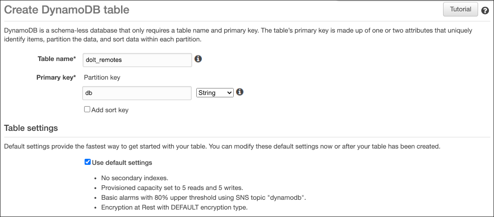

# What are Remotes?

Just like Git, Doltgres supports syncing with a [remote
database](../../../concepts/git/remotes.md). A remote is a copy of your database that is
distinct from your local copy. It usually is stored on a separate host or service for fault
tolerance. The primary use cases are disaster recovery and collaboration. More conceptual
description of remotes can be found [here](../../../concepts/git/remotes.md).

# Configuring Remotes

Remotes are configured using the [`dolt_remote`
procedure](./dolt-sql-procedures.md#dolt_remote). You configure a remote with a name and a
URL. When you want to use the remote, you refer to it by name. When you clone a remote, a remote
named `origin` is automatically configured for you.

<h1 id="pushing-to-remote">Pushing to a Remote</h1>

Let's go through an example of how you can push data from a local Doltgres database to a remote. In
this example, we'll use the running Doltgres server we created in the [Getting
Started](../../concepts/rdbms/database.md) section to push a branch a file-based remote.

First, we need to add a new remote:

```sql
call dolt_remote('add', 'origin', 'file:///var/share/remotes');
+--------+
| status |
+--------+
|      0 |
+--------+
1 row in set (0.03 sec)
```

And then we can push:

```
call dolt_push('origin', 'main');
+--------+
| status |
+--------+
|      0 |
+--------+
1 row in set (0.77 sec)
```

Now the data from our local Dolt server is now available for others to clone using the same URL.

# Remote Actions

Sync functionality is supported via the [`clone`](./dolt-sql-procedures.md#dolt_clone),
[`fetch`](./dolt-sql-procedures.md#dolt_fetch), [`push`](./dolt-sql-procedures.md#dolt_push), and
[`pull`](./dolt-sql-procedures.md#dolt_pull) procedures.

# Remote Options

## Filesystem

Filesystem based remotes allow you to push/pull data from any location that can be accessed via the
filesystem. This may be a directory on your local disk, or any other storage location that can be
mounted to the filesystem. To add a filesystem based remote use a URL with the `file://` protocol.

**Linux / OSX Examples**

- Adding a remote

```
dolt remote add origin file:///Users/brian/datasets/menus
```

- Cloning

```
dolt clone file:///Users/brian/datasets/menus
```

**Windows Examples**

- Adding a remote

```
dolt remote add origin file:///c:/Users/brian/datasets/menus
```

- Cloning

```
dolt clone file:///c:/Users/brian/datasets/menus
```

It's important to note that a directory-based remote is not the same as a workspace for a dolt clone, and the directory listed above as a remote file URL is not a dolt repository created or cloned with the [Dolt](https://doltdb.com) cli. Similarly, a [Dolt](https://doltdb.com) repository directory's file URL [cannot be used as a remote directly](https://github.com/dolthub/dolt/issues/1860).

## AWS

AWS remotes use a combination of DynamoDB and S3. The Dynamo table can be created with any name but
must have a primary key with the name "db".



This single DynamoDB table can be used for multiple unrelated remote repositories. Once you have a DynamoDB table, and an S3 bucket setup you can add an AWS remote using a URL with the protocol `aws://`. To add a remote named "origin" to my "menus" repository using an S3 bucket named `dolt_remotes_s3_storage` and a DynamoDB table named `dolt_dynamo_table` you would run:

```
dolt remote add origin aws://[dolt_dynamo_table:dolt_remotes_s3_storage]/menus
```

This same URL can then be used to clone this database by another user.

```
dolt clone aws://[dolt_remotes:dolt_remotes_storage]/menus
```

In order to initialize your system to be able to connect to your AWS cloud resources see [Amazon's documentation](https://docs.aws.amazon.com/cli/latest/userguide/cli-configure-files.html) on configuring your credential file. [Dolt](https://doltdb.com) also provides additional parameters you may need to provide when adding an AWS remote such as `aws-creds-profile`, and `aws-region`.`aws-creds-profile` allows you to select a profile from your credential file. If it is not provided then the default profile is used. `aws-region` allows you to specify the region in which your DynamoDB table and S3 bucket are located. If not provided, it will use the default region from the current profile.

```
dolt remote add --aws-creds-profile prod-profile --aws-region us-west-2 origin aws://[dolt_dynamo_table:dolt_remotes_s3_storage]/menus
```

or

```
dolt clone --aws-creds-profile prod-profile --aws-region us-west-2 origin aws://[dolt_dynamo_table:dolt_remotes_s3_storage]/menus
```

## GCS

Google Cloud Platform remotes use Google Cloud Storage (GCS). You can create or use an existing GCS bucket to host one or more [Dolt](https://doltdb.com) remotes. To add a GCP remote provide a URL with the `gs://` protocol like so:

```
dolt remote add origin gs://BUCKET/path/for/remote
```

In order to initialize [Dolt](https://doltdb.com) to use your GCP credentials you will need to install the `gcloud` command line tool and run `gcloud auth login`. See the [Google document](https://cloud.google.com/sdk/gcloud/reference/auth/login) for details.

## OCI

Oracle Cloud Infrastructure (OCI) remotes use Oracle Cloud Object Storage. You can create or use an existing OCI bucket to host one or more [Dolt](https://doltdb.com) remotes. To add an OCI remote provide a URL with the `oci://` protocol like so:

```
dolt remote add origin oci://BUCKET/path/for/remote
```

In order to initialize [Dolt](https://doltdb.com) to use your OCI credentials you will need to install the `oci` command line tool and run `oci session authenticate`. See the [Oracle document](https://docs.oracle.com/en-us/iaas/Content/API/SDKDocs/clitoken.htm) for details.

## HTTP(s) Remotes

[Dolt](https://doltdb.com) supports remotes which use the protocol `http://` and `https://`. Remote servers must implement the GRPC methods defined by the [ChunkStoreService interface](https://github.com/dolthub/dolt/blob/master/proto/dolt/services/remotesapi/v1alpha1/chunkstore.proto#L23).

[Dolt](https://doltdb.com) provides a [sample remote server](https://github.com/dolthub/dolt/tree/master/go/utils/remotesrv) that we use for integration testing which could be deployed to serve your remotes as well, though you would want to extend the sample functionality to support things like auth. In our integration tests we install and run the remote server locally:

```
remotesrv --http-port 1234 --dir ./remote_storage
```

This starts a server listening on port 50051 for our grpc requests, and runs a file server on port
1234 which provides upload, and download functionality similar to S3 / GCS locally. We use the url
`http://localhost:50051/test-org/test-repo` when adding a remote or cloning from this remote server.

## Doltgres sql-server

A running [Doltgres](https://doltgres.com) can expose all the databases on it through an HTTP(s)
remote endpoint. To configure this, you include a `remotesapi:` configuration stanza inside the
`config.yaml` file given to `sql-server` command. The stanza currently supports a single integer
field, `port:`, which defines the TCP port the remotesapi endpoint will be exposed on. Providing a
port will cause the sql-server process to run a remotesapi endpoint on the provided port. The
listening IP address is the same as for the SQL server itself. If the MySQL server itself is
configured with a TLS key and certificate then the endpoint will use the same TLS configuration as
the SQL server endpoint itself and it will require HTTPS.

Authenticating to the remotesapi exposed on a `sql-server` works differently than authenticating to
a typical HTTPS Dolt remote. Authentication to a sql-server remote is based on SQL users, passwords
and grants, as opposed to the `dolt creds` functionality which is used above in DoltHub and DoltLab
remotes. The Dolt client's `clone`, `fetch`, `pull`, and `push` commands support a `--user`
parameter, which can be used to supply a username for authentication when interacting with the
remote. The password to be used is supplied through an environment variable, `DOLT_REMOTE_PASSWORD`,
which should be set to the appropriate value when the `clone`/`fetch`/`pull`/`push` command is
run. This username and password correspond to a configured SQL user on the sql-server.

### Reading from sql-server

The `clone`,`fetch`, and `pull` operations require the SQL user must have a grant for the
`CLONE_ADMIN` privilege on the server to which they are connecting. Here is an end-to-end example
showing exposing the remotesapi on a running sql-server, granting a user permissions to a database
on it, and then cloning that database from a Dolt client.

We configure the remotesapi to run on the `sql-server` and run the sql-server process:

```
$ cat config.yaml
remotesapi:
  port: 8080
```

This configuration stanza causes the `doltgres` server to open a remotesapi endpoint running on port
`8080`. We can clone `exampledb` from another server:

```sql
call dolt_clone('--user', 'exampleuser', 'https://localhost:8080/exampledb',  'exampledb');
\c exampledb;
select * from dolt_log;
```

The `--user` and `DOLT_REMOTE_PASSWORD` settings are not stored in the local state of the remote
configuration for the `clone`. All future `fetch` and `pull` invocations from the clone directory
need to supply them in order to authenticate to the remote.

### Writing to sql-server

The `push` operation require the SQL user must have super user privileges to push the the
server.
