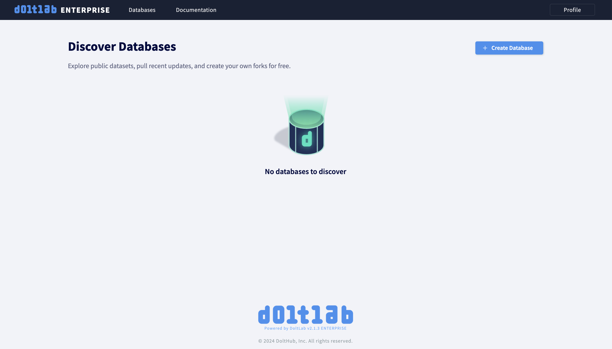
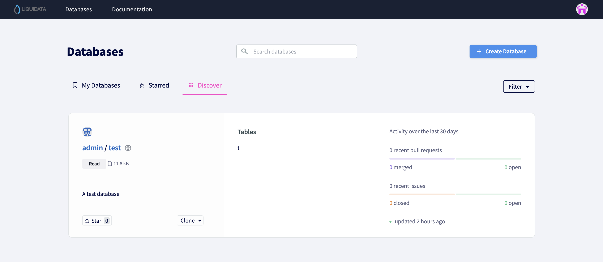

To run DoltLab Enterprise, you'll need a free version of DoltLab running first. The easiest way to do that is using an AWS EC2 host. This is covered in our [Getting Started guide](../introduction/getting-started). Setting up DoltLab on a EC2 host takes less than 30 minutes.

## Set Up Enterprise

Once you have a DoltLab up and running and have shell access to the host, you'll need Enterprise credentials. If you're interested in a free trial, please just let us know. Come by [our Discord](https://discord.gg/gqr7K4VNKe) and just ask.

You need to run the installer with the Enterprise credentials to enable it. If you already have a DoltLab running, you need to stop it with `stop.sh`, run the installer, and then start your new Enterprise configured DoltLab with `start.sh`.

```sh
ubuntu@ip-10-2-0-24:~/doltlab$ ./installer --host=54.191.163.60 --enterprise-online-product-code=<foo>
--enterprise-online-shared-key=<bar>
--enterprise-online-api-key=<baz>
--enterprise-online-license-key=<zap>
ubuntu@ip-10-2-0-24:~/doltlab$ ./start.sh
[+] Running 7/7
 ✔ Container doltlab-doltlabenvoy-1           Started                      0.6s
 ✔ Container doltlab-doltlabdb-1              Started                      0.5s
 ✔ Container doltlab-doltlabfileserviceapi-1  Started                      0.8s
 ✔ Container doltlab-doltlabremoteapi-1       Started                      1.1s
 ✔ Container doltlab-doltlabapi-1             Started                      1.3s
 ✔ Container doltlab-doltlabgraphql-1         Started                      1.5s
 ✔ Container doltlab-doltlabui-1              Started                      1.7s
```

Hit your DoltLab to make sure it works:



You'll notice you have an Enterprise logo and the footer says "ENTERPRISE" in the version string. If you see those, your DoltLab Enterprise is working.

## Enable Features

Most Enterprise features are enabled by [passing arguments to the installer](../guides/enterprise.md). To show off an Enterprise features, I'm going to give my DoltLab a custom logo.

As some of you know, [DoltHub was initially Liquidata](https://www.dolthub.com/blog/2020-09-25-dolthub-rebrand/) and the logo was pretty sick.


I'm going to make a DoltLab Enterprise instance that is Liquidata branded. Oh what could have been?

To do this I `scp` that logo to my DoltLab host.

```sh
$ scp ~/Downloads/ld-logo.png ubuntu@54.191.163.60:/home/ubuntu/doltlab/
ld-logo.png                                   100%   86KB 652.6KB/s   00:00
```

And then run the installer with the custom logo passed in.

```sh
ubuntu@ip-10-2-0-24:~/doltlab$ ./installer --host=54.191.163.60 --enterprise-online-product-code=<foo>
--enterprise-online-shared-key=<bar>
--enterprise-online-api-key=<baz>
--enterprise-online-license-key=<zap>
--custom-logo=/home/ubuntu/doltlab/ld-logo.png
```

Then I start my instance and I get a new look and feel.



Again, most of the features are enabled using the installer, so get used to running that to change your running DoltLab.
