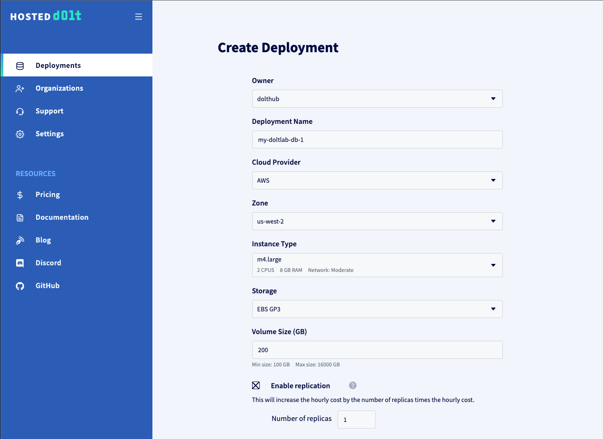
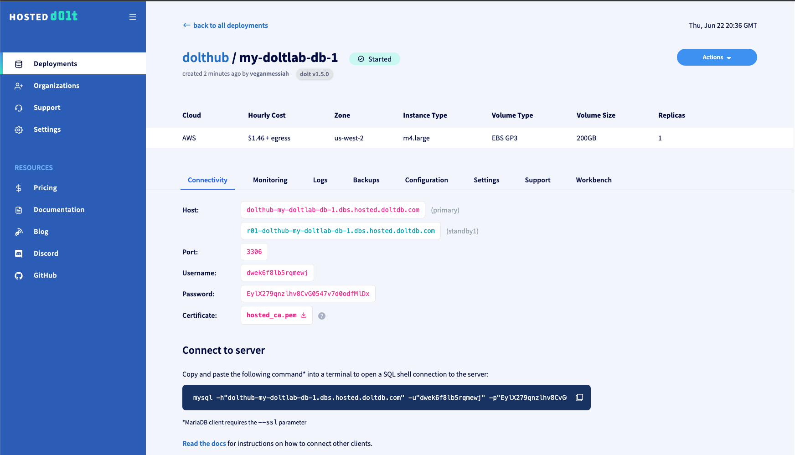

This guide will cover how to perform common DoltLab administrator configuration and tasks for the latest versions of DoltLab, >= `v2.1.0`. These versions use the [installer](../reference/installer.md) binary included in DoltLab's `.zip` file. For instructions on running DoltLab in Enterprise mode and configuring exclusive Enterprise features, see the [Enterprise Guide](./enterprise.md). If you're using an older version of DoltLab that does not include the [installer](../reference/installer.md), please see the [pre-installer Admin guide](./pre-installer-administrator-guide.md).

1. [File issues and view release notes](#file-issues-and-view-release-notes)
2. [Backup DoltLab data](#backup-and-restore-volumes)
3. [Connect with the DoltLab team](#connect-with-the-doltlab-team)
4. [Send service logs to the DoltLab team](#send-service-logs)
5. [Authenticate a Dolt client to use a DoltLab account](#authenticate-a-dolt-client-to-use-a-doltlab-account)
6. [Monitor DoltLab with cAdvisor and Prometheus](#monitor-doltlab-with-cadvisor-and-prometheus)
7. [Connect DoltLab to an SMTP server](#connect-doltlab-to-an-smtp-server)
8. [Connect DoltLab to an SMTP server with implicit TLS](#connect-doltlab-to-an-smtp-server-with-implicit-tls)
9. [Troubleshoot SMTP server connection problems](#troubleshoot-smtp-server-connection-problems)
10. [Set up a SMTP server using any Gmail address](#set-up-a-smtp-server-using-any-gmail-address)
11. [Prevent unauthorized user account creation](#prevent-unauthorized-user-account-creation)
12. [Use an external database server with DoltLab](#use-an-external-database-server-with-doltlab)
13. [DoltLab Jobs](#doltlab-jobs)
14. [Disable usage metrics](#disable-usage-metrics)
15. [Use a domain name with DoltLab](#use-a-domain-name-with-doltlab)
16. [Run DoltLab on Hosted Dolt](#run-doltlab-on-hosted-dolt)
17. [Serve DoltLab over HTTPS natively](#serve-doltlab-over-https-natively)
18. [Improve DoltLab performance](#improve-doltlab-performance)
19. [Serve DoltLab behind an AWS Network Load Balancer](#serve-doltlab-behind-an-aws-network-load-balancer)

# File issues and view release notes

DoltLab's source code is currently closed, but you can file DoltLab issues the [issues repository](https://github.com/dolthub/doltlab-issues). Release notes are available [here](../../release-notes.md).

# Backup and restore volumes

DoltLab currently persists all data to local disk using Docker volumes. To backup or restore DoltLab's data, we recommend the following steps which follow Docker's official [volume backup and restore documentation](https://docs.docker.com/storage/volumes/#back-up-restore-or-migrate-data-volumes).

## Backing up and restoring remote data, user uploaded data, and Dolt server data with Docker

To backup DoltLab's remote data, the database data for all database on a given DoltLab instance, leave DoltLab's services up and run:

```bash
# backup remote data stored in DoltLab RemoteAPI's volume and save to a tar file
docker run --rm --volumes-from doltlab_doltlabremoteapi_1 -v $(pwd):/backup ubuntu tar cvf /backup/remote-data.tar /doltlab-remote-storage
```

This will create a tar file called `remote-data.tar` in your working directory.

To backup user uploaded files, run:

```bash
# backup remote data stored in DoltLab RemoteAPI's volume and save to a tar file
docker run --rm --volumes-from doltlab_doltlabfileserviceapi_1 -v $(pwd):/backup ubuntu tar cvf /backup/user-uploaded-data.tar /doltlab-user-uploads
```

This will create a tar file called `user-uploaded-data.tar` in your working directory.

To backup Dolt server data, run:

```bash
# backup Dolt's root volume
docker run --rm --volumes-from doltlab_doltlabdb_1 -v $(pwd):/backup ubuntu tar cvf /backup/doltlabdb-root.tar /.dolt

# backup Dolt's config volume
docker run --rm --volumes-from doltlab_doltlabdb_1 -v $(pwd):/backup ubuntu tar cvf /backup/doltlabdb-configs.tar /etc/dolt

# backup Dolt's data volume
docker run --rm --volumes-from doltlab_doltlabdb_1 -v $(pwd):/backup ubuntu tar cvf /backup/doltlabdb-data.tar /var/lib/dolt

# backup Dolt's local backup volume
docker run --rm --volumes-from doltlab_doltlabdb_1 -v $(pwd):/backup ubuntu tar cvf /backup/doltlabdb-backups.tar /backups
```

Before restoring DoltLab's volumes from a backup, first, stop the running DoltLab services, `prune` the Docker containers, and remove the old volume(s):

```bash
cd doltlab

# stop the DoltLab services
docker-compose stop

# prune containers
docker container prune

# remove the remote data volume
docker volume rm doltlab_doltlab-remote-storage

# remove the user uploaded data
docker volume rm doltlab_doltlab-user-uploads

# remove the Dolt server root volume
docker volume rm doltlab_doltlabdb-dolt-root

# remove the Dolt server config volume
docker volume rm doltlab_doltlabdb-dolt-configs

# remove the Dolt server data volume
docker volume rm doltlab_doltlabdb-dolt-data

# remove the Dolt server local backups volume
docker volume rm doltlab_doltlabdb-dolt-backups
```

Next, [start DoltLab's services](../installation/start-doltlab.md) using the `start.sh` script. After the script completes, stop DoltLab once more with `./stop.sh`. Doing this will recreate the required containers so that their volumes can be updated with the commands below.

Once the services are stopped, `cd` into the directory containing the `remote-data.tar` backup file and run:

```bash
# restore remote data from tar
docker run --rm --volumes-from doltlab_doltlabremoteapi_1 -v $(pwd):/backup ubuntu bash -c "cd /doltlab-remote-storage && tar xvf /backup/remote-data.tar --strip 1"
```

To restore user uploaded data, `cd` into the directory containing `user-uploaded-data.tar` and run:

```bash
# restore remote data from tar
docker run --rm --volumes-from doltlab_doltlabfileserviceapi_1 -v $(pwd):/backup ubuntu bash -c "cd /doltlab-user-uploads && tar xvf /backup/user-uploaded-data.tar --strip 1"
```

To restore Dolt server root data, `cd` into the directory containing `doltlabdb-root.tar` and run:

```bash
# restore Dolt server root data from tar
docker run --rm --volumes-from doltlab_doltlabdb_1 -v $(pwd):/backup ubuntu bash -c "cd /.dolt && tar xvf /backup/doltlabdb-root.tar --strip 1"
```

To restore Dolt server config data, `cd` into the directory containing `doltlabdb-configs.tar` and run:

```bash
# restore Dolt server config data from tar
docker run --rm --volumes-from doltlab_doltlabdb_1 -v $(pwd):/backup ubuntu bash -c "cd /etc/dolt && tar xvf /backup/doltlabdb-configs.tar --strip 2"
```

To restore Dolt server data, `cd` into the directory containing `doltlabdb-data.tar` and run:

```bash
# restore Dolt server data from tar
docker run --rm --volumes-from doltlab_doltlabdb_1 -v $(pwd):/backup ubuntu bash -c "cd /var/lib/dolt && tar xvf /backup/doltlabdb-data.tar --strip 3"
```

To restore Dolt server local backup data, `cd` into the directory containing `doltlabdb-backups.tar` and run:

```bash
# restore Dolt server local backups data from tar
docker run --rm --volumes-from doltlab_doltlabdb_1 -v $(pwd):/backup ubuntu bash -c "cd /backups && tar xvf /backup/doltlabdb-backups.tar --strip 1"
```

You can now restart DoltLab, and should see all data restored from the `tar` files.

## Backing up and restoring the Dolt Server using the `dolt backup` command

The quickest way to do this is with the `./doltlabdb/shell-db.sh` script generated by the [installer](../reference/installer.md):

```bash
DOLT_PASSWORD=<DOLT_PASSWORD> ./doltlabdb/shell-db.sh
...
mysql>
```

Next, add a local backup using the `DOLT_BACKUP()` stored procedure. By default, DoltLab uses a Docker volume backed by the host's disk that allows you to create backups of the Dolt server. These backups will be located at `/backups` from within the Dolt server container. To create persistent backups, simply use `/backups` as the path prefix to the backup names:

```bash
mysql> call dolt_backup('add', 'local-backup', 'file:///backups/dolthubapi/2023/06/01');
+---------+
| success |
+---------+
|       1 |
+---------+
1 row in set (0.00 sec)
```

The above snippet will create a new backup stored at `/backups/dolthubapi/2023/06/01` within the Dolt server container, and persisted to the host using the Docker volume `doltlab_doltlabdb-dolt-backups`.

You can sync the backup with the `sync` command:

```bash
mysql> call dolt_backup('sync', 'local-backup');
+---------+
| success |
+---------+
|       1 |
+---------+
1 row in set (0.00 sec)
```

The local backup is now synced, and you can now disconnect the shell.

At the time of this writing, Dolt only supports restoring backups using the CLI. To restore the Dolt server from a local backup, stop DoltLab's services using `./stop.sh`.

Then, use the `./doltlabdb/dolt_db_cli.sh` generated by the [installer](../reference/installer.md). This script will open a container shell with access to the Dolt server volumes.

Delete the existing `./dolthubapi` directory located at `/var/lib/dolt` from within this container:

```bash
./doltlabdb/dolt_db_cli.sh
root:/var/lib/dolt# ls
dolthubapi
root:/var/lib/dolt# rm -rf dolthubapi/
```

Doing this removes the existing Dolt server database. Now, use [dolt backup restore](https://docs.dolthub.com/cli-reference/cli#dolt-backup) to restore the database from the backup located at `/backups/dolthubapi/2023/06/01`:

```bash
root:/var/lib/dolt# dolt backup restore file:///backups/dolthubapi/2023/06/01 dolthubapi

root:/var/lib/dolt# ls
dolthubapi
```

The database has now been successfully restored, and you can now restart DoltLab.

# Connect with the DoltLab Team

If you need to connect to a DoltLab team member, the best way to do so is on [Discord](https://discord.gg/s8uVgc3), in the `#doltlab` server.

# Send Service Logs to DoltLab Team

DoltLab is composed of [multiple services](https://www.dolthub.com/blog/2022-02-25-doltlab-101-services-and-roadmap/) running in a single Docker network via Docker compose. Logs for a particular service can be viewed using the `docker logs <container name>` command. For example, to view to logs of `doltlabapi` service, run:

```bash
docker logs doltlab_doltlabapi_1
```

If you need to send service logs to the DoltLab team, first locate the logs on the host using the `docker inspect` command, then `cp` the logs to your working directory:

```bash
DOLTLABAPI_LOGS=$(docker inspect --format='{{.LogPath}}' doltlab_doltlabapi_1)
cp "$DOLTLABAPI_LOGS" ./doltlab-api-logs.json
```

Next change permissions on the copied file to enable reads by running:

```bash
chmod 0644 ./doltlab-api-logs.json
```

Finally, download the copied log file from your DoltLab host using `scp`. You can then send this and any other log files to the DoltLab team member you're working with via email.

# Authenticate a Dolt Client to use a DoltLab account

To authenticate a Dolt client against a DoltLab remote, use the `--auth-endpoint`, `--login-url`, and `--insecure` arguments with the [dolt login](https://docs.dolthub.com/cli-reference/cli#dolt-login) command.

`--auth-endpoint`, should point at the [DoltLab RemoteAPI Server](https://www.dolthub.com/blog/2022-02-25-doltlab-101-services-and-roadmap/#doltlab-remoteapi-server) running on port `50051`.
`--login-url`, should point at the DoltLab instance's credentials page.
`--insecure`, a boolean flag, should be used since if DoltLab is not running with TLS.

```bash
dolt login --insecure --auth-endpoint doltlab.dolthub.com:50051 --login-url http://doltlab.dolthub.com/settings/credentials
```

Running the `dolt login` command will open your browser window to the `--login-url` with credentials populated in the "Public Key" field. Simply add a "Description" and click "Create", then return to your terminal to see your Dolt client successfully authenticated.

```bash
Credentials created successfully.
pub key: 9pg8rrkaqouuno4rihdlkb6pvaf16t134dscb68dlg0u0261rmtg
/.dolt/creds/cepi47m5sojotm8s2e8rkqm9fdjocidsc42canggvb8e0.jwk
Opening a browser to:
	http://doltlab.dolthub.com/settings/credentials#9pg8rrkaqouuno4rihdlkb6pvaf16t134dscb68dlg0u0261rmtg
Please associate your key with your account.
Checking remote server looking for key association.
requesting update
requesting update


Key successfully associated with user: <user> email <email>
```

To authenticate without using the `dolt login` command, first run the [dolt creds new](https://docs.dolthub.com/cli-reference/cli#dolt-creds-new) command, which will output a new public key:

```bash
dolt creds new
Credentials created successfully.
pub key: fef0kj7ia389i5atv8mcb31ksg9h3i6cji7aunm4jea9tccdl2cg
```

Copy the generated public key and run the [dolt creds use](https://docs.dolthub.com/cli-reference/cli#dolt-creds-use) command:

```bash
dolt creds use fef0kj7ia389i5atv8mcb31ksg9h3i6cji7aunm4jea9tccdl2cg
```

Next, login to your DoltLab account, click your profile image, then click "Settings" and then "Credentials".

Paste the public key into the "Public Key" field, write a description in the "Description" field, then click "Create".

Your Dolt client is now authenticated for this DoltLab account.

# Monitor DoltLab with cAdvisor and Prometheus

[Prometheus](https://prometheus.io/) [gRPC](https://grpc.io/) service metrics for [DoltLab's Remote API Server](https://www.dolthub.com/blog/2022-02-25-doltlab-101-services-and-roadmap/#doltlab-remoteapi-server), `doltlabremoteapi`, and [DoltLab's Main API server](https://www.dolthub.com/blog/2022-02-25-doltlab-101-services-and-roadmap/#doltlab-api-server), `doltlabapi`, are published on port `7770`.

The metrics for these services are available at endpoints corresponding to each service's container name. For DoltLab's Remote API, thats `:7770/doltlabremoteapi`, and for DoltLab's Main API that's `:7770/doltlabapi`.

You can view the `doltlabremoteapi` service metrics for our DoltLab demo instance here, [http://doltlab.dolthub.com:7770/doltlabremoteapi](http://doltlab.dolthub.com:7770/doltlabremoteapi) and you can view the `doltlabapi` service metrics here [http://doltlab.dolthub.com:7770/doltlabapi](http://doltlab.dolthub.com:7770/doltlabapi).

To make these endpoints available to Prometheus, open port `7770` on your DoltLab host.

We recommend monitoring DoltLab with [cAdvisor](https://github.com/google/cadvisor), which will expose container resource and performance metrics to Prometheus. Before running `cAdvisor`, open port `8080` on your DoltLab host as well. `cAdvisor` will display DoltLab's running containers via a web UI on `:8080/docker` and will publish Prometheus metrics for DoltLab's container at `:8080/metrics` by default.

Run `cAdvisor` as a Docker container in daemon mode with:

```bash
docker run -d -v /:/rootfs:ro -v /var/run:/var/run:rw -v /sys:/sys:ro -v /var/lib/docker/:/var/lib/docker:ro -v /dev/disk/:/dev/disk:ro -p 8080:8080 --name=cadvisor --privileged gcr.io/cadvisor/cadvisor:v0.39.3
```

To run a Prometheus server on your DoltLab host machine, first open port `9090` on the DoltLab host. Then, write the following `prometheus.yml` file on the host:

```yaml
global:
  scrape_interval: 5s
  evaluation_interval: 10s
scrape_configs:
  - job_name: cadivsor
    static_configs:
      - targets: ["host.docker.internal:8080"]
  - job_name: prometheus
    static_configs:
      - targets: ["localhost:9090"]
  - job_name: doltlabremoteapi
    metrics_path: "/doltlabremoteapi"
    static_configs:
      - targets: ["host.docker.internal:7770"]
  - job_name: doltlabapi
    metrics_path: "/doltlabapi"
    static_configs:
      - targets: ["host.docker.internal:7770"]
```

Then, start the Prometheus server as a Docker container running in daemon mode:

```bash
docker run -d --add-host host.docker.internal:host-gateway --name=prometheus -p 9090:9090 -v "$(pwd)"/prometheus.yml:/etc/prometheus/prometheus.yml:ro prom/prometheus:latest --config.file=/etc/prometheus/prometheus.yml
```

`--add-host host.docker.internal:host-gateway` is only required if you are running the Prometheus server _on_ your DoltLab host. If its running elsewhere, this argument may be omitted, and the `host.docker.internal` hostname in `prometheus.yml` can be changed to the hostname of your DoltLab host.

# Connect DoltLab to an SMTP server

DoltLab's most basic configuration does not require connection to an SMTP server. In this configuration, only the default user can use the DoltLab instance, as new account creation on DoltLab _requires_ an SMTP server to be connected to the instance. To enable account creation on DoltLab and enable its full suite of features, connect DoltLab to an SMTP server by editing `./installer_config.yaml` [to configure the SMTP server connection](#installer-config-reference-smtp).

```yaml
# installer_config.yaml
smtp:
  auth_method: plain
  host: smtp.gmail.com
  port: 587
  no_reply_email: me@gmail.com
  username: me@gmail.com
  password: mypassword
```

Save the changes to `./installer-config.yaml` then run the [installer](../reference/installer.md) to regenerate DoltLab assets that enable connection to your SMTP server.

```bash
./installer
```

Alternatively, instead of using `./installer_config.yaml`, the [installer](../reference/installer.md) can be run with the following flag arguments to configure DoltLab to connect to your SMTP server.

`--no-reply-email`, _required_, the "from" email address for all emails sent by DoltLab to users of your instance. Ensure your SMTP server allows emails to be sent by this address.  
`--smtp-auth-method`, _required_, the authentication method supported by your SMTP server, one of `plain`, `login`, `external`, `anonymous`, `oauthbearer`, or `disable`.  
`--smtp-host`, _required_, the host name of your SMTP server, for example `smtp.gmail.com`.
`--smtp-port`, _required_, the port of your SMTP server.  
`--smtp-username`, _required_ for authentication methods `plain` and `login`, the username for authenticating against the SMTP server.  
`--smtp-password`, _required_ for authentication methods `plain` and `login`, the password for authenticating against the SMTP server.  
`--smtp-oauth-token`, _required_ for authentication method `oauthbearer`,the oauth token used for authentication against the SMTP server.

# Connect DoltLab to an SMTP server with implicit TLS

Edit `./installer_config.yaml` [to configure the SMTP server connection](#installer-config-reference-smtp) set `smtp.implicit_tls` as `true`.

```yaml
# installer_config.yaml
smtp:
  implicit_tls: true
```

To skip TLS verification, set `smtp.insecure_tls` as `true`.

```yaml
# installer_config.yaml
smtp:
  implicit_tls: true
  insecure_tls: true
```

Save these changes, then re-run the [installer](../reference/installer.md).

```bash
./installer
```

Alternatively, use `--smtp-implicit-tls=true` with the [installer](../reference/installer.md) to use implicit TLS. Use `--smtp-insecure-tls=true` to skip TLS verification.

# Troubleshoot SMTP server connection problems

DoltLab requires a connection to an existing SMTP server in order for users to create accounts, verify email addresses, reset forgotten passwords, and collaborate on databases.

DoltLab creates a [default user](../installation/start-doltlab.md), `admin`, when if first starts up, which allows administrators to sign-in to their DoltLab instance, even if they are experiencing SMTP server connection issues.

To help troubleshoot and resolve SMTP server connection issues, we've published the following [go tool](https://github.com/dolthub/doltlab-issues/blob/main/go/cmd/smtp_connection_helper/main.go) to help diagnose the SMTP connection issues on the host running DoltLab.

This tool ships in DoltLab's `.zip` file and is called `smtp_connection_helper`.

For usage run `./smtp_connection_helper --help` which will output:

```bash

'smtp_connection_helper' is a simple tool used to ensure you can successfully connect to an smtp server.
If the connection is successful, this tool will send a test email to a single recipient from a single sender.
By default 'smtp_connection_helper' will attempt to connect to the SMTP server with STARTTLS. To use implicit TLS, use --implicit-tls

Usage:

./smtp_connection_helper \
--host <smtp hostname> \
--port <smtp port> \
--from <email address> \
--to <email address> \
--message {This is a test email message sent with smtp_connection_helper!} \
--subject {Testing SMTP Server Connection} \
--client-hostname {localhost} \
--auth <plain|login|external|anonymous|oauthbearer|disable> \
[--username smtp username] \
[--password smtp password] \
[--token smtp oauth token] \
[--identity smtp identity] \
[--trace anonymous trace] \
[--implicit-tls] \
[--insecure]
```

To send a test email using `plain` authentication, run:

```bash
./smtp_connection_helper \
--host existing.smtp.server.hostname \
--port 587 \ #STARTTLS port
--auth plain \
--username XXXXXXXX \
--password YYYYYYY \
--from email@address.com \
--to email@address.com
Sending email with auth method: plain
Successfully sent email!
```

To send a test email using `plain` authentication with implicit TLS, run:

```bash
./smtp_connection_helper \
--host existing.smtp.server.hostname \
--port 465 \ #TLS Wrapper Port
--implicit-tls \
--auth plain \
--username XXXXXXXX \
--password YYYYYYY \
--from email@address.com \
--to email@address.com
Sending email with auth method: plain
Successfully sent email!
```

# Set up a SMTP Server using any Gmail address

To quickly get up and running with an existing SMTP server, we recommend using [Gmail's](https://www.gmail.com). Once you've created a Gmail account, navigate to [your account page](https://myaccount.google.com/) and click the [Security](https://myaccount.google.com/security) tab. Under the section "How you sign in to Google", click `2-Step Verification`. If you have not yet setup 2-Step Verification, follow the prompts on this page to enable it. You will need to set up 2-step verification before continuing on to the remaining steps.

After 2-Step Verification is set up, at the bottom of the page click "App passwords".


If you do not see "App Passwords" at the bottom of this page, return to the Security page and in the search bar, search for "App Passwords".


Next, name your app password, then click "Generate." You will be provided a password you can use with your DoltLab instance.


This generated password can be supplied along with your Gmail email address, as the `username`, to send emails with `smtp_connection_helper` and DoltLab.

```bash
./smtp_connection_helper \
--host smtp.gmail.com \
--port 587 \
--auth plain \
--username example@gmail.com \
--password <generated App password> \
--from example@gmail.com \
--to email@address.com
Sending email with auth method: plain
Successfully sent email!
```

Importantly, there have been times when these passwords do not work as expected and [we've written a blog post](https://www.dolthub.com/blog/2024-05-03-deconfusing-how-to-use-gmails-smtp-server-in-2024/) about this happening.

In the event the password you generated results in a "Bad credentials" error, try generating a new app password, and using that one instead. For some reason, this seems to work. We do not know the root cause, but as far as we can tell, stems from an issue/bug on Google's side.

After you have the password, you can configure DoltLab to use it by stopping your running DoltLab and editing the `./installer_config.yaml` to [configure connection to Gmail's SMTP server](#installer-config-reference-smtp).

```yaml
# installer_config.yaml
smtp:
  auth_method: plain
  host: smtp.gmail.com
  port: 587
  no_reply_email: tim@dolthub.com
  username: tim@dolthub.com
  password: "xxxx xxxx xxxx xxxx"
```

Save these changes and rerun the [installer](../reference/installer.md) to regenerate assets that will connect your DoltLab to Gmail's SMTP server.

```bash
./installer
```

Alternatively, you can run the [installer](../reference/installer.md) with flag arguments to configure SMTP server connection, if you don't want to use `./installer_config.yaml`:

```sh
ubuntu@ip-10-2-0-24:~/doltlab$ ./stop.sh
WARN[0000] The "DOLT_PASSWORD" variable is not set. Defaulting to a blank string.
WARN[0000] The "DOLTHUBAPI_PASSWORD" variable is not set. Defaulting to a blank string.
WARN[0000] The "SMTP_SERVER_USERNAME" variable is not set. Defaulting to a blank string.
WARN[0000] The "SMTP_SERVER_PASSWORD" variable is not set. Defaulting to a blank string.
WARN[0000] The "SMTP_SERVER_OAUTH_TOKEN" variable is not set. Defaulting to a blank string.
WARN[0000] The "DEFAULT_USER_PASSWORD" variable is not set. Defaulting to a blank string.
WARN[0000] The "DOLTHUBAPI_PASSWORD" variable is not set. Defaulting to a blank string.
WARN[0000] The "DOLTHUBAPI_PASSWORD" variable is not set. Defaulting to a blank string.
[+] Stopping 7/7
 ✔ Container doltlab-doltlabui-1              Stopped                     10.1s
 ✔ Container doltlab-doltlabgraphql-1         Stopped                     10.1s
 ✔ Container doltlab-doltlabapi-1             Stopped                      0.1s
 ✔ Container doltlab-doltlabremoteapi-1       Stopped                      0.1s
 ✔ Container doltlab-doltlabfileserviceapi-1  Stopped                      0.1s
 ✔ Container doltlab-doltlabdb-1              Stopped                      0.1s
 ✔ Container doltlab-doltlabenvoy-1           Stopped                      0.3s
ubuntu@ip-10-2-0-24:~/doltlab$ ./installer --host=54.191.163.60 \
--smtp-auth-method=plain \
--smtp-port=587 \
--smtp-username=tim@dolthub.com \
--smtp-password="xxxx xxxx xxxx xxxx" \
--no-reply-email=tim@dolthub.com
--smtp-host=smtp.gmail.com
2024-05-02T19:11:03.397Z	INFO	metrics/emitter.go:111	Successfully sent DoltLab usage metrics

2024-05-02T19:11:03.397Z	INFO	cmd/main.go:519	Successfully configured DoltLab	{"version": "v2.1.2"}

2024-05-02T19:11:03.397Z	INFO	cmd/main.go:525	To start DoltLab, use:	{"script": "/home/ubuntu/doltlab/start.sh"}
2024-05-02T19:11:03.397Z	INFO	cmd/main.go:530	To stop DoltLab, use:	{"script": "/home/ubuntu/doltlab/stop.sh"}

ubuntu@ip-10-2-0-24:~/doltlab$ ./start.sh
[+] Running 7/7
 ✔ Container doltlab-doltlabenvoy-1           Started                      0.5s
 ✔ Container doltlab-doltlabdb-1              Started                      0.5s
 ✔ Container doltlab-doltlabfileserviceapi-1  Started                      0.8s
 ✔ Container doltlab-doltlabremoteapi-1       Started                      1.1s
 ✔ Container doltlab-doltlabapi-1             Started                      1.3s
 ✔ Container doltlab-doltlabgraphql-1         Started                      1.4s
 ✔ Container doltlab-doltlabui-1              Started                      1.7s
ubuntu@ip-10-2-0-24:~/doltlab$
```

Running the newly generated `./start.sh` will start DoltLab connected to Gmail.

# Prevent unauthorized user account creation

DoltLab supports explicit email whitelisting to prevent account creation by unauthorized users.

To only permit whitelisted emails to create accounts on your DoltLab instance, edit `./installer_config.yaml` to [configure explicit email whitelisting](#installer-config-whitelist-all-users).

```yaml
# installer_config.yaml
whitelist_all_user: false
```

Save these changes, then rerun the [installer](../reference/installer.md) to regenerate DoltLab assets that will require explicit whitelisting of new user accounts.

```bash
./installer
```

Alternatively, run the [installer](../reference/installer.md) with `--white-list-all-users=false`, which disables automatically whitelisting all users.

Next, once you've restarted you DoltLab instance with the regenerated [installer](../reference/installer.md) assets, to whitelist an email for account creation in your instance, you will need to insert their email address into the `email_whitelist_elements` table.

To do this run the script generated by the [installer](../reference/installer.md), called `./doltlabdb/shell-db.sh`.

Use this script by supplying the `DOLT_PASSWORD` you used to start your DoltLab instance. Run:

```bash
DOLT_PASSWORD=<password> ./doltlabdb/shell-db.sh
```

You will see a `mysql>` prompt connected to DoltLab' application Dolt database.

Execute the following `INSERT` to allow the user with `example@address.com` to create an account on your DoltLab instance:

```sql
INSERT INTO email_whitelist_elements (email_address, updated_at, created_at) VALUES ('example@address.com', CURRENT_TIMESTAMP, CURRENT_TIMESTAMP);
```

# Use an external database server with DoltLab

In the external Dolt database, prior to connecting your DoltLab instance, run the following SQL statements:

```sql
CREATE USER 'dolthubadmin' IDENTIFIED BY '<password>';
CREATE USER 'dolthubapi' IDENTIFIED BY '<password>';
GRANT ALL ON *.* TO 'dolthubadmin';
GRANT ALL ON dolthubapi.* TO 'dolthubapi';
```

Next, stop your DoltLab instance if it is running. Then, supply the `--doltlabdb-host=<external db host>` and `--doltlabdb-port=<external db port>` arguments to the [installer](../reference/installer.md).

When you restart your instance it should now be connected to your external Dolt database.

# DoltLab Jobs

DoltLab Jobs are stand-alone, long-running Docker containers that perform specific tasks for DoltLab users behind the scenes.

As a result, DoltLab may consume additional memory and disk, depending on the number of running Jobs and their workload.

# Disable usage metrics

By default, DoltLab collects first-party metrics for deployed instances. We use DoltLab's metrics to determine how many resources to allocate toward its development and improvement.

Metrics can be disabled by setting the [metrics_disabled](#installer-config-reference-metrics-disabled) field of the `./installer_config.yaml`:

```yaml
# installer_config.yaml
metrics_disabled: true
```

Save these changes, then rerun the [installer](../reference/installer.md) to regenerate DoltLab assets that disable usage metrics.

```bash
./installer
```

Alternatively, to disable first-party metrics using command line arguments, run the [installer](../reference/installer.md) with `--disable-usage-metrics=true`.

# Use a domain name with DoltLab

It's common practice to provision a domain name to use for a DoltLab instance. To do so, secure a domain name and map it to the _stable_, public IP address of the DoltLab host. Then, supply the domain name as the value to the `--host` argument used with the [installer](../reference/installer.md).

Let's say we've have set up and run an EC2 instance with the latest version of DoltLab and have successfully configured its Security Group to allow ingress traffic on `80`, `100`, `4321`, and `50051`. By default, this host will have a public IP address assigned to it, but this IP is unstable and will change whenever the host is restarted.

First, we should attach a stable IP to this host. To do this in AWS, we can provision an [Elastic IP Address (EIP)](https://docs.aws.amazon.com/AWSEC2/latest/UserGuide/elastic-ip-addresses-eip.html#using-instance-addressing-eips-allocating).

Next, we should associate the EIP with our DoltLab host by following [these steps](https://docs.aws.amazon.com/AWSEC2/latest/UserGuide/elastic-ip-addresses-eip.html#using-instance-addressing-eips-associating). Once this is done, the DoltLab host should be reachable by the EIP.

Finally, we can provision a domain name for the DoltLab host through [AWS Route 53](https://docs.aws.amazon.com/Route53/latest/DeveloperGuide/domain-register.html). After registering the new domain name, we need to create an `A` record that's attached to the EIP of the DoltLab host. To do so, follow the steps for creating records outlined [here](https://docs.aws.amazon.com/Route53/latest/DeveloperGuide/resource-record-sets-creating.html).

Your DoltLab host should now be accessible via your new domain name. You can now stop your DoltLab server and update the `host` field in your `./installer_config.yaml`.

```yaml
# installer_config.yaml
host: "yourdomain.com"
```

Save these changes, the rerun the [installer](../reference/installer.md) to regenerate DoltLab assets the use your new domain name.

```yaml
./installer
```

Alternatively, if you want to use command line flags instead, rerun the [installer](../reference/installer.md) with `--host=yourdomain.com`.

Restart your DoltLab instance with `./start.sh`.

In the event you are configuring your domain name with an Elastic Load Balancer, ensure that it specifies Target Groups for each of the ports required to operate DoltLab, `80`, `100`, `4321`, and `50051`.

# Run DoltLab on Hosted Dolt

DoltLab can be configured to use a [Hosted Dolt](https://hosted.doltdb.com) instance as its application database. This allows DoltLab administrators to use the feature-rich SQL workbench Hosted Dolt provides to interact with their DoltLab database.

To configure a DoltLab to use a Hosted Dolt, follow the steps below as we create a sample DoltLab Hosted Dolt instance called `my-doltlab-db-1`.

## Create a Hosted Dolt deployment

To begin, you'll need to create a Hosted Dolt deployment that your DoltLab instance will connect to. We've created a [video tutorial](https://www.dolthub.com/blog/2022-05-20-hosted-dolt-howto/) for how to create your first Hosted Dolt deployment, but briefly, you'll need to create an account on [hosted.doltdb.com](https://hosted.doltdb.com) and then click the "Create Deployment" button.

You will then see a form where you can specify details about the host you need for your DoltLab instance:



In the image above you can see that we defined our Hosted Dolt deployment name as `my-doltlab-db-1`, selected an AWS EC2 host with 2 CPU and 8 GB of RAM in region `us-west-2`. We've also requested 200 GB of disk. For DoltLab, these settings should be more than sufficient.

We have also requested a replica instance by checking the "Enable Replication" box, and specifying `1` replica, although replication is not required for DoltLab.


If you want the ability to [clone this Hosted Dolt instance](https://www.dolthub.com/blog/2023-04-17-cloning-a-hosted-database/), check the box "Enable Dolt Credentials". And finally, if you want to use the SQL workbench feature for this hosted instance (which we recommend) you should also check the box "Create database users for the SQL Workbench".

You will see the hourly cost of running the Hosted Dolt instance displayed above the "Create Deployment" button. Click it, and wait for the deployment to reach the "Started" state.



Once the deployment has come up, the deployment page will display the connection information for both the primary host and the replica, and each will be ready to use. Before connecting a DoltLab instance to the primary host, though, there are a few remaining steps to take to ensure the host has the proper state before connecting DoltLab.

First, click the "Configuration" tab and uncheck the box "behavior_disable_multistatements". DoltLab will need to execute multiple statements against this database when it starts up. You can also, optionally, change the log_level to "debug". This log level setting will make sure executed queries appear in the database logs, which is helpful for debugging.


Click "Save Changes".

Next, navigate to the "Workbench" tab and check the box "Enable Writes". This will allow you to execute writes against this instance from the SQL workbench. Click "Update".


Then, with writes enabled, on this same page, click "Create database" to create the database that DoltLab expects, called `dolthubapi`.

Finally, create the required users and grants that DoltLab requires by connecting to this deployment and running the following statements:

```sql
CREATE USER 'dolthubadmin' IDENTIFIED BY '<password>';
CREATE USER 'dolthubapi' IDENTIFIED BY '<password>';
GRANT ALL ON *.* TO 'dolthubadmin';
GRANT ALL ON dolthubapi.* TO 'dolthubapi';
```

You can do this by running these statements from the Hosted workbench SQL console, or by connecting to the database using the mysql client connection command on the "Connectivity" tab, and executing these statements from the SQL shell.

This instance is now ready for a DoltLab connection.

## Rerun DoltLab's Installer

To connect DoltLab to `my-doltlab-db-1`, ensure that your DoltLab instance is stopped.

Next, edit the `services.doltlabdb.host`, `services.doltlabdb.port`, and `services.doltlabdb.tls_skip_verify` fields of the `installer_config.yaml`.

```yaml
# installer_config.yaml
services:
  doltlabdb:
    host: "dolthub-my-doltlab-db-1.dbs.hosted.doltdb.com"
    port: 3306
    tls_skip_verify: true
```

Save these changes and rerun the [installer](../reference/installer.md) to regenerate DoltLab assets that will use your hosted instance as DoltLab's application database.

```bash
./installer
```

Alternatively, rerun the [installer](../reference/installer.md) with `--doltlabdb-host` referring to the host name of the Hosted Dolt instance, `--doltlabdb-port` referring to the port, and `--doltlabdb-tls-skip-verify=true` if you'd prefer to use command line arguments.

```bash
./installer \
... \
--doltlabdb-host=dolthub-my-doltlab-db-1.dbs.hosted.doltdb.com \
--doltlabdb-port=3306 \
--doltlabdb-tls-skip-verify=true
```

Start DoltLab using the `./start.sh` script generated by the [installer](../reference/installer.md). Once DoltLab is running successfully against `my-doltlab-db-1`, you can create a database on DoltLab, for example called `test-db`, and you will see live changes to the database reflected in the Hosted Dolt workbench:


# Serve DoltLab over HTTPS natively

First, make sure that port `443` is open on the host running DoltLab (as well as the other required ports `100`, `4321`, and `50051`) and that you have a valid TLS certificate configured for your DoltLab host. We recommend creating a TLS certificate using [certbot](https://certbot.eff.org/).

Next, edit `installer_config.yaml` to contain the following:

```yaml
# installer_config.yaml
scheme: https
tls:
  cert_chain: /path/to/tls/certificate/chain
  private_key: /path/to/tls/private/key
```

Save these changes and rerun the [installer](../reference/installer.md) to regenerate DoltLab assets that will be served over HTTPS.

```bash
./installer
```

Alternatively, if you prefer to use command line flags, run the [installer](../reference/installer.md) with:

```bash
./installer \
...
-https=true \
--tls-cert-chain=/path/to/tls/certificate/chain \
--tls-private-key=/path/to/tls/private/key
```

You can now restart DoltLab with the `./start.sh` script, and it will be served over HTTPS.

# Improve DoltLab performance

It is possible to limit the number of concurrent Jobs running on a DoltLab host, which might be starving the host for resources and affecting DoltLab's performance.

When users upload files on a DoltLab instance, or merge a pull request, DoltLab creates a Job corresponding to this work. These Jobs spawn new Docker containers that performs the required work.

By default, DoltLab imposes no limit to the number of concurrent Jobs that can be spawned. As a result, a DoltLab host might experience resources exhaustion as the Docker engine uses all available host resources for managing it's containers.

To limit concurrent Jobs, edit `./installer_config.yaml` to contain the following:

```yaml
# installer_config.yaml
jobs:
  concurrency_limit: 5
  concurrency_loop_seconds: 10
  max_retries: 5
```

Save these changes and rerun the [installer](../reference/installer.md) to regenerate DoltLab assets that will limit the Job concurrency of your instance.

```bash
./installer
```

Alternatively, you can use the following command line arguments with the [installer](../reference/installer.md) to prevent job resource exhaustion:

```bash
./installer \
...
--job-concurrency-limit="5" \
--job-concurrency-loop-seconds="10" \
--job-max-retries="5
```

# Serve DoltLab behind an AWS Network Load Balancer

The following section describes how to setup an [AWS Network Load Balancer (NLB)](https://aws.amazon.com/elasticloadbalancing/network-load-balancer/) for a DoltLab instance.

First, setup DoltLab on an [AWS EC2 host](https://aws.amazon.com/pm/ec2) in the same [Virtual Private Cloud (VPC)](https://docs.aws.amazon.com/vpc/latest/userguide/what-is-amazon-vpc.html) where your NLB will run.

If this instance should _only_ be accessible by the NLB, ensure that the DoltLab host is created in a private subnet and does not have public IP address.

After setting up your DoltLab host, edit the host's inbound security group rules to allow all traffic on ports: `80/443`, `100`, `4321`, `50051`, and `2001`.

Because the host is in a private subnet with no public IP though, only the NLB will be able to connect to the host on these ports.

Next, in AWS, create [target groups](https://docs.aws.amazon.com/elasticloadbalancing/latest/application/create-target-group.html) for each DoltLab port that the NLB will forward requests to. These ports are:
`80/443`, `100`, `4321`, and `50051`.


When creating the target groups, select `Instances` as the target type. Then, select `TCP` as the port protocol, followed by the port to use for the target group. In this example we will map all target group ports to their corresponding DoltLab port, ie `80:80`, `100:100`, `4321:4321` and `50051:50051`. Select the same VPC used by your DoltLab host as well.


During target group creation, in the `Health Checks` section, click `Advanced health check settings` and select `Override` to specify the port to perform health checks on. Here, enter `2001`, the health check port for DoltLab's Envoy proxy, `doltlabenvoy`. We will use this same port for _all_ target group health checks.


After clicking `Next`, you will register targets for your new target group. Here you should see your DoltLab host. Select it and specify the port the target group will forward to.


Click `Include as pending below`, then click `Create target group`.

Once you've created your target groups you can create the NLB.


Be sure to select the Network Load balancer as the other types of load balancers may require different configurations.

Then, create an NLB in the same VPC and subnet as your DoltLab host that uses `Scheme: Internet-facing` and `Ip address type: IPV4`.


Additionally, select the the same availability zone that your DoltLab host uses. You can use the `default` security group for your NLB, however the ingress rules for this group will need to be updated before inbound traffic will be able to reach your NLB.


In the Listeners section, add listeners for each target group you created, specifying the NLB port to use for each one. But again, in this example we will forward on the same port. Click `Create load balancer`.

It make take a few minutes for the NLB to become ready. After it does, check each target group you created and ensure they are all healthy.

Next, edit the inbound rules for the security group attached to the NLB you created so that it allows connections on the listening ports.


On the NLB page you should now see the DNS name of your NLB which can be used to connect to your DoltLab instance.

Restart your DoltLab instance supplying this DNS name as the `--host` to the [installer](../reference/installer.md), and your DoltLab instance will now be ready to run exclusively through the NLB.
