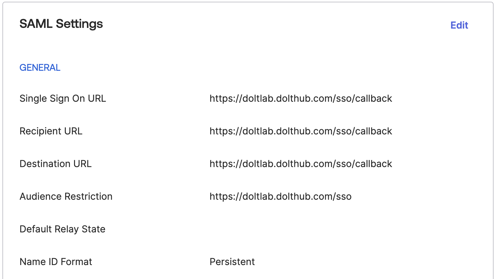
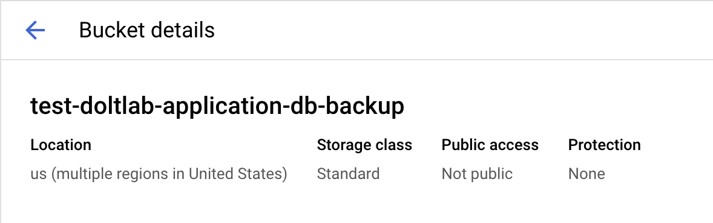

This guide will cover how to run DoltLab in Enterprise mode and use exclusive features not covered in the [Basic Administrator's Guide](./basic.md).

To start DoltLab in Enterprise mode, edit the `installer_config.yaml` file, supplying your Enterprise license keys:

```yaml
enterprise:
  online_product_code: "yourproductcode"
  online_shared_key: "yoursharedkey"
  online_api_key: "yourapikey"
  online_license_key: "yourlicensekey"
```

Save these changes and rerun the [installer](../reference/installer.md) to regenerate DoltLab assets that allow it to run in Enterprise mode.

```bash
./installer
```

Alternatively, you can supply command line flags to the [installer](../reference/installer.md) like so:

```bash
./installer \
... \
--enterprise-online-product-code="yourproductcode" \
--enterprise-online-shared-key="yoursharedkey" \
--enterprise-online-api-key="yourapikey" \
--enterprise-online-license-key="yourlicensekey"
```

The values for these arguments will be provided to you by our DoltLab team. The following contents on this page covers how to configure various Enterprise features for your DoltLab instance.

1. [Use custom Logo on DoltLab instance](#use-custom-logo-on-doltlab-instance)
2. [Customize automated emails](#customize-automated-emails)
3. [Customize DoltLab colors](#customize-doltlab-colors)
4. [Add Super Admins to a DoltLab instance](#add-super-admins-to-a-doltlab-instance)
5. [Configure SAML Single-Sign-on](#configure-saml-single-sign-on)
6. [Automated Remote Backups](#automated-remote-backups)
7. [Deploy DoltLab across multiple hosts](#deploy-doltlab-across-multiple-hosts)

# Use custom logo on DoltLab instance

DoltLab Enterprise allows administrators to customize the logo used across their DoltLab instance. At the time of this writing, custom logos custom logos must have a maximum height of `32px` and a maximum width of `240px`. They will be visible in the top navbar of every page and the footer of some pages, so therefore should work against dark backgrounds. If a custom logo is used on DoltLab, the footer of the DoltLab instance will display the text "Powered by DoltLab [version]" next to the custom logo.

You can use a custom logo on DoltLab by editing `./installer_config.yaml` and providing the path to your custom logo:

```yaml
# installer_config.yaml
enterprise:
  online_product_code: "yourproductcode"
  online_shared_key: "yoursharedkey"
  online_api_key: "yourapikey"
  online_license_key: "yourlicensekey"
  customize:
    logo: /absolute/path/to/custom/logo.png
```

Save these changes and rerun the [installer](../reference/installer.md) to regenerate DoltLab assets that use your custom logo.

```bash
./installer
```

Alternatively, you can run the [installer](../reference/installer.md) with the argument `--custom-logo=/absolute/path/to/custom/logo.png`.

You should see your new logo when you restart (`./start.sh`) your instance.

## Example

We'll use Starbucks as an example. First I need to find a logo that works well with a dark
background. I found a white Starbucks logo and copy that image file over to my DoltLab
host.

I create a `logos` folder on my host and use `scp` to securely copy my logo image.

```bash
$ scp ~/Desktop/starbucks-logo.png ubuntu@54.191.163.60:/home/ubuntu/logos
starbucks-logo.png
```

Note that this will not work if you create the `logos` folder while running `sudo newgrp docker`.

Once my image is there, I can add the absolute path to my image to the installer
configuration file.

```yaml
# installer_config.yaml
enterprise:
  # other enterprise config
  customize:
    logo: /home/ubuntu/logos/starbucks-logo.png
```

Once I save my changes, rerun the installer (`./installer`), and restart (`./start.sh`), I
should see my new Starbucks logo.


# Customize automated emails

DoltLab Enterprise allows administrators to customize the automated emails their DoltLab instance sends to its users.

Custom emails can be configured with the [installer](../reference/installer.md) by editing `./installer_config.yaml` and setting `enterprise.customize.email_templates` to `true`.

```yaml
# installer_config.yaml
enterprise:
  online_product_code: "yourproductcode"
  online_shared_key: "yoursharedkey"
  online_api_key: "yourapikey"
  online_license_key: "yourlicensekey"
  customize:
    email_templates: true
```

Save these changes and rerun the [installer](../reference/installer.md) to generate email template files you can customize, that DoltLab will use.

```bash
./installer
```

Alternatively, you can supply the argument `--custom-email-templates=true` to the [installer](../reference/installer.md) instead.

Once run, the [installer](../reference/installer.md) will generate the email template files at `./doltlabapi/templates/email` which match the files described below. You can customize these files and they will be used by DoltLab. Each file is named according to use-case. The names and paths of these files should NOT be changed.

- `collabInvite.txt` sent to invite user to be a database collaborator.
- `invite.txt` sent to invite a user to join an organization.
- `issueComment.txt` sent to notify user that an issue received a comment.
- `issueState.txt` sent to notify user that an issue's state has changed.
- `pullComment.txt` sent to notify user that a pull request received a comment.
- `pullCommits.txt` sent to notify user that a pull request received a commit.
- `pullReview.txt` sent to notify user that a pull request review's state has changed.
- `pullState.txt` sent to notify user that a pull request's state has changed.
- `recoverPassword.txt` sent to provide user with a link to reset their password.
- `resetPassword.txt` sent to notify a user that their password has been reset.
- `verify.txt` sent to a user to verify their email account.

To alter the text within one of the above files, we recommend only changing the hardcoded text between the [Actions](https://pkg.go.dev/text/template#hdr-Actions) and replacing the use of `{{.App}}`, which normally evaluates to "DoltLab", with the name of your company or team.

You should not change any template definitions, indicated with `{{define "some-template-name"}}` syntax, within these files as `doltlabapi` relies on these specific definitions.

To better illustrate how to modify these files, let's look at an example. Here is the default `verify.txt` template:

```
{{define "verifySubject" -}}
[{{.App}}] Please verify your email address.
{{- end}}

{{define "verifyHTML" -}}
<html>
	<body>
		<p>To secure access to your {{.App}} account, we need you to verify your email address: {{.Address}}.
		<p><a href="{{.BaseURL}}/users/{{.Username}}/emailAddresses/{{.Address}}/verify?token={{.Token}}">Click here to verify your email address.</a>
		<p>You’re receiving this email because you created a new {{.App}} account or added a new email address. If this wasn’t you, please ignore this email.
	</body>
</html>
{{- end}}

{{define "verifyText" -}}
Hi,

To secure access to your {{.App}} account, we need you to verify your email address: {{.Address}}.

Click the link below to verify your email address:

{{.BaseURL}}/users/{{.Username}}/emailAddresses/{{.Address}}/verify?token={{.Token}}

You're receiving the email because you created a new {{.App}} account or added a new email address. If this wasn't you, please ignore this email.
{{- end}}
```

Above, three templates are defined `verifySubject`, `verifyHTML`, and `verifyText`. We will not add or remove any of these templates and we won't change their names, but we will replace the `{{.App}}` field with the name of our company, Acme, Inc.'s DoltLab instance, "AcmeLab". We'll also modify the hardcoded text to be specific to our DoltLab instance's users.

After replacing `{{.App}}` with "AcmeLab", our file looks like:

```
{{define "verifySubject" -}}
[AcmeLab] Please verify your email address.
{{- end}}

{{define "verifyHTML" -}}
<html>
	<body>
		<p>To secure access to your AcmeLab account, we need you to verify your email address: {{.Address}}.
		<p><a href="{{.BaseURL}}/users/{{.Username}}/emailAddresses/{{.Address}}/verify?token={{.Token}}">Click here to verify your email address.</a>
		<p>You’re receiving this email because you created a new AcmeLab account or added a new email address. If this wasn’t you, please ignore this email.
	</body>
</html>
{{- end}}

{{define "verifyText" -}}
Hi,

To secure access to your AcmeLab account, we need you to verify your email address: {{.Address}}.

Click the link below to verify your email address:

{{.BaseURL}}/users/{{.Username}}/emailAddresses/{{.Address}}/verify?token={{.Token}}

You're receiving the email because you created a new AcmeLab account or added a new email address. If this wasn't you, please ignore this email.
{{- end}}
```

Lastly, let's customize this email with the contact information of our AcmeLab admin, in case users have any questions. We want to add the same
information to the `verifyHTML` template and the `verifyText` template so that it appears for either supported email format:

```
{{define "verifySubject" -}}
[AcmeLab] Please verify your email address.
{{- end}}

{{define "verifyHTML" -}}
<html>
	<body>
    <p>Thank you for signing up for AcmeLab!
		<p>To secure access to your AcmeLab account, we need you to verify your email address: {{.Address}}.
		<p><a href="{{.BaseURL}}/users/{{.Username}}/emailAddresses/{{.Address}}/verify?token={{.Token}}">Click here to verify your email address.</a>
		<p>You’re receiving this email because you created a new AcmeLab account or added a new email address. If this wasn’t you, please ignore this email.
    <p> If you need further assistance, please reach out to Kevin at kevin@acmeinc.com.
	</body>
</html>
{{- end}}

{{define "verifyText" -}}
Thank you for signing up for AcmeLab!

To secure access to your AcmeLab account, we need you to verify your email address: {{.Address}}.

Click the link below to verify your email address:

{{.BaseURL}}/users/{{.Username}}/emailAddresses/{{.Address}}/verify?token={{.Token}}

You're receiving the email because you created a new AcmeLab account or added a new email address. If this wasn't you, please ignore this email.

If you need further assistance, please reach out to Kevin at kevin@acmeinc.com.

{{- end}}
```

Once we save our edits, we can restart our DoltLab instance for the changes to take affect.

# Customize DoltLab colors

DoltLab Enterprise allows administrators to customize the color of certain assets across
their DoltLab instance. This is current list of colors that you can customize and what
they are used for:

- `accent_1`: An accent color used sparingly to highlight certain features, such as active tabs.
- `background_accent_1`: An accent background color used often for headers. As the primary
  background color for DoltLab is white/grey and not configurable, is expected that is
  color is dark enough to work with light or white text.
- `background_gradient_start`: A background color used to create a gradient for some
  headers in combination with `background_accent_1`. If you do not want a gradient you can
  use the same value as `background_accent_1`.
- `button_1`: Primary button color.
- `button_2`: Secondary button color, used for hover states.
- `link_1`: Primary link color.
- `link_2`: Secondary link color, used for hover states.
- `link_light`: Tertiary link color, used for links on dark backgrounds.
- `primary`: Primary text color, also used for some outlines.
- `code_background`: Dark background color for code blocks.

Here is a visual guide for where customizable colors are used on the database
page on DoltLab:


In order to configure these customized colors, you'll need the
[RGB](https://en.wikipedia.org/wiki/RGB_color_model) value of each color. Each color value
must include three comma-separated colors. We use dynamic [Tailwind
themes](https://tailwindcss.com/docs/theme) to implement these custom colors. You can
learn more about the specifics of how this is implemented
[here](https://www.dolthub.com/blog/2024-03-20-dynamic-tailwind-themes/).

Once you decide on the color palette, edit the `./installer_config.yaml`, adding:

```yaml
enterprise:
  online_product_code: "yourproductcode"
  online_shared_key: "yoursharedkey"
  online_api_key: "yourapikey"
  online_license_key: "yourlicensekey"
  customize:
    color_overrides:
      rgb_accent_1: "252, 66, 201"
      rgb_background_accent_1: "24, 33, 52"
      rgb_background_gradient_start: "31, 41, 66"
      rgb_button_1: "61, 145, 240"
      rgb_button_2: "31, 109, 198"
      rgb_link_1: "31, 109, 198"
      rgb_link_2: "61, 145, 240"
      rgb_link_light: "109, 176, 252"
      rgb_primary: "0, 0, 0"
      rgb_code_background: "24, 33, 52"
```

Save these changes and rerun the [installer](../reference/installer.md) to regenerate DoltLab assets that use your custom colors.

```bash
./installer
```

Alternatively, you can run the [installer](../reference/installer.md) with the following arguments corresponding to the custom color you want to override:

```bash
./installer \
... \
--custom-color-rgb-accent-1="252, 66, 201" \
--custom-color-rgb-background-accent-1="24, 33, 52" \
--custom-color-rgb-background-gradient-start="31, 41, 66" \
--custom-color-rgb-button-1="61, 145, 240" \
--custom-color-rgb-button-2="31, 109, 198" \
--custom-color-rgb-link-1="31, 109, 198" \
--custom-color-rgb-link-2="61, 145, 240" \
--custom-color-rgb-link-light="109, 176, 252" \
--custom-color-rgb-primary="0, 0, 0" \
--custom-color-rgb-code-background="24, 33, 52"
```

You should see your new colors when you restart (`./start.sh`) your instance.

## Example

Using Starbucks as an example again, we use their [color
guide](https://creative.starbucks.com/color/) to choose some colors to brand our DoltLab
and then add them to the installer configuration.

```yaml
# installer_config.yaml
enterprise:
  # other enterprise config
  customize:
    logo: /home/ubuntu/logos/starbucks-logo.png
    color_overrides:
      rgb_accent_1: "219, 168, 61"
      rgb_background_accent_1: "41, 96, 68"
      rgb_background_gradient_start: "50, 115, 78"
      rgb_button_1: "50, 115, 78"
      rgb_link_1: "50, 115, 78"
      rgb_button_2: "41, 96, 68"
      rgb_link_2: "41, 96, 68"
      rgb_link_light: "216, 232, 226"
      rgb_primary: "36, 56, 50"
      rgb_code_background: "41, 96, 68"
```

I rerun the installer and restart:

```bash
$ ./installer
$ ./start.sh
```

And now DoltLab is Starbucks branded!


See other examples of utilizing colors to brand DoltLab for some well-known companies
[here](https://dolthub.awsdev.ld-corp.com/blog/2024-05-23-customizing-doltlab-colors/#other-examples).

# Add Super Admins to a DoltLab instance

DoltLab Enterprise allows administrators to specify users who will be "super admins" on their DoltLab instance.

A DoltLab "super admin" is a user granted unrestricted access and the highest possibly permission level on all organizations, teams, and databases on a DoltLab instance. This allows these users to write to any database, public or private, merge pull-requests, delete databases and add or remove organization/team members. By default there are no "super admins" registered on a DoltLab instance, including the default user `admin`.

Super admins can be configured by editing the `./installer_config.yaml` file and specifying the email addresses for users you want to be super admins.

```yaml
# installer_config.yaml
enterprise:
  online_product_code: "yourproductcode"
  online_shared_key: "yoursharedkey"
  online_api_key: "yourapikey"
  online_license_key: "yourlicensekey"
  super_admins: ["me@email.com", "you@email.com"]
```

Alternatively, you can use the [installer](../reference/installer.md) with the argument `--super-admin-email` instead. This argument can be supplied multiple times, for example:

```bash
./installer \
...
--super-admin-email=me@email.com \
--super-admin-email=you@email.com
```

# Configure SAML Single-Sign-On

DoltLab Enterprise supports SAML single-sign-on. To configure your DoltLab instance to use single-sign-on, you will first need an Identity Provider (IP) to provide you with a metadata descriptor.

For example, [Okta](https://www.okta.com/), a popular IP, provides an endpoint for downloading the metadata descriptor for a SAML application after you register an application on their platform.


During registration, Okta will ask you for the "Single Sign On Url" and an "Audience Restriction" for the application.

Use the domain/host IP address of your DoltLab instance followed by `/sso/callback` for the "Single Sign On Url", and use that same domain/host IP address followed by just "/sso" for the "Audience Restriction". Since this example will be for `https://doltlab.dolthub.com`, we'll use `https://doltlab.dolthub.com/sso/callback` and `https://doltlab.dolthub.com/sso` respectively.



Be sure to also set "Name ID Format" to "Persistent".

Then, download the metadata Okta provides for this application to your DoltLab host.

Next, edit `./installer_config.yaml` with the path to the metadata descriptor and the common name to use when generating the saml certificate.

```yaml
# installer_config.yaml
enterprise:
  online_product_code: "yourproductcode"
  online_shared_key: "yoursharedkey"
  online_api_key: "yourapikey"
  online_license_key: "yourlicensekey"
  saml:
    metadata_descriptor_file: "/absolute/path/to/downloaded/metadata/descriptor"
    cert_common_name: "mydoltlabinstance"
```

Save these changes and rerun the [installer](../reference/installer.md) to regenerate DoltLab assets the enable saml single-sign-on.

```bash
./installer
```

Alternatively, the [installer](../reference/installer.md) can be run with the following arguments to do the same thing:

```bash
./installer \
...
--sso-saml-metadata-descriptor=/absolute/path/to/downloaded/metadata/descriptor \
--sso-saml-cert-common-name="mydoltlabinstance"
```

When SAML single-sign-on is configured, you will see the SAML option on the sign-in page:


Next, as user `admin`, login to your DoltLab instance and navigate to `Profile` > `Settings` > `SSO`.


On this tab you will see the following:


`Assertion Consumer Service Url` displays the url where Okta should send the SAML assertion.

`Entity ID/Login Url` displays the url users can use to login to DoltLab using the IP, but they can now simply use the option available on the sign-in page.

`IP Metadata Descriptor` is a metadata descriptor for this DoltLab instance, and can be downloaded and supplied to the IP if it requires service providers to upload metadata.

`Certificate` can be downloaded if you want to add a signature certificate to the IP to verify the digital signatures.

Your Enterprise instance will now use single-sign-on through your IP for user login and account creation.

# Automated Remote Backups

DoltLab Enterprise supports automated database backups for DoltLab's application Dolt server. To backup database data of all the Dolt databases hosted on your DoltLab instance, we recommend taking regular snapshots of the host's filesystem.

To configure your DoltLab instance to automatically back up its Dolt database server, first, provision either a GCP bucket or and AWS S3 bucket and Dynamo DB table. You will need these to resources to create a remote backup. Oracle Cloud Infrastucture (OCI) storage buckets may be used as well.

Dolt supports a [backup](https://docs.dolthub.com/sql-reference/server/backups#dolt-backup-command) command which can be used to create backups of a Dolt instance.

Let's walk through setting up automated backups using an AWS remote backup first.

## AWS Remote Backup

Dolt can use an [AWS Remote](https://www.dolthub.com/blog/2021-07-19-remotes/) as a backup destination, but requires that two resources be provisioned. As stated in [this helpful blog post](https://www.dolthub.com/blog/2021-07-19-remotes/#aws-remotes), "AWS remotes use a combination of Dynamo DB and S3. The Dynamo table can be created with any name but must have a primary key with the name `db`."

For our example, let's create an AWS S3 bucket called `test-doltlab-application-db-backups`.


Let's also create a Dynamo DB table in the same AWS region, and call it `test-doltlab-backup-application-db-manifest`. Notice its uses the required partition key (primary key) `db`.


The AWS remote url for our DoltLab instance which is determined by the template `aws://[dolt_dynamo_table:dolt_remotes_s3_storage]/backup_name`, will be `aws://[test-doltlab-backup-application-db-manifest:test-doltlab-application-db-backups]/my_doltlab_backup`.

We've also granted read and write access for these resources to an IAM role called `DoltLabBackuper`.

It's now time to update our DoltLab instance configuration to automatically backup it's Dolt server data to our AWS remote.

First, ensure that the AWS credentials on the DoltLab host can be used to assume the role `DoltLabBackuper`. Create a AWS config file that contains:

```
[profile doltlab_backuper]
role_arn = arn:aws:iam::<aws account number>:role/DoltLabBackuper
region = <aws region>
source_profile = default
```

Then use the AWS CLI to confirm this profile can be used on your DoltLab host:

```
AWS_SDK_LOAD_CONFIG=1 \
AWS_REGION=<aws region> \
AWS_CONFIG_FILE=<path to config file> \
AWS_SDK_LOAD_CONFIG=1 \
AWS_PROFILE=doltlab_backuper \
aws sts get-caller-identity
{
    "UserId": "<user id>:botocore-session-1700511795",
    "Account": <aws account number>,
    "Arn": "arn:aws:sts::<aws account number>:assumed-role/DoltLabBackuper/botocore-session-1700511795"
}
```

Next, edit the `./installer_config.yaml` file to configure automated backups.

```yaml
# installer_config.yaml
enterprise:
  online_product_code: "yourproductcode"
  online_shared_key: "yoursharedkey"
  online_api_key: "yourapikey"
  online_license_key: "yourlicensekey"
  automated_backups:
    remote_url: "aws://[test-doltlab-backup-application-db-manifest:test-doltlab-application-db-backups]/my_doltlab_backup"
    aws_region: "aws-region"
    aws_profile: "doltlab_backuper"
    aws_shared_credentials_file: "/absolute/path/to/aws/credentials"
    aws_config_file: "/absolute/path/to/aws/config"
```

Save these edits and rerun the [installer](../reference/installer.md) to regenerate DoltLab assets that will automatically backup `doltlabdb` to AWS.

```bash
./installer
```

Alternatively, run the [installer](../reference/installer.md) with the following arguments to configure the AWS backup:

```bash
./installer \
...
--automated-dolt-backups-url="aws://[test-doltlab-backup-application-db-manifest:test-doltlab-application-db-backups]/my_doltlab_backup" \
--aws-shared-credentials-file="/absolute/path/to/aws/credentials" \
--aws-config-file="/absolute/path/to/aws/config" \
--aws-region="aws-region" \
--aws-profile="doltlab_backuper"
```

DoltLab will use a combination of Prometheus and Alertmanager to notify you if your regularly scheduled backup fails for some reason. You'll need to edit the Alertmanager configuration file generated by the [installer](../reference/installer.md) at `./alertmanager/alertmanager.yaml` and include your SMTP authentication information in the `global` section. The other sections do not need to be edited:

```yaml
global:
  smtp_from: no-reply@example.com
  smtp_auth_username: my-username
  smtp_auth_password: ******
  smtp_smarthost: smtp.gmail.com:587

receivers:
  - name: doltlab-admin-email
    email_configs:
      - to: me@example.com
        send_resolved: true

route:
  receiver: "doltlab-admin-email"
  group_wait: 30s
  group_interval: 2m
  repeat_interval: 4h
  routes:
    - receiver: "doltlab-admin-email"
      group_by: [alertname]
      matchers:
        - app =~ "backup-syncer"
        - severity =~ "page|critical"
```

For more configuration options, please consult the [AlertManager documentaion](https://prometheus.io/docs/alerting/latest/configuration/).

Finally, start DoltLab using the `./start.sh` script. DoltLab will create the first backup when started, and by default, will create backups at midnight each night. You will see your backups stored in your S3 bucket, and the manifest stored in your DynamoDB table.


Your DoltLab's Dolt server is now automatically backing up to your AWS remote.

## GCP Remote Backup

To backup DoltLab's Dolt server to a GCP remote, first create a bucket in GCP. This will be the only required resource needed.



Next, add GCP JSON credentials to your DoltLab host. You can find information about GCP credentials [here](https://cloud.google.com/sdk/gcloud/reference/auth/application-default/login).

Following the Dolt's url template for GCP remotes as outlined in [this blog](https://www.dolthub.com/blog/2021-07-19-remotes/#gcp-remotes), the remote url we will use for this bucket will be `gs://test-doltlab-application-db-backup/my_doltlab_backup`.

Next, edit `./installer_config.yaml` and supply your GCP remote information.

```yaml
# installer_config.yaml
enterprise:
  online_product_code: "yourproductcode"
  online_shared_key: "yoursharedkey"
  online_api_key: "yourapikey"
  online_license_key: "yourlicensekey"
  automated_backups:
    remote_url: "gs://test-doltlab-application-db-backup/my_doltlab_backup"
    google_credentials_file: "/absolute/path/to/gcloud/credentials"
```

Save these edits and rerun the [installer](../reference/installer.md) to regenerate DoltLab assets that will automatically backup `doltlabdb` to AWS.

```bash
./installer
```

Alternatively, run the [installer](../reference/installer.md) with the following arguments to create automated GCP backups:

```bash
./installer \
...
--automated-dolt-backups-url="gs://test-doltlab-application-db-backup/my_doltlab_backup" \
--google-creds-file="/absolute/path/to/gcloud/credentials"
```

Finally, edit the `./alertmanager/alertmanager.yaml` file generated by the [installer](../reference/installer.md), as shown in the AWS backups section, to receive notifications of backup failures.

Once you start your Enterprise instance with `./start.sh`, it will now automatically back up its application Dolt server to your GCP bucket.


## OCI Remote Backup

To backup DoltLab's Dolt server to an OCI remote, first create a bucket in OCI. This will be the only required resource needed.


Next, install the `oci` CLI tool on your DoltLab host, and run `oci setup config` to create a configuration file with credentials authorized to access your bucket. You can find information about creating an config file [here](https://docs.oracle.com/en-us/iaas/Content/API/SDKDocs/cliinstall.htm#configfile).

`oci setup config` will create a config file and private key file that you will then need to mount into the `doltlabdb` container.

First, edit the generated config file so that the `key_file` field contains the absolute path of where the generate key file will be mounted in the `doltlabdb` container.

```
[DEFAULT]
user=ocid1.user.oc1..<unique_ID>
fingerprint=<your_fingerprint>
key_file=/oci_private_key.pem
tenancy=ocid1.tenancy.oc1..<unique_ID>
region=us-ashburn-1
```

In the above example, we've changed `key_file` to point to `/oci_private_key.pem`, where DoltLab will mount the private key file. Save these changes.

Following the Dolt's url template for OCI remotes as outlined in [this blog](https://www.dolthub.com/blog/2021-07-19-remotes/#oci-remotes), the remote url we will use for this bucket will be `oci://test-doltlab-application-db-backup/my_doltlab_backup`.

Next, edit `./installer_config.yaml` and supply your OCI remote information.

```yaml
# installer_config.yaml
enterprise:
  online_product_code: "yourproductcode"
  online_shared_key: "yoursharedkey"
  online_api_key: "yourapikey"
  online_license_key: "yourlicensekey"
  automated_backups:
    remote_url: "oci://test-doltlab-application-db-backup/my_doltlab_backup"
    oci_config_file: "/absolute/path/to/oci/config"
    oci_key_file: "/absolute/path/to/oci/private/key.pem"
```

Save these edits and rerun the [installer](../reference/installer.md) to regenerate DoltLab assets that will automatically backup `doltlabdb` to OCI.

```bash
./installer
```

Alternatively, you can run the [installer](../reference/installer.md) with the following arguments to configure the OCI backups:

```bash
./installer \
...
--automated-dolt-backups-url="oci://test-doltlab-application-db-backup/my_doltlab_backup" \
--oci-config-file="/absolute/path/to/oci/config" \
--oci-key-file="/absolute/path/to/oci/private/key.pem"
```

Finally, edit the `./alertmanager/alertmanager.yaml` file generated by the [installer](../reference/installer.md), as shown in the AWS backups section, to receive notifications of backup failures.

Once you start your Enterprise instance with `./start.sh`, it will now automatically back up its application Dolt server to your OCI bucket.


# Deploy DoltLab across multiple hosts

DoltLab's services can be deployed across multiple hosts which allow DoltLab's services to be scaled independently.

The following guide will walkthrough deploying a DoltLab instance whose set of services each run on separate host machines.


The diagram above depicts the multi-host architecture for DoltLab. Each independent service runs on a distinct host, and is served behind it's own reverse proxy. Both the service and the proxy run via Docker compose, and are easily configured using the [installer](../reference/installer.md). At the time of this writing, multi-host deployments are only available over `http`. For `https` support, please [file an issue in our issues repository](https://github.com/dolthub/doltlab-issues).

To get started with a DoltLab multi-host deployment, you'll need to provision a host per DoltLab service. Here are our hardware recommendations for each service:

- `doltlabdb`, DoltLab's Dolt database, requires a host with at least 2 CPU, 4GB of memory, and 15GB of disk.
- `doltlabfileserviceapi`, DoltLab's service for managing user uploads, requires a host with at least 2 CPU, 4GB of memory, and 50GB of disk.
- `doltlabremoteapi`, DoltLab's service for managing database data, requires a host with at least 2 CPU, 4GB of memory, and 200GB of disk.
- `doltlabapi`, DoltLab's main API, requires a host with at least 4 CPU, 16GB of memory, and 50GB of disk.
- `doltlabgraphql`, DoltLab's data transformation layer, requires a host with at least 2 CPU, 4GB of memory, and 10GB of disk.
- `doltlabui`, DoltLab's frontend, requires a host with at least 2 CPU, 4GB of memory, and 10GB of disk.

When provisioning the hosts for each service, change the networking settings on each host so that the ports specified below are open for ingress. You will also need to ensure that each host has a publicly reachable IP address:

- `doltlabdb`, port `3306`.
- `doltlabfileserviceapi`, port `4321`.
- `doltlabremoteapi`, ports `50051` and `100`.
- `doltlabapi`, ports `9443` and `9444`.
- `doltlabgraphql`, port `9000`.
- `doltlabui`, port `80`.

Before continuing you will need to document the public IP of each host associated with each DoltLab service, as it will be referenced in different places throughout this process.

For this walkthrough I will use the following IP's for each DoltLab service:

- `doltlabdb`, `52.43.136.146`.
- `doltlabfileserviceapi`, `34.221.204.184`.
- `doltlabremoteapi`, `34.222.48.69`.
- `doltlabapi`, `35.91.149.175`.
- `doltlabgraphql`, `35.91.70.84`.
- `doltlabui`, `35.94.142.32`.

Once the hosts are provisioned and running, you will need to download the latest version of DoltLab on each host, and install `unzip`:

```bash
# download DoltLab
curl -LO https://doltlab-releases.s3.amazonaws.com/linux/amd64/doltlab-latest.zip

# install unzip
sudo apt install unzip
```

You can then unzip DoltLab's contents and install it's dependencies using the installation script generated by the [installer](../reference/installer.md).

```bash
# unzip DoltLab contents
unzip doltlab-latest.zip -d doltlab
cd doltlab

# generate installation script
./installer --ubuntu

# run installation script
./ubuntu_install.sh
```

Again, you should complete this process on each host before moving on to the subsequent steps.

Next, we will use the [installer](../reference/installer.md) to configure the separate services on each host in the following order:

- `doltlabdb`
- `doltlabapi`
- `doltlabremoteapi`
- `doltlabfileserviceapi`
- `doltlabgraphql`
- `doltlabui`

## doltlabdb

Starting with your `doltlabdb` host and from within the unzipped `doltlab` directory, ensure that Docker can run without the `sudo` command by running:

```bash
sudo newgrp docker
```

Next, edit the `./installer_config.yaml` and set `enterprise.multihost.doltlabdb_only` to `true`.

```yaml
# installer_config.yaml

services:
  doltlabdb:
    dolthubapi_password: "9jjalvilpiod0n5u4q30"
    admin_password: "1H8srd1QVbBbG1pJRcpP"

enterprise:
  online_product_code: "yourproductcode"
  online_shared_key: "yoursharedkey"
  online_api_key: "yourapikey"
  online_license_key: "yourlicensekey"
  multihost:
    doltlabdb_only: true
```

Save these changes and rerun the [installer](../reference/installer.md) to regenerate DoltLab assets that will make this deployment `doltlabdb` only.

```bash
./installer
```

Alternatively, run the [installer](../reference/installer.md) with the `--doltlabdb-only` argument. Be sure to also supply the arguments for DoltLab Enterprise mode, as those are required as well.

```bash
./installer \
--enterprise-online-product-code=your_product_code \
--enterprise-online-api-key=your_api_key \
--enterprise-online-shared-key=your_shared_key \
--enterprise-online-license-key=your_license_key \
--doltlabdb-only \
--doltlabdb-admin-password="1H8srd1QVbBbG1pJRcpP" \
--doltlabdb-dolthubapi-password="9jjalvilpiod0n5u4q30"
```

`services.doltlabdb.admin_password`, or `--doltlabdb-admin-password`, is required and is used to create user `dolthubadmin`.</br>
`services.doltlabdb.dolthubapi_password`, or `--doltlabdb-dolthubapi-password`, is required and is used to create user `dolthubapi`.</br>

Running the [installer](../reference/installer.md) will produce output like the following:

```bash
2024-05-06T20:13:52.080Z	INFO	cmd/main.go:519	Successfully configured DoltLab	{"version": "v2.1.4"}

2024-05-06T20:13:52.081Z	INFO	cmd/main.go:525	To start DoltLab, use:	{"script": "/home/ubuntu/doltlab/start.sh"}
2024-05-06T20:13:52.082Z	INFO	cmd/main.go:530	To stop DoltLab, use:	{"script": "/home/ubuntu/doltlab/stop.sh"}
```

When the generated `./start.sh` script runs for the first time, the `doltlabdb` database is initialized with two users, `dolthubadmin` and `dolthubapi`. Their passwords are the values of `services.doltlabdb.admin_password` (--doltlabdb-admin-password) and `services.doltlabdb.dolthubapi_password` (--doltlabdb-dolthubapi-password), respectively.

DoltLab's main API will connect to `doltlabdb` as the user `dolthubapi`, so you will need to make note of this password for use later on.

Now start `doltlabdb` by running `./start.sh`:

```bash
./start.sh
```

You can see the running services by running `docker ps`:

```bash
docker ps
CONTAINER ID   IMAGE                                                   COMMAND                  CREATED              STATUS              PORTS                                                  NAMES
1f5483db7c97   public.ecr.aws/dolthub/doltlab/dolt-sql-server:v2.1.4   "tini -- docker-entr…"   About a minute ago   Up About a minute   0.0.0.0:3306->3306/tcp, :::3306->3306/tcp, 33060/tcp   doltlab-doltlabdb-1
```

## doltlabapi

Now connect to your `doltlabapi` host, `cd` into the `doltlab` directory, and ensure you can use `docker` without `sudo` by running:

```bash
sudo newgrp docker
```

Edit the `./installer_config.yaml` and set `enterprise.multihost.doltlabapi_only` to `true`, as well as specifying the other required fields/sections.

```yaml
# installer_config.yaml

host: "35.91.149.175"

services:
  doltlabdb:
    host: "52.43.136.146"
    port: 3306
    dolthubapi_password: "9jjalvilpiod0n5u4q30"

  doltlabremoteapi:
    host: "34.222.48.69"
    port: 50051
    file_server_port: 100

  doltlabfileserviceapi:
    host: "34.221.204.184"
    port: 4321

  doltlabui:
    host: "35.94.142.32"
    port: 80

default_user:
  email: "me@email.com"

smtp:
  host: "smtp.email.com"
  port: 587
  auth_method: "plain"
  username: "******"
  password: "************"
  no_reply_email: me@email.com

enterprise:
  online_product_code: "yourproductcode"
  online_shared_key: "yoursharedkey"
  online_api_key: "yourapikey"
  online_license_key: "yourlicensekey"
  multihost:
    doltlabapi_only: true
```

Save these changes and rerun the [installer](../reference/installer.md) to regenerate DoltLab assets that will make this deployment `doltlabapi` only.

```bash
./installer
```

Alternatively, you can run the [installer](../reference/installer.md) with the `--doltlabapi-only` flag and the other required arguments in order to configure the `doltlabapi` instance.

```bash
./installer \
--enterprise-online-product-code=your_product_code \
--enterprise-online-api-key=your_api_key \
--enterprise-online-shared-key=your_shared_key \
--enterprise-online-license-key=your_license_key \
--doltlabapi-only \
--host=35.91.149.175 \
--doltlabdb-host=52.43.136.146 \
--doltlabdb-port=3306 \
--doltlabremoteapi-host=34.222.48.69 \
--doltlabremoteapi-port=50051 \
--doltlabremoteapi-file-server-port=100 \
--doltlabfileserviceapi-host=34.221.204.184 \
--doltlabfileserviceapi-port=4321 \
--doltlabui-host=35.94.142.32 \
--doltlabui-port=80 \
--doltlabdb-dolthubapi-password="9jjalvilpiod0n5u4q30" \
--smtp-host=smtp.email.com \
--smtp-port=587 \
--smtp-auth-method=plain \
--smtp-username=****** \
--smtp-password=************ \
--no-reply-email=me@email.com \
--default-user-email=me@email.com
```

`host`, or `--host`, is required and should be the IP address of the `doltlabapi` host. </br>
`services.doltlabdb.host`, or `--doltlabdb-host` is required and is the IP address of the `doltlabdb` host.</br>
`services.doltlabdb.port`, or `--doltlabdb-port`, is required and should be the value `3306`. This port value should not be changed.</br>
`services.doltlabremoteapi.host`, or `--doltlabremoteapi-host`, is required and is the IP address of the `doltlabremoteapi` host.</br>
`services.doltlabremoteapi.port`, or `--doltlabremoteapi-port`, is required and should be the value `50051`. This port value should not be changed.</br>
`services.doltlabremoteapi.file_server_port`, or `--doltlabremoteapi-file-server-port`, is required and should be the value `100`. This port value should not be changed.</br>
`services.doltlabfileserviceapi.host`, or `--doltlabfileserviceapi-host`, is required and is the IP address of the `doltlabfileserviceapi` host.</br>
`services.doltlabfileserviceapi.port`, or `--doltlabfileserviceapi-port`, is required and should be the value `4321`. This port value should not be changed.</br>
`services.doltlabui.host`, or `--doltlabui-host`, is required and is the IP address of the `doltlabui` host.</br>
`services.doltlabui.port`, or `--doltlabui-port`, is required and should be the value `80`. This port value should not be changed.</br>
`services.doltlabdb.dolthubapi_password`, or `--doltlabdb-dolthubapi-password`, is required and should be the `services.doltlabdb.dolthubapi_password` value defined on the `doltlabdb` host.</br>
`smtp.host`, or `--smtp-host`, is optional and is the host name of an SMTP server. It is only required if users other than `admin` will be using the DoltLab instance. See [connecting DoltLab to an SMTP server](./basic.md#connect-smtp-server) for more information.</br>
`smtp.port`, or `--smtp-port`, is optional and is the port of an SMTP server. It is only required if users other than `admin` will be using the DoltLab instance. See [connecting DoltLab to an SMTP server](./basic.md#connect-smtp-server) for more information.</br>
`smtp.auth_method`, or `--smtp-auth-method`, is optional and is the authentication method supported by the SMTP server. It is only required if users other than `admin` will be using the DoltLab instance. See [connecting DoltLab to an SMTP server](./basic.md#connect-smtp-server) for more information.</br>
`smtp.username`, or `--smtp-username`, is required for authentication method `plain`, and is the username used to connect to the SMTP server.</br>
`smtp.password`, or `--smtp-password`, is required for authentication method `plain`, and is the password used to connect to the SMTP server.</br>
`smtp.no_reply_email`, or `--no-reply-email`, is optional and is the email used to send automated DoltLab emails. It is only required if users other that `admin` will be using the DoltLab instance. See [connecting DoltLab to an SMTP server](./basic.md#connect-smtp-server) for more information.</br>
`default_user.email`, or `--default-user-email`, is optional and is the email address to associate with the [default user](./installation/start-doltlab.md) `admin`.</br>

After running the [installer](../reference/installer.md), you will see output like the following:

```bash
2024-05-06T21:06:19.124Z	INFO	cmd/main.go:519	Successfully configured DoltLab	{"version": "v2.1.4"}

2024-05-06T21:06:19.125Z	INFO	cmd/main.go:525	To start DoltLab, use:	{"script": "/home/ubuntu/doltlab/start.sh"}
2024-05-06T21:06:19.126Z	INFO	cmd/main.go:530	To stop DoltLab, use:	{"script": "/home/ubuntu/doltlab/stop.sh"}
```

You can now run `./start.sh`:

```bash
./start.sh
```

Running `docker ps` will show the running services:

```bash
docker ps
CONTAINER ID   IMAGE                                                     COMMAND                  CREATED              STATUS
14b440a088c1   public.ecr.aws/dolthub/doltlab/dolthubapi-server:v2.1.4   "/app/go/services/do…"   About a minute ago   Up About a minute                                                                                                                                                                    doltlab-doltlabapi-1
6215f1c26441   envoyproxy/envoy:v1.28-latest                             "/docker-entrypoint.…"   38 minutes ago       Up About a minute   0.0.0.0:2001->2001/tcp, :::2001->2001/tcp, 0.0.0.0:9443-9444->9443-9444/tcp, :::9443-9444->9443-9444/tcp, 0.0.0.0:9901->9901/tcp, :::9901->9901/tcp, 10000/tcp   doltlab-doltlabenvoy-1
```

## doltremoteapi

Now connect to your `doltlabremoteapi` host, `cd` into the `doltlab` directory, and ensure you can use `docker` without `sudo` by running:

```bash
sudo newgrp docker
```

Edit the `./installer_config.yaml` and set `enterprise.multihost.doltlabremoteapi_only` to `true`, as well as specifying the other required fields/sections.

```yaml
# installer_config.yaml

host: "34.222.48.69"

services:
  doltlabapi:
    host: "35.91.149.175"
    port: 9443

enterprise:
  online_product_code: "yourproductcode"
  online_shared_key: "yoursharedkey"
  online_api_key: "yourapikey"
  online_license_key: "yourlicensekey"
  multihost:
    doltlabremoteapi_only: true
```

Save these changes and rerun the [installer](../reference/installer.md) to regenerate DoltLab assets that will make this deployment `doltlabremoteapi` only.

```bash
./installer
```

Alternatively, run the [installer](../reference/installer.md) with the `--doltlabremoteapi-only` flag and the other required arguments in order to configure the `doltlabremoteapi` instance.

```bash
./installer \
--enterprise-online-product-code=yourproductcode \
--enterprise-online-api-key=yourapikey \
--enterprise-online-shared-key=yoursharedkey \
--enterprise-online-license-key=yourlicensekey \
--doltlabremoteapi-only \
--host=34.222.48.69 \
--doltlabapi-host=35.91.149.175 \
--doltlabapi-port=9443
```

`host`, or `--host`, is required and should be the IP address of the `doltlabremoteapi` host. </br>
`services.doltlabapi.host`, or `--doltlabapi-host`, is required and should be the IP address of the `doltlabapi` host. </br>
`services.doltlabapi.port`, or `--doltlabapi-port`, is required and the value should be `9443`. This port value should not be changed. </br>

You can now run `./start.sh`:

```bash
./start.sh
```

Running `docker ps` will show the running services:

```bash
3bef32ba8c14   public.ecr.aws/dolthub/doltlab/doltremoteapi-server:v2.1.4   "/app/go/services/do…"   10 seconds ago   Up 8 seconds                                                                                                                                                                                                                                      doltlab-doltlabremoteapi-1
eba5520bcf10   envoyproxy/envoy:v1.28-latest                                "/docker-entrypoint.…"   12 seconds ago   Up 9 seconds   0.0.0.0:100->100/tcp, :::100->100/tcp, 0.0.0.0:2001->2001/tcp, :::2001->2001/tcp, 0.0.0.0:7770->7770/tcp, :::7770->7770/tcp, 0.0.0.0:9901->9901/tcp, :::9901->9901/tcp, 0.0.0.0:50051->50051/tcp, :::50051->50051/tcp, 10000/tcp   doltlab-doltlabenvoy-1
```

## doltlabfileserviceapi

Now connect to your `doltlabfileserviceapi` host, `cd` into the `doltlab` directory, and ensure you can use `docker` without `sudo` by running:

```bash
sudo newgrp docker
```

Edit the `./installer_config.yaml` and set `enterprise.multihost.doltlabfileserviceapi_only` to `true`, as well as specifying the other required fields/sections.

```yaml
# installer_config.yaml

services:
  doltlabapi:
    host: "35.91.149.175"
    port: 9443

  doltlabremoteapi:
    host: "34.222.48.69"
    port: 50051

  doltlabui:
    host: "35.94.142.32"

enterprise:
  online_product_code: "yourproductcode"
  online_shared_key: "yoursharedkey"
  online_api_key: "yourapikey"
  online_license_key: "yourlicensekey"
  multihost:
    doltlabfileserviceapi_only: true
```

Save these changes and rerun the [installer](../reference/installer.md) to regenerate DoltLab assets that will make this deployment `doltlabfileserviceapi` only.

```bash
./installer
```

Alternatively, run the [installer](../reference/installer.md) with the `--doltlabfileserviceapi-only` flag and the other required arguments in order to configure the `doltlabfileserviceapi` instance.

```bash
./installer \
--enterprise-online-product-code=yourproductcode \
--enterprise-online-api-key=yourapikey \
--enterprise-online-shared-key=yoursharedkey \
--enterprise-online-license-key=yourlicensekey \
--doltlabfileserviceapi-only \
--doltlabapi-host=35.91.149.175 \
--doltlabapi-port=9443 \
--doltlabremoteapi-host=34.222.48.69 \
--doltlabremoteapi-port=50051 \
--doltlabui-host=35.94.142.32
```

`services.doltlabapi.host`, or `--doltlabapi-host`, is required and should be the IP address of the `doltlabapi` host. </br>
`services.doltlabapi.port`, or `--doltlabapi-port`, is required and should be the value `9443`. This port value should not be changed. </br>
`services.doltlabremoteapi.host`, or `--doltlabremoteapi-host`, is required and should be the IP address of the `doltlabremoteapi` host. </br>
`services.doltlabremoteapi.port`, or `--doltlabremoteapi-port`, is required and should be the value `50051`. This port value should not be changed. </br>
`services.doltlabui.host`, or `--doltlabui-host`, is required and should be the IP address of the `doltlabui` host. </br>

You can now run `./start.sh`:

```bash
./start.sh
```

Running `docker ps` will show the running services:

```bash
docker ps
CONTAINER ID   IMAGE                                                         COMMAND                  CREATED         STATUS         PORTS                                                                                                                                        NAMES
cba4ed0160c6   public.ecr.aws/dolthub/doltlab/fileserviceapi-server:v2.1.4   "/app/go/services/fi…"   5 seconds ago   Up 3 seconds                                                                                                                                                doltlab-doltlabfileserviceapi-1
109bcbe3a254   envoyproxy/envoy:v1.28-latest                                 "/docker-entrypoint.…"   6 seconds ago   Up 3 seconds   0.0.0.0:2001->2001/tcp, :::2001->2001/tcp, 0.0.0.0:4321->4321/tcp, :::4321->4321/tcp, 0.0.0.0:9901->9901/tcp, :::9901->9901/tcp, 10000/tcp   doltlab-doltlabenvoy-1
```

## doltlabgraphql

Now connect to your `doltlabgraphql` host, `cd` into the `doltlab` directory, and ensure you can use `docker` without `sudo` by running:

```bash
sudo newgrp docker
```

Edit the `./installer_config.yaml` and set `enterprise.multihost.doltlabgraphql_only` to `true`, as well as specifying the other required fields/sections.

```yaml
# installer_config.yaml

services:
  doltlabapi:
    host: "35.91.149.175"
    port: 9443

enterprise:
  online_product_code: "yourproductcode"
  online_shared_key: "yoursharedkey"
  online_api_key: "yourapikey"
  online_license_key: "yourlicensekey"
  multihost:
    doltlabgraphql_only: true
```

Save these changes and rerun the [installer](../reference/installer.md) to regenerate DoltLab assets that will make this deployment `doltlabgraphql` only.

```bash
./installer
```

Alternatively, run the [installer](../reference/installer.md) with the `--doltlabgraphql-only` flag and the other required arguments in order to configure the `doltlabgraphql` instance.

```bash
./installer \
--enterprise-online-product-code=yourproductcode \
--enterprise-online-api-key=yourapikey \
--enterprise-online-shared-key=yoursharedkey \
--enterprise-online-license-key=yourlicensekey \
--doltlabgraphql-only \
--doltlabapi-host=35.91.149.175 \
--doltlabapi-port=9443
```

`services.doltlabapi.host`, or `--doltlabapi-host`, is required and should be the IP address of the `doltlabapi` host. </br>
`services.doltlabapi.port`, `--doltlabapi-port`, is required and should be the value `9443`. This port value should not be changed. </br>

You can now run `./start.sh`:

```bash
./start.sh
```

Running `docker ps` will show the running services:

```bash
docker ps
CONTAINER ID   IMAGE                                                             COMMAND                  CREATED          STATUS          PORTS                                                                                                                                        NAMES
243caaad3540   public.ecr.aws/dolthub/doltlab/dolthubapi-graphql-server:v2.1.4   "docker-entrypoint.s…"   58 seconds ago   Up 57 seconds   9000/tcp                                                                                                                                     doltlab-doltlabgraphql-1
0d656cf21fd3   envoyproxy/envoy:v1.28-latest                                     "/docker-entrypoint.…"   59 seconds ago   Up 57 seconds   0.0.0.0:2001->2001/tcp, :::2001->2001/tcp, 0.0.0.0:9000->9000/tcp, :::9000->9000/tcp, 0.0.0.0:9901->9901/tcp, :::9901->9901/tcp, 10000/tcp   doltlab-doltlabenvoy-1
```

## doltlabui

Now connect to your `doltlabui` host, `cd` into the `doltlab` directory, and ensure you can use `docker` without `sudo` by running:

```bash
sudo newgrp docker
```

Edit the `./installer_config.yaml` and set `enterprise.multihost.doltlabui_only` to `true`, as well as specifying the other required fields/sections.

```yaml
# installer_config.yaml

services:
  doltlabapi:
    host: "35.91.149.175"
    csv_port: 9444

  doltlabgraphql:
    host: "35.91.70.84"
    port: 9000

enterprise:
  online_product_code: "yourproductcode"
  online_shared_key: "yoursharedkey"
  online_api_key: "yourapikey"
  online_license_key: "yourlicensekey"
  multihost:
    doltlabui_only: true
```

Save these changes and rerun the [installer](../reference/installer.md) to regenerate DoltLab assets that will make this deployment `doltlabui` only.

```bash
./installer
```

Run the [installer](../reference/installer.md) with the `--doltlabui-only` flag and the other required arguments in order to configure the `doltlabui` instance.

```bash
./installer \
--enterprise-online-product-code=yourproductcode \
--enterprise-online-api-key=yourapikey \
--enterprise-online-shared-key=yoursharedkey \
--enterprise-online-license-key=yourlicensekey \
--doltlabui-only \
--doltlabapi-host=35.91.149.175 \
--doltlabapi-csv-port=9444 \
--doltlabgraphql-port=9000 \
--doltlabgraphql-host=35.91.70.84
```

`services.doltlabapi.host`, or `--doltlabapi-host`, is required and should be the IP address of the `doltlabapi` host. </br>
`services.doltlabapi.csv_port`, or `--doltlab-csv-port`, is required and should be the value `9444`. This port value should not be changed. </br>
`services.doltlabgraphql.port`, or `--doltlabgrapqhl-port`, is required and should be the value `9000`. This port value should not be changed. </br>
`services.doltlabgraphql.host`, or `--doltlabgraphql-host`, is required and should be the IP address of the `doltlabgraphql` host. </br>

You can now run `./start.sh`:

```bash
./start.sh
```

Running `docker ps` will show the running services:

```bash
docker ps
CONTAINER ID   IMAGE                                                  COMMAND                  CREATED         STATUS         PORTS                                                                                                                                NAMES
f36ac9f7831f   public.ecr.aws/dolthub/doltlab/dolthub-server:v2.1.4   "docker-entrypoint.s…"   5 seconds ago   Up 3 seconds   3000/tcp                                                                                                                             doltlab-doltlabui-1
d6803cd65898   envoyproxy/envoy:v1.28-latest                          "/docker-entrypoint.…"   7 seconds ago   Up 4 seconds   0.0.0.0:80->80/tcp, :::80->80/tcp, 0.0.0.0:2001->2001/tcp, :::2001->2001/tcp, 0.0.0.0:9901->9901/tcp, :::9901->9901/tcp, 10000/tcp   doltlab-doltlabenvoy-1
```

You are now running DoltLab in multi-host deployment configuration. To view the homepage of your DoltLab instance, navigate to `http://${HOST_IP}`, where `HOST_IP` is the IP address of the `doltlabui` host.
