[DoltLab](httpos://www.doltlab.com) is [Dolt](https://www.doltdb.com)'s self-hosted [remote](https://www.dolthub.com/blog/2024-04-25-why-remotes/) with a built-in web interface. You get all the features of [DoltHub](https://www.dolthub.com), a built in SQL Workbench, Pull Requests, Issues, etc, on infrastructure deployed in your own network.

This guide will walk through the simplest way to set up a basic DoltLab installation. Once complete, you'll have a DoltLab running on an internet-accessible EC2 instance that works for a single `admin` user. Some features like multiple users, HTTPS, and custom logo and colors are not enabled but links to documentation to enable those things are provided.

# Get a Ubuntu Host

The first thing you will need is an internet accessible Ubuntu host. We use AWS here but any cloud will do.

To get your DoltLab ready host on AWS:

1. Go to [AWS EC2 console](https://console.aws.amazon.com/ec2/) and click "Launch instance".

2. Select a Ubuntu 22.04 amd64 t2.xlarge instance.

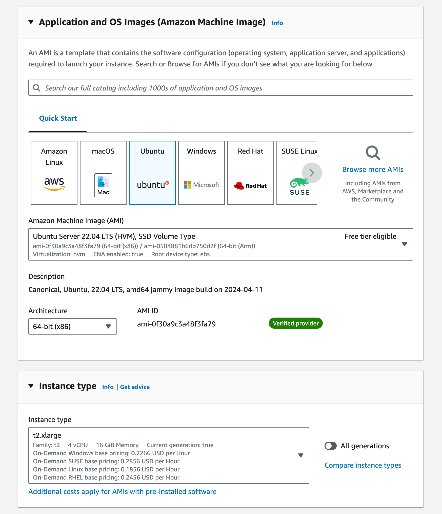

3. Create a new RSA key pair for your instance in `.pem` format.

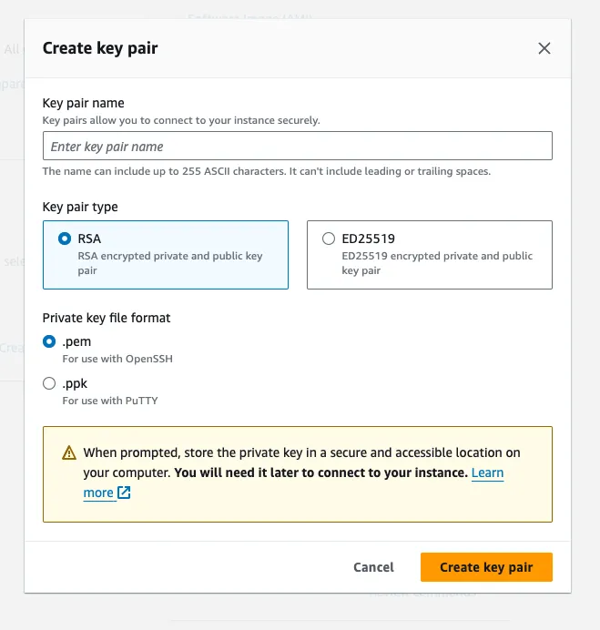

This will create a `.pem` file and download it locally.

3. Edit network settings and from the "Auto-assign public IP" drop-down menu choose "Enable".

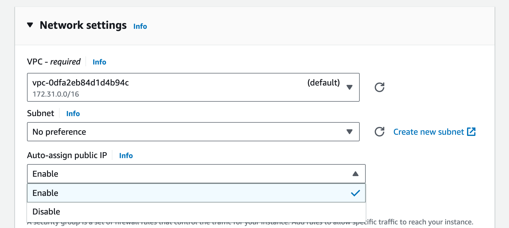

4. Add security group rules for ports 22 (SSH), 80 (HTTP), 443 (HTTPS), 100 (CUSTOM), 4321 (CUSTOM), 50051 (CUSTOM) that allow ingress from anywhere. Specifics [here](https://docs.doltlab.com/introduction/installation#networking-requirements). You also may need to create a new VPC and Subnet here. Just use the defaults.

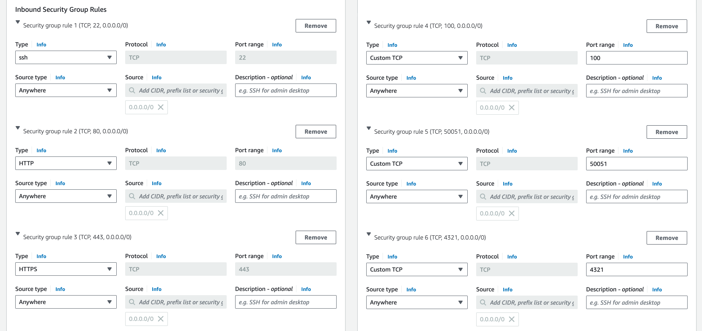

5. Add 300GB gp3 disk.

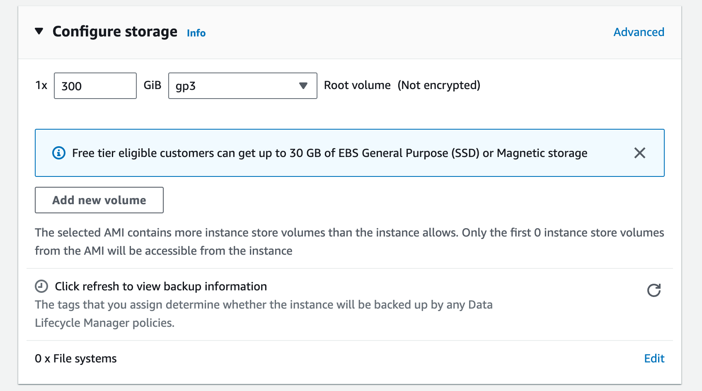

6. Click "Launch instance".

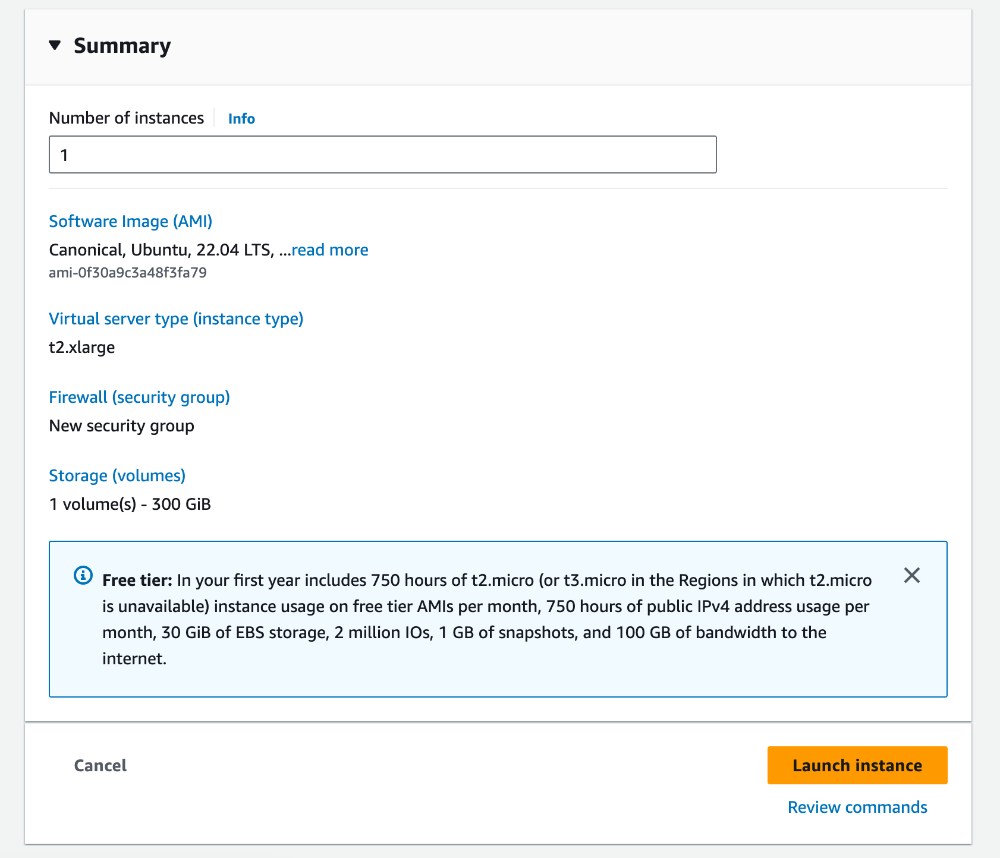

After this you should get a public IP for your new host. Mine was `54.191.163.60`.

# SSH to your New Host

Now I need to SSH to this host. I copy the `.pem` file I created when I launched the instance to my `.ssh` folder, give it appropriate permissions and then I can ssh to my new host.

```sh
$ cp ~/Downloads/doltlab.pem ~/.ssh
$ chmod 600 .ssh/doltlab.pem
$ ssh -i ~/.ssh/doltlab.pem ubuntu@54.191.163.60
Enter passphrase for key '/Users/timsehn/.ssh/y':
Welcome to Ubuntu 22.04.4 LTS (GNU/Linux 6.5.0-1014-aws x86_64)

 * Documentation:  https://help.ubuntu.com
 * Management:     https://landscape.canonical.com
 * Support:        https://ubuntu.com/pro

  System information as of Thu Apr 25 17:17:23 UTC 2024

  System load:  0.0185546875       Processes:             124
  Usage of /:   0.5% of 339.02GB   Users logged in:       0
  Memory usage: 1%                 IPv4 address for eth0: 10.2.0.124
  Swap usage:   0%

Expanded Security Maintenance for Applications is not enabled.

0 updates can be applied immediately.

Enable ESM Apps to receive additional future security updates.
See https://ubuntu.com/esm or run: sudo pro status


The list of available updates is more than a week old.
To check for new updates run: sudo apt update


The programs included with the Ubuntu system are free software;
the exact distribution terms for each program are described in the
individual files in /usr/share/doc/*/copyright.

Ubuntu comes with ABSOLUTELY NO WARRANTY, to the extent permitted by
applicable law.

To run a command as administrator (user "root"), use "sudo <command>".
See "man sudo_root" for details.

ubuntu@ip-10-2-0-124:~$
```

I'm in!

# Download DoltLab and its Dependencies

Now that you're on the host, you need to get DoltLab and its [dependencies](https://docs.doltlab.com/introduction/installation#dependencies) on the host. First, you'll need `curl` and `unzip` as a basic minimum. `curl` was already on my Ubuntu host by default but `unzip` was not. So, I grabbed unzip like so:

```sh
ubuntu@ip-10-2-0-24:~$ sudo apt install unzip
Reading package lists... Done
Building dependency tree... Done
Reading state information... Done
Suggested packages:
  zip
The following NEW packages will be installed:
  unzip
0 upgraded, 1 newly installed, 0 to remove and 0 not upgraded.
Need to get 175 kB of archives.
After this operation, 384 kB of additional disk space will be used.
Get:1 http://us-west-2.ec2.archive.ubuntu.com/ubuntu noble/main amd64 unzip amd64 6.0-28ubuntu4 [175 kB]
Fetched 175 kB in 0s (8990 kB/s)
Selecting previously unselected package unzip.
(Reading database ... 71839 files and directories currently installed.)
Preparing to unpack .../unzip_6.0-28ubuntu4_amd64.deb ...
Unpacking unzip (6.0-28ubuntu4) ...
Setting up unzip (6.0-28ubuntu4) ...
Processing triggers for man-db (2.12.0-4build2) ...
Scanning processes...
Scanning linux images...

Running kernel seems to be up-to-date.

No services need to be restarted.

No containers need to be restarted.

No user sessions are running outdated binaries.

No VM guests are running outdated hypervisor (qemu) binaries on this host.
```

Then I downloaded and unzipped the latest DoltLab.

```sh
$ curl -LO https://doltlab-releases.s3.amazonaws.com/linux/amd64/doltlab-latest.zip
$ unzip doltlab-latest.zip -d doltlab
$ cd doltlab
```

This should produce a directory that includes the DoltLab installer. It can take it from here!

```sh
ubuntu@ip-10-2-0-24:~/doltlab$ ls
installer  smtp_connection_helper
```

I run `./installer --ubuntu` to generate an install script for the rest of DoltLab's dependencies. Then, I run the install script.

```sh
ubuntu@ip-10-2-0-24:~/doltlab$ ./installer --ubuntu
2024-04-30T23:32:04.317Z	INFO	metrics/emitter.go:111	Successfully sent DoltLab usage metrics
2024-04-30T23:32:04.318Z	INFO	cmd/main.go:504	To install DoltLab's dependencies, use this script	{"script": "/home/ubuntu/doltlab/ubuntu_install.sh"}
ubuntu@ip-10-2-0-24:~/doltlab$ ls
installer  smtp_connection_helper  ubuntu_install.sh
ubuntu@ip-10-2-0-24:~/doltlab$ ./ubuntu_install.sh
```

There are a few dependencies. This will take a couple minutes.

## Make sure Docker works

DoltLab uses Docker to run all of its services. After the bootstrap script is done, make sure Docker works with sudo by running:

```sh
ubuntu@ip-10-2-0-124:~/doltlab$ sudo newgrp docker
root@ip-10-2-0-124:/home/ubuntu/doltlab#
```

Then exit the docker shell. You want to set it up so Docker can run as your current user, in my case `ubuntu`. The [steps to do this are here](https://docs.docker.com/engine/install/linux-postinstall/) but I just ran:

```sh
ubuntu@ip-10-2-0-124:~/doltlab$ sudo usermod -aG docker $USER
ubuntu@ip-10-2-0-124:~/doltlab$ newgrp docker
```

And then ran `docker ps` to test.

```
ubuntu@ip-10-2-0-124:~/doltlab$ docker ps
CONTAINER ID   IMAGE     COMMAND   CREATED   STATUS    PORTS     NAMES
```

If `docker ps` works without `sudo`, you are in business.

# Installer

Now, my host is set up for DoltLab, I need to generate the configuration needed to run it. This is done with the installer as well, this time by only passing in the name of your host.

```sh
ubuntu@ip-10-2-0-24:~/doltlab$ ./installer --host 54.191.163.60
2024-04-30T23:38:43.844Z	INFO	metrics/emitter.go:111	Successfully sent DoltLab usage metrics

2024-04-30T23:38:43.844Z	INFO	cmd/main.go:519	Successfully configured DoltLab	{"version": "v2.1.2"}

2024-04-30T23:38:43.844Z	INFO	cmd/main.go:525	To start DoltLab, use:	{"script": "/home/ubuntu/doltlab/start.sh"}
2024-04-30T23:38:43.844Z	INFO	cmd/main.go:530	To stop DoltLab, use:	{"script": "/home/ubuntu/doltlab/stop.sh"}

2024-04-30T23:38:43.844Z	INFO	cmd/main.go:628	To sign-in to DoltLab as the default user, use	{"username": "admin", "password: value of DEFAULT_USER_PASSWORD, stored at": "/home/ubuntu/doltlab/.secrets/default_user_pass.priv"}

Then, I just run the `start.sh` that was generated. This pulls all the Docker images and runs them.

```sh
ubuntu@ip-10-2-0-124:~/doltlab$ ./start.sh
cc278092afcb55de755e9b05725b86bb122eddd128264ee17134418dc154f455
[+] Running 40/40
 ✔ doltlabremoteapi Pulled                                                 5.6s
   ✔ 9a9b158612b8 Pull complete                                            4.4s
 ✔ doltlabdb Pulled                                                       24.0s
   ✔ 7021d1b70935 Pull complete                                            6.1s
   ✔ cf05bca36b9d Pull complete                                            6.4s
   ✔ 30cd3062abcc Pull complete                                            8.0s
   ✔ 2dc80158ffbe Pull complete                                            9.5s
   ✔ 1d34e1b573d9 Pull complete                                            9.7s
   ✔ 7bdb035d6fe3 Pull complete                                            9.9s
   ✔ a1d86dfde1cb Pull complete                                           10.1s
   ✔ 052cdc99d8c0 Pull complete                                           11.8s
   ✔ 83deda927f37 Pull complete                                           12.0s
 ✔ doltlabui Pulled                                                      128.1s
   ✔ 619be1103602 Pull complete                                            0.8s
   ✔ 738ed9d2c558 Pull complete                                            2.4s
   ✔ ba3b98b2e159 Pull complete                                            1.0s
   ✔ df5b844a1292 Pull complete                                            1.0s
   ✔ 4dc0109a97d9 Pull complete                                            1.1s
   ✔ 4f4fb700ef54 Pull complete                                            1.1s
   ✔ 0619fba6d3c6 Pull complete                                           54.0s
 ✔ doltlabapi Pulled                                                      17.3s
   ✔ a398c1d691a9 Pull complete                                           14.0s
 ✔ doltlabfileserviceapi Pulled                                            1.8s
   ✔ a4307bc95380 Pull complete                                            0.8s
   ✔ d21f0afecee0 Pull complete                                            0.4s
   ✔ aa88de97b42f Pull complete                                            0.3s
   ✔ f2ed730a5b7f Pull complete                                            0.8s
   ✔ 9220a2fd62ee Pull complete                                            0.8s
 ✔ doltlabenvoy Pulled                                                    23.8s
   ✔ 43cfb69dbb46 Pull complete                                           13.9s
   ✔ be3b2ffdc401 Pull complete                                           14.1s
   ✔ 14996c115d84 Pull complete                                           14.4s
   ✔ c9a8c8872dcd Pull complete                                           14.9s
   ✔ 53fd8416c370 Pull complete                                           15.2s
   ✔ f79887314984 Pull complete                                           15.5s
   ✔ 320fd87eb7e2 Pull complete                                           15.8s
   ✔ c7dd92188c98 Pull complete                                           16.6s
 ✔ doltlabgraphql Pulled                                                 117.0s
   ✔ 3f40adaa3be4 Pull complete                                            1.3s
   ✔ 4c17c6546dd4 Pull complete                                           47.2s
[+] Running 13/13
 ✔ Volume "doltlab_doltlabdb-dolt-data"       Created                      0.0s
 ✔ Volume "doltlab_doltlabdb-dolt-root"       Created                      0.0s
 ✔ Volume "doltlab_doltlabdb-dolt-configs"    Created                      0.0s
 ✔ Volume "doltlab_doltlabdb-dolt-backups"    Created                      0.0s
 ✔ Volume "doltlab_doltlab-user-uploads"      Created                      0.0s
 ✔ Volume "doltlab_doltlab-remote-storage"    Created                      0.0s
 ✔ Container doltlab-doltlabenvoy-1           Started                     16.3s
 ✔ Container doltlab-doltlabdb-1              Started                     16.3s
 ✔ Container doltlab-doltlabfileserviceapi-1  Started                      0.0s
 ✔ Container doltlab-doltlabremoteapi-1       Started                      0.1s
 ✔ Container doltlab-doltlabapi-1             Started                      0.0s
 ✔ Container doltlab-doltlabgraphql-1         Started                      0.0s
 ✔ Container doltlab-doltlabui-1              Started                      0.0s
```

Now the moment of truth, I hit the IP over `http`, not `https`, http://54.191.163.60/. Bam!

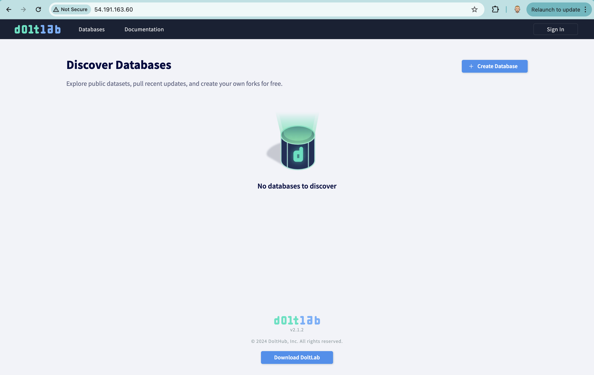

# Login as Admin

Now, your DoltLab is running but it's not very useful. Only logged in users can create databases so your DoltLab is going to stay really empty.

The DoltLab instance ships with a default user configured called `admin`. It has a password `DoltLab1234`. If you click the Sign In button in the top corner and log in as `admin`, you get a more useful set of features.

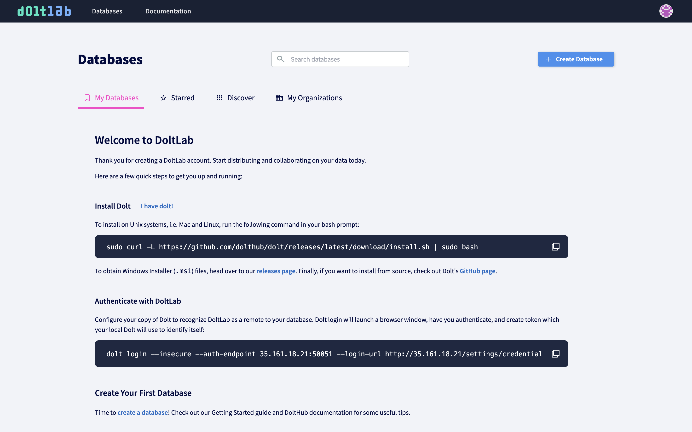

# What Works

## Single user

A configured email server is required to create new users. If you try to create a user, you'll get an error that looks like this:

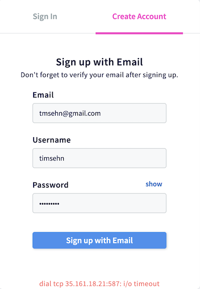

So, you only have a single admin user to play with for now.

## Create/Modify databases

You can build whatever database you can imagine using the web user interface. The built in SQL workbench can be used to create and edit tables. You can import CSVs. You can edit a table using the spreadsheet editor. You can make branches and Pull Requests.

Here's a simple test database I created using SQL.

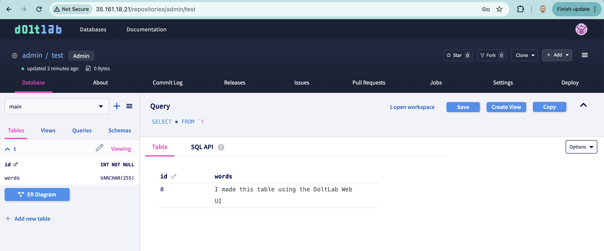

## Clone Databases

DoltLab is a remote so you can clone databases from it. The remote API is exposed on port 50051. I made my test database public so I don't need any permissions to clone it.

```sh
$ dolt clone http://54.191.163.60:50051/admin/test
cloning http://54.191.163.60:50051/admin/test
$ cd test
$ dolt ls
Tables in working set:
	 t
$ dolt sql -q "select * from t"
+----+--------------------------------------------+
| id | words                                      |
+----+--------------------------------------------+
| 0  | I made this table using the DoltLab Web UI |
+----+--------------------------------------------+
```

I now have the test database I created on my DoltLab locally.

## Push Databases

To push databases you need your Dolt client authenticated against your DoltLab instance. You can run a fresh `dolt login` against DoltLab using something like this:

`dolt login --insecure --auth-endpoint 54.191.163.60:50051 --login-url http://54.191.163.60/settings/credentials`

It is listed on the new user page on DoltLab. It will open a browser window. Follow the instructions to authenticate your client.

But if you're already logged into DoltHub, you can just look at your credential using `dolt creds ls` and copy that into your Settings/Credentials.

```sh
$ dolt creds ls
* ioohq4v4itlhgse9sv10acrknngmr6hukvm93n7k1qvo856oudug
```

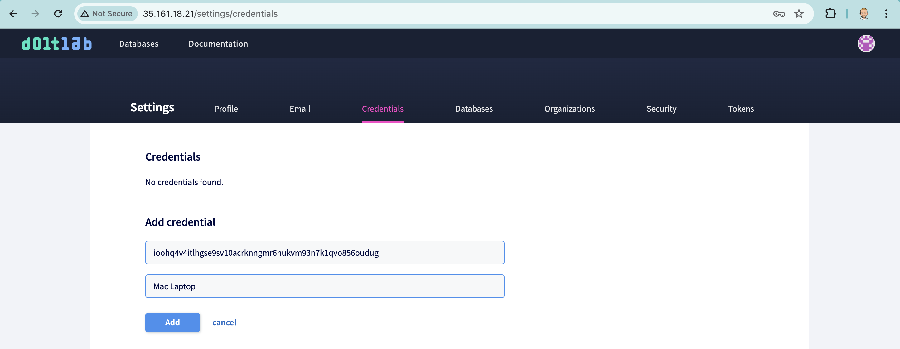

Now you should be able to make a change and push to your DoltLab.

```sh
$ dolt sql -q "insert into t values (1, 'I made this change on my laptop')"
Query OK, 1 row affected (0.00 sec)
$ dolt commit -am "Local change"
commit gafrqo7a8kvs4rjl2etpg0s6ra8ruiha (HEAD -> main)
Author: timsehn <tim@dolthub.com>
Date:  Fri Apr 26 09:43:41 -0700 2024

        Local change

$ dolt push
/ Uploading...
To http://54.191.163.60:50051/admin/test
 * [new branch]          main -> main
```

And I can now see my change on DoltLab!

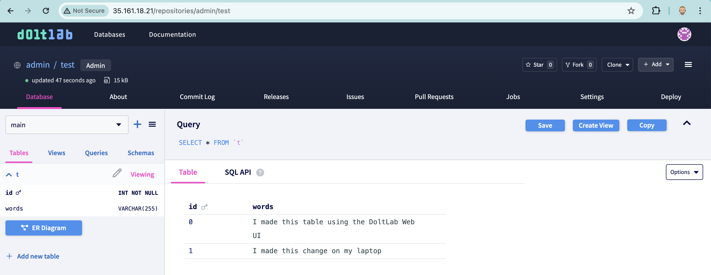

You're now ready to try out all the Dolt and DoltLab experiences like Pull Requests, Issues, the SQL Workbench, and Diffs. Get testing and see if DoltLab is right for you and your team.

# Adding Additional Functionality

## Create new users

As discussed in [the single user section](#single-user), creating users requires a working SMTP server to send emails. Configuring an email server for DoltLab is beyond the scope of this Getting Started guide. You have a bunch of options, the simplest being using any Gmail address' SMTP server. Consult [this guide to set up an email server for DoltLab](../../guides/administrator#set-up-a-smtp-server-using-any-gmail-address).

## Receive Email Notifications

DoltLab sends emails for password resets, pull request and issue status, and a few other use cases. Obviously, these also won't work without a running email server. Consult [this guide to set up an email server for DoltLab](../../guides/administrator#set-up-a-smtp-server-using-any-gmail-address).

## HTTPS

Your DoltLab is currently set up to only use HTTP which is fairly insecure. If it's running on your internal network and you have other threat mitigations, this may be OK. But having it sit on the public internet on AWS without HTTPS is probably not what you want. [Learn how to set up HTTPS on your DoltLab here](../../guides/administrator#doltlab-https-natively).

## Custom URL

Right now, you're stuck hitting the IP address of your host. In order to use a custom URL on the internet, you need a static IP for your EC2 host and a domain name. If your host is running on an internal network, you may need to follow a different process.

## Custom Logo/Colors

Yay! Our first DoltLab Enterprise feature. If you would like a custom logo and color scheme for your DoltLab instance, you are going to need [DoltLab Enterprise](../../guides/enterprise). DoltLab Enterprise is $5,000/month for unlimited users. It comes with Enterprise Support for Dolt as well. Among [other features](../..//guides/enterprise), DoltLab Enterprise allows you to customize the look and feel of your DoltLab instance. Learn how to [configure your DoltLab as Enterprise](../../guides/enterprise) and [set up your custom look and feel here](../../guides/enterprise#use-custom-logo).

## Scalability

Lastly, your DoltLab is running on a single host. All the components will scale to the size of that host including storing all the databases that are created. Storage and compute requirements can get big quickly. In order to break your DoltLab up into multiple instances and use cloud storage to store your databases, you need [DoltLab Enterprise](https://docs.doltlab.com/guides/enterprise). Learn [how to set up Enterprise here](../../guides/enterprise).