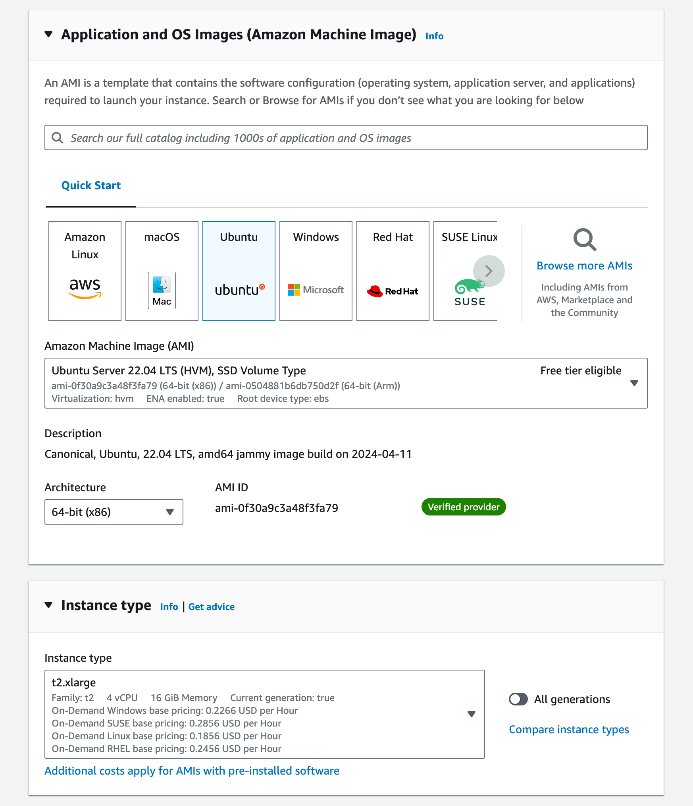
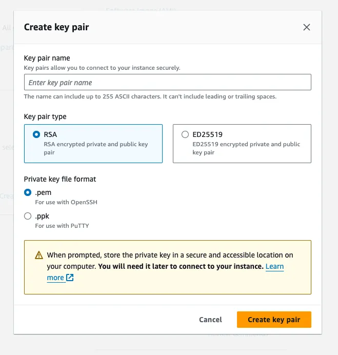
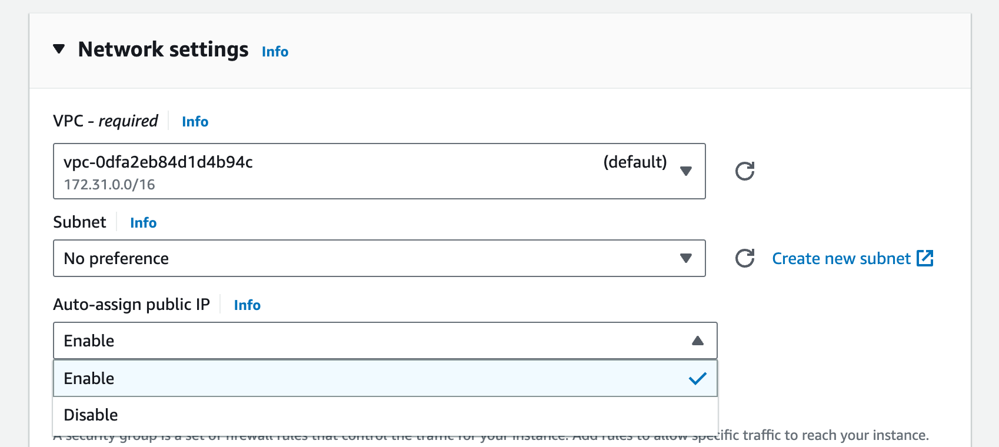
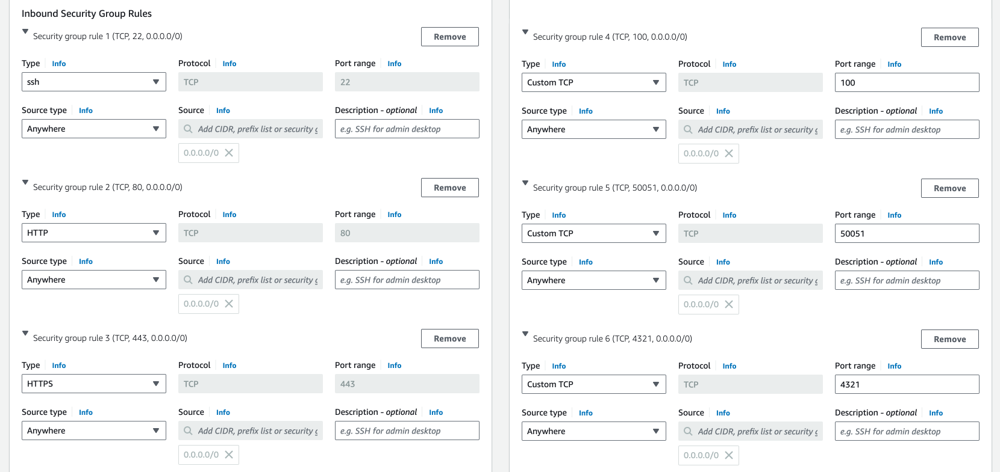
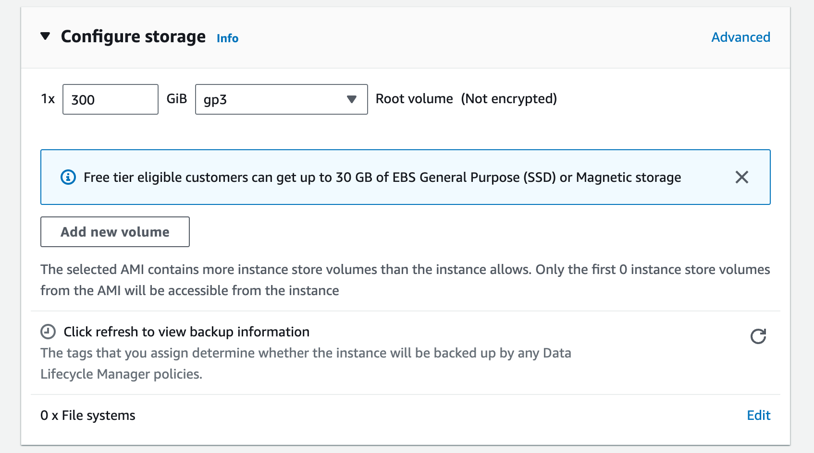

# Get a Ubuntu EC2 Instance

To get your DoltLab ready host on AWS:

1. Go to [AWS EC2 console](https://console.aws.amazon.com/ec2/) and click "Launch instance".

2. Select a Ubuntu 22.04 amd64 t2.xlarge instance.



3. Create a new RSA key pair for your instance in `.pem` format.



This will create a `.pem` file and download it locally.

3. Edit network settings and from the "Auto-assign public IP" drop-down menu choose "Enable".



4. Add security group rules for ports 22 (SSH), 80 (HTTP), 443 (HTTPS), 100 (CUSTOM), 4321 (CUSTOM), 50051 (CUSTOM) that allow ingress from anywhere. Specifics [here](https://docs.doltlab.com/introduction/installation#networking-requirements). You also may need to create a new VPC and Subnet here. Just use the defaults.



5. Add 300GB gp3 disk.



6. Click "Launch instance".


After this you should get a public IP for your new host. Mine was `54.191.163.60`.

# SSH to your New Host

Now I need to SSH to this host. I copy the `.pem` file I created when I launched the instance to my `.ssh` folder, give it appropriate permissions and then I can ssh to my new host.

```sh
$ cp ~/Downloads/doltlab.pem ~/.ssh
$ chmod 600 .ssh/doltlab.pem
$ ssh -i ~/.ssh/doltlab.pem ubuntu@54.191.163.60
Enter passphrase for key '/Users/timsehn/.ssh/y':
Welcome to Ubuntu 22.04.4 LTS (GNU/Linux 6.5.0-1014-aws x86_64)

 * Documentation:  https://help.ubuntu.com
 * Management:     https://landscape.canonical.com
 * Support:        https://ubuntu.com/pro

  System information as of Thu Apr 25 17:17:23 UTC 2024

  System load:  0.0185546875       Processes:             124
  Usage of /:   0.5% of 339.02GB   Users logged in:       0
  Memory usage: 1%                 IPv4 address for eth0: 10.2.0.124
  Swap usage:   0%

Expanded Security Maintenance for Applications is not enabled.

0 updates can be applied immediately.

Enable ESM Apps to receive additional future security updates.
See https://ubuntu.com/esm or run: sudo pro status


The list of available updates is more than a week old.
To check for new updates run: sudo apt update


The programs included with the Ubuntu system are free software;
the exact distribution terms for each program are described in the
individual files in /usr/share/doc/*/copyright.

Ubuntu comes with ABSOLUTELY NO WARRANTY, to the extent permitted by
applicable law.

To run a command as administrator (user "root"), use "sudo <command>".
See "man sudo_root" for details.

ubuntu@ip-10-2-0-124:~$
```

I'm in!

Now that you have a DoltLab ready host, [continue the Getting Started guide](./getting-started.md#download-doltlab-and-its-dependencies)