The first step for setting up DoltLab in Microsoft Azure Cloud is provisioning a [virtual machine](https://azure.microsoft.com/en-us/products/virtual-machines). A virtual machine in Azure is Microsoft's equivalent to [EC2](https://aws.amazon.com/pm/ec2) in AWS.

Referencing the [recommended minimum hardware for DoltLab](https://docs.doltlab.com/administrator-guides/installation#minimum-recommended-hardware), we'll provision a virtual machine with at least 4 CPU and 16 GB of RAM. We'll also need to ensure our host has at least 300 GB of disk.

From the Azure Cloud console, we'll select "Virtual machines" from the list of services.

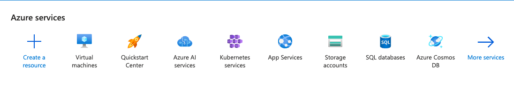

This will take you to the Virtual Machines Dashboard.

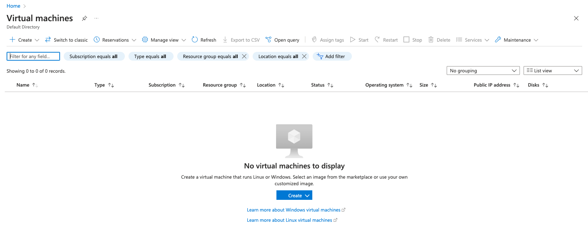

Next, click "Create". This will take you to the following form with the "Basics" tab open.

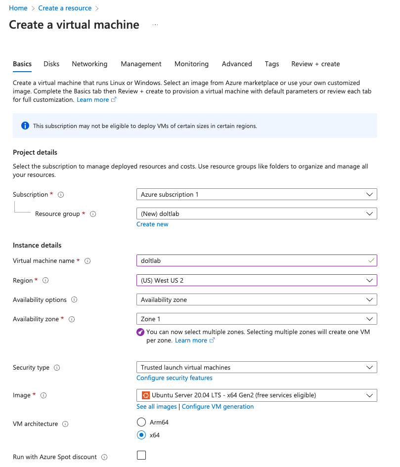

The "Subscription" field of the "Project details" section should have your Azure subscription selected. Mine is called "Azure subscription 1". I've also chosen to create a new "Resource group" called "doltlab".

In "Instance details", I've named our DoltLab instance "doltlab", and chosen the appropriate region and availability where I want my virtual machine deployed.

"Security type" defaults to "Trusted launch virtual machines", and does not need to be changed.

For "Image", DoltLab requires Ubuntu, so I went with `20.04 LTS`, though `22.04 LTS` is also fine. DoltLab also requires `x86` for "VM architecture" so the choice is selected as well.

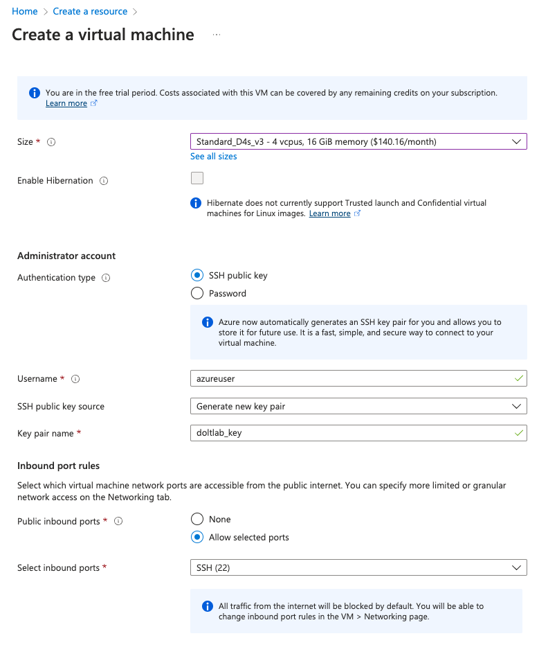

Scrolling further down the page, for "Size", we select `Standard_D4s_v3` which meets the minimum hardware requirements, and we choose "SSH public key" for connecting to our virtual machine.

We use the default value for "Username", `azureuser`, choose "Generate a new key pair" under "SSH public key source", since we don't have an existing one to use on this host.

Now click over to the "Disks" tab.

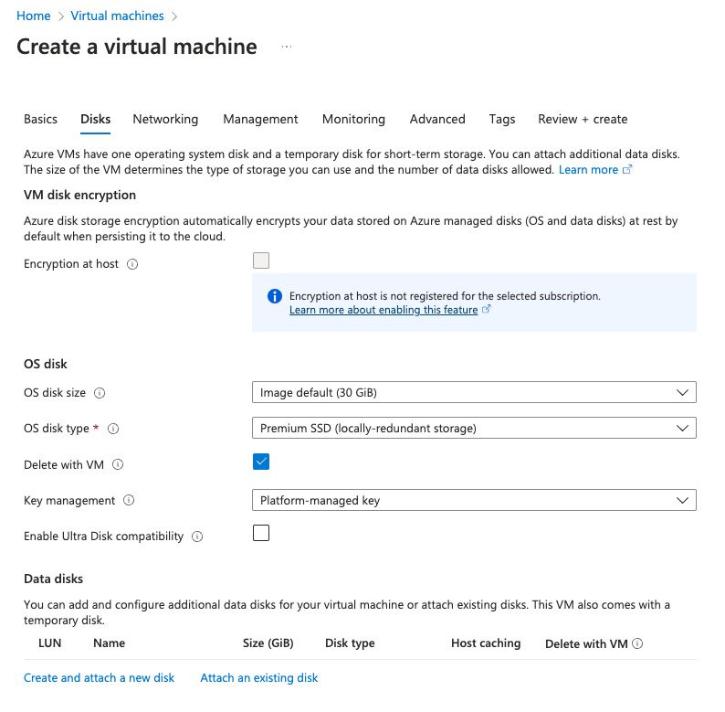

Here we can choose the size of the OS disk, which defaults to 30 GB. This is sufficient for the OS, but we _do_ need at least 300 GBs for DoltLab.

For that, under the "Data disks" section at the bottom, we can click "Create and attach a new disk".

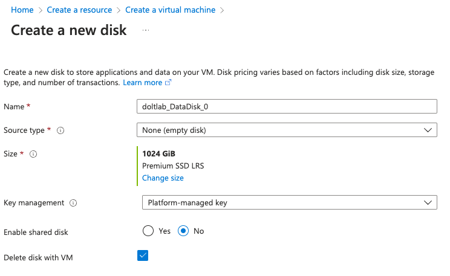

We can make our data disk for DoltLab using this form. Since the default size for this new disk is 1TB, we go ahead and leave the default values for all fields here. The one exception is whether you want to have this disk automatically deleted when the virtual machine is deleted. I chose this option.

Click "Ok", then move on to the "Networking" tab.

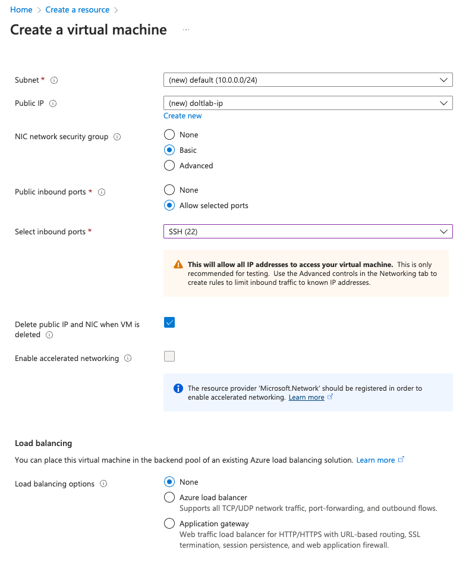

By default, new "Subnet" and new "Public IP" are selected for us. And, since we don't have existing ones we want to use, this is fine for us.

We also want to delete the public IP if we delete the virtual machine, so we check "Delete public IP and NIC when VM is deleted".

Finally, we can click "Review + create".

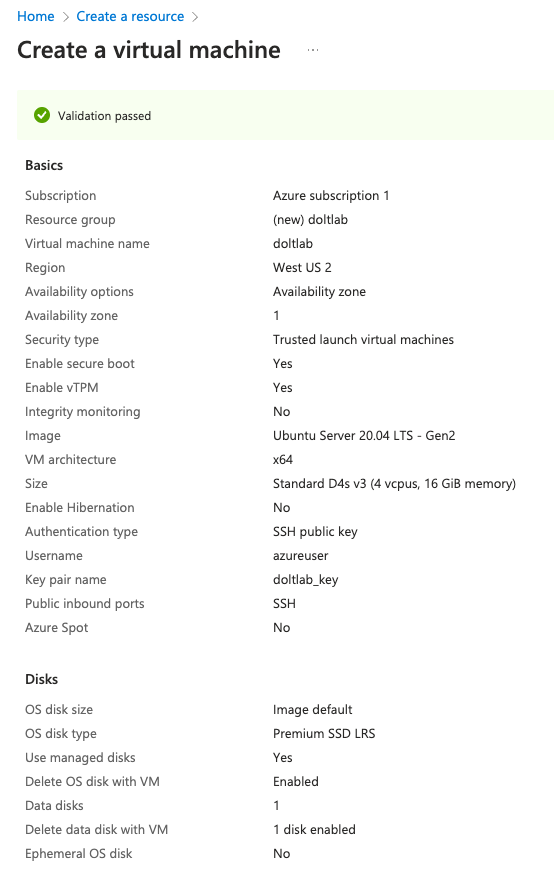
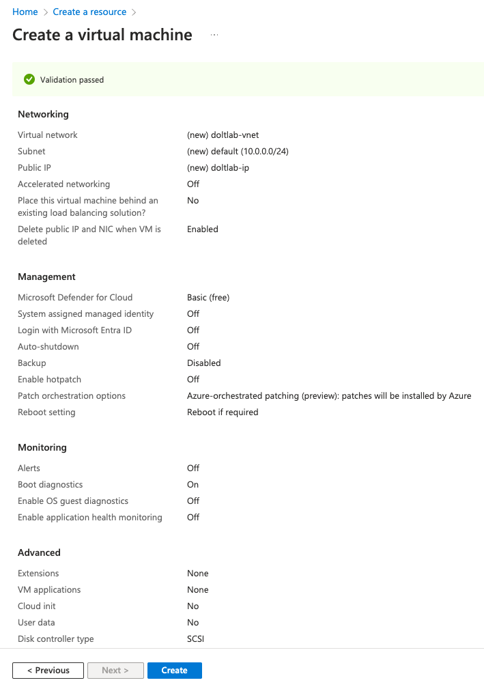

You'll see a summary of all the configuration options on this page. Click "create" to deploy your virtual machine. Azure will then prompt you to download the generated private key file you'll need to ssh into the host.

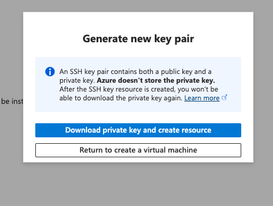

Click "Download private key and create resource".

Azure will begin the deployment of your host, and it will take a minute or two to come up. In the meantime, change the permissions of the private key you downloaded by running:

```bash
chmod 400 doltlab_key.pem
```

Now let's open the required ports on our virtual machine.

# Open the required ports

When the virtual machine is up and running, Azure will redirect you to the dashboard for your running virtual machine.

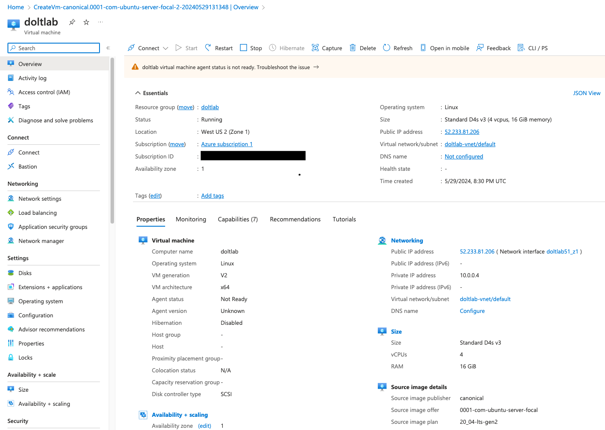

From the menu on the left, under the "Networking" section, choose "Network settings". This is where we will create inbound rules for the ports DoltLab requires to be open.

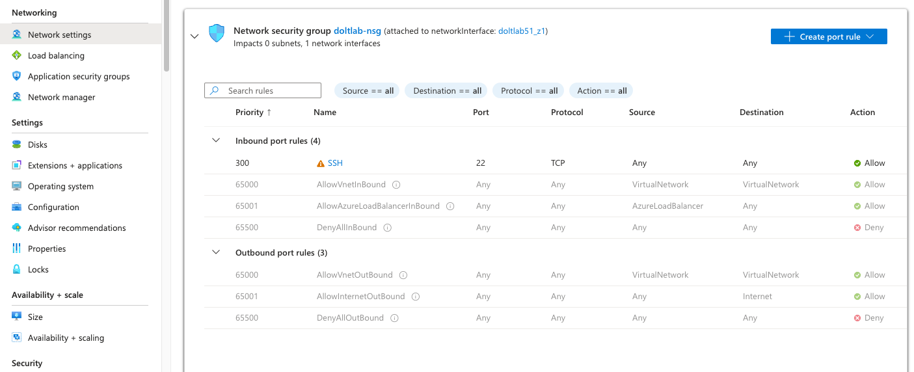

We can see that our ssh inbound rule is already configured. Now we need open ports `80`, `100`, `4321`, and `50051` [which are required for DoltLab](https://docs.doltlab.com/administrator-guides/installation#networking-requirements).

Click "Create port rule".

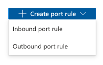

Be sure to select "Inbound port rule". Following this you'll see the form you use to create each port rule.

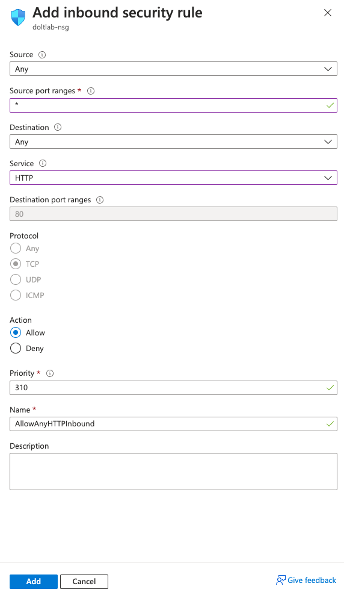

Creating a rule for port `80` can be done by selecting "HTTP" from the "Service" dropdown menu. Make sure "Action" is "Allow" and click "Add".

For the remaining ports, click "Create port rule" for each one, then fill in the form to create the new port rules. Each port rule should have a "Source" of "Any", an "*" for "Source port ranges", "Any" for "Destination", nothing for "Service", and the port number you're adding in "Destination port ranges", one of `100`, `4321`, and `50051`.

All port-rule "Protocols" should be "TCP", with "Action" "Allow". None of the other settings need to be modified from their default values here. Click "Add" to create each new port rule.

When you're finished, your ports should look like this:

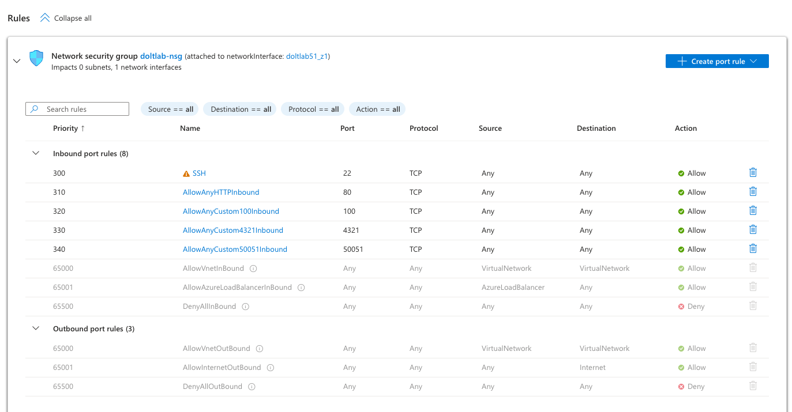

If they do, you've successfully provisioned your virtual machine for DoltLab and it's time to connect to it and set up the attached disk.

# Configure the disk

To connect to your virtual machine, ssh into it with a command like the following:

```bash
ssh -i ~/.ssh/doltlab_key.pem azureuser@52.233.81.206
```

Once connected, if you look for the 1TB disk we attached while creating the virtual machine, you won't see it listed.

```bash
azureuser@doltlab:~$ df -h
Filesystem      Size  Used Avail Use% Mounted on
/dev/root        29G  1.5G   28G   5% /
devtmpfs        7.8G     0  7.8G   0% /dev
tmpfs           7.8G     0  7.8G   0% /dev/shm
tmpfs           1.6G  996K  1.6G   1% /run
tmpfs           5.0M     0  5.0M   0% /run/lock
tmpfs           7.8G     0  7.8G   0% /sys/fs/cgroup
/dev/loop0       64M   64M     0 100% /snap/core20/2264
/dev/loop1       39M   39M     0 100% /snap/snapd/21465
/dev/loop2       92M   92M     0 100% /snap/lxd/24061
/dev/sda15      105M  6.1M   99M   6% /boot/efi
/dev/sdb1        32G   28K   30G   1% /mnt
tmpfs           1.6G     0  1.6G   0% /run/user/1000
```

This is because we need to format and partition the disk before we can use it. To do this, I followed [this documentation](https://learn.microsoft.com/en-us/azure/virtual-machines/linux/attach-disk-portal), but I'll show each step I performed on my host here as well.

First, I used `lsblk` to search for the 1TB attached disk.

```bash
azureuser@doltlab:~$ lsblk -o NAME,HCTL,SIZE,MOUNTPOINT | grep -i "sd"
sda     0:0:0:0      30G 
├─sda1             29.9G /
├─sda14               4M 
└─sda15             106M /boot/efi
sdb     0:0:0:1      32G 
└─sdb1               32G /mnt
sdc     1:0:0:0       1T 
```

The disk we attached is `sdc`.

Next we use the `parted` and `partprobe` utilities to format and partition the disk.

```bash
azureuser@doltlab:~$ sudo parted /dev/sdc --script mklabel gpt mkpart xfspart xfs 0% 100%
azureuser@doltlab:~$ sudo mkfs.xfs /dev/sdc1
meta-data=/dev/sdc1              isize=512    agcount=4, agsize=67108736 blks
         =                       sectsz=4096  attr=2, projid32bit=1
         =                       crc=1        finobt=1, sparse=1, rmapbt=0
         =                       reflink=1
data     =                       bsize=4096   blocks=268434944, imaxpct=25
         =                       sunit=0      swidth=0 blks
naming   =version 2              bsize=4096   ascii-ci=0, ftype=1
log      =internal log           bsize=4096   blocks=131071, version=2
         =                       sectsz=4096  sunit=1 blks, lazy-count=1
realtime =none                   extsz=4096   blocks=0, rtextents=0
azureuser@doltlab:~$ sudo partprobe /dev/sdc1
```

Then we need to mount the disk and get the block id using `blkid`. We'll mount the disk to `/datadrive`.

```bash
azureuser@doltlab:~$ sudo mkdir /datadrive
azureuser@doltlab:~$ sudo mount /dev/sdc1 /datadrive
azureuser@doltlab:~$ sudo blkid
/dev/sdb1: UUID="37f8c837-59f6-4e39-aac4-9c885a8c36fa" TYPE="ext4" PARTUUID="04c7e087-01"
/dev/sda1: LABEL="cloudimg-rootfs" UUID="32c589b5-7835-4684-9994-62e8fb26cd85" TYPE="ext4" PARTUUID="543198b3-f3a1-4b8c-af24-13528d57bedf"
/dev/sda15: LABEL_FATBOOT="UEFI" LABEL="UEFI" UUID="9915-EF3D" TYPE="vfat" PARTUUID="74635b66-5240-4255-aa0c-8c5ba19b7933"
/dev/loop0: TYPE="squashfs"
/dev/loop1: TYPE="squashfs"
/dev/loop2: TYPE="squashfs"
/dev/sda14: PARTUUID="293179ee-1e44-4436-a325-a8dd7eb21c8e"
/dev/sdc1: UUID="0dee6a06-1d62-4e14-a437-ea2ad1e82d09" TYPE="xfs" PARTLABEL="xfspart" PARTUUID="f9c4f28d-a3cb-4618-a115-5cc88a292d99"
```

Next, we edit `/etc/fstab` and add our device's `UUID` to the file.

```bash
azureuser@doltlab:~$ sudo cat /etc/fstab
# CLOUD_IMG: This file was created/modified by the Cloud Image build process
UUID=32c589b5-7835-4684-9994-62e8fb26cd85	/	 ext4	defaults,discard	0 1
UUID=9915-EF3D	/boot/efi	vfat	umask=0077	0 1
/dev/disk/cloud/azure_resource-part1	/mnt	auto	defaults,nofail,x-systemd.requires=cloud-init.service,_netdev,comment=cloudconfig	0	2
UUID=0dee6a06-1d62-4e14-a437-ea2ad1e82d09 /datadrive   xfs   defaults,nofail   1   2
```

Once those edits are saved, we can see our new device successfully mounted using `lsblk` and `df`:

```bash
azureuser@doltlab:~$ lsblk -o NAME,HCTL,SIZE,MOUNTPOINT | grep -i "sd"
sda     0:0:0:0      30G 
├─sda1             29.9G /
├─sda14               4M 
└─sda15             106M /boot/efi
sdb     0:0:0:1      32G 
└─sdb1               32G /mnt
sdc     1:0:0:0       1T 
└─sdc1             1024G /datadrive
azureuser@doltlab:~$ df -h
Filesystem      Size  Used Avail Use% Mounted on
/dev/root        29G  1.5G   28G   5% /
devtmpfs        7.8G     0  7.8G   0% /dev
tmpfs           7.8G     0  7.8G   0% /dev/shm
tmpfs           1.6G 1000K  1.6G   1% /run
tmpfs           5.0M     0  5.0M   0% /run/lock
tmpfs           7.8G     0  7.8G   0% /sys/fs/cgroup
/dev/loop0       64M   64M     0 100% /snap/core20/2264
/dev/loop1       39M   39M     0 100% /snap/snapd/21465
/dev/loop2       92M   92M     0 100% /snap/lxd/24061
/dev/sda15      105M  6.1M   99M   6% /boot/efi
/dev/sdb1        32G   28K   30G   1% /mnt
tmpfs           1.6G     0  1.6G   0% /run/user/1000
/dev/sdc1       1.0T  7.2G 1017G   1% /datadrive
```

Finally, we need to change the permissions of `/datadrive` so we can write to it. Initially, only `root` can do so.

```bash
azureuser@doltlab:~$ ls -la /datadrive
total 4
drwxr-xr-x  2 root root    6 May 29 21:07 .
drwxr-xr-x 20 root root 4096 May 29 21:07 ..
```

This can be done using `chown`:

```bash
azureuser@doltlab:~$ sudo chown azureuser: /datadrive
azureuser@doltlab:~$ ls -la /datadrive
total 4
drwxr-xr-x  2 azureuser azureuser    6 May 29 21:07 .
drwxr-xr-x 20 root      root      4096 May 29 21:07 ..
```

Our disk is now ready, and we can move on to installing and running DoltLab. [Continue the Getting Started guide](./getting-started.md#download-doltlab-and-its-dependencies).