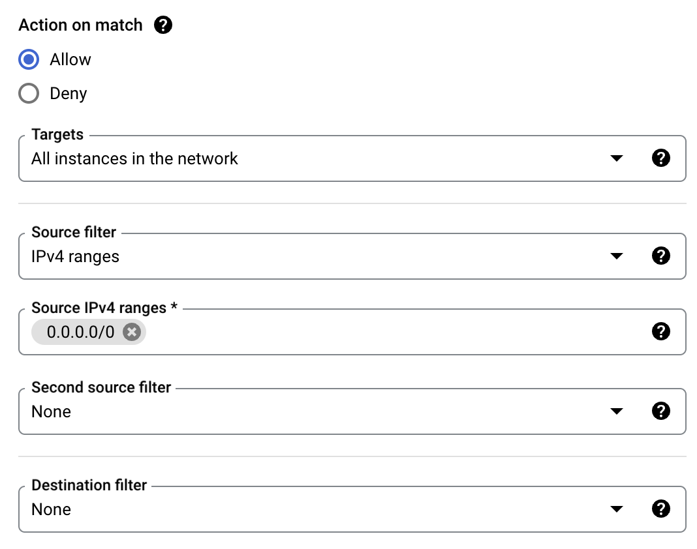

We need a properly configured Ubuntu host to run DoltLab on. This will take a few steps. Start by going to [Google Cloud Platform console](https://console.cloud.google.com/).

## Create a GCP Project

Let's create a new project for our DoltLab. Click Create Project and you'll be greeted by this screen.

This takes a couple seconds and then you need to switch to the project.

Google really wants me to use Gemini. I can't get rid of that pop up.

## Procure a New Compute Engine Instance

Now, we need a compute engine instance. Click Compute Engine and the click Enable. Compute Engine does not seem to be on by default for new projects. This takes a couple minutes but once enabled you'll be greeted with this screen.

Click Create Instance.

Call it something cool. I called mine `doltlab-getting-started`.

Now, you need to hit the DoltLab minimum hardware requirements; 4CPUs, 16GB of RAM, and 300GB of disk. For this, I select the E2 family of instance (because it's the default) and then in the "Machine Type" drop down I switch to "Standard" and select the "4CPU, 16GB RAM" option.

Now, it's time to change the Operating System and the disk size under the Boot Disk section. 

It looks like GCP defaults to Debian with 10GB of disk. We need Ubuntu with 300GB of disk.

Much better. Either Debian 22.04 or 24.04 will work with DoltLab.

Finally, on this page, we'll enable HTTP traffic under the Firewall section. We'll need a few more ports open but we do that after the instance is created.

Let's fire this baby up by clicking "CREATE". After a couple minutes I have a running instance.

Make note of your public IP. You'll need this to install DoltLab on the host. Ours is 34.171.211.99.

## Open the Required Ports

We need to open a few more ports for DoltLab to operate correctly. Click "Set Up Firewall Rules" and the "Create new Firewall Rule".

In "Actions on Match", select "All instances in Network" and enter a Source IPv4 range as `0.0.0.0/0` or the entire range. We want the whole internet to see this wonderful DoltLab we're creating.

Scroll down to Protocols and Ports, enable TCP on port 100.

Click "CREATE".

Rinse and repeat for ports 4321 and 50051. After your done, you're firewall rules should look like this.

## SSH to the host

GCP has a cool SSH in browser that I'll use.

This opens a new browser window for you to SSH with. Click authorize and you should be greeted with an in browser terminal window connected to your new instance.

Pretty slick Google. Pretty slick.

Now that you have a DoltLab ready host, [continue the Getting Started guide](./getting-started.md#download-doltlab-and-its-dependencies)